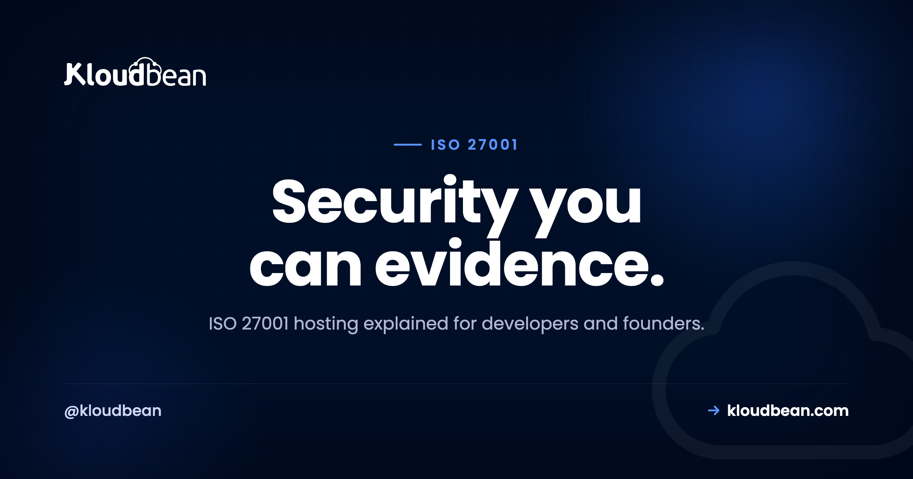

# ISO 27001 Hosting: What Gets Certified, and What's Yours to Own

If you sell software to enterprises or government, one question eventually lands in your inbox: are you ISO 27001? Sometimes it's a procurement form, sometimes a deal that quietly stalls until you answer. So you go looking for ISO 27001 hosting, hoping a plan will tick the box for you. It won't, and that's good news once you see how the pieces fit. ISO 27001 compliant hosting gives you infrastructure controls, and evidence, for one layer of the picture. The certification itself is about your organization, not your server.

ISO 27001 is the international standard for an information security management system, an ISMS. Certification describes how your organization manages security risk, so no host can be certified on your behalf. A good host runs the infrastructure layer well and hands you controls that map to the standard's control areas. The rest, your policies, your risk decisions, the scope of your own certification, stays with you.

> **The short version:** ISO 27001 certifies your organization's information security management system (ISMS), not a single server or hosting plan. Your host and the tier-1 cloud data centers underneath it provide infrastructure controls and evidence for the infrastructure layer: physical, network, and access-control pieces. You still own your ISMS: the policies, the risk assessment and treatment, and the scope of your own certification. The data centers Kloudbean runs on, operated by providers like AWS and Google Cloud, hold ISO 27001 at the data-center level. Your organization's certification is separate, and it is yours to earn.

## What ISO 27001 actually is

ISO/IEC 27001 is the international standard for building and running an information security management system. That phrase, ISMS, is the whole point. An ISMS is the set of policies, processes, risk decisions, and controls your organization uses to manage information security in a repeatable, documented way. The standard doesn't hand you a shopping list of servers. It asks you to understand your risks, manage them on purpose, and prove you do.

Certification works like this. You build your ISMS, run it long enough to produce evidence, then an accredited certification body audits it in two stages: a documentation review, then a deeper audit of how you operate. Pass, and your organization holds an ISO 27001 certificate, with surveillance audits each year and a full recertification around every three years. Notice the subject there. The organization gets the certificate. Not a data center, not a hosting plan, not a line of your code.

Annex A is the part developers usually hear about. It's a reference catalog of information security controls you choose from based on your risk assessment. The 2022 version groups 93 controls into four themes: organizational, people, physical, and technological. You don't apply all of them. You document which ones apply, and why, in a Statement of Applicability. A fair number of those ISO 27001 Annex A controls touch hosting directly, which is where your infrastructure choices start to matter.

People sometimes search for "ISMS hosting" as if the management system were a product on a shelf. It isn't. Hosting can support your ISMS with real controls and clean evidence, but the system itself is something your organization runs. One honest note before we go further: this is general information to help you plan, not compliance or legal advice.

## What ISO 27001 hosting actually requires

Most ISO 27001 hosting requirements trace back to a handful of Annex A control areas that land on infrastructure. The bulk of the standard is management and process, and it lives with your team. But these areas touch your servers and data directly, and this is where hosting pulls its weight. The table maps each one to the kind of control that satisfies it.

| Annex A control area | What it asks of hosting | The kind of control that satisfies it |
| --- | --- | --- |
| Access control | Only authorized identities reach systems, at least privilege | Unique logins, role-based permissions, IP restrictions |
| Cryptography | Protect data moving over networks | TLS/SSL everywhere, plus an at-rest decision you make |
| Operations security | Hardened, patched systems; controlled change | Firewall, brute-force blocking, patching, change history |
| Communications security | Segment and isolate networks | IP allow-listing so databases are reachable only from trusted hosts (private networking on Enterprise) |
| Physical security | Protect the facilities holding data | Tier-1 data centers with their own certification |
| Backup and availability | Data survives and can be restored | Automatic backups, and a restore you have tested |
| Logging and monitoring | Record and review significant activity | An activity log or audit trail you can search and export |

One thing to plan for early: ISO 27001 expects you to protect data according to its risk, so encryption in transit is a given, and encryption at rest is a decision you make where the data lives, at the application or database level. Don't assume it. Design it.

## Shared responsibility: the provider layer vs your ISMS

Here's the idea that untangles the topic. ISO 27001 responsibility splits across layers, and no single party owns all of it. The cloud provider secures the physical foundation. Your host runs and hardens the infrastructure on top. You own the ISMS around your app and your organization. Two of those layers can carry their own ISO 27001 certification, independently of yours.

| Provider and platform layer | Your ISMS (yours to own) |
| --- | --- |
| Physical data-center security (ISO 27001 at the provider level) | The ISMS itself: how your organization manages security risk |
| Infrastructure hardening (firewall, Fail2ban) | Risk assessment and risk treatment decisions |
| Network isolation and IP allow-listing (private networking on Enterprise) | Security policies, procedures, and their upkeep |
| Encryption in transit (free SSL) | Staff training and security awareness |
| Automatic backups | Access governance: joiners, movers, and leavers |
| Access controls (UAC, IP rules) | Your certification scope and Statement of Applicability |
| Activity logging (enterprise Audit Trail) | Internal audits and the external audit of your ISMS |

Look at the right column. That's most of the standard, and no server touches it. A host can hand you a clean, well-run infrastructure layer with evidence to show for it. It cannot make risk decisions for your business or run your ISMS, and any host implying otherwise is overselling.

```
   Where ISO 27001 sits in your stack

   ┌────────────────────────────────────────────┐   ┐
   │  YOUR APP + YOUR ISMS                        │   │ Your ISO 27001
   │  policies · risk treatment · SoA             │   │ certification
   └────────────────────────────────────────────┘   ┘ (your ISMS scope)

   ┌────────────────────────────────────────────┐
   │  KLOUDBEAN INFRASTRUCTURE CONTROLS           │   controls that
   │  hardening · free SSL · access control ·     │   map to Annex A
   │  IP allow-listing · backups                  │
   └────────────────────────────────────────────┘

   ┌────────────────────────────────────────────┐   ┐
   │  TIER-1 CLOUD DATA CENTERS (AWS, Google)     │   │ Provider ISO 27001
   │  physical security · ISO 27001 at the        │   │ certification
   │  data-center level                           │   │ (data-center level)
   └────────────────────────────────────────────┘   ┘

   Two certifications, different scopes. The data-center
   one is the provider's. Your ISMS certification is separate.
```

<!-- ADD IMAGE: your Statement of Applicability, the Annex A controls you apply, the ones you exclude, and the reason for each -->

## ISO 27001 vs SOC 2, briefly

You'll often see the two mentioned together, and buyers sometimes ask for one or the other. Both give customers assurance about your security, but the deliverable differs. ISO 27001 is an international standard, and the outcome is a certification of your ISMS granted by an accredited body. SOC 2 is a US-oriented framework, and the outcome is an attestation report from an auditor, describing how your controls meet the Trust Services Criteria over a period. One produces a certificate, the other a report you share.

Enterprises with a global footprint often lean toward ISO 27001, while many US SaaS buyers ask for SOC 2 first. We go deeper in [SOC 2 compliant hosting](https://www.kloudbean.com/blog/soc2-compliant-hosting/). Either way, the underlying controls overlap heavily, so the hosting groundwork you lay for one serves the other.

## How Kloudbean's controls map to Annex A

Honest framing before the table: none of this makes your organization ISO 27001 certified. What it does is give you infrastructure-layer controls that map to Annex A areas, already built and running, so you're evidencing controls instead of assembling them from scratch. These support your ISO 27001 program. They don't replace it.

| Annex A area | Kloudbean infrastructure control that supports your program |
| --- | --- |
| Access control | Subusers with granular User Access Control (per-resource, per-action); IP Access Control by CIDR; HttpOnly cookie sessions; a Basic Auth gate for apps still in progress |
| Cryptography (in transit) | Free SSL/TLS, issued and auto-renewed across your app and its APIs |
| Operations security | Shorewall firewall and Fail2ban brute-force blocking, on by default |
| Communications security | IP Access Control locks managed databases to your app server's IP; private networking / VPC available on Enterprise |
| Physical security | Runs on tier-1 clouds (AWS, Google Cloud) whose data centers hold ISO 27001 at the infrastructure level |
| Backup and availability | Automatic backups, plus seven managed database engines with controlled access and their own backups, on a tier-1 uptime foundation |
| Logging and monitoring | Enterprise Audit Trail: immutable, searchable, account-wide, CSV export |

Two of those deserve a closer look. Access control is where least privilege becomes real: give each teammate a subuser with only the permissions their role needs, and you can answer "who can reach production" precisely. Here's [how user access control works](https://www.kloudbean.com/blog/user-access-control-explained/). Logging is the enterprise Audit Trail's job, an immutable, account-wide record with CSV export. One honest caveat: it's an enterprise capability, not per-app logging on every plan, and your app still logs its own security events.

## Practical steps toward an ISO 27001-ready setup

Building the ISMS is your project, mostly people and process. But you can get the infrastructure layer into shape in parallel, so the technical Annex A controls are already there when your auditor asks. Here's the order I'd work in.

### Step 1. Lock down who can reach production

Give every teammate a unique login, never a shared one, and grant the narrowest role that gets the job done. Subusers with granular User Access Control cover per-resource, per-action permissions, and IP Access Control lets you pin admin access to known networks. When your audit asks who can reach production, you want a precise answer sitting in the dashboard, not a shrug.


### Step 2. Encrypt everything in transit

Serve every page and API call over HTTPS, with no mixed content, so data in transit is protected end to end. A free SSL certificate that issues and renews itself removes any excuse to run plain HTTP. Encryption at rest is a separate call you make at the application or database level, so plan it deliberately rather than assuming it's handled.


### Step 3. Harden the servers and isolate the network

Unpatched software and open ports start a lot of incidents, so keep the stack patched and run baseline protections like a firewall and brute-force blocking by default. Then lock your managed database down with IP allow-listing, so only your app server's IP can reach it and a random scanner can't even knock. That single move closes a whole class of exposure. On Enterprise, private networking (a VPC) takes the database off the public internet entirely. Here's [what a VPC is](https://www.kloudbean.com/blog/what-is-a-vpc/) if the concept is new.


### Step 4. Turn on automatic backups and test a restore

ISO 27001 cares about availability, not just secrecy, so your data needs to survive a bad day. Automatic backups stored off the main server cover that, and the seven managed database engines carry their own. Do the step everyone skips: actually test a restore, because an untested backup is a hope, not a control. Our [server backups guide](https://www.kloudbean.com/blog/server-backups-guide/) walks through it.


### Step 5. Record significant activity

An auditor will ask who did what, and when. On enterprise accounts the Audit Trail gives you an immutable, searchable, account-wide log you can export to CSV, which is the kind of evidence that turns a stressful audit into a boring one. Your app should log its own security-relevant events too, since the platform trail covers the account layer, not your application's internals.

<!-- ADD IMAGE: an export of your account activity log or audit trail, filtered to the actions an auditor cares about -->

### Step 6. Do the risk assessment and Statement of Applicability

Now the part only you can do, and the part ISO 27001 actually revolves around. Run a risk assessment, decide how you'll treat each risk, write the policies that back those decisions, and record which Annex A controls apply in your Statement of Applicability. The infrastructure steps above give you strong evidence for the technical controls. This step is what makes it an ISMS rather than a pile of good settings.

<!-- ADD IMAGE: your risk register, each identified risk, its owner, the treatment decision, and the control that addresses it -->

> **A quick, honest boundary.** This is general educational information to help you plan, not compliance or legal advice. ISO 27001 has real nuance, and your scope, risk profile, and Statement of Applicability deserve a qualified security professional and an accredited certification body. When you're evaluating any provider, confirm its current certifications and their scope directly with the provider, rather than taking a marketing line for it.

## So, is my host ISO 27001 certified?

It's a fair question, and the honest answer needs precision. A hosting product isn't the thing that gets a certificate; ISO 27001 covers an organization's ISMS. So ask two things. Does the provider's own organization hold a certification for the services you use? And do the data centers underneath hold ISO 27001 at the infrastructure level? For the tier-1 clouds Kloudbean runs on, like AWS and Google Cloud, the data-center answer is yes, and their compliance pages spell out the scope. For a provider's own organizational certification, ask directly and read what they publish.

My honest take: most of the pain isn't infrastructure. It's underestimating the ISMS, the policies, the risk work, and the evidence you keep over months. Good hosting shrinks the technical slice and gives you clean evidence for it. It never shrinks the management work. ISO 27001 cloud hosting is a foundation, not a finish line.

Where Kloudbean fits: the infrastructure side, with controls that map to Annex A areas, on tier-1 clouds whose data centers hold ISO 27001 at the infrastructure level. What it won't do, because no honest host can, is make your organization certified or hand you a certificate for your ISMS. Mapping several frameworks at once? The siblings pair well: [PCI compliant hosting](https://www.kloudbean.com/blog/pci-compliant-hosting/), [GDPR compliant hosting](https://www.kloudbean.com/blog/gdpr-compliant-hosting/), [HIPAA compliant hosting](https://www.kloudbean.com/blog/hipaa-compliant-hosting/), and the broader [secure and compliant hosting](https://www.kloudbean.com/blog/secure-compliant-hosting/) overview.

---

**Build on a foundation your ISO 27001 program can point to.** Run your app on infrastructure with hardening, encryption in transit, IP allow-listing, access controls, and automatic backups, all on tier-1 clouds and all on one dashboard. Talk to us about the enterprise Audit Trail, private networking, and custom setups for your ISO 27001 program. Start with a free trial and free migration assistance at [kloudbean.com](https://www.kloudbean.com/), and see plans on [pricing](https://www.kloudbean.com/pricing/).

Access control (UAC) · Free SSL · Shorewall + Fail2ban · IP allow-listing · Automatic backups · Enterprise Audit Trail

## ISO 27001 hosting FAQ

**Is Kloudbean ISO 27001 certified?**
ISO 27001 covers an organization's information security management system, so it isn't something a hosting product carries on your behalf. Kloudbean provides infrastructure controls that map to Annex A areas, including access control, encryption in transit, hardening, IP allow-listing, and backups, and these support your ISO 27001 program. The tier-1 cloud data centers it runs on, operated by providers like AWS and Google Cloud, hold ISO 27001 at the data-center level. Your own organization's certification is separate and yours to pursue, and you should confirm any provider's current certifications with them directly.

**What is ISO 27001?**
ISO/IEC 27001 is the international standard for an information security management system, or ISMS. It describes how an organization identifies security risks and manages them with documented policies, processes, and controls. An accredited certification body audits the ISMS, and the organization, not a server or a product, receives the certificate. Annex A is a reference catalog of controls you choose from based on your risk assessment.

**Does hosting make my company ISO 27001 certified?**
No. Certification covers your organization's ISMS, which includes your policies, your risk decisions, and the scope you define. Hosting supplies infrastructure controls and evidence for the infrastructure layer, which is genuinely useful, but it is only one part. You still own your ISMS and the audit of it, so treat good hosting as a head start rather than a finished result.

**What is the difference between ISO 27001 and SOC 2?**
Both give customers assurance about your security, but the deliverables differ. ISO 27001 is an international standard, and the outcome is a certification of your ISMS granted by an accredited body. SOC 2 is a US-oriented framework, and the outcome is an attestation report from an auditor describing how your controls meet the Trust Services Criteria over time. The underlying controls overlap heavily, so infrastructure groundwork tends to serve both.

**What controls does ISO 27001 need from hosting?**
The Annex A areas that touch hosting are access control, cryptography (encryption in transit, with an at-rest decision you make), operations and communications security (hardening, patching, network isolation), physical security handled by the data centers, backup and availability, and logging and monitoring. A good host supplies the technical controls for each. Your ISMS still decides which controls apply and documents them in a Statement of Applicability.

**What is an ISMS?**
An ISMS is an information security management system: the set of policies, processes, risk decisions, and controls your organization uses to manage information security in a repeatable, documented way. ISO 27001 certifies that system rather than any single piece of technology. It is the reason certification lives with your organization and not with your host.

**What is Annex A?**
Annex A is the reference catalog of information security controls that comes with ISO 27001. The 2022 version groups 93 controls into four themes: organizational, people, physical, and technological. You don't apply every control. You select the ones your risk assessment justifies and record your choices, and your reasons, in a Statement of Applicability.

**Do the tier-1 clouds behind my host hold ISO 27001?**
Major cloud providers such as AWS and Google Cloud maintain ISO 27001 certification for their infrastructure and data centers, which covers the physical and environmental layer. That is the provider layer, and it does not extend to your application or your ISMS. Check the provider's compliance page for the current certificate and its scope, since scope can vary by service and region.

**How long does ISO 27001 take to achieve?**
It varies with your size and starting point, but building the ISMS, running it long enough to produce evidence, and passing the two audit stages often takes several months. After certification, expect surveillance audits each year and a full recertification roughly every three years. Running the technical controls early helps, because you cannot manufacture months of evidence the week before an audit.

**Is ISO 27001 required by law?**
Generally no. ISO 27001 is voluntary, but enterprise customers, partners, and government contracts frequently require it before they will trust you with their data. If larger buyers are asking whether you are ISO 27001, that is usually the signal to start. Let real customer demand, not fear, decide the timing.

---

*By Kloudbean Security · Security you can evidence.*
