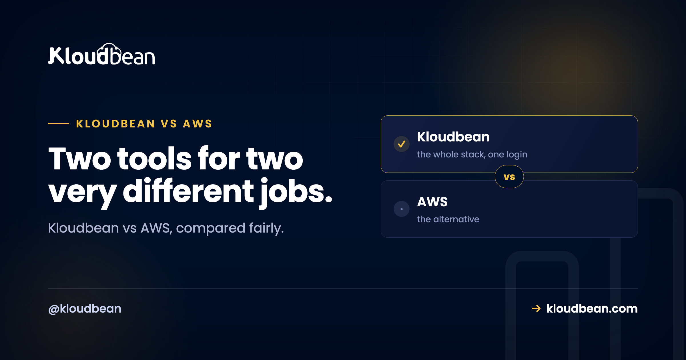

# Kloudbean vs AWS: An Honest Head-to-Head for Small Teams

By Kloudbean Engineering · Two tools for two very different jobs.

Search Kloudbean vs AWS and most results line the two up like rival versions of the same product. They aren't. AWS is a giant catalog of cloud services you assemble and operate yourself. Kloudbean is a managed platform that runs the server, stack, SSL, backups, and patching for you across several clouds, from one dashboard. So the real question isn't "who wins." It's which of those two shapes fits your team right now. This is the honest version, fair to both, with no invented numbers and no pretending Kloudbean is the answer for everyone.

> **The short answer.** AWS gives you maximum control and hundreds of services, and you run all of it. Kloudbean gives you a managed stack across seven clouds from one dashboard, and it runs the boring parts for you. Choose AWS when you have the skills, a specific AWS-only service, a procurement mandate, or genuine hyperscale. Choose Kloudbean when you want to ship without operating raw cloud, you're a small team, and you want predictable flat pricing.

## Kloudbean vs AWS: two products, two different jobs

Start here, because it's the thing the head-to-head tables usually skip. AWS is infrastructure you build with. It hands you EC2 for servers, VPC for networking, IAM for permissions, RDS for databases, S3 for storage, and a long tail of hundreds more services. You wire them together and you keep them running. That's the whole model, and for a large engineering team it's a feature, not a flaw.

Kloudbean sits one layer up. It's a managed multi-cloud platform: managed application servers, seven managed database engines, S3-compatible object storage plus managed Google Cloud Storage buckets, a built-in load balancer, automatic backups, free SSL, and managed Git-based deploys, all from a single dashboard. Under the hood it provisions on real clouds, and AWS is one of the seven it supports, alongside AWS Lightsail, Google Cloud, Linode, Vultr, DigitalOcean, and UpCloud.

So Kloudbean or AWS isn't quite apples to apples. One is the raw material. The other is a finished, operated stack that can even run on AWS hardware underneath. Keep that framing and the rest of the comparison gets a lot clearer.

## A quick scope note: this is full AWS, not Lightsail

One clarification so we're comparing the right things. AWS has a simplified product called Lightsail, which packages a basic VPS with predictable bundles. That's a different, gentler comparison, and it has its own page in [AWS Lightsail vs Kloudbean](https://www.kloudbean.com/blog/aws-lightsail-vs-kloudbean/).

This article is about full AWS. The EC2, RDS, VPC, IAM world. The powerful, self-operated toolbox that people usually mean when they say "we're on AWS." If you were only ever going to spin up one small Lightsail box, read that other piece instead. If you're weighing the real AWS platform against a managed alternative, you're in the right place.

## Setup and the learning curve

Here's where the two feel most different on day one. On full AWS, "getting started" means decisions. You pick a region and an instance type, set up a VPC and subnets, configure security groups, wire IAM roles and policies, attach storage, and then figure out how deployments will actually work. None of that is your product. It's the cost of admission, and it's steep if you haven't done it before. AWS even sells certifications for a reason: there's a lot to learn.

On Kloudbean the setup is smaller on purpose. You launch a managed server on the cloud and region you want, attach a managed database, connect a Git repo, and deploy. SSL, the firewall baseline, and backups are handled as part of the managed stack rather than as separate services you assemble. The tradeoff is honest: you get fewer knobs. For most small teams that's the point, not a loss. If you want the full explanation of what "managed" takes off your plate, [what a managed server actually is](https://www.kloudbean.com/blog/what-is-a-managed-server/) walks through it.

## Who operates it, and why that is the real decision

Almost every real difference between these two comes down to one question: after launch, who runs the thing? This is the shared-responsibility line, and it's worth seeing plainly.

On AWS, the line sits low. Amazon keeps the physical hardware and the core services healthy. Everything above that is yours: OS patching, stack configuration, security hardening, SSL renewal, backups, scaling, and uptime. That control is exactly what large teams want. It's also a real, ongoing job that someone has to own.

On Kloudbean, the line sits higher. The platform runs the server, the stack, SSL, automatic backups, and patching. You keep what should stay yours: your application code and your data. That's the honest boundary of "managed," and it's the same boundary whether you're on the AWS underneath Kloudbean or any of the other six clouds. If the whole managed-versus-run-it-yourself idea is new to you, [managed vs unmanaged hosting](https://www.kloudbean.com/blog/managed-vs-unmanaged-hosting/) breaks down exactly where that line falls.

<!-- ADD IMAGE: swap the SVG below for a polished version if desired. src -> images/responsibility-split.png -->

<figure>
<svg viewBox="0 0 820 360" role="img" aria-labelledby="split-t split-d" xmlns="http://www.w3.org/2000/svg" style="width:100%;height:auto;background:#f6f7fb;border:1px solid #e6e9f2;border-radius:16px">
  <title id="split-t">Who operates each layer on AWS versus Kloudbean</title>
  <desc id="split-d">On full AWS you operate every layer above the raw hardware: the app and data, the runtime and stack, OS patching, networking, access control, and scaling. On Kloudbean the platform operates the server, stack, SSL, backups, and patching, while you own only your app and data.</desc>
  <text x="30" y="36" fill="#000f27" font-family="Poppins,sans-serif" font-size="16" font-weight="700">Who runs which layer after launch</text>

  <text x="30" y="72" fill="#b42318" font-family="Poppins,sans-serif" font-size="13" font-weight="700">Full AWS: you operate all of it</text>
  <rect x="30" y="84" width="360" height="236" rx="10" fill="#ffffff" stroke="#f2b8b5"/>
  <rect x="48" y="98" width="324" height="30" rx="5" fill="#4F1AF3"/><text x="210" y="118" text-anchor="middle" fill="#ffffff" font-family="Poppins,sans-serif" font-size="12">your app + data</text>
  <rect x="48" y="134" width="324" height="30" rx="5" fill="#000f27"/><text x="210" y="154" text-anchor="middle" fill="#ffffff" font-family="JetBrains Mono,monospace" font-size="12">runtime + stack</text>
  <rect x="48" y="170" width="324" height="30" rx="5" fill="#000f27"/><text x="210" y="190" text-anchor="middle" fill="#ffffff" font-family="JetBrains Mono,monospace" font-size="12">OS + patching</text>
  <rect x="48" y="206" width="324" height="30" rx="5" fill="#000f27"/><text x="210" y="226" text-anchor="middle" fill="#ffffff" font-family="JetBrains Mono,monospace" font-size="12">VPC + networking</text>
  <rect x="48" y="242" width="324" height="30" rx="5" fill="#000f27"/><text x="210" y="262" text-anchor="middle" fill="#ffffff" font-family="JetBrains Mono,monospace" font-size="12">IAM + access</text>
  <rect x="48" y="278" width="324" height="30" rx="5" fill="#000f27"/><text x="210" y="298" text-anchor="middle" fill="#ffffff" font-family="JetBrains Mono,monospace" font-size="12">scaling + backups</text>

  <text x="430" y="72" fill="#0a7d33" font-family="Poppins,sans-serif" font-size="13" font-weight="700">Kloudbean: managed layer runs the rest</text>
  <rect x="430" y="84" width="360" height="236" rx="10" fill="#ffffff" stroke="#40b75f"/>
  <rect x="448" y="98" width="324" height="30" rx="5" fill="#4F1AF3"/><text x="610" y="118" text-anchor="middle" fill="#ffffff" font-family="Poppins,sans-serif" font-size="12">your app + data (yours)</text>
  <rect x="448" y="134" width="324" height="30" rx="5" fill="#40b75f"/><text x="610" y="154" text-anchor="middle" fill="#ffffff" font-family="JetBrains Mono,monospace" font-size="12">stack + runtime</text>
  <rect x="448" y="170" width="324" height="30" rx="5" fill="#40b75f"/><text x="610" y="190" text-anchor="middle" fill="#ffffff" font-family="JetBrains Mono,monospace" font-size="12">OS patching</text>
  <rect x="448" y="206" width="324" height="30" rx="5" fill="#40b75f"/><text x="610" y="226" text-anchor="middle" fill="#ffffff" font-family="JetBrains Mono,monospace" font-size="12">free SSL</text>
  <rect x="448" y="242" width="324" height="30" rx="5" fill="#40b75f"/><text x="610" y="262" text-anchor="middle" fill="#ffffff" font-family="JetBrains Mono,monospace" font-size="12">automatic backups</text>
  <rect x="448" y="278" width="324" height="30" rx="5" fill="#40b75f"/><text x="610" y="298" text-anchor="middle" fill="#ffffff" font-family="JetBrains Mono,monospace" font-size="12">firewall baseline</text>

  <text x="410" y="344" text-anchor="middle" fill="#475467" font-family="Poppins,sans-serif" font-size="12">Purple stays yours on both. Navy is your job on AWS. Green is what Kloudbean runs for you.</text>
</svg>
<figcaption>The difference isn't power, it's how many of these layers you personally have to keep alive.</figcaption>
</figure>

## How the bill works: metered services vs a flat plan

Pricing shape matters more than any single number, so let's talk shape and skip the invented figures. AWS bills per service, per resource, mostly by usage, with data-transfer charges that are easy to trigger and famously hard to predict. That granularity is fair when you're big and want to pay for exactly what you use. When you're small, it's the source of the classic surprise bill: you spun something up for a test, forgot it, and the invoice has nothing to do with how many customers you served.

Kloudbean's shape is the opposite. You pick a managed plan and you know what the month costs before it starts. Standard plans begin at a low flat monthly rate, and the managed stack, backups, SSL, and support are part of it rather than a pile of separate line items. Neither model is "cheaper" in the abstract, and I won't pretend a flat plan always wins on raw compute cost. But for a small team, predictable beats theoretically-optimal-if-you-tune-it, and the [true cost of running infrastructure yourself](https://www.kloudbean.com/blog/the-real-cost-of-unmanaged-vps/) is rarely just the sticker price. Count your own hours in the total.

## How far each one scales

Be honest about ceilings, because this is where AWS earns its reputation. AWS scales further than almost anything, full stop. Autoscaling groups, global regions, managed Kubernetes, specialized services for machine learning, streaming, analytics, and more. If you're heading for genuine hyperscale or a very specialized architecture, that depth is real and it's a legitimate reason to be on AWS.

Kloudbean scales in the ways most apps actually need. You can resize a server up when you need more room, put the built-in load balancer in front of multiple servers to spread traffic, and add read replicas for MySQL and MariaDB to take pressure off the primary database. If the database is the only layer you're actually weighing, [running managed Postgres or MySQL instead of RDS](https://www.kloudbean.com/blog/aws-rds-alternative/) is the narrower version of this decision. A single application can even run across multiple clouds and regions from one dashboard, wired together through the load balancer. Kubernetes, autoscaling, and private networking (VPC) exist too, but on Kloudbean those are Enterprise features, not part of the standard flat plan, so don't picture them as default. The honest read: Kloudbean comfortably covers the scaling path most small and growing teams walk, while AWS's raw ceiling is higher if you truly need it.

## Kloudbean vs AWS, side by side

Here's the decision view. Not a scoreboard, a fit guide.

| | Full AWS | Kloudbean |
| --- | --- | --- |
| What it is | A toolbox of hundreds of cloud services | A managed platform across seven clouds |
| Setup before launch | Region, instance, VPC, IAM, deploys | Launch server, attach database, deploy |
| Who operates it | You, from the OS up | The platform runs server, stack, SSL, backups |
| Pricing shape | Metered per service, plus data transfer | Flat, predictable monthly plan |
| Learning curve | Steep, rewards expertise | Gentle, fewer knobs on purpose |
| Scaling | Highest ceiling, autoscaling, global | Resize, load balancer, replicas; k8s on Enterprise |
| Windows / IIS | Native Windows workloads supported | Linux-based stacks; native Windows is Enterprise only |
| Best fit | Cloud-skilled teams, specific services, hyperscale | Small teams shipping without operating raw cloud |

Neither column is the winner in the abstract. The right one is whichever row you keep nodding at. If you read the left column and thought "yes, I want all those knobs," AWS is your tool. If the right column felt like relief, that's your answer.

## Choose AWS if...

I'd genuinely point you to AWS in these cases, and it would be dishonest not to.

- **You already have AWS or DevOps skills.** Existing expertise is worth more than any theoretical simplicity. Don't fight a tool your team already knows well.
- **You need a specific AWS-only service.** A particular managed service, an ML or analytics product, or a feature a customer contractually requires, with no good equivalent elsewhere.
- **A procurement mandate names AWS.** Regulated and enterprise deals sometimes require a specific named cloud. That requirement decides for you.
- **You're headed for genuine hyperscale.** If fine-grained control over dozens of services and near-unbounded autoscaling will earn its keep, that depth is real.
- **You need native Windows Server or IIS.** Kloudbean runs Linux-based stacks; a native Windows or IIS environment is an Enterprise arrangement rather than the standard experience, so full AWS can be the more direct fit.

If one of those is you, use AWS and don't feel bad about the operational weight. It's buying you something concrete.

## Choose Kloudbean if...

And I'd point you here in these cases, which describe a lot of builders and small teams.

- **You want to ship without operating raw cloud.** No VPC to design, no IAM policies to debug before your first user. Launch, attach a database, deploy from Git.
- **You're a small team or a solo founder.** The managed stack is effectively an ops layer you don't have to hire for yet. That makes Kloudbean a reasonable AWS alternative for small teams that would otherwise burn weeks on setup.
- **You want predictable, flat pricing.** A known monthly cost beats a metered bill you have to watch, especially early on.
- **You want one dashboard for the whole stack.** Servers, managed databases, object storage, and the load balancer in one place, instead of stitched-together services.
- **You want cloud choice without operating each cloud.** Deploy on AWS, Google Cloud, DigitalOcean, and others through the same managed layer, and move between them without relearning a new console each time.

That's the shape of a managed cloud vs AWS decision for most small teams: not less capable, just less to personally run. If you're specifically standing up an AI or SaaS app, the buyer's view in [hosting for an AI SaaS](https://www.kloudbean.com/blog/best-hosting-for-ai-saas/) applies the same logic to that use case.

## The honest bottom line

Is AWS better than Kloudbean? Wrong question. AWS is better at being a deep, self-operated toolbox for teams with the skills and the need. Kloudbean is better at getting a small team to production and keeping it there without a dedicated ops hire. Pick the one that matches who's actually going to run it. And if you start on Kloudbean and later hit a real reason to move to raw AWS, your code and data come with you, so choosing simple now doesn't lock you in. That reversibility is the quiet reason starting managed is a safe first move. If you're still upstream of this decision and wondering whether you need AWS at all, [do I need AWS to launch a SaaS](https://www.kloudbean.com/blog/do-i-need-aws-to-launch-a-saas/) tackles that question head-on.

Ship on a managed stack, or wire up raw cloud yourself. If you'd rather have a managed server, a managed database, backups, and SSL across your choice of cloud without operating it all, that's what Kloudbean is for. See [kloudbean.com](https://www.kloudbean.com/) and [pricing](https://www.kloudbean.com/pricing/).

## FAQ

**Is AWS better than Kloudbean?**
Neither is better in the abstract; they solve different jobs. AWS is a deep toolbox of self-operated services, best when you have cloud skills, need a specific service, or are heading for hyperscale. Kloudbean is a managed platform that runs the server, stack, SSL, and backups for you, best when a small team wants to ship without operating raw cloud. Match the tool to who will run it.

**Should I choose Kloudbean or AWS?**
Ask who operates it after launch. If you or your team already know AWS and want maximum control, choose AWS. If you'd rather deploy from Git and let the platform handle patching, SSL, and backups, choose Kloudbean. Existing skills, a specific AWS-only service, or a procurement mandate push toward AWS; a small team wanting predictable pricing pushes toward Kloudbean.

**Is Kloudbean cheaper than AWS?**
It depends on how you count, and there's no honest single number. AWS bills per service with data-transfer charges that are hard to predict, so small workloads can see surprise bills. Kloudbean uses a flat, predictable monthly plan with the managed stack included. Compare total cost including your own hours for setup and upkeep, not just the headline compute price.

**Can Kloudbean do everything AWS does?**
No, and it doesn't try to. AWS has hundreds of specialized services; Kloudbean covers the stack most apps actually use: managed servers, seven database engines, object storage, a load balancer, backups, SSL, and Git deploys. For a common web or SaaS app that's plenty. For a niche AWS-only service, AWS is the direct fit.

**Does Kloudbean run on top of AWS?**
Yes. AWS is one of the seven clouds Kloudbean can provision and manage, alongside AWS Lightsail, Google Cloud, Linode, Vultr, DigitalOcean, and UpCloud. So you can get the AWS network underneath with a managed stack on top, or spread an application across several of those clouds from one dashboard.

**Can I move from Kloudbean to AWS later?**
Yes. Your application is your own code and your data is portable, so moving to raw AWS later is a normal path if you hit the scale or specific need that justifies it. Starting managed is a reversible decision, which is why it's a low-risk first move for a small team rather than a lock-in.

**What is the difference between AWS and managed cloud hosting?**
AWS gives you raw building blocks that you assemble and operate yourself. Managed cloud hosting runs the server, stack, SSL, patching, and backups for you and hands you a finished environment to deploy into. The AWS vs managed cloud hosting choice is really about who does the operations work, not about which network is faster.

**Does Kloudbean support Windows Server or IIS apps?**
Kloudbean runs Linux-based stacks, which cover PHP, Node.js, Python, Go, Ruby, Java, and more. If your app specifically needs a native Windows Server or IIS environment, that's an Enterprise arrangement rather than the standard flat-plan experience, and full AWS may be the more direct fit for that particular need.

---

*Kloudbean Engineering · Pick the one that matches your team, not the one with the biggest catalog.*
