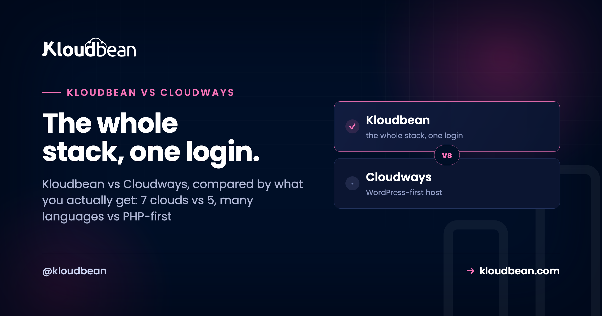
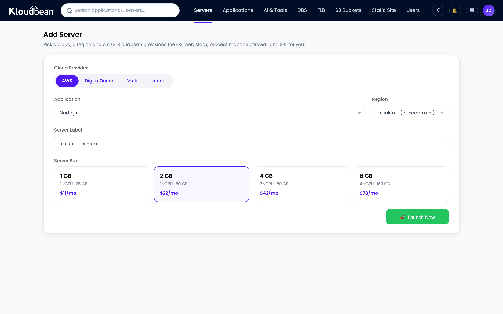
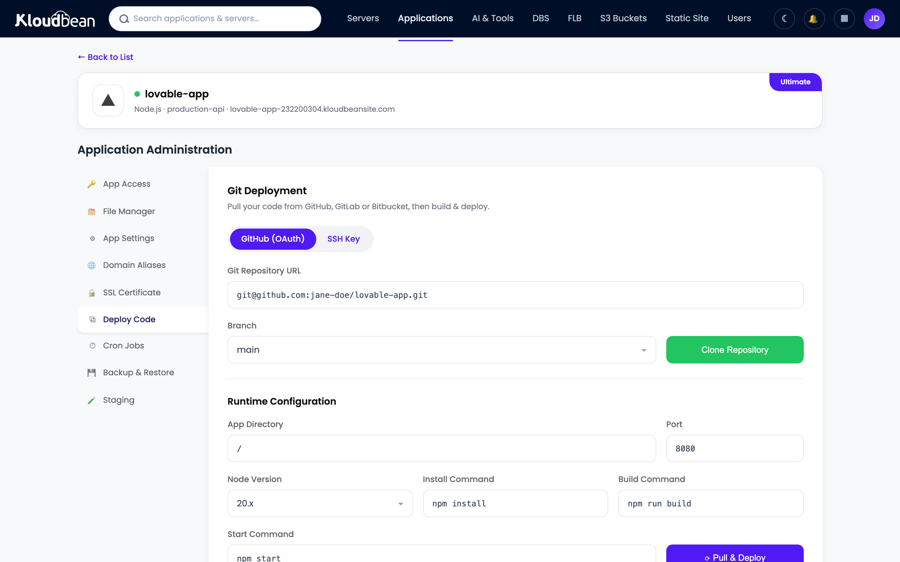

# Kloudbean vs Cloudways: What You Actually Get, Compared

On paper, Kloudbean vs Cloudways looks like a coin flip. Both are managed cloud hosting. Neither hands you a raw server to babysit. Both sit on top of real clouds and run the OS, the stack, SSL, and backups for you.

So the spec-sheet framing (which one is "managed hosting") is the wrong question, because they both are. The useful question is scope: how much of your stack does each one actually cover? That's where they split, and it's not subtle. Cloudways is a managed WordPress and PHP host, and a well-regarded one. Kloudbean is a full-stack platform, servers plus apps in many languages, six managed databases, object storage, a load balancer, and enterprise Kubernetes, in one dashboard. Let's compare what you actually get, not what the category label says.

> **Short answer:** Pick Cloudways if your world is WordPress and PHP and you want a host laser-focused on that. Pick Kloudbean if you want more clouds (seven vs five, a strict superset), more languages, standalone managed databases, built-in object storage and load balancing, real CI/CD with live build logs, and an enterprise path (audit trail, Kubernetes), all in one console. Both are managed. Kloudbean is just wider.

## What Kloudbean and Cloudways genuinely share

The common ground is real, and I'd rather say it plainly than pretend it away.

- **A managed layer over real clouds.** You pick a provider and a size. The platform handles the OS, the web stack, updates, and certificates. You're not the sysadmin on either.
- **Top-tier infrastructure underneath.** Both run your app on major clouds, not mystery shared hosting.
- **Solid WordPress and PHP.** Both run the stacks that power most of the web, with staging to test changes safely.
- **Your app stays yours.** The platform keeps the server healthy; your code and data are yours to export.

If your entire need is one managed WordPress or PHP site on a good cloud, you'll be fine on either. The gap opens the moment your project is bigger than that. Here's the shape of it: everything Cloudways does sits inside what Kloudbean does.

**Inside the Cloudways set:** 5 clouds (DO, Vultr, Linode, AWS, GCP); WordPress, Laravel, PHP; MySQL / MariaDB with the app; Git pull deploys and staging; a Cloudflare Enterprise add-on.

**What Kloudbean adds on top:** AWS Lightsail and UpCloud (7 clouds); Node, Python, Ruby, Java, static sites; one-click AI apps (n8n, Supabase); Redis, PostgreSQL, MongoDB, Elasticsearch; S3 and GCS object storage; a built-in load balancer (FLB); managed CI/CD with live build logs; and an enterprise audit trail with Kubernetes.

## What you actually get, category by category

### Clouds: seven vs five (and it's a superset)

This is the one line in the whole comparison that isn't a matter of taste. Cloudways runs on DigitalOcean, Vultr, Linode, AWS, and Google Cloud. Kloudbean runs on those same five, plus AWS Lightsail and UpCloud. Seven total. So any cloud you could pick on Cloudways, you can pick on Kloudbean, with two more on the table. You provision by choosing the provider first:

### Languages: the whole ecosystem, not just PHP

Cloudways is built around PHP, and WordPress and Laravel run well there. Kloudbean runs those too, and then keeps going: Node.js (Express, plus React, Vue, Angular front ends), Python (Django, Flask, FastAPI), Ruby, Java, static sites with free SSL, and one-click apps like n8n and Supabase. If your stack is a WordPress site plus a Node API plus a Python worker, you don't need three hosts. You need one that speaks all three.

### Managed data: six engines, standalone

On a PHP-centric host, the database is usually the MySQL or MariaDB sitting beside your app. Fine for WordPress. Kloudbean runs six managed engines as first-class, standalone services: MySQL, MariaDB, PostgreSQL, Redis, Elasticsearch, and MongoDB. Launch one, get a connection string, back it up automatically, keep it on a private network. Deciding between engines? See [MySQL vs PostgreSQL](https://www.kloudbean.com/blog/mysql-vs-postgresql/), or the how-to in [add a managed database to your app](https://www.kloudbean.com/blog/add-managed-database-to-your-app/).

### Storage and load balancing: built in, not bolted on

Kloudbean includes S3-compatible object storage and managed Google Cloud Storage buckets, so big files live off your server instead of bloating it. And the Flexible Load Balancer is built into every account, off by default, ready when you need to spread traffic across nodes. No separate product, no separate login. Background on both: [S3-compatible object storage](https://www.kloudbean.com/blog/s3-compatible-object-storage/) and [how a cloud load balancer works](https://www.kloudbean.com/blog/cloud-load-balancer-explained/).

<!-- ADD IMAGE: the object storage view with an S3-compatible bucket, or the Flexible Load Balancer panel, showing both live in the same console -->

### Deploys: managed CI/CD with live build logs

Connect a Git repo and Kloudbean builds and deploys on every push, streaming the build logs into the console so you can watch it happen (and see exactly where it fails). That's a step past a plain Git pull. Details in [CI/CD auto-deploy from GitHub](https://www.kloudbean.com/blog/ci-cd-auto-deploy-from-github/).

<!-- ADD IMAGE: the managed databases panel with the six engines (MySQL, MariaDB, PostgreSQL, Redis, Elasticsearch, MongoDB) -->

### Team and enterprise: UAC, audit trail, Kubernetes

Kloudbean adds subusers with granular per-resource access control, and, for enterprise and government teams, an immutable audit trail (searchable, CSV export, built for compliance) plus Kubernetes and custom architectures. For a regulated org, that's the difference between a hosting plan and something closer to an in-house infrastructure team.

## Kloudbean vs Cloudways, at a glance

| | Cloudways | Kloudbean |
| --- | --- | --- |
| **Core model** | Managed WordPress / PHP hosting | Full-stack platform, one dashboard |
| **Cloud providers** | DO, Vultr, Linode, AWS, GCP (5) | AWS, Lightsail, GCP, Linode, Vultr, DO, UpCloud (7) |
| **App types** | PHP / WordPress-centric | PHP, Node, Python, Ruby, Java, static, AI apps |
| **Managed databases** | MySQL / MariaDB with the app | Standalone MySQL, MariaDB, PostgreSQL, Redis, Elasticsearch, MongoDB |
| **Object storage** | External / add-on | Built-in S3-compatible plus GCS buckets |
| **Load balancer** | Not a standard built-in | Built-in FLB, enable on any account |
| **Deploys** | Git pull integration | Managed CI/CD, live build logs on push |
| **Cloudflare Enterprise** | Add-on | Add-on (free for Enterprise) |
| **Enterprise** | Managed / scale options | Kubernetes, autoscaling, audit trail, custom setups |
| **Who owns the app** | You | You |

## Where Cloudways is genuinely the right call

Cloudways has a long track record with WordPress and PHP, a big and active community, and it's backed by DigitalOcean. If a portfolio of WordPress sites is your whole world, and you want a host that does exactly that and nothing you'll never use, Cloudways handles it well. That's the fair nod, and I mean it. The pivot: Kloudbean isn't a newcomer either. It launched in 2023 and has shipped new clouds, runtimes, and features nearly every month since, with a large customer base running on it now. So "mature and proven" isn't a tiebreaker that only one side gets.

> **Cloudflare: call it a tie.** Both platforms resell a Cloudflare Enterprise add-on for edge caching, so this isn't a Kloudbean-only edge over Cloudways. On Kloudbean it's a paid add-on (free on Enterprise plans). If someone tells you Cloudflare is the reason to switch between these two, they're overselling it.

## How the pricing model works (and what to compare)

Both are managed layers over cloud infrastructure, so they price in a similar shape: you pay for the underlying server (bigger size, more cost) plus the management on top (the automation, updates, security, and support that save you the work). That's a different animal from a bare VPS, where the sticker looks cheaper precisely because you are the management. So don't compare a managed plan against a raw VPS on price alone. Compare managed to managed. Between these two, size the server you actually need, then weigh the built-ins, because getting standalone databases, object storage, and a load balancer in one place can move the real total more than the base server rate does. The [managed vs unmanaged breakdown](https://www.kloudbean.com/blog/managed-vs-unmanaged-hosting/) unpacks what "management" is really buying you.

## The honest small print

Same caveats apply to both, kept short. These are Linux stacks, the world of PHP, Node, Python, Ruby, and Java and their databases, not Windows, .NET, or IIS. And "managed" means the server, stack, SSL, and backups are handled, while your application code and its data stay yours. One Kloudbean-specific note for general readers: autoscaling is an enterprise and custom feature, not something standard accounts flip on. So if automatic scaling is central to your plan, that's an enterprise conversation, not a default. Want the wider field first? See [Cloudways alternatives](https://www.kloudbean.com/blog/cloudways-alternatives/).

---

**Your whole stack, one dashboard, seven clouds.** Run apps in any language, six managed databases, object storage, and a load balancer, all managed, all in one place. Start free at [kloudbean.com](https://www.kloudbean.com/), compare options on [pricing](https://www.kloudbean.com/pricing/).

7 clouds · One dashboard for your whole stack · 6 managed databases · Built-in load balancer · Free migration · Free trial

## FAQ

**Is Kloudbean a Cloudways alternative?**
Yes, and a strong one. Both are managed cloud hosting, but Cloudways is focused on WordPress and PHP, while Kloudbean is a full-stack platform: seven clouds, apps in many languages, six standalone managed databases, built-in object storage and a load balancer, real CI/CD, and enterprise Kubernetes, all in one dashboard. If you need more than PHP sites, Kloudbean covers more of your stack.

**Does Kloudbean support more cloud providers than Cloudways?**
Yes. Kloudbean supports seven (AWS, AWS Lightsail, Google Cloud, Linode, Vultr, DigitalOcean, and UpCloud), which is every provider Cloudways offers plus AWS Lightsail and UpCloud. It's a strict superset, so you never give up a cloud choice by picking Kloudbean.

**Which is better for WordPress?**
Both run WordPress well, with staging to test changes safely. Cloudways is WordPress and PHP focused, so it's a reasonable pick for a pure WordPress fleet. Kloudbean also runs WordPress and WooCommerce comfortably and is the clear choice when WordPress is one part of a broader stack, or when you want room to add Node, Python, databases, or storage later without switching hosts.

**What does Kloudbean give me that isn't standard on Cloudways?**
In one console: six standalone managed databases, S3-compatible and GCS object storage, a built-in Flexible Load Balancer, managed CI/CD with live build logs, apps in many languages, and, for enterprise, Kubernetes, autoscaling, and an audit trail. The idea is to keep a full project's pieces together instead of spread across separate products.

**Is Cloudflare a reason to pick Kloudbean over Cloudways?**
Not really. Both resell a Cloudflare Enterprise add-on for edge caching, so on that specific point it's a tie. Cloudflare is a strong edge against edge-first platforms, but between these two it's parity. Pick based on clouds, languages, and built-in services instead.

**Does Kloudbean autoscale my app automatically?**
Not on standard accounts. Autoscaling is an enterprise and custom feature. For a normal plan you scale by resizing the server or adding nodes behind the built-in load balancer. If automatic scaling is central to your plan, that's an enterprise conversation.

**Do I still own my app on either platform?**
Yes. On both Kloudbean and Cloudways, the platform manages the server, stack, SSL, and backups, while your application code and data belong to you and are exportable. The managed part is the infrastructure, not your work.

**Is Kloudbean cheaper than Cloudways?**
Neither is universally cheaper. Both price the server plus management, so it depends on your configuration and which built-ins you'd otherwise pay for separately. Size the setup you actually need on each and compare that, rather than headline rates.

**How do I move from Cloudways to Kloudbean?**
For WordPress or PHP, you copy the files and database, re-point DNS, and re-issue SSL. For an app, it's basically a redeploy: connect the repo, set environment variables, attach the database, cut the domain over. Kloudbean offers free migration assistance, and the zero-downtime migration guide walks the steps.

---

*Kloudbean · The whole stack, one login.*
