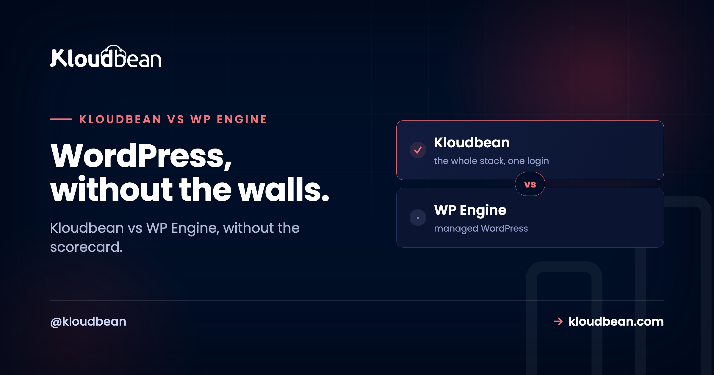

# Kloudbean vs WP Engine: Walled Garden or Open Platform?

Pick a managed WordPress host and you're really picking a philosophy. WP Engine builds a walled garden: a polished, opinionated home for WordPress, with its own tooling, its own caching, and guardrails that keep WordPress humming. Kloudbean builds an open platform, where WordPress is one of many things you run, on the cloud you choose, next to your databases, apps, and storage.

So the honest Kloudbean vs WP Engine question isn't "who runs WordPress better." It's whether you want a beautiful enclosure or an open field. And that answer depends less on WordPress itself than on everything your project might become. Let's walk it through.

> **Short answer:** WP Engine is a premium walled garden for managed WordPress, and it's genuinely excellent if WordPress with strong conventions is the whole job. Kloudbean is an open, multi-cloud platform that runs managed WordPress and WooCommerce (with staging and backups) plus Node, Python, six managed databases, S3-compatible storage, and a load balancer, all in one console across 7 clouds. Pick the garden if you'll only ever grow WordPress. Pick the open platform if your stack is heading anywhere else.

```
WALLED GARDEN (WP Engine)        |   OPEN PLATFORM (Kloudbean)
  [ fence ]                      |   Pick any of 7 clouds
  ( WordPress )  one cloud       |   [WordPress][Node.js][Python]
  lock-in, one way               |   [Database ][S3     ][Load bal.]
                                 |   one dashboard, one login
Beautiful garden, one plant.     |   Managed WordPress, plus everything else.
```
*Same job, two shapes. WP Engine keeps WordPress inside a tuned enclosure. Kloudbean puts WordPress on an open grid next to your other workloads, on the cloud you choose.*

## What WP Engine's walled garden gets right

Credit where it's due. WP Engine has spent years making one thing excellent: managed WordPress at a premium level. Fast WordPress-tuned infrastructure. Caching handled for you. Dev, staging, and production environments with a clean push between them. Automatic WordPress updates. Security rules written for the specific ways WordPress gets attacked, and support staff who know the platform cold. There's even a headless WordPress path for teams that want a decoupled front end.

That focus is a feature, not an accident. If your world is WordPress and you want a host that has poured everything into WordPress specifically, WP Engine earned its reputation honestly. A walled garden is a lovely place to be when you only want to grow the one plant it was built for. This piece isn't here to pretend otherwise.

## What a walled garden quietly costs you

Every enclosure has a price, and it's rarely the monthly bill. It's the shape of the walls. Three costs show up again and again once a project matures past a single WordPress install.

**The cloud isn't yours to choose.** A managed WordPress platform runs on the infrastructure it runs on. You don't get to say "put this one in Frankfurt on Google Cloud, and that one on a cheaper provider." You take the garden's soil. Fine, until latency, data-residency rules, or a procurement team asks for a specific cloud you can't provide.

**The tooling is proprietary.** A garden's caching, its deploy flow, its config surfaces are its own. That's why it feels smooth. It's also why the knowledge doesn't fully transfer, and why leaving means unwinding conventions rather than copying a folder. Lock-in isn't a scandal. It's just a real cost you should price in.

**Anything that isn't WordPress has no home.** This is the big one. The moment your project needs a small **Node API** for a mobile app, a nightly **Python job** that crunches data, a **database** that isn't WordPress's MySQL, or a bit of **object storage** for uploads that shouldn't bloat the media library, the WordPress-shaped host has nowhere to put it. So it goes elsewhere.

<!-- ADD IMAGE: A screenshot of the sprawl: separate browser tabs for your WordPress host, your API host, your database provider, and your file storage, all open at once. -->

## The moment the assumption cracks

Here's a pattern we see all the time. A WordPress site is humming along. Then the team needs one more thing, then another. The Node API lands on one service. The Python job on a second. The extra database on a third. The storage on a fourth. Now there are four dashboards, four bills, and a mental map of which piece lives where.

The WordPress part is still great. It's everything around it that got complicated. And the tax is bigger than a few extra tabs. Credentials get copied into two places and drift out of sync. The API and the WordPress site can't talk over a private network, so traffic takes the long way around. Backups run on four schedules with four restore procedures you've never tested together. When something breaks at 2am, you're correlating logs across dashboards that don't know about each other. None of it is fatal on any single day. All of it is standing friction that grows with the stack.

## Kloudbean vs WP Engine: the open-platform alternative

This is the exact seam Kloudbean is built along. The premise is different from the ground up: your WordPress site is welcome, and it's treated as one kind of app among many rather than the whole point. So when that Node API shows up, it gets a home on the same platform. You set its environment, connect it to a database, and deploy it right next to the WordPress site.


The nightly Python job runs there too. The extra database is a managed one you launch in the same console: MySQL, MariaDB, PostgreSQL, Redis, Elasticsearch, or MongoDB. The object storage is an S3-compatible bucket a click away. A load balancer is built in, sitting there for the day you need it. And because the platform is genuinely multi-cloud, you choose where each server lives: AWS, AWS Lightsail, Google Cloud, Linode, Vultr, DigitalOcean, or UpCloud.

None of that comes at WordPress's expense. Kloudbean still runs managed WordPress and WooCommerce with staging, automatic backups, and free SSL. You're not trading WordPress quality for range. You get the WordPress essentials, plus a home for everything the project grows into. If you want the deeper WordPress-specific angle, the [Kloudbean vs Kinsta comparison](https://www.kloudbean.com/blog/kloudbean-vs-kinsta/) covers the pure-WordPress scope question, and there are focused guides on [speeding up WordPress](https://www.kloudbean.com/blog/speed-up-wordpress/) and [secure WordPress hosting](https://www.kloudbean.com/blog/secure-wordpress-hosting/) too.

<!-- ADD IMAGE: Your WordPress site and a Node app listed together under one Kloudbean server, on the cloud you picked. -->

## Walled garden vs open platform, side by side

| | WP Engine (walled garden) | Kloudbean (open platform) |
|---|---|---|
| **What runs here** | Managed WordPress (plus headless WP) | WordPress, WooCommerce, Node, Python, Ruby, Java, static, one-click AI apps |
| **Cloud choice** | The platform's own infrastructure | 7 clouds: AWS, Lightsail, GCP, Linode, Vultr, DigitalOcean, UpCloud |
| **Databases** | WordPress MySQL | 6 managed engines (MySQL, MariaDB, PostgreSQL, Redis, Elasticsearch, MongoDB) |
| **Object storage** | Not a general-purpose feature | Built-in S3-compatible buckets (and GCS) |
| **Load balancing** | Handled behind the platform | Built-in Flexible Load Balancer on any account |
| **WordPress staging** | Yes, a core strength | Yes, WordPress and Laravel staging |
| **Portability** | Proprietary conventions to unwind | Standard Linux stack, export any time |
| **Best fit** | WordPress-only, especially at scale | WordPress plus a wider, growing stack |

## Where this bites in real life

Let me be blunt about the anti-pattern, because it's the one that costs teams the most. It's building a business on a platform that has no room for the second thing you need, then discovering that fact under deadline. The classic version: marketing wants a lightweight microservice to personalize a landing page, or the product team wants an API the mobile app can hit. On a WordPress-only host, that work quietly gets outsourced to a fourth provider, and the "simple WordPress site" is suddenly a distributed system nobody designed on purpose.

My honest opinion after watching this play out: most projects that live long enough stop being pure WordPress. Not all. But most. A brochure site for a law firm might stay WordPress forever, and that's a perfectly good reason to sit in the garden. A growing product company almost never does. So the smart move is to bet on where your stack is going, not just where it is the week you sign up. Migrating later is doable, but it's always more annoying than choosing room to grow on day one.

## So which should you pick?

If you're WordPress and only WordPress, especially at enterprise scale where WordPress-specific tooling matters most, WP Engine's specialization is a strong, honest fit. You'll get depth a generalist can't easily match, and the walls will feel like guardrails rather than fences.

If your reality is WordPress *plus* a Node service, a Python job, a spare database, some object storage, or you're an agency tired of stitching those across separate providers, the open platform wins. You keep managed WordPress, and you stop paying the sprawl tax on everything else. Agencies especially tend to feel this fast, which is why there's a whole [agency WordPress hosting](https://www.kloudbean.com/blog/agency-wordpress-hosting/) guide and a broader look at [Cloudways alternatives](https://www.kloudbean.com/blog/cloudways-alternatives/) if you're weighing the managed-cloud field.

Underneath, the managed deal is the same on both. These are Linux stacks. The platform looks after the server, the stack, SSL, and backups, and your sites, apps, and data stay yours to export whenever you want. WP Engine points that deal squarely at WordPress. Kloudbean points it at whatever you're running, whether that's WordPress today or WordPress plus a [managed database](https://www.kloudbean.com/blog/add-managed-database-to-your-app/) and some [object storage](https://www.kloudbean.com/blog/s3-compatible-object-storage/) next quarter.

<!-- ADD IMAGE: The cloud picker: choosing which of the 7 providers a new WordPress server lands on. -->

---

**Keep WordPress. Lose the walls.** Run managed WordPress and everything that grows around it in one console, on the cloud you choose. Start free at [kloudbean.com](https://www.kloudbean.com/); plans on [pricing](https://www.kloudbean.com/pricing/).

Managed WordPress & WooCommerce · WP staging · Node & Python apps · 6 managed databases · S3 + GCS storage · Built-in load balancer · 7 clouds · Free migration · Free trial

## FAQ

**Is Kloudbean a good WP Engine alternative?**
It's a strong WP Engine alternative for teams whose stack is broader than WordPress. WP Engine specializes deeply in managed WordPress. Kloudbean runs WordPress alongside apps in other languages, six managed databases, and object storage in one console across 7 clouds. If you want WordPress plus other things together, Kloudbean fits. If you're WordPress-only, WP Engine's depth is genuinely compelling.

**Which is better for pure WordPress?**
For a WordPress-only footprint, especially at scale, WP Engine's years of WordPress-specific tuning, staging, and expert support make it an excellent choice. Kloudbean also runs WordPress well, with staging and backups, but it shines when WordPress is part of a wider stack rather than the entire stack.

**Can WP Engine host a Node or Python app?**
WP Engine is built around WordPress, including a headless WordPress path, not general-purpose apps. A standalone Node API or Python job usually has to live on a separate service, which is what leads to a multi-dashboard setup. Kloudbean gives those apps a home on the same platform as your WordPress site.

**What does "walled garden" mean for hosting lock-in?**
It means the platform's caching, deploy flow, and config are proprietary, so the smoothness comes with conventions that don't fully transfer elsewhere. Leaving means unwinding those conventions rather than copying standard files. Kloudbean runs a standard Linux stack you can export any time, which keeps switching costs low.

**Can I choose my cloud provider on each platform?**
On a managed WordPress platform you generally run on its own infrastructure, with no provider choice. On Kloudbean you pick from 7 clouds per server: AWS, AWS Lightsail, Google Cloud, Linode, Vultr, DigitalOcean, or UpCloud. That matters for latency, cost, and data-residency requirements.

**Does Kloudbean do WordPress staging and backups like WP Engine?**
Yes. Kloudbean provides WordPress (and Laravel) staging, automatic backups, and free SSL. You get the WordPress essentials teams rely on, plus room to run non-WordPress workloads in the same account.

**Why do WordPress stacks end up spread across services?**
Because a WordPress-focused host has no natural home for the non-WordPress pieces that accumulate: an API, a background job, an extra database, some file storage. Each lands on a different provider, adding logins and bills. A broader platform keeps them together, which is the main reason teams consolidate.

**Do I keep ownership of my sites and apps on either platform?**
Yes. On both WP Engine and Kloudbean, the provider manages the infrastructure (server, stack, SSL, backups) while your WordPress sites, application code, and data remain yours. Managed refers to the operations, not to your work. You can export and leave when you choose.

---

*By Kloudbean · WordPress, without the walls.*
