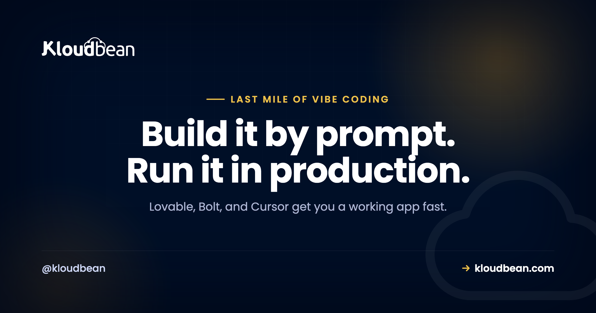

# The Last Mile of Vibe Coding Is Production: What AI Builders Still Don't Handle

You described an app and an AI wrote it. Lovable, Bolt, Cursor, v0, Replit, Claude Code, they're genuinely good now at turning a sentence into something that runs. Then you try to put it in front of real users, and a different kind of problem starts. The building was the easy part. The last stretch, keeping the thing alive in production, is where most vibe-coded apps stall.

That gap is the whole subject of this page. Not "how do I deploy" (we have a [step-by-step deploy guide](https://www.kloudbean.com/blog/deploy-ai-built-app-to-production/) for that). This is the map of everything the builder quietly left for you to figure out once the app is real, and where to fix each one.

> **The short version:** AI builders hand you working code, not a running product. Production means a database that survives a redeploy, secrets that never reach the browser, memory for your AI features, defence against abuse, and a bill you can predict. None of that is written for you by the prompt. Below is the full list, with the fix for each piece.

## Where the preview ends and production begins

The URL your builder gives you is a demo, not a home. It often sleeps after a few minutes, resets its data, or vanishes when your trial does. That's fine for showing a friend. It's not where you put paying users.

Production is a smaller word for a longer list: a place the app runs all the time, a database that keeps your data when you ship a change, a domain with a real certificate, somewhere safe for your keys, and a way to tell what happened when something breaks at 2am. The prompt got you the features. This is the plumbing under them, and it doesn't write itself.

## The things that break once real people show up

Here's the honest map. Each one is a real wall teams hit, and each links to the fix.

- **Your data doesn't survive a redeploy.** Most AI-built apps start on a local SQLite file or an in-memory store. It works beautifully until you push an update, and then the file is gone and so are your users. The fix is a managed database that lives outside the app process, so a new deploy never touches your data. Start with [adding a managed database to your app](https://www.kloudbean.com/blog/add-managed-database-to-your-app/), and if this already bit you, [why your app works locally but not in production](https://www.kloudbean.com/blog/why-my-ai-app-works-locally-but-not-in-production/) explains the pattern.
- **Secrets leak into the browser or into Git.** AI code loves to hard-code an API key or drop it in a file that ships to the client. Anyone can read it. Keys belong on the server, in environment variables, and they need rotating when they leak. See [secrets management](https://www.kloudbean.com/blog/secrets-management/) and [environment variables done right](https://www.kloudbean.com/blog/environment-variables-done-right/).
- **Your AI features need memory.** A chatbot that forgets the last message, or a search that can't find your own documents, feels broken. You need a durable store for history and context, and usually vector search for retrieval. Postgres holds the record of truth, [pgvector handles embeddings](https://www.kloudbean.com/blog/pgvector-for-ai-apps/), and [managed Redis](https://www.kloudbean.com/blog/managed-redis-hosting/) is the fast layer for sessions and caching.
- **Long jobs can't run inside a web request.** Ingesting a document, building embeddings, sending a batch of email, none of that fits in the few seconds a request should take. It belongs in a queue with a worker running beside the app. [Background jobs with BullMQ and Redis](https://www.kloudbean.com/blog/nodejs-background-jobs-bullmq/) covers the shape.
- **Files need somewhere real to live.** PDFs, images, user uploads, they can't sit on the app's disk, which is temporary and disappears on redeploy. They go in object storage. Here's [how to store user uploads in object storage](https://www.kloudbean.com/blog/store-user-uploads-in-object-storage/).
- **Security is your job now.** An AI app takes untrusted input and often hands it to a model with real permissions. Prompt injection, key abuse, and data leaks are live risks the moment you have users. Work through the [AI app security checklist](https://www.kloudbean.com/blog/ai-built-app-security-checklist/).
- **The model itself is slow, expensive, or down sometimes.** Provider APIs rate-limit you, cost more than you expect, and have outages. Real apps cap spend, retry sensibly, and fall back when a model is unavailable. This one is mostly discipline, not a product you buy.
- **It has to stay up.** A serverless preview that scales to zero pays a cold-start tax on every first request and reopens database connections constantly. A steady app is happier as an always-on process with a stable connection pool. See [from prototype to production](https://www.kloudbean.com/blog/from-prototype-to-production-checklist/) and [database connection pooling](https://www.kloudbean.com/blog/database-connection-pooling/).

If you read only one thing here, read the first bullet. The wiped-database surprise is the single most common way a vibe-coded app loses real user data.

## Preview versus production, side by side

| Concern | What the AI builder gives you | What production actually needs |
| --- | --- | --- |
| Data | A local SQLite file or demo store | A managed database that outlives every deploy |
| Secrets | Keys in the code or client | Server-side env vars, rotated when leaked |
| AI memory | Nothing persistent | Postgres + Redis + a vector store |
| Long work | Runs in the request until it times out | A queue and a worker beside the app |
| Files | The app's temporary disk | Object storage |
| Uptime | A preview that sleeps and cold-starts | An always-on process with a real domain and SSL |
| Security | Whatever the prompt happened to add | Deliberate input, key, and abuse controls |

## The architecture underneath

Once you see the shape, it stops being scary. A production AI app is a handful of boxes with clear jobs: a frontend, a backend that holds the keys, a managed database for the record of truth, Redis for the fast layer, object storage for files, the model API (or a private model) it calls, and logging plus backups underneath, all behind one domain with SSL.

<!-- ADD IMAGE: the reference architecture diagram (frontend, backend, Postgres, Redis, object storage, AI API, logging, backups, domain/SSL). -->

You don't need all of it on day one. You need the database and the secrets right immediately; the rest you add as the app earns it.

## A few opinions, because sitting on the fence helps nobody

- Most AI apps do not need Kubernetes or autoscaling to launch. A right-sized, always-on server beats a serverless maze for a steady product, and you can grow later.
- SQLite is great in development and the wrong choice in production for anything with more than one user. Move before launch, not after the data loss.
- Most production failures are configuration, not code. A missing environment variable, a hard-coded `localhost`, or a server bound to `127.0.0.1` instead of `0.0.0.0` accounts for a huge share of "it worked on my machine."

## Where the deployment layer begins

The reason this last mile hurts is that the pieces usually live in different places: one host for the app, another for the database, a third for files, a console you have to learn for each. Kloudbean puts them in one dashboard. You launch a server, add a managed Postgres or MySQL and a managed Redis, get object storage, backups, and free SSL, and deploy from Git on every push. Apps run always-on, so there are no cold starts, and you lock the database down by whitelisting your app server's IP so only it can connect. We run our own tools this way, so this is the setup we actually use, not a brochure.

The honest boundary, because it builds trust: managed means the platform handles the server, the stack, SSL, backups, and patching. Your application code, your data, and your app's bugs stay yours. Kloudbean makes the running easy. It doesn't make a bad prompt safe.

## Ship the app, then keep it alive

**You prompted it into existence. Now give it a home that won't lose your users' data.** Run your AI app on a managed server with a managed database, Redis, object storage, backups, and free SSL, all in one dashboard, deployed straight from Git. Start free at [kloudbean.com](https://www.kloudbean.com/); see plans on [pricing](https://www.kloudbean.com/pricing/).

Managed database · Always-on (no cold starts) · Object storage · Automatic backups · Free SSL · Git deploy · Free migration

## FAQ

**Where should I host an app I built with Lovable, Bolt, or Cursor?**
Anywhere that gives you a persistent process and a real database, not just a preview URL. You want the app running always-on, a managed database that survives deploys, a place for files, and your secrets on the server. A managed cloud like Kloudbean bundles those in one dashboard, or you can assemble them yourself across providers.

**Why does my database reset every time I deploy?**
Because the app is using a local file (usually SQLite) or in-memory data that lives inside the deploy. Every new build replaces that, so the data goes with it. Move to a managed database that runs outside the app, then a deploy only changes code, never your data.

**Do I need serverless for an AI app?**
Usually no. Serverless is great for spiky, occasional traffic, but it pays a cold-start cost on the first request and keeps reopening database connections. A steady app is simpler and often cheaper as an always-on process with one stable connection pool.

**How do I keep my AI provider API keys safe in production?**
Keep them on the server, never in the browser or in your Git repo. Load them from environment variables, call the model provider from your backend rather than the client, and rotate any key that may have leaked. The [AI app security checklist](https://www.kloudbean.com/blog/ai-built-app-security-checklist/) walks through it.

**What actually breaks when my AI app gets real users?**
Data loss on redeploy, leaked keys, an AI feature with no memory, jobs that time out in a web request, files on a disk that disappears, and a provider bill that climbs faster than expected. Each is fixable, and each has a section above.

**Do I need a vector database for AI memory?**
If your app does retrieval or semantic search, yes, but you probably don't need a separate product. Postgres with the pgvector extension handles embeddings alongside your normal data, which keeps the stack simple. See [pgvector for AI apps](https://www.kloudbean.com/blog/pgvector-for-ai-apps/).

**How do I stop my AI API bill from exploding?**
Put limits in front of the model: per-user quotas, a spend cap, authentication so strangers can't call it, and caching for repeated prompts. Treat the provider API as a metered resource you gate, not an open pipe.

**Is a preview URL enough to launch?**
No. A preview is a demo. It can sleep, reset, or expire, and it rarely has your own domain, real SSL, or a durable database. Launch on something that runs continuously and keeps your data.

**What does 'production' mean for a vibe-coded app?**
It means the app runs all the time on infrastructure you control, keeps its data through deploys, holds secrets safely, has a domain and SSL, and can be watched and backed up. The prompt gives you features; production is the plumbing that makes those features safe to depend on.

---

*Kloudbean · Build it by prompt. Run it in production.*
