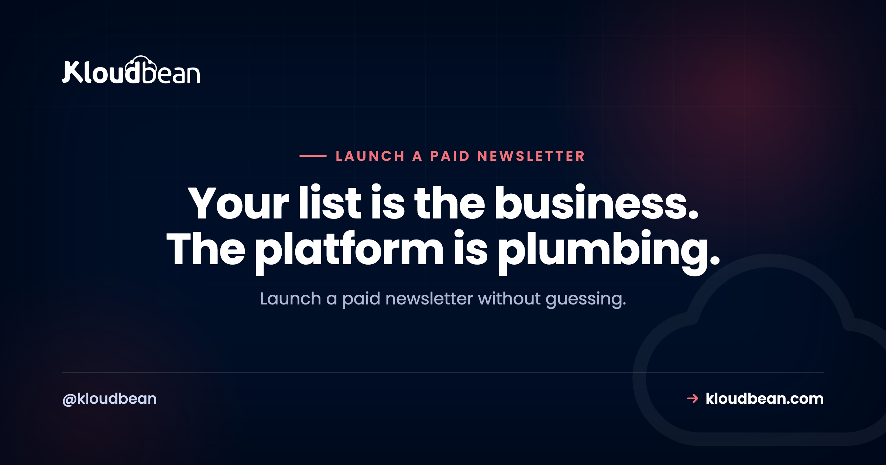
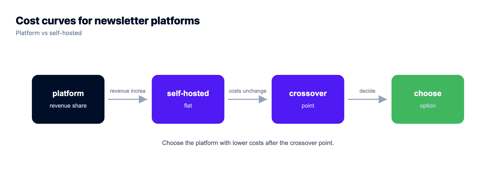
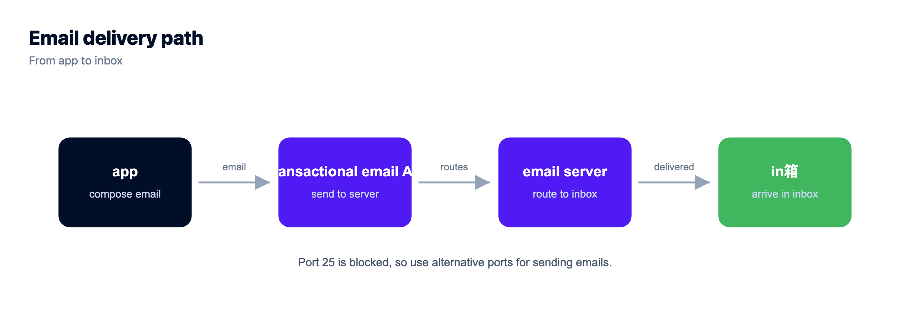
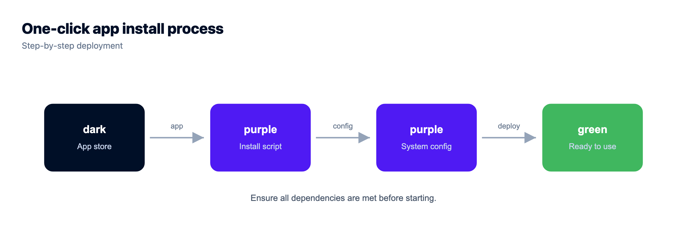

# How to Launch a Paid Newsletter: Platform or Self-Hosted?

By Kloudbean Engineering · Your list is the business. The platform is plumbing.

You want to launch a paid newsletter, and about ten minutes into the research you hit the fork: pick a paid newsletter platform like Substack, Ghost Pro or beehiiv, or run a self-hosted newsletter yourself. Most advice on this is written by whoever wants your signup. This isn't. It's a decision guide for a newsletter subscription business, including the part people consistently get wrong, which is email deliverability, and the honest conditions under which becoming your own Substack alternative pays off.

> **The short answer.** Start on a hosted platform. It handles payments, paywalls and deliverability, which is most of the work. Self-host once a percentage of your subscription revenue costs more than a flat infrastructure bill, or once you need control the platform won't give you. Either way, own your list. That's the asset, not the tool.

## What launching a paid newsletter actually involves

Strip away the branding and a paid newsletter is four moving parts. Writing is one, and it's the only one you can't hand off.

The other three: a **list** (email addresses plus who has paid and who hasn't), a **payment system** that charges cards monthly and handles failures, cancellations and taxes, and a **sending system** that gets your email into an inbox instead of a spam folder. So the decision isn't "which writing tool do I like." It's which of those three you want to be responsible for. Hosted platforms take all three, and that's their whole value proposition. It's a real one.

## Platform versus self-hosted: the honest tradeoff

The trade isn't complexity versus simplicity. It's a percentage of revenue and a rented audience versus a flat infrastructure cost and full control of your list.

Hosted platforms typically take a cut of your subscription revenue, on top of the card processing fee. The exact percentage varies by platform and changes over time, so check current pricing on each rather than trusting a number in a blog post. The structural point is what matters: it's a percentage, so the cost scales with your success. A self-hosted setup is a flat monthly bill, so it doesn't.

| | Hosted platform | Self-hosted newsletter |
| --- | --- | --- |
| Cost shape | A percentage of subscription revenue | Flat monthly server plus per-email sending |
| Deliverability | Handled for you | Yours to configure and monitor |
| Payments and paywall | Built in | You wire up a payment processor |
| Your list | Exportable, but lives with them | In your own database |
| Product control | Within their template | Whatever you want to build |
| Ops work | Effectively none | Updates, backups, monitoring |
| Wins when | You're starting, or revenue is modest, or you'd rather write | Revenue is real, or you need control the platform won't give |

Read that last row twice. Most writers are in the left column and should stay there a while. A percentage of a small number is a small number, and the work you're avoiding is worth more than that early on.

## Why owning your email list matters more than your platform

Here's the thing I'd want a new writer to internalise: your list is the business. Not the archive, not the design, not the platform's discovery features. A list of people who chose to hear from you, some of whom pay, is a direct channel with no algorithm in front of it.

So the questions worth asking about any platform are boring and specific. Can you export addresses *plus* subscription status, not just addresses? Can you switch sending providers without asking permission? If the platform changed its terms, its pricing model or its content policy tomorrow, how many days until you're sending from somewhere else?

If the answer to that last one is "I don't know," you're renting your audience. That can still be a good deal, when the landlord does real work for you. Just keep a current export somewhere you control.

## The part everyone underestimates: deliverability

This is where self-hosting plans quietly fall apart. Sending email is not the same as sending email that arrives.

Inbox providers decide whether to accept your mail based on authentication and reputation. Three DNS records are non-negotiable:

- **SPF** lists which servers may send for your domain. Get it wrong and receivers treat your mail as suspicious.
- **DKIM** signs each message cryptographically, so the receiver can verify it wasn't forged or altered.
- **DMARC** tells receivers what to do when SPF or DKIM fails, and reports who's sending as your domain.

Those are the easy part. One-time configuration, verifiable. The hard part is **sending reputation**. Inbox providers score the IP and domain your mail comes from using history: opens, spam complaints, bounces. A brand new IP has no history, and no history isn't neutral. It's distrusted until it earns trust, which takes weeks of consistent, wanted mail at gradually rising volume. Warming up, it's called. There's no shortcut.

### The anti-pattern: running your own mail server to save money

This is the mistake I'd most like to talk you out of. You've decided to self-host, you've seen that email providers charge per thousand messages, and you think: I already have a server, I'll run Postfix and send for free.

Two things happen. First, you probably can't. Outbound port 25 is blocked by default at most cloud providers to limit spam, and opening it is rarely a self-serve toggle. We wrote up [why port 25 is blocked and which ports actually work](https://www.kloudbean.com/blog/port-25-blocked-smtp-ports/) because it catches people constantly. Second, even with it open you'd start from zero reputation on a cloud IP range receivers already distrust. Your paid edition lands in spam, and you find out from a subscriber's complaint rather than a dashboard.

The right answer is unglamorous. Send through a transactional email API. Your app talks to the provider over HTTPS or authenticated SMTP submission on port 587, and the provider carries IP reputation, feedback loops and the relationships with inbox providers. You still own your list. You're just not pretending to be a mail operator. Budget for it as a line item, priced per email sent.

## Paywalls and payments, where the real complexity hides

A paywall sounds like a checkbox and turns out to be a small product. Recurring charges, cards that expire mid-subscription, upgrades, downgrades, cancellations, refunds, a gated web archive, and sending the paid edition only to people whose payment is currently good.

That last one is sneaky. Your sending logic has to read live subscription state, so a cancellation on the third doesn't get the edition on the fourth. On a platform that link is built. Self-hosted, you build it: the payment processor fires webhooks when a subscription starts, renews, fails or cancels, and your app updates the subscriber record. Not hard code. Code you have to write, test, then trust with your revenue.

Add tax. Digital subscriptions can trigger VAT and sales tax duties depending on where subscribers live, and some payment platforms act as merchant of record while others leave it with you. That alone is a fair reason to stay on a platform longer than the raw economics suggest.

## What you actually run if you self-host

Concretely, a self-hosted newsletter is a short list of pieces:

- **A newsletter application.** Listmonk for a focused sender and list manager, Ghost for publishing plus paid tiers in one. Walkthroughs: [self-hosting Listmonk](https://www.kloudbean.com/blog/self-host-listmonk/) and [self-hosting Ghost](https://www.kloudbean.com/blog/self-host-ghost/).
- **A database.** Listmonk uses PostgreSQL, Ghost uses MySQL. This is where your subscriber list and payment status live.
- **A transactional email provider** for delivery, plugged in as SMTP credentials or an API key.
- **A payment processor** plus webhook handling, unless your app already integrates one.
- **Backups you have restored at least once.** Not configured. Restored. An untested backup is a hypothesis.
- **A scheduler** for timed sends and housekeeping jobs.

Read that list as risk, not cost. The app is replaceable in an afternoon. The email provider is swappable. The database holding your subscriber list and who has paid is the one piece whose loss you can't recover from, because those people exist nowhere else. So self-hosting really comes down to a persistent app plus a database you trust.

That's the shape of thing [Kloudbean](https://www.kloudbean.com/) runs: Listmonk and Ghost install in one click on a managed server with free SSL, the app process stays running rather than sleeping between requests, scheduled sends can be cron jobs set from the dashboard without SSH, and the [managed PostgreSQL or MySQL](https://www.kloudbean.com/blog/managed-postgresql-hosting/) behind it takes automatic backups, which is exactly the list-protection point above.

Wherever you run it, read [how backups actually work](https://www.kloudbean.com/blog/server-backups-guide/) and do a test restore. Then diary another one in six months.

## When self-hosting starts to make sense

My position: start on a platform, move when the economics or a real control requirement justifies it. Not before. At zero subscribers the platform's cut is zero, and every week spent building a stack is a week not spent writing the thing people would pay for.

Signals the maths has flipped:

- **The revenue share clearly exceeds a flat infrastructure bill.** Compare like for like: platform cut versus server plus database plus sending plus your own time, valued honestly.
- **You need a product the platform can't be.** Custom tiers, a members area, gated tools, a paid community, unusual segmentation, your own front end.
- **Portability has become a business risk.** If this is meaningful income, sitting one policy change away from disruption is a real exposure.
- **You genuinely enjoy running things.** Not a joke. If maintenance is a chore you resent, self-hosted infrastructure decays, and decay is how lists get lost.

Signals to stay put: you're pre-launch, you write more than you tinker, your list is small, or debugging a webhook at 1am sounds like a bad evening. All good reasons. Platforms remove real work, especially on deliverability, and paying a percentage for that is a sane trade. Plenty of paid newsletters will never self-host. They're buying their attention back.

## The gap I won't paper over

One caveat it would be convenient to skip. Deliverability and sending reputation stay your responsibility wherever your app runs. A managed server keeps the app alive, patches the OS and backs up the database. It can't make an inbox provider trust your domain. That comes from correct DNS records, a genuinely opt-in list, low bounce and complaint rates, and volume that ramps instead of arriving all at once.

If you don't want to own that, stay on a platform. Not a cop-out. It's the right call for a lot of people, and it's the biggest thing the hosted options do for you.

## Where launch a Paid Newsletter leads

- [Self-hosted tools worth running](https://www.kloudbean.com/blog/best-self-hosted-tools/) if you like owning your stack.
- [What a side project actually costs](https://www.kloudbean.com/blog/cost-of-running-a-side-project/) to keep online.

<!-- cta:start -->
**Ship the app, not the infrastructure.**

Servers, managed databases, object storage, and a built-in load balancer live behind one login, on the cloud and region you pick. The stack, SSL, patching, and backups are handled for you.

- Seven cloud providers
- Managed databases
- Object storage
- Automatic backups
- Free SSL
- Git deploy
- Free migration assistance

[Start free](https://console.kloudbean.com/register) · [See plans](https://www.kloudbean.com/pricing/)
<!-- cta:end -->

## FAQ

**How do I launch a paid newsletter from scratch?**
Pick one topic and one audience, start free to build a list and a publishing habit, then add a paid tier once you know what people come back for. Use a hosted platform for version one so payments, paywall and delivery are handled. Export your list regularly from day one.

**Is it worth self-hosting a newsletter instead of using Substack?**
It becomes worth it when the platform cut on your subscription revenue clearly exceeds a flat infrastructure bill, or when you need product features the platform will not build. Below that, the operational work costs more than you save. Self-hosting is a growth-stage optimisation, not a launch strategy.

**Can I send newsletters from my own server?**
Technically yes, practically it goes badly. Outbound port 25 is blocked by default at most cloud providers, and a fresh IP has no sending reputation, so your mail lands in spam. Run the newsletter app on your own server, but send through a transactional email API or authenticated SMTP on port 587.

**What are SPF, DKIM and DMARC and do I need all three?**
SPF declares which servers may send for your domain, DKIM signs messages so receivers can verify they were not forged, and DMARC tells receivers what to do when either check fails and reports back to you. Yes, configure all three. They are the minimum for a paid newsletter to reach inboxes.

**What does a self-hosted newsletter actually cost to run?**
Three line items: a server for the app, a database for your subscriber list, and per-email charges from your sending provider. The first two are flat monthly costs, the third scales with list size and send frequency. Compare that total against a percentage of your subscription revenue, and include your time.

**Who owns my subscriber list on a hosted platform?**
You can normally export addresses, and reputable platforms let you. The nuance is whether you can export subscription status too, and how fast you could resume sending elsewhere. Keep a current export you control, and treat the ability to leave as something you check before committing, not after.

**Should I use Listmonk or Ghost for a paid newsletter?**
Ghost if you want publishing, a website and paid membership tiers in one application, since the paywall and payment integration are built in. Listmonk if you already have a site and want a lean list manager and sender, accepting that you wire the payment and access logic yourself. Ghost is the shorter route to charging money.

**How do I paywall newsletter content properly?**
Two gates, not one. Gate the send, so only subscribers with a currently valid payment receive the paid edition, driven by webhooks from your payment processor. And gate the web archive, so a paid post is not readable by anyone holding the link. Missing that second gate is the common mistake.

**Will my paid newsletter emails land in spam?**
They can, especially early. Authenticate with SPF, DKIM and DMARC, send only to people who opted in, remove hard bounces promptly, keep complaint rates low, and raise volume gradually rather than all at once. Deliverability is a reputation you build over weeks, and it stays your job wherever the app runs.

---

*Kloudbean Engineering · Write first. Own the list always. Self-host when the numbers, not the vibes, say so.*
