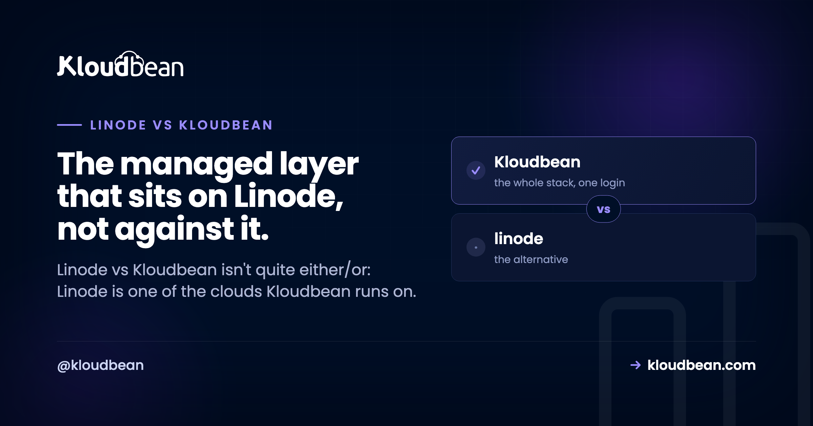

# Linode vs Kloudbean: Unmanaged VPS or Managed Cloud?

Type "Linode vs Kloudbean" into a search box and you're weighing a decision that isn't quite the head-to-head it looks like. Linode is a raw cloud VPS, a clean Linux box you rent and run yourself, now part of Akamai. Kloudbean is a managed layer that sits on top of clouds, and Linode is one of the seven it can deploy to. So the real question isn't which company wins. It's whether you want to patch, secure, and babysit that Linode box yourself, or have it handled and just ship.

> **Short answer:** Linode vs Kloudbean isn't strictly either/or. Kloudbean can provision and manage a server on Linode's own infrastructure, so the real comparison is a raw Linode VPS you administer yourself versus the same Linode box with a managed layer on top. Run it yourself and you own the patching, stack, SSL, backups, deploys, and monitoring. Let Kloudbean manage it and those are handled, on Linode or six other clouds, from one dashboard. Raw Linode wins on price and control if you have the ops time; Kloudbean wins if you'd rather build product than run a server.

## The twist most "Linode alternative" searches miss

Most "X vs Y" hosting posts line up two providers and score their networks. This one can't do that cleanly, because the two options can share a network. Linode sells you infrastructure: a Linux instance at a fair price, plus building blocks (block storage, a backups add-on, load balancers) you wire together yourself. Kloudbean sells a managed layer, and it will happily put that layer on a Linode instance.

So the thing that trips people up in a "Linode alternative" search is this: Kloudbean isn't an alternative to Linode's hardware. It's an alternative to being the sysadmin. Same infrastructure underneath, different amount of work landing on you. That turns the whole decision from "whose cloud" into "who runs the box."

*Linode is the foundation in both cases. What moves is the managed layer in the middle: on a raw VPS you build and maintain it yourself, and with Kloudbean on Linode it comes handled.*

## What Linode actually is (and what it leaves to you)

Credit where it's due. Linode has been around since 2003 and earned its following the honest way: fair, predictable pricing, a clean API, and documentation so thorough that a good chunk of the internet learned Linux from Linode guides. Akamai bought it in 2022 and folded it into Akamai Cloud Computing. If you want a reliable Linux box from a company that documents things well, Linode is a genuinely good pick.

But a Linode instance is an empty Linux box. That's its strength and its chore list in one sentence. Everything above the kernel is yours: the web server, the runtime, the database, the firewall, the TLS cert and its renewal, the backups, the deploys, the monitoring. Not just on setup day. Every day after, until you automate it well or it bites you. Linode gives you excellent raw material. It just doesn't hand you a managed stack, and never claimed to.

## Linode vs Kloudbean: who owns which job

A VPS is an empty Linux box, so the comparison is really a list of chores and who signs up for each. Here's the same Linode instance run two ways, task by task.

| The job | Raw Linode VPS | Kloudbean on Linode |
| --- | --- | --- |
| OS + security patching | You, indefinitely | Handled |
| Firewall + brute-force protection | You configure and tune it | Configured (Shorewall + Fail2ban) |
| Web server / runtime | You install and maintain it | Set up for you |
| SSL + renewal | You run certbot and remember to renew | Free SSL, auto-renewed |
| Backups | You script them, or enable the add-on you meant to | Automatic backups |
| Deploys | You build the pipeline (SSH, scripts, or your own CI) | Connect a repo, pull and deploy |
| Monitoring | You wire it up | Built in |
| Database | Install and secure it yourself | Launch a managed engine on the same box |

Neither column is wrong. The left is what you sign up for with a raw VPS, and plenty of engineers do it well and enjoy every minute. The right is what a managed layer folds into the price. The choice is which of those two lists you want to own. The screen where "not either/or" stops being abstract is where you pick your cloud, with Linode right there among the options.


## The part of a VPS that outlasts the setup

Setup is what everyone compares in a Linode review, and it matters least six months in. Spinning up an instance is fast. But a server isn't a one-time build. It's a standing responsibility, and someone has to write the maintenance and then keep watching it.

```
# on a raw Linode, the box is yours forever, not just on setup day.
# someone writes this maintenance crontab, then has to keep watching it:
0 4 * * 0  apt-get update && apt-get -y upgrade   # weekly patching
0 3 * * *  certbot renew --quiet                  # renew SSL, or the site 500s
30 2 * * * /usr/local/bin/backup.sh               # off-box backups
# plus: log rotation, fail2ban tuning, kernel reboots, disk-space alerts...
```

The instances that get people into trouble are almost never hacked in some clever way. It's an expired certificate that took the site down on a Sunday. A disk full of logs nobody rotated. A CVE unpatched for a year because everything looked fine. Boring failures, all of them, invisible until the exact moment they aren't.

I'll take a side here. A raw Linode is the right tool when running the server is part of the project and you'll keep up with it. The common mistake isn't choosing Linode. It's choosing a VPS and treating it like it's managed: set up once, patched never, backed up "eventually" because the backups add-on was the thing you meant to enable and didn't. If the box is just where your product lives, paying so you never think about the patch cadence is the better trade. We dig into that in [managed vs unmanaged hosting](https://www.kloudbean.com/blog/managed-vs-unmanaged-hosting/) and put real numbers on it in [the real cost of an unmanaged VPS](https://www.kloudbean.com/blog/the-real-cost-of-unmanaged-vps/).


<!-- ADD IMAGE: A Linode Cloud Manager instance beside a terminal running apt and certbot. -->

## Akamai Linode vs managed cloud: does the acquisition change your decision?

This is the part a generic comparison skips, so let's deal with it plainly. Akamai bought Linode in 2022 and rebranded the cloud side as Akamai Cloud Computing. For a big enterprise that matters: a larger global backbone and heavier enterprise services now sit behind the same instances. For a small team, the day-to-day is unchanged. You still get a raw Linux VPS, and you're still the one patching it, renewing SSL, and running backups.

So framed as "Akamai Linode vs managed cloud," it's the same raw-versus-managed question it always was, now with Akamai's network behind the raw side. The acquisition gave Linode more infrastructure. It didn't give you a managed stack. Kloudbean runs on that same Akamai-backed Linode infrastructure and adds what the raw product leaves out: the stack, SSL, backups, deploys, and a managed database, from one console.

## When a raw Linode VPS is the right call

This is a real fork in the road, not a setup for a pitch, so here's the honest case for going direct. Use a raw Linode when you're comfortable with server administration and want the cheapest raw compute. Use it when you want control down to the kernel and treat that as the fun part. Use it when you want to assemble Linode's own building blocks yourself, its block storage, backups add-on, and managed Kubernetes (LKE), wired your way. If your time is cheaper than your budget, or you just like the work, Linode direct is a fine answer that needs no managed layer bolted on.

## When the managed layer wins (and why seven clouds matters)

Kloudbean is the better fit when you'd rather ship than administer: the app, API, and database on one server, SSL and backups already handled, at a predictable price. When you're pushing something out of Lovable, Cursor, or Bolt and don't want to become a sysadmin just to get it online. That's what managed Linode hosting looks like in practice: Linode's box underneath, Kloudbean's control panel on top, and that maintenance crontab already handled.

There's a bonus a raw instance can't hand you: you're not married to Linode. Because Kloudbean runs on seven clouds, you can start on Linode today and move the same setup to AWS, Google Cloud, DigitalOcean, Vultr, UpCloud, or Lightsail later, behind one dashboard. The same reasoning plays out cloud by cloud, so if Vultr is the box you were actually pricing, [raw Vultr next to managed Vultr hosting](https://www.kloudbean.com/blog/vultr-vs-kloudbean/) runs this comparison there instead. You keep Linode if you love it. You keep the exit if you don't.


<!-- ADD IMAGE: The Launch Database screen creating a managed engine on a Linode server. -->

On a raw VPS you install and secure the database yourself; on Kloudbean you launch a managed engine on the same server, reached over the local network and backed up automatically. There's a walk-through in [adding a managed database to your app](https://www.kloudbean.com/blog/add-managed-database-to-your-app/), and the whole-market view in the pillar, [best managed cloud hosting](https://www.kloudbean.com/blog/best-managed-cloud-hosting/).

## A fair word on cost

A raw Linode is cheaper than a managed server, and it should be. You're supplying labor a managed plan bakes in. The honest frame is total cost, not the sticker. Linode's monthly price is low (check their current plans, they change), but the hours you spend configuring, securing, and maintaining the box are real, and so is the risk of getting SSL or backups wrong at the worst time. A managed server costs a bit more and buys that back. Kloudbean's standard plans start from $8/mo, with Enterprise priced custom through sales, so confirm current figures on the [pricing page](https://www.kloudbean.com/pricing/). For what actually drives a hosting bill, [cloud hosting pricing explained](https://www.kloudbean.com/blog/cloud-hosting-pricing-explained/) takes it apart.

The rule of thumb: if your schedule is tighter than your budget, managed wins; if your budget is tighter, or the ops are genuinely fun for you, the raw Linode wins. The DigitalOcean version of this same trade is in [DigitalOcean vs Kloudbean](https://www.kloudbean.com/blog/digitalocean-vs-kloudbean/).

## What linode vs Kloudbean cannot do

Kloudbean runs Linux web stacks: Node, PHP, Python, Ruby, Java, and frameworks like React, Vue, Angular, Laravel, Django, and WordPress. Windows Server is a Premium and Enterprise option rather than a standard one, though .NET itself runs on Linux here. Standalone managed Kubernetes is also enterprise or custom rather than a default. "Managed" means Kloudbean runs the server, stack, SSL, patching, and backups; you still own your application and your data. That division of labor is the point: you keep the app, someone else keeps the box healthy. And because it's standard Linux and standard code underneath, you can leave for a raw Linode, or anywhere else, whenever you want.

## Linode's infrastructure. Without the 2am pager.

Run a managed server on Linode (or six other clouds) at [kloudbean.com](https://www.kloudbean.com/). Seven managed databases, free SSL, automatic backups, a built-in load balancer, free migration, and a free trial. Compare plans on [pricing](https://www.kloudbean.com/pricing/).

## FAQ

**Is Linode vs Kloudbean an either/or choice?**
Not really. Kloudbean can provision and manage a server on Linode, which is one of its seven supported clouds. So you can have Linode's infrastructure and Kloudbean's managed layer at the same time. The real decision is whether you administer the Linode box yourself or have it managed for you.

**Can I run Kloudbean on Linode's infrastructure?**
Yes. When you add a server, pick Linode as the cloud provider. You get a Linode instance underneath with Kloudbean's managed experience (one-click deploy, managed databases, free SSL, automatic backups, monitoring) on top.

**Is Kloudbean just a Linode reseller?**
No. It's a managed hosting platform that can provision on seven clouds: Linode, AWS, AWS Lightsail, Google Cloud, DigitalOcean, Vultr, and UpCloud. Linode is one option. The value is the managed layer on top of whichever provider you pick, not reselling the raw compute.

**Is a Linode VPS cheaper than Kloudbean?**
On sticker price, usually yes, because you supply the setup and maintenance labor yourself. Kloudbean costs a bit more and does that work for you. The right answer depends on whether your time or your budget is the tighter constraint. Verify current prices on both sides, since they change.

**What's a good Linode alternative if I don't want to be a sysadmin?**
The honest twist: you don't have to leave Linode to stop being the sysadmin. Kloudbean can run its managed layer on Linode, so you keep the infrastructure and hand off patching, SSL, backups, and deploys. If you'd rather switch clouds entirely, Kloudbean runs on six others too, so a "Linode alternative" search can end with the same box managed, or a different cloud.

**Did Akamai buying Linode change how it works?**
For enterprises, the acquisition added a larger global network and heavier enterprise services. For a small team, the day-to-day is the same raw Linux VPS: you're still responsible for patching, SSL, and backups. Framed as Akamai Linode vs managed cloud, it's still the raw-versus-managed question, now with Akamai's network behind the raw side.

**What does managed Linode hosting actually include?**
With Kloudbean managing a Linode server, you get the OS and stack set up and patched, a configured firewall with brute-force protection, free auto-renewing SSL, automatic backups, Git-based deploys with build logs, monitoring, and a managed database on the same box. You own the application and the data; the server layer is handled.

**Do I get a managed database if I run Kloudbean on Linode?**
Yes. You launch a managed engine (MySQL, MariaDB, PostgreSQL, Redis, Memcached, Elasticsearch, or MongoDB) on the same server as the app, backed up and reached over the local network. No standing one up by hand, and no separate metered database product across the network.

**Can I move off Kloudbean or off Linode later?**
Yes. It runs standard Linux and standard code, so you're never trapped. Move to a raw Linode you manage yourself, shift to another of the seven clouds behind the same dashboard, or leave for a different host. The exit door is part of the design.

**When should I just use a raw Linode VPS?**
When you're comfortable with server administration, want the cheapest raw compute, and will actually keep up with patching, SSL, and backups. Also when you want to assemble Linode's own pieces (block storage, the backups add-on, LKE Kubernetes) yourself. If running the server is part of the project, go direct.

By Kloudbean Platform Team · The managed layer that sits on Linode, not against it.
