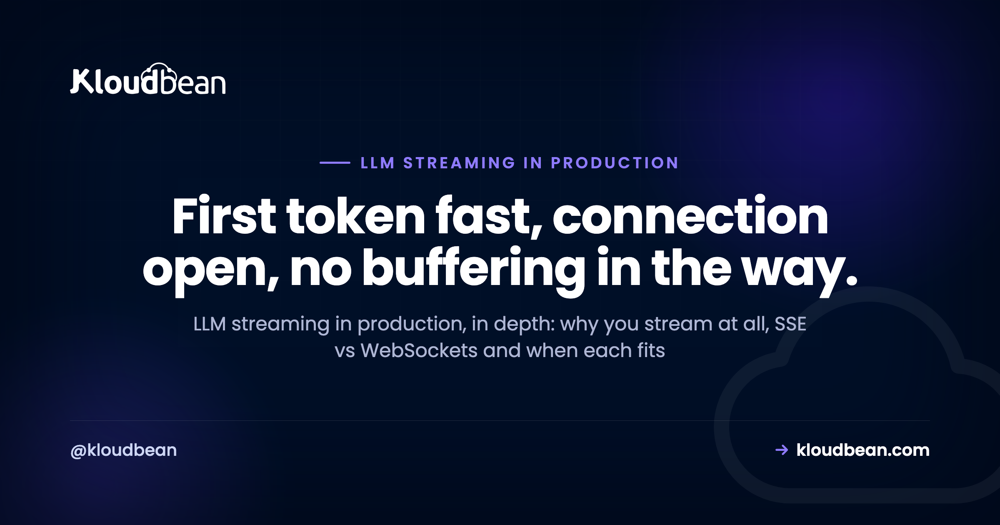

# LLM Streaming in Production: SSE, WebSockets, Timeouts, and Reverse Proxies

Your app streams tokens beautifully on localhost. You deploy it, open the live URL, ask a question, and the reply just hangs. Then the whole answer drops out at once, like the stream never happened. Getting LLM streaming in production right is rarely about your code. It's about the pipes between your code and the browser: the transport you picked, the reverse proxy in front of you, and the timeouts nobody set on purpose.

This is the transport-level deep dive, not another [chatbot architecture overview](https://www.kloudbean.com/blog/host-ai-chatbot-in-production/). Streaming is one piece of shipping an AI build to production; for the whole map of what else breaks, see [the last mile of vibe coding](https://www.kloudbean.com/blog/last-mile-of-vibe-coding/). We'll cover why streaming matters at all, how Server-Sent Events and WebSockets actually differ, the buffering-proxy bug that fools everyone, the read timeouts that cut long streams, backpressure, reconnection, and why serverless makes all of this harder, with real code you can paste.

> **The short version:** Stream because it collapses perceived latency: first token in under a second beats a ten second spinner. Use Server-Sent Events for one-way token streaming; reach for WebSockets only when the browser also needs to talk back mid-stream. The single most common production failure is a reverse proxy that buffers the response, so turn buffering off on the stream route, disable gzip on it, and raise the read timeout so a long answer isn't cut mid-sentence.

## Why LLM streaming in production is worth the trouble

You stream to hide latency. A model can take many seconds to finish a long answer, but it produces the first token almost immediately. Stream, and the user sees words within a second and reads along as the rest arrives. Don't stream, and they stare at a spinner wondering if it broke.

The number that matters is time to first token, not total time. A response that takes twelve seconds to complete but starts painting at 800 milliseconds feels fast. The exact same response, delivered in one lump after twelve seconds, feels broken. Nothing about the model changed. Only the perception did, and perception is what users actually judge.

There's a practical reason too. Long non-streamed responses sit on an open connection doing nothing visible, which is exactly the shape that trips request timeouts and makes users hit refresh (firing a second expensive model call). Streaming keeps bytes moving, so the connection looks alive to every layer between you and the browser. That matters more than it sounds, as the timeout section will show.

## SSE, WebSockets, or waiting for the whole reply?

For streaming LLM tokens to a browser, Server-Sent Events (SSE) are almost always the right tool. A chat reply is one-way: the server sends, the browser reads. That's precisely what SSE is, a long-lived HTTP response that pushes text as it's ready. WebSockets give you a full two-way channel, which is more than a token stream needs and more to operate.

Here's the trade in one view.

| Approach | Direction | Runs over | Best for | The catch |
| --- | --- | --- | --- | --- |
| Server-Sent Events | One way, server to browser | Plain HTTP, auto-reconnect built in | Streaming model tokens to a UI | A buffering proxy silently collects it |
| WebSocket | Two way, full duplex | Its own upgrade protocol (ws / wss) | Live collaboration, the client sends mid-stream | More to run; scaling across instances needs work |
| Wait for the full reply | One shot | A normal HTTP request | Short answers, internal tools, batch jobs | Feels frozen on long answers; invites timeouts |

My honest opinion after watching plenty of these builds: default to SSE for chat, and only reach for WebSockets when you genuinely need the browser to send data back during the response. Typing indicators the server pushes, a token stream, a progress feed: all one-way, all SSE. Live multiplayer editing, a voice session, a client that interrupts or steers mid-generation: that's real two-way traffic, and now WebSockets earn their cost. Picking WebSockets for a plain chat stream is over-engineering you'll pay for at scale. If you do go that way, read [scaling WebSockets in Node.js](https://www.kloudbean.com/blog/scale-websockets-nodejs/) before launch, because a socket that works on one instance breaks in surprising ways across several.

SSE has a quirk worth knowing up front: the browser's native `EventSource` only does GET, and browsers cap how many SSE connections you can open per domain over HTTP/1.1 (a handful). Behind HTTP/2 that limit effectively disappears. If you need to POST a big request body to start the stream, you skip `EventSource` and read the response with `fetch()` and a stream reader instead, but the server side stays the same.

## A minimal SSE endpoint in Node and Python

An SSE endpoint is a normal route that sets a few headers, then writes lines in the shape `data: ...` followed by a blank line, and keeps the connection open until the model is done. Here's a complete Express version that proxies an OpenAI-style token stream. The header details are the part people skip, and they're what makes it survive production.

```js
import express from "express";
import OpenAI from "openai";

const app = express();
const client = new OpenAI();

app.get("/chat", async (req, res) => {
  res.setHeader("Content-Type", "text/event-stream");
  res.setHeader("Cache-Control", "no-cache, no-transform");
  res.setHeader("Connection", "keep-alive");
  res.setHeader("X-Accel-Buffering", "no");   // ask nginx not to buffer
  res.flushHeaders();

  const stream = await client.chat.completions.create({
    model: "gpt-4o-mini",
    messages: [{ role: "user", content: req.query.q }],
    stream: true,
  });

  for await (const part of stream) {
    const token = part.choices[0]?.delta?.content || "";
    if (token) res.write(`data: ${JSON.stringify(token)}\n\n`);
  }
  res.write("event: done\ndata: end\n\n");
  res.end();
});

app.listen(3000);
```

Two small but real details. First, `no-transform` in the cache header tells intermediaries not to gzip or otherwise rewrite the body, which is one way compression sneaks back in. Second, notice each token is `JSON.stringify`-ed. A raw token can contain a newline, and a bare newline inside an SSE `data:` field breaks the framing. Encoding the token sidesteps that entirely, and the client just parses it back.

FastAPI is the same idea with a generator and a `StreamingResponse`. Because it's async-capable through an ASGI server like Uvicorn, a long open stream doesn't tie up a worker the way a blocking one would.

```python
import json
from fastapi import FastAPI
from fastapi.responses import StreamingResponse
from openai import OpenAI

app = FastAPI()
client = OpenAI()

@app.get("/chat")
def chat(q: str):
    def event_stream():
        stream = client.chat.completions.create(
            model="gpt-4o-mini",
            messages=[{"role": "user", "content": q}],
            stream=True,
        )
        for part in stream:
            token = part.choices[0].delta.content or ""
            if token:
                yield f"data: {json.dumps(token)}\n\n"
        yield "event: done\ndata: end\n\n"

    return StreamingResponse(
        event_stream(),
        media_type="text/event-stream",
        headers={"Cache-Control": "no-cache", "X-Accel-Buffering": "no"},
    )
```

The client is almost boring, which is the point. Open an `EventSource`, append each token as it lands, and close on the done event.

```js
const es = new EventSource("/chat?q=" + encodeURIComponent(question));

es.onmessage = (e) => {
  output.textContent += JSON.parse(e.data);
};

es.addEventListener("done", () => es.close());

es.onerror = () => {
  // the browser auto-reconnects by default; close when you are finished
  es.close();
};
```

<!-- ADD IMAGE: browser dev tools Network tab on the /chat request, showing the response streaming in as chunks over time (the EventStream / timing view) rather than arriving as one payload. -->

That's a working stream on localhost. Now for the part that breaks the moment you deploy.

## Why streaming works on localhost but breaks behind a proxy

The classic bug: everything streams perfectly in development, then in production the reply arrives all at once after a long pause. The cause is almost never your app. It's a reverse proxy or CDN in front of it that buffers the response, collecting every token and only forwarding them once your app closes the connection. Locally there's no proxy, so you never see it.

A reverse proxy buffers by default for good reasons on normal responses: it can serve a slow backend's output to a fast client efficiently and free the backend sooner. For a stream, that same behaviour is fatal. The proxy holds your tokens waiting for an end that, from its point of view, takes ten seconds to arrive, then hands the browser the whole thing in one lump. Streaming didn't fail. It got un-streamed in transit. (For the general picture of what a reverse proxy is and does, [reverse proxy explained](https://www.kloudbean.com/blog/reverse-proxy-explained/) is the primer; this section is specifically about the streaming edge case.)

Before the config below, work out whether that config is even yours. On a raw VPS you own the nginx file and can set anything. On a managed platform, including Kloudbean, the reverse proxy in front of your app is part of the managed layer, not a file you tune per route. That sounds like a limitation and is mostly the opposite: it means the lever you reach for is the response header, which travels with the response and works regardless of who owns the config. Set it in your handler and you're done, on either kind of host.

<!-- ADD IMAGE: the token-flow diagram (browser to reverse proxy to your app to model), marking the proxy as the choke point where buffering on delivers one lump and buffering off passes tokens straight through. -->

On nginx, the fix is a handful of directives on the streaming location. Turn buffering off, turn caching off, turn gzip off for this route (compression forces the proxy to collect the body before it can compress), keep the upstream connection on HTTP/1.1, and allow chunked transfer.

```nginx
location /chat/ {
    proxy_pass http://127.0.0.1:3000;
    proxy_http_version 1.1;
    proxy_set_header Connection "";

    proxy_buffering off;          # do not collect the response first
    proxy_cache off;
    gzip off;                     # compression forces buffering
    chunked_transfer_encoding on;

    proxy_read_timeout 3600s;     # covered in the next section
    proxy_send_timeout 3600s;
}
```

The `X-Accel-Buffering: no` response header (set in the app code above) is the same instruction from the other direction: it tells nginx to disable buffering for this one response, even if the global config buffers. Belt and suspenders. If a CDN sits in front too, confirm it passes streaming responses through rather than caching or buffering them; many need `text/event-stream` explicitly excluded from caching, or the whole trip repeats one layer out. This exact class of bug shows up as a single triage row in [why AI apps fail in production](https://www.kloudbean.com/blog/why-ai-apps-fail-in-production/); here it gets the full treatment because it's the one that wastes the most hours.

## Read timeouts: the other thing that quietly cuts your stream

The second production surprise is a stream that starts fine and then dies partway through a long answer. That's usually a read or idle timeout on the proxy or gateway. Many default to 30 or 60 seconds, and a long generation can outrun that, so the connection gets killed mid-sentence and the user sees a truncated reply or an error.

You saw `proxy_read_timeout` in the nginx block above. It exists because the default is too short for streaming. The subtlety is what the timeout measures: it's not total duration, it's time since the last byte. This is a second, quieter reason streaming beats waiting for the full reply. A steady trickle of tokens keeps resetting the idle clock, so a well-behaved stream rarely trips a read timeout even on a slow answer. A single blocking request that takes 90 seconds to return anything will trip a 60 second timeout every time.

Two things to check beyond nginx. Cloud load balancers have their own idle timeout, often 60 seconds, set separately from your web server, and it's easy to fix one and forget the other. And any keep-alive comment frame you emit (an SSE `: ping` line every 15 seconds or so) does double duty: it keeps the idle clock alive and lets you detect a dead client faster. Emit one on a timer if your answers can go quiet for a while, for example while a tool call runs.

## Backpressure: when the browser can't keep up with the model

Backpressure is what happens when your app produces tokens faster than the client can receive them. The tokens have to go somewhere, so they queue in your server's memory. One slow client on a fast stream is nothing. A few thousand of them, on a big generation, is a memory problem that looks like a leak.

The good news: the runtimes handle the common case if you let them. When you write to a Node response and the socket's buffer is full, `res.write()` returns `false`, signalling you to pause until the `drain` event. The OpenAI-style `for await` loop naturally respects this when the underlying stream is piped properly, because awaiting the consumer slows the producer. The failure mode is code that ignores the return value and keeps shoving tokens into a buffer nobody is draining.

You don't need to hand-roll flow control for a normal chat app. You do need to not fight it: don't buffer the entire model response in an array to send at the end (that's just un-streaming yourself with extra steps), and cap how many concurrent streams a single instance will hold so a burst can't exhaust memory. Once you've capped it, one Node process holding a few hundred open streams is the constraint, and the cheap answer is more processes on the same box: Kloudbean runs Node under PM2 in multi-process mode, so you use every core instead of pinning long connections to a single worker, and you can resize the server up yourself when memory gets tight. If you truly need many thousands of simultaneous long streams, that's a horizontal-scaling conversation, and again the patterns in [scaling WebSockets in Node.js](https://www.kloudbean.com/blog/scale-websockets-nodejs/) transfer directly to SSE.

## Reconnecting and resuming a dropped stream

Connections drop. Phones switch from wifi to cellular, laptops sleep, networks hiccup. The nice thing about SSE is that `EventSource` reconnects on its own by default: when the connection dies, the browser waits a moment and reopens it, no code from you. That's a genuine advantage over a raw WebSocket, where reconnection is your job to write.

Auto-reconnect alone can be worse than nothing for a chat, though. If the browser reopens your `/chat` endpoint, a naive server starts the whole generation again from scratch, so the user watches the answer restart, and you pay for a second model call. Two ways to handle it. The simplest: on the done event, close the `EventSource` yourself (the client code above does exactly that), so a completed answer never reconnects. For long or resumable streams, use the SSE `id:` field on each event; the browser sends the last id back in the `Last-Event-ID` header on reconnect, and your server can decide to resume from there or decline politely.

Honestly, most chat apps don't need full resume. Close on done, handle the error path so a genuine drop doesn't loop forever, and you've covered the real cases. Save id-based resume for streams where losing the middle actually matters, like a long document generation you don't want to pay to redo.

## The serverless streaming trap

Here's where a lot of this goes sideways at once: serverless. Streaming from a serverless function is possible on some platforms now, but it fights you in ways an always-on process doesn't. Functions have execution time limits (often tens of seconds) that cap how long a stream can run. Many gateways in front of functions buffer the response by default, which is the exact bug from earlier, one layer up and harder to reach. And a cold start adds latency to time-to-first-token, which is the one number streaming exists to protect.

The anti-pattern I see most, and it's worth naming: faking a stream with a polling loop. The client hits `/status` every 500 milliseconds, the server returns however much text it has generated so far, and the UI redraws. It sort of works. It's also laggy (you're quantised to the poll interval), it hammers your server with requests, it races against itself, and it throws away the token-by-token smoothness that made streaming worth doing. People build it to dodge the serverless streaming limits, which is a signal the platform is wrong for the workload, not that polling is the answer.

Streaming wants two things serverless is bad at: a process that stays open for the life of the response, and a path to the client that doesn't buffer. A long-lived server gives you both by default. This is the honest reason a steady, connection-heavy streaming workload is usually happier on an always-on process than on functions, even setting any one provider aside.

Concretely, that's what you're choosing when you deploy a streaming app to something like Kloudbean instead of a function platform: your Node or Python app runs as a process that stays up between requests, so an open SSE connection lives for as long as the generation takes and there's no execution ceiling to design around, and no cold start charged to your first token. Nothing exotic. It's the old model, and it happens to be the right shape for streaming. If you're already on functions and hitting this, [moving an AI app off serverless](https://www.kloudbean.com/blog/move-ai-app-off-serverless/) walks the migration.

## Why flushing harder never fixes it, and what to test instead

Search this problem and the popular advice is to flush harder. Call `res.flush()` after every token. Rip out the compression middleware. Send a couple of kilobytes of whitespace first to "prime" the connection. People try all three, in that order, and stay broken. So here's the mechanism, because once you see it you stop reaching for them.

Your app writes a token and it does leave your process. Immediately. Flushing works exactly as advertised: it pushes bytes out of your socket. The problem is where they land. The proxy is a separate program that already has your bytes and is deciding when to forward them, and no flush call inside your process reaches into another process's buffer. You can flush all day into a bucket someone else is holding shut. The whitespace-padding trick is even more misleading, because it's real advice for a genuinely different problem, old browsers that wouldn't render until they'd received a few kilobytes, and it does nothing about a proxy.

Only three things cross that boundary: instructions the proxy is built to read. The `X-Accel-Buffering: no` header, the `text/event-stream` content type that some layers special-case, and the proxy's own config. Everything else is you talking to yourself.

Which means the first move is finding the layer, not editing code. Four checks, in order, and stop when the trickle disappears:

1. **Hit the app directly on its port, past the proxy.** `curl -N http://127.0.0.1:3000/chat` on the server. Tokens arriving one at a time means your handler is genuinely streaming and the bug is downstream. If it arrives in one lump here, stop; nothing in front of the app is at fault.
2. **Hit the public URL with `curl -N`.** Trickle means the proxy is passing bytes through. Lump means buffering, and the header is your first fix.
3. **Bypass the CDN.** Same public request against the origin, or with the CDN paused. Plenty of "nginx is buffering" investigations end here, one layer further out than anyone was looking.
4. **Watch the clock, not just the shape.** If it trickles then stops dead around 30 or 60 seconds, that's an idle timeout, not buffering, and you're in the previous section instead.

Use `curl -N` rather than the browser for this. Browsers add their own buffering and rendering behaviour on top, so a curl that trickles and a UI that doesn't is a front-end bug, which is a nice thing to be able to prove in one command.

The part no host fixes, ours included: if your route awaits the whole completion and then returns it, every proxy on earth will deliver it in one lump, correctly, because that's not a stream. A managed platform can keep the pipe open, run your app as a process that stays alive, and honour the header your handler sets. It can't turn a blocking handler into a streaming one, and it can't know which of your routes stream, so those headers stay your call. That's the split worth remembering: the transport is buyable, the handler isn't.

<!-- cta:start -->
**Prototype to production, without the babysitting.**

Run the app as an always-on process with managed databases, Redis, object storage, and automatic backups beside it. Deploy from Git with live build logs, and keep the infrastructure someone else's problem.

- Managed databases
- Always-on processes
- Object storage
- Automatic backups
- Free SSL
- Git deploy
- Free migration

[Start free](https://console.kloudbean.com/register) · [See plans](https://www.kloudbean.com/pricing/)
<!-- cta:end -->

## FAQ

**Why does LLM streaming work locally but break in production?**
Almost always a reverse proxy or CDN that buffers the response. Locally there's no proxy, so tokens flow straight to the browser. In production the proxy collects every token and only forwards them once your app closes the connection, so the reply arrives in one lump. Turn buffering off for the streaming route to fix it.

**Should I use SSE or WebSockets to stream LLM responses?**
Use Server-Sent Events for one-way token streaming, which is what a chat reply is. SSE runs over plain HTTP, has auto-reconnect built in, and is simpler to operate. Reach for WebSockets only when the browser also needs to send data back mid-stream, like live collaboration or a client that interrupts generation. For plain chat, WebSockets are usually over-engineering.

**How do I stop nginx from buffering an SSE stream?**
Set proxy_buffering off on the streaming location, turn gzip off for that route since compression forces buffering, and keep the upstream on HTTP/1.1. Setting the X-Accel-Buffering header to no from your app disables it for that one response too. Together they make nginx pass tokens straight through instead of collecting them.

**What does the X-Accel-Buffering header do?**
It tells nginx whether to buffer a specific response. Setting its value to no disables buffering for that one response, even if nginx is configured to buffer globally. For a streaming endpoint that's exactly what you want, so tokens are forwarded as they arrive rather than held until the connection closes. It's a per-response override you set from your app.

**Why does my LLM stream cut off after about a minute?**
A read or idle timeout on a proxy or load balancer, which often defaults to 30 or 60 seconds. The timeout measures time since the last byte, not total duration, so a steady stream of tokens usually keeps it alive. If answers can go quiet, emit a keep-alive comment frame every 15 seconds or so, and raise the read timeout on both nginx and any cloud load balancer.

**Does EventSource reconnect automatically if the connection drops?**
Yes. The browser's EventSource reopens the connection on its own after a drop, with no code from you, which is a real advantage over raw WebSockets. The catch is that a naive server restarts the whole generation on reconnect. Close the EventSource on your done event so a finished answer never reconnects, and use the Last-Event-ID header if you need true resume.

**Can I stream LLM output from a serverless function?**
On some platforms yes, but it fights you. Function execution limits cap how long a stream can run, gateways in front of functions often buffer the response, and cold starts add latency to the first token. Streaming wants a process that stays open and a path that doesn't buffer, which is what an always-on server gives you by default.

**Should I turn off gzip for a streaming endpoint?**
Yes, on the streaming route. Compression makes the proxy collect the body so it has something to compress, which reintroduces the buffering bug you're trying to avoid. Disable gzip for the stream location and send a Cache-Control value that includes no-transform so intermediaries don't recompress it. Leave gzip on for your normal routes.

**Is SSE fast enough for a production chat app?**
Yes. SSE is a thin layer over HTTP and adds negligible overhead to token streaming; the latency you feel is the model and the network, not the transport. The main limit is that HTTP/1.1 caps SSE connections per domain to a handful, which disappears under HTTP/2. For streaming model tokens to a browser, SSE is both fast enough and the right fit.

---

*Kloudbean · First token fast, connection open, no buffering in the way.*
