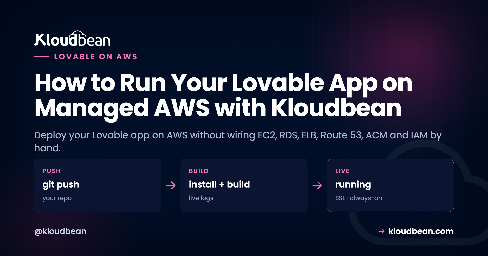

# How to Run Your Lovable App on Managed AWS with Kloudbean

There's a specific moment when "host it anywhere" turns into "it should probably be on AWS." A customer expects it. Your company already lives there. You want the reliability and the region coverage. Then you open the AWS console and remember why people pay others to deal with it: instance types, VPCs, subnets, security groups, IAM roles, a load balancer, a certificate manager, and a dozen decisions before your app serves a single request. So here's the honest way to deploy your Lovable app on AWS without any of that. AWS is one of Kloudbean's seven cloud providers, so you pick AWS, and Kloudbean runs the server on it for you.

This isn't an abstraction that hides AWS from you. It's a real server on real AWS infrastructure, in the AWS region you choose, with a managed layer on top so you never touch EC2 or IAM. Same simple deploy flow, running on AWS underneath.

> **The short version:** You want AWS under your Lovable app, not a second career as an AWS admin. Because AWS is one of Kloudbean's seven clouds, you select AWS and a region when you add a server, and Kloudbean provisions and manages the instance: the OS, stack, networking, SSL, and backups. You deploy from Git, run a managed database next to the app, and manage the whole thing in one dashboard, never opening the EC2, RDS, ELB, Route 53, ACM, or IAM consoles.

## Raw AWS, or the same AWS with a managed layer

Raw AWS is the most capable cloud there is, and the one most likely to eat a week of your time. The distance between "I have an AWS account" and "my app is running securely with backups, TLS, and a sane network" is enormous, and almost none of it is the work you set out to do. For someone who just shipped a Lovable app, that gap *is* the problem. Here's the shape of the choice.

*On the left, raw AWS is a scatter of services to wire together: EC2, VPC, RDS, ELB, Route 53, ACM, IAM, plus security groups and monitoring, connected by tangled lines. An arrow labelled "managed layer" collapses all of it into one Kloudbean dashboard on the right, sitting on top of an AWS infrastructure base, described as one of Kloudbean's seven clouds.*

## What raw AWS actually asks of you

It helps to see exactly what "managed" is covering, because that's the pile of work you're handing off. Each row here is a real AWS service you'd otherwise set up and maintain yourself, and it's a small project on its own.

| AWS piece | What you'd wire by hand | What the managed layer does |
| --- | --- | --- |
| EC2 | Instance type, AMI, key pair, SSH hardening, a process manager so the app restarts on crash | Provisions the instance and configures Node with a supervisor that keeps the app running. |
| VPC, subnets, security groups | The whole network, plus which ports are open to the world | Sets up networking so the box is reachable without you editing security groups by hand. |
| RDS | A managed database instance, parameter groups, backups, access rules | One-click managed Postgres or MySQL next to the app, backed up and secured. |
| ELB / ALB | Load balancer, target groups, health checks | Kloudbean's built-in Flexible Load Balancer when you need to scale out. |
| Route 53 | Hosted zone and DNS records | Point your domain and add it under Domain Aliases. |
| ACM | Certificate request, validation, renewal wiring | A free Let's Encrypt certificate that installs and auto-renews. |
| IAM | Roles, policies, least-privilege access | Handled as part of provisioning, so you don't hand-craft policies to get started. |
| CloudWatch | Metrics, log wiring, alarms | Server health and live build and app logs in the console. |

My honest opinion after watching a lot of these: most Lovable apps don't need ninety percent of AWS. They need one right-sized instance, a database sitting next to it, TLS, and backups. The rest of that list solves problems you don't have yet. Raw AWS is the right call when you have a cloud team, or you genuinely need a specific AWS-only service. If you're the whole team, managed-on-AWS is the honest pick, and you can always go deeper later.

## The same-AWS-managed flow, start to finish

Get your Lovable code into GitHub first (connect and push if you haven't), then in the [Kloudbean](https://www.kloudbean.com/) console click **Add Server**. Set the **Cloud Provider** to **AWS**, choose your AWS **region**, pick **Node.js**, and choose a size with 2 to 4 GB of headroom for the build.

Open the app and go to **Application Administration, Deploy Code**. Connect GitHub, paste the repo URL, pick the branch, and set the runtime fields: app directory, the assigned `process.env.PORT`, Node version, and your install, build, and start commands. Then **Pull & Deploy**. The build runs on your AWS server exactly as it would anywhere, because the platform abstracts the cloud, not the code.

Launch a managed database from **DBS, Launch Database**. It runs on your AWS infrastructure alongside the app, and you wire the credentials in as environment variables rather than hard-coding them. If your Lovable app uses Supabase, you can point at your existing project or run [managed Supabase](https://www.kloudbean.com/blog/self-host-supabase/) here too.

Add your variables under **Runtime Configuration, Environment Variables** (the **Paste .env Content** tab is quickest), attach your domain under **Domain Aliases** with a free Let's Encrypt certificate, and turn on **automated deployment** so every push builds and ships on your AWS server. A missing variable is the most common reason a first deploy 503s, so if that happens, read the app log and see [environment variables, done right](https://www.kloudbean.com/blog/environment-variables-done-right/).

<!-- ADD IMAGE: The AWS region picker on the Add Server screen, with a region selected close to the app's users. -->

## Choosing an AWS region

If you do go AWS, the one decision worth a real moment is the region. Pick the AWS region physically closest to the bulk of your users, because latency is mostly a function of distance, and a user in Frankfurt hitting a server in Frankfurt feels the app snap. If you have a data-residency requirement (a lot of EU work does), the region is also where that's satisfied, so choose one that keeps data in the right jurisdiction. Users spread evenly across the world? Pick the region nearest your largest cluster and don't agonize. A single well-placed server serves a global audience fine until you're big enough to need several regions, and by then you'll have the traffic to justify the work. You set this once when you add the server, so get it roughly right, but it isn't a decision you can never revisit.

## Where people get AWS wrong: the surprise bill

AWS has a reputation for shock invoices, and it's earned. But the shocks almost always come from sprawl, not from the compute itself. A forgotten load balancer still running. Data-transfer charges nobody modeled. A dozen services each metering separately, with no single place showing the total. That's the failure mode we see scare people off AWS entirely, and it's worth naming, because a single managed server is a completely different shape of bill.

When you run one AWS instance through Kloudbean, you pay for that instance sized to your app, plus the plan that manages it. That's a number you can predict at the start of the month and recognize at the end of it. It usually won't be the cheapest way to run a small app (a budget provider can undercut AWS), so you're paying a little for the AWS name and footprint. Choose it when that's worth it, and reach for a cheaper cloud when it isn't. The point of managed AWS is a predictable bill on reliable infrastructure, not the lowest line item on the market.

## You picked AWS, but you're not locked into it

This is the part that makes managed AWS a comfortable choice rather than a trap. AWS is one of seven clouds Kloudbean runs on: AWS, AWS Lightsail, Google Cloud, DigitalOcean, Linode, Vultr, and UpCloud. You chose AWS deliberately, and if the reason for AWS ever goes away, you can run the same app on a cheaper provider without changing a line of code. And because it's a standard Linux box running standard code, you can move off Kloudbean entirely if you want. AWS is a choice here, not a cage. If you want to see the same raw-versus-managed reasoning applied to a cheaper cloud, the [DigitalOcean comparison](https://www.kloudbean.com/blog/digitalocean-vs-kloudbean/) runs it for DO.

## Scaling on AWS when you grow

One reason to be on AWS at all is the ceiling, and there's a lot of room above you. When the app outgrows its instance, you resize to a larger AWS instance, more CPU and memory, which is a straightforward change rather than a re-architecture, because your code doesn't move. When one box isn't enough, put a [load balancer](https://www.kloudbean.com/blog/cloud-load-balancer-explained/) in front and run more than one instance, or split the database onto its own server so app and data stop competing. None of that rewrites the Lovable app. And because you can host several apps on one server, growth sometimes just means you had the headroom to add the next project without spending another cent.

## Where this stops working

Two straight facts. Kloudbean runs Linux web stacks on AWS: Node and the modern frameworks (React, Next.js, Vue) that Lovable produces, plus PHP, Python, Ruby, and Java. This isn't a bare-metal AWS tutorial. .NET is supported on Linux, and Windows Server is offered on Premium and Enterprise. It's managed Linux hosting that happens to run on AWS. And "managed" means Kloudbean runs the server, the stack, SSL, patching, and automatic backups; you still own your application and its data. That division is the whole value: AWS underneath, your app on top, and the ops in between handled. For the Lovable-specific side of things, the [deploy-a-Lovable-app guide](https://www.kloudbean.com/blog/deploy-lovable-app-to-your-own-server/) covers the frontend and Supabase details.

**AWS underneath, without the console maze.** Run your app on managed AWS at [kloudbean.com](https://www.kloudbean.com/). Click to launch a database, backups running, access allow-listed, deploys from Git. Tool-agnostic deploy walkthrough [here](https://www.kloudbean.com/blog/deploy-ai-built-app-to-production/); plans on [pricing](https://www.kloudbean.com/pricing/).

## FAQ

### Can I deploy a Lovable app on AWS without learning AWS?
Yes. Choose AWS as the cloud provider when you add a server on Kloudbean, and the platform provisions and manages the AWS instance, the stack, networking, SSL, and backups. You deploy from Git and never open the EC2, RDS, ELB, Route 53, ACM, or IAM consoles.

### Is this real AWS, or an abstraction on top of it?
It's a real server on AWS infrastructure, in the AWS region you pick, managed for you by Kloudbean. AWS is one of Kloudbean's seven clouds. You get AWS's reliability and footprint with one-click deploy and managed ops on top, not a simulated version of it.

### Do I have to use AWS to use Kloudbean?
No. AWS is one of seven providers, alongside AWS Lightsail, Google Cloud, DigitalOcean, Linode, Vultr, and UpCloud. For a single app, a cheaper provider is often just as good, so pick AWS only when there's a concrete reason like a customer requirement or an existing AWS standard.

### Can my app and database both run on the AWS server?
Yes. Launch a managed database from the DBS section and it runs alongside your app on the same AWS infrastructure, backed up and secured, wired in through environment variables. If the app uses Supabase, you can keep your existing project or run managed Supabase too.

### Will running on AWS give me a surprise bill?
The AWS shocks people fear come from sprawl: forgotten resources and data-transfer across many separately metered services. A single managed instance is a different shape. You pay for one right-sized server plus the plan that manages it, a number you can predict at the start of the month and recognize at the end.

### How do I scale a Lovable app on AWS later?
Resize to a larger AWS instance for more CPU and memory, which doesn't change your code. When one box isn't enough, put a load balancer in front and run more instances, or move the database to its own server. You can also host several apps on one server, so growth doesn't always mean a bigger bill.

By Kloudbean · Managed multi-cloud hosting. Build. Deploy. Scale. Faster Than Ever.
