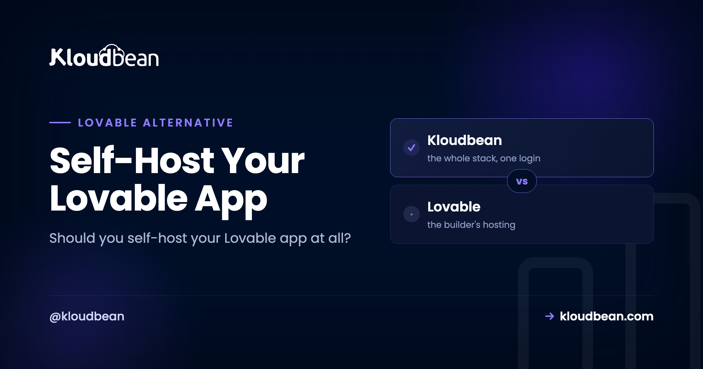

# Self-Host Your Lovable App: Own the Running App

First, a reframe that saves a lot of confusion: going Lovable self-hosted doesn't mean leaving Lovable. You keep building in Lovable exactly as you do now. The only thing that changes is where the finished app runs and who owns it. Lovable is a builder, not a hosting company, so it isn't especially concerned with the long game: who controls the domain, the data, the cost, the ability to pack up and move. For a weekend demo, none of that matters. For something you plan to keep, it matters a lot. This is a decision guide, not a tutorial. Should you self-host your Lovable app at all, and if so, what does that actually mean?

> **The reframe:** "self-hosting" here means owning the running app, not writing your own server software or unplugging from Lovable. You build in Lovable, and the output runs on infrastructure you own.

> **The short answer:** Keep Lovable's built-in hosting while your app is a demo or you're iterating daily. Self-host once it has real users, real data, and a domain you care about. And for almost everyone, "self-hosted" should mean owned-but-managed (you own the app, data, and domain; a platform keeps the box healthy), not a bare Linux server you babysit at 2am. Own it when there's something worth owning.

## What "self-hosted" actually means for a Lovable app

The phrase scares people because it gets used for two very different things, and only one of them is hard.

- **Fully DIY.** You rent a bare server, then install and maintain everything yourself: the OS, web server, runtime, security patches, certificates, backups, monitoring. Total control, and a genuine ongoing job.
- **Managed and owned.** You own the app and the server it runs on, but a platform handles the operational layer (provisioning, the stack, security, SSL, backups). Ownership without the pager.

When a Lovable builder says "I want to self-host," they almost always mean the second one. They don't want to run a Linux box for fun. They want the app to be *theirs*: their server, their data, their domain, their bill, their right to leave, with the tedious parts handled. The diagram below is the whole decision in one picture. Look at who controls each layer.

*Two layer stacks. Renting on Lovable hosting: you own the app code, but the domain, runtime, server, and data hosting are the builder's. Owning it self-hosted: you own the domain, app code, and data, while the runtime and server are yours but maintained by the platform.*

## Should you self-host this Lovable app? A quick decision guide

Not every Lovable app should be self-hosted, and moving one that shouldn't be is wasted effort. Here's the honest split. Read down whichever column matches your app.

| Stay on Lovable's hosting when | Self-host (own it) when |
| --- | --- |
| It's a demo, prototype, or idea you're validating | Real people use it and it holds data you can't lose |
| You're iterating daily and nothing's precious yet | It lives at a domain that's part of your brand |
| No real users, no real data, no custom domain | A client is paying for it and should own what they bought |
| You want zero infrastructure and the publish flow is enough | You want a predictable, budgetable cost you control |
| The app might not exist in a month | You need room to grow: background jobs, a real database, cron |

My honest opinion: don't self-host to prove a point, and don't self-host a three-day-old prototype. There's nothing to own yet, and you'll spend effort protecting something that might not exist next week. Self-hosting earns its place the moment the app becomes something you rely on. Until then, Lovable's built-in publishing is the right, lazy, correct choice.

## The data question is the one that should decide it

Of everything you take ownership of, data is the one that matters most and gets thought about least. While the app is a demo, its data is throwaway. The moment real people use it, the database holds things you genuinely can't afford to lose or lock away: accounts, content, records, whatever the app is actually for.

So ask the question that should drive the whole decision: *where does my data live, and can I get all of it out, today, without asking anyone?* If the honest answer is "I'm not totally sure" or "I'd have to figure it out," that's your signal. Self-hosting gives that question a reassuring answer. The database sits on your server, you can back it up on your terms, export it whenever you like, query it directly to answer a support question, and carry it with you if you change hosts. On a managed server you launch a real [Postgres or MySQL](https://www.kloudbean.com/blog/managed-postgresql-hosting/), connect it through environment variables, and it's yours, readable and portable. The full mechanics are in [adding a managed database to your app](https://www.kloudbean.com/blog/add-managed-database-to-your-app/).

## What owning it actually gets you

Beyond the data, a few benefits tend to arrive together as a project grows up.

- **Your domain, your presence.** The app lives at your domain with your SSL, presented as your product, not a subdomain that quietly says "made in a tool."
- **A cost you can budget.** A flat, predictable price for a server, instead of pricing that climbs with seats or usage on someone else's terms.
- **Portability and handoff.** It's standard code on a standard server, so you can change hosts, hand it to a client, or bring on a teammate who works with an ordinary codebase. Nothing exotic to learn, nothing to be locked into.
- **Room to grow past the builder.** A real database you can query, background jobs, cron, staging environments, several apps sharing [one server](https://www.kloudbean.com/blog/host-app-api-and-database-on-one-server/). A publish flow doesn't stretch that far; a server does.

That last cluster is really about optionality. The value isn't only what you do today. It's that owning the running app keeps every door open: hand it off, grow it, or walk away from every tool involved and the app keeps running, because it never depended on any of them to stay alive.

## Where people get the timing wrong

Two mistakes, in opposite directions, and both are common. Some people move too early: they self-host a prototype with three test rows in it, then spend energy maintaining ownership of something that isn't real yet. Others move too late, and that one hurts more. A real little business, actual paying users, months of data, all sitting on a builder's publish flow with no clear export path, and no plan for the day the pricing changes or the app needs something the builder doesn't offer.

The pattern we see over and over: the trigger people should watch for isn't traffic or revenue, it's the first time losing the data would genuinely set them back. That's the moment to own it. Not sooner, definitely not later. If you'd feel sick losing what's in that database, it belongs on infrastructure you control.

## Own vs rent, on cost

Being straight about the money: owning isn't automatically cheaper. At tiny scale, a builder's free or low tier can undercut any always-on server, because a server costs the same whether it serves ten requests or ten thousand. The owned model wins on predictability at any size, and on total cost as you grow and add projects to the same box. If your reason to self-host is purely "it'll be cheaper," check the math for your stage first. If your reason is ownership, control, and a bill you can forecast, that's where owning clearly pays.

## How it works, briefly

The mechanics are the same clean flow any Lovable deploy uses, and the [step-by-step guide](https://www.kloudbean.com/blog/deploy-lovable-app-to-your-own-server/) covers every field. In short: sync your Lovable project to GitHub, then on a platform like [Kloudbean](https://www.kloudbean.com/), launch a server and open **Application Administration, Deploy Code**.

Connect the repo, set the runtime fields, launch a managed database so your data lives on your server, add your environment variables, attach your domain with a free Let's Encrypt certificate, and switch on auto-deploy. That's it. The app now runs on a server you own, with your data and your domain, redeploying when you push. If you built with more than one tool, the [tool-agnostic deploy guide](https://www.kloudbean.com/blog/deploy-ai-built-app-to-production/) covers Cursor, Bolt, and v0 too.

<!-- ADD IMAGE: The Lovable app live on its own custom domain, logged in with real data loading and the SSL padlock in the address bar. -->

## The honest version of "self-hosted"

Being straight one more time: managed hosting is not the fully DIY, run-every-layer-yourself sense of the word. A provider still operates the underlying server and datacenter, applies the patches, and runs the backups. If your definition requires that *you personally* control everything down to the metal, then managed hosting isn't that, and a bare server is, with all the work that implies. For the large majority who use "self-host" to mean "the app is mine, on my server, with my data, and I can leave whenever," managed hosting is exactly that, minus the ops. And because it's standard Linux running standard code, the fully DIY door stays open: you could move to a bare server later if you ever wanted. If you want to keep the Supabase side managed rather than run it yourself, [managed Supabase](https://www.kloudbean.com/blog/self-host-supabase/) covers that path.

## The honest limits

Kloudbean runs Linux web stacks: Node and the modern web toolkit (React, Next.js, Vue) that Lovable produces, plus PHP, Python, Ruby, and Java. It isn't for Windows, .NET, or IIS. "Managed" means Kloudbean runs the server, the stack, SSL, patching, and automatic backups; you own and maintain the application itself. That division (you own the app and data, the platform keeps the server healthy) is precisely the "self-hosted without the sysadmin work" arrangement most Lovable builders actually want.

**Built in a tool. Owned by you.** Own your app at [kloudbean.com](https://www.kloudbean.com/). One-click databases, automatic backups, IP allow-listing, free migration, free trial, and simple Git deploy. Plans on [pricing](https://www.kloudbean.com/pricing/).

## FAQ

### What does it mean to self-host a Lovable app?
It means the running app is yours: your code on your server, your data in your database, at your domain, with a cost you control and the freedom to move. It doesn't mean leaving Lovable or writing server software. You keep building in Lovable, and managed hosting gives you that ownership while handling the operational layer.

### Do I have to manage a server myself to self-host?
No. That's the fully DIY sense of self-hosting. With managed hosting you own the app and server while the platform handles provisioning, the stack, SSL, and backups, so it's ownership without the ops. Fully DIY stays an option if you want total control over every layer.

### When should I self-host my Lovable app instead of using its built-in hosting?
Self-host once the app has real users, data you can't afford to lose, or a domain that's part of your brand, or when a client should own what they paid for. Stay on Lovable's publishing while it's a demo you're still validating. The trigger is the first time losing the data would genuinely set you back.

### Is my Lovable app portable if I self-host it?
Yes. It's standard React and Node code on a standard Linux server, so you can move it to another host, or to a fully DIY server, whenever you want. Your database exports cleanly too. Nothing locks you in.

### Is managed hosting really 'self-hosted'?
In the sense most people mean, where the app, data, and domain are yours and you can leave, yes. In the strict sense of personally operating every layer, no, because a provider runs the underlying server. The ownership that matters is yours; the chores are handled.

### Will self-hosting cost more than Lovable's hosting?
Maybe, at tiny scale, since a builder's low tier can undercut an always-on server. Owning wins on predictability at any size and on total cost as you grow or add more apps to the same server. If your only goal is a lower bill today, check the math for your stage; if it's ownership and control, owning pays.

By Kloudbean · Managed multi-cloud hosting. Build. Deploy. Scale. Faster Than Ever.
