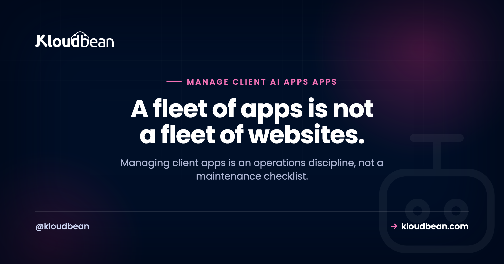

# How to Manage a Fleet of Client AI Apps: The Agency Operating Model

By Kloudbean Engineering · A fleet of apps is not a fleet of websites.

Agencies got good at running WordPress at scale. Fifty sites, one dashboard, a nightly backup, a weekly update run, an uptime alert if something falls over. It's a solved problem. Then the work changed: clients bring apps now, a Next.js dashboard here, a Python API there, an AI tool a founder vibe-coded and can't keep running. Manage those like WordPress sites and you'll be fine right up until the morning three of them are down for three unrelated reasons. This is the operating model for running a fleet of client apps without it running you.

> **The short version.** Managing a fleet of client apps is an operations discipline, not a maintenance checklist. Give each app its own isolated environment so one failure can't spread to another client, monitor error rate and spend rather than just uptime, update dependencies on staging with a rollback ready, and keep an incident runbook for the day one goes down. The failure modes are new. The discipline is old.

## Why an app fleet is not a website fleet

A WordPress site is mostly static from the server's point of view. It sits there, serves pages, and the risky moments are scheduled: a plugin update, a core upgrade. You can batch that work and sleep at night. An app is a living process. It runs continuously, holds memory, talks to external services, and can fall over between one request and the next for reasons that have nothing to do with your update schedule.

Five differences make app fleets their own discipline. Apps have **running processes** that crash, leak memory, or hang, so "the server is up" doesn't mean "the app is up." They have **dependencies that drift**, npm and pip packages with security patches and breaking changes arriving weekly. They hold **secrets**, external API keys that expire, get revoked, or hit quotas. Many carry **usage-driven cost**, especially AI apps, where a busy day is an expensive day. And they fail in **novel ways**, so pattern-matching from a decade of WordPress support only gets you so far.

None of this means apps are harder in some absolute sense. It means the shape of the work is different: less scheduled maintenance, more continuous operation. If your only move is the WordPress playbook, you'll miss the failures it was never designed to catch. The deeper reason shared hosting can't carry these apps at all is covered in [why shared hosting can't run AI-built apps](https://www.kloudbean.com/blog/wordpress-agency-ai-app-hosting/); this piece assumes you've made the move and now have a fleet to run. The contrast with a pure [WordPress fleet operation](https://www.kloudbean.com/blog/agency-wordpress-hosting/) is worth keeping in mind throughout.

## Isolation: the decision that shapes everything else

Before monitoring, before updates, one decision sets the tone for the whole fleet: how isolated is each client's app from the others? Get this right and most incidents stay small. Get it wrong and one client's bad day becomes everyone's.

The question is really about blast radius. If ten client apps share one server and one app leaks memory until the box runs out, all ten go down. If one app gets compromised, the attacker is now sitting next to nine other clients' code and data. If one app gets a traffic spike, the others slow to a crawl. That's the noisy-neighbor problem, the security problem, and the availability problem, all from the same root: no boundary.

| | Shared server, soft limits | One server per client |
| --- | --- | --- |
| Blast radius of a crash | All apps on the box | Just that client |
| Security boundary | Weak, shared OS | Strong, separate machine |
| Noisy neighbor | Real risk | None |
| Cost attribution | Estimated, blended | Exact, per client |
| Best for | A few tiny, low-risk apps | Anything real or sensitive |

Shared hosting with per-app limits is defensible for a handful of tiny internal tools where nothing sensitive lives and downtime is cheap. For anything a client actually depends on, the answer is a separate environment per app: its own server, its own memory, its own security boundary. It costs a little more and it saves you the incident where one app takes down four clients. It also makes the billing honest, which the companion piece on [pricing client app hosting](https://www.kloudbean.com/blog/pricing-ai-app-hosting-for-clients/) leans on heavily, because a dedicated server is a dedicated, readable bill.

<!-- ADD IMAGE: two diagrams. Left "Shared server": one box holding App A, B, C, D; App B is on fire and the flames reach the whole box (caption: one crash, everyone down). Right "Per client": four separate boxes, App B on fire but sealed off, A/C/D untouched (caption: blast radius of one). Brand colors navy #000f27, purple #4F1AF3, green #40b75f, a warning red for the fire. -->

*The isolation model decides how far a single failure travels. On a shared box, one app's crash is everyone's outage. Separated, it's one client's problem.*

## What to monitor, and what WordPress never taught you

WordPress monitoring is mostly a heartbeat: is the site responding, yes or no. Apps need more, because an app can respond with a 200 and still be quietly broken, throwing errors on half its requests or burning money on a runaway loop.

Watch four things per app. **Uptime** is still the floor, is it responding at all. **Error rate** is the one WordPress didn't teach you: what fraction of requests are failing, and did that fraction just jump after a deploy. **Resource use**, memory and CPU, because a slow memory leak is invisible until the process dies, and a trend line catches it days early. And **spend or quota**, especially for AI apps, so you see a cost spike or an API nearing its limit before it becomes an outage or a surprise invoice. The how-to for all of this lives in [AI app observability](https://www.kloudbean.com/blog/ai-app-observability/), which is worth reading once and setting up per client.

The goal is simple and it's the whole reason monitoring exists: know before the client does. An agency that finds out an app is down because the client emailed is an agency that looks reactive. The one that emailed the client first, already fixing it, looks like it's worth the retainer.

## Updates: the part that quietly breaks things

Here's an honest opinion that will save you grief: dependency updates are riskier than WordPress plugin updates, and you should treat them with more respect, not less. A WordPress plugin update usually just works or visibly doesn't. A dependency update can change behavior subtly, pass your quick glance, and break something a week later under a specific input. Node and Python projects can have hundreds of transitive dependencies, and any of them can ship a breaking change inside a version bump that looks harmless.

So the discipline is non-negotiable: never update dependencies straight on production. Update on a staging copy, run the app, click through the real flows, then promote. Keep the ability to roll back to the last known-good state, because you will need it. This is exactly the workflow that [deploying an AI-built app to production](https://www.kloudbean.com/blog/deploy-ai-built-app-to-production/) sets up, and it's why staging is not a luxury for an app fleet, it's the thing standing between a routine update and a client outage. Pair it with backups you have actually restored at least once, per the [backups guide](https://www.kloudbean.com/blog/server-backups-guide/). A backup you've never tested is a rumor.

## The incident runbook for client apps

At some point an app goes down and a client is waiting. What separates a calm fix from a scramble is having a runbook, a short list of the usual suspects in the order you should check them. App incidents cluster into a handful of causes, and most of them are not the code.

| Failure mode | What you see | The usual fix |
| --- | --- | --- |
| Expired or revoked API key | Auth errors from an external service | Rotate the key, update the secret, redeploy |
| Rate limit or quota hit | 429s, sudden failures under load | Back off, cache, raise the quota, or throttle |
| Out of memory | Process restarts, slow death, OOM in logs | Fix the leak, raise memory, or cap concurrency |
| Runaway usage or cost | Spend spike, quota alarm | Find the loop or abuse, add a cap |
| Dependency break | Build fails, or behaves wrong after a bump | Roll back to the last known-good deploy |
| Model or API deprecation | A vendor endpoint returns errors | Move to the current model or version |

Notice how few of these are "the code is wrong." Most incidents in client apps are configuration, credentials, capacity, or an external service moving under you. That single insight makes you faster, because you stop reading application code first and start checking keys, quotas, memory, and recent deploys. The wider catalog of how these apps fall over is in [why AI apps fail in production](https://www.kloudbean.com/blog/why-ai-apps-fail-in-production/), and it rewards a read before your first 2am page, not during it.

## Access and offboarding: the boring part that bites

Two access failures show up in real agencies, and both are avoidable. The first is credential sprawl: one shared admin login used across every client, so nobody can tell who did what, and offboarding a contractor means changing everything. Use per-person accounts with least privilege instead, so a junior can deploy without holding the keys to every client's data, and revoking one person is one action.

The second is messy offboarding. When a client leaves, or when you hand an app back, there should be a clean sequence: transfer or export their data, hand over or rotate the credentials, remove your team's access, and stop the billing. Doing this ad hoc is how you end up still paying for a former client's server, or worse, still holding access you shouldn't. The full checklist is in [client offboarding done right](https://www.kloudbean.com/blog/agency-client-offboarding/). Set it up as a repeatable process now, while you have three clients, not later when you have thirty and can't remember which credentials went where.

## An operating model that scales with your fleet

The right amount of process depends on how many apps you run, and over-engineering early is its own mistake. Roughly, it goes in three stages.

At **one to a few apps**, you can operate by hand. Isolate each app, set up basic uptime and error alerts, update on staging, and keep credentials in a password manager rather than your head. That's enough, and adding heavy tooling here is procrastination dressed as diligence.

At **around ten apps**, manual stops scaling. You want one place to see the whole fleet's health, a standard way to spin up a new client environment so they're all consistent, and a written incident runbook so any team member can respond, not just you. Consistency is the theme: apps that are each set up differently are apps you can't operate at speed.

At **fifty and beyond**, you're running a platform whether you call it that or not. Templated environments, centralized monitoring and log aggregation, defined on-call, and per-client cost tracking stop being nice-to-haves. The agencies that get here comfortably are the ones that standardized early, so growth was more of the same rather than a new problem each time.

## Where the platform helps

Most of this operating model is discipline and habit, and you can run it on almost any infrastructure. What a good platform does is remove friction from the parts you'd otherwise cobble together: one place to see every client's app, a fast way to stand up an identical isolated environment per client, staging, tested backups, and per-person access.

Kloudbean lines up with this model on the hosting side. Each client app can run on its own managed server, so the blast radius stays small and each bill is clean. One dashboard covers the whole fleet, staging is built in for WordPress and Laravel, backups are automatic, and subusers with User Access Control give your team least-privilege access instead of a shared login. Baseline hardening (Shorewall and Fail2ban) and free SSL come standard. Useful scaffolding for a fleet, but the operating model above is what actually keeps the apps healthy, wherever they run.

<!-- cta:start -->
**Stop paying a platform per client.**

Consolidate the dashboards: isolated apps on managed servers, per-client databases, per-app backups you can restore individually, and permissions scoped per resource and action.

- One dashboard
- Per-client isolation
- Subusers and access control
- Per-app backups
- Git deploys
- Free migration assistance

[Start free](https://console.kloudbean.com/register) · [See plans](https://www.kloudbean.com/pricing/)
<!-- cta:end -->

## FAQ

**How do I manage multiple client apps at scale?**
Give each app its own isolated environment so one failure can't spread, monitor error rate and spend rather than just uptime, update dependencies on staging with a rollback ready, and keep a written incident runbook. As you grow past ten apps, standardize how you set up and monitor each one so the fleet stays consistent and any team member can respond to an incident.

**Should each client app run on its own server?**
For anything a client genuinely depends on, yes. A separate server per app keeps the blast radius of a crash, a compromise, or a traffic spike contained to one client, and it makes each client's cost exact instead of estimated. Sharing one server across many apps only makes sense for a few tiny, low-risk internal tools where downtime is cheap.

**How is managing apps different from managing WordPress sites?**
WordPress sites are mostly static and fail at scheduled moments like updates, so you can batch the work. Apps run continuously, hold memory, depend on drifting packages and external API keys, and often carry usage-driven cost, so they fail in more varied and less predictable ways. Managing apps is continuous operations rather than scheduled maintenance.

**What should I monitor for a client app?**
Four things per app: uptime, error rate, resource use like memory and CPU, and spend or quota for anything with usage-based cost. Uptime alone is not enough because an app can return a 200 while failing half its requests or burning money on a runaway loop. The aim is to know an app is in trouble before the client emails you.

**Why do dependency updates break client apps?**
Node and Python apps can pull in hundreds of transitive dependencies, and any of them can ship a breaking change inside an innocent-looking version bump. Unlike a WordPress plugin update that visibly works or fails, a dependency change can alter behavior subtly and surface a week later. Always update on staging, test the real flows, then promote, and keep a rollback ready.

**What usually causes a client app to go down?**
Most app incidents are not bad code. They cluster into expired or revoked API keys, hitting a rate limit or quota, running out of memory, runaway usage or cost, a dependency that broke on update, and a vendor deprecating a model or endpoint. Checking keys, quotas, memory, and recent deploys first will resolve incidents faster than reading application code.

**How do I handle access for a team managing client apps?**
Use per-person accounts with least privilege rather than one shared admin login. That way you can see who did what, let a junior deploy without handing them every client's data, and revoke one person's access in a single action. Shared credentials make auditing impossible and turn offboarding anyone into a fleet-wide password change.

**What is the right way to offboard a client app?**
Follow a repeatable sequence: transfer or export the client's data, hand over or rotate credentials, remove your team's access, and stop the billing. Doing this ad hoc leads to paying for servers you forgot or retaining access you shouldn't have. Set the process up while your fleet is small so it's automatic by the time it's large.

**Do small agencies need heavy tooling to manage a few apps?**
No, and reaching for it early is a common mistake. With a handful of apps you can isolate each one, set basic uptime and error alerts, update on staging, and keep credentials in a password manager. Invest in centralized monitoring, templated environments, and a formal on-call only as the fleet grows toward and past ten apps.

---

*Kloudbean Engineering · Isolate each app, watch error rate and spend, update on staging, keep a runbook.*
