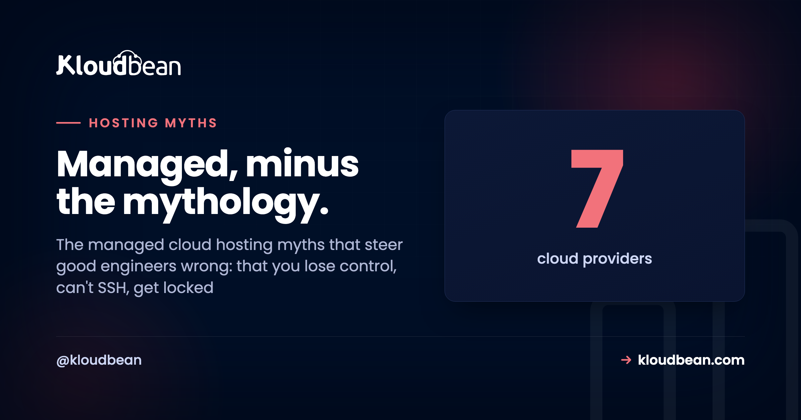

# Managed Cloud Hosting Myths That Refuse to Die

Managed cloud hosting carries a reputation built on stuff that was maybe half-true a decade ago. You'll hear it strips your control, that you can't SSH in, that it traps you, that it can't scale, that it's really just pricey shared hosting, that it's a WordPress thing. Most of these managed cloud hosting myths are folklore. And they quietly push capable people into running everything themselves for reasons that don't hold up.

So let's do this properly. Eight of the stickiest misconceptions, each set right next to what's actually true today. Not to sell you anything yet, just so you decide based on how managed hosting really works instead of a rumor you absorbed in 2014.

> **The short version:** Managed cloud hosting runs the operational layer for you (provisioning, patching, SSL, backups, firewall) while you keep SSH, your stack, your code, and your data. It's standard Linux, so there's no lock-in. It scales by resizing and by adding servers behind a load balancer. And "one dashboard" doesn't mean one cloud: on Kloudbean it spans seven providers and every major language, not just WordPress.

## Myth vs reality, at a glance

The pattern behind every myth is the same. People confuse "managed operations" with "surrendered control." Here are four of the biggest, crossed out and corrected:

```
The myths, crossed out

  THE MYTH                        WHAT'S ACTUALLY TRUE
  ----------------------          --------------------------------
  [x] You lose control      -->   You keep SSH and your full stack
  [x] You're locked in      -->   Standard Linux, export anytime
  [x] It can't scale        -->   Resize, then load-balance
  [x] 1 dashboard = 1 cloud  -->  1 dashboard, 7 clouds
```

<!-- ADD IMAGE: a shareable myth-vs-reality card summarizing all eight myths in one graphic -->

## Myth 1: "Managed hosting means you can't SSH in or control anything"

**Reality:** you hand off the operations, not the keys.

This is the big one, and it's mostly a mix-up about what "managed" even covers. On a real managed cloud host you still get shell access over SSH, your choice of framework and libraries, your own environment variables, your deploy process, your database. What the platform runs is the *operational layer*: provisioning the server, the base stack, OS patching, free SSL, automatic backups, a baseline firewall with Fail2ban watching for brute-force attempts. That's the 2am toil. It isn't the steering wheel. Calling that "losing control" is like saying you lose control of your car because you don't refine your own gasoline.

<!-- ADD IMAGE: an SSH session on a managed server, running an ordinary shell command -->

## Myth 2: "Managed cloud hosting is just overpriced shared hosting"

**Reality:** different architecture, and the price gap closes once you count your time.

Shared hosting packs hundreds of sites onto one machine. No root, noisy neighbors, one busy tenant slowing everyone down. Managed cloud hosting gives you your own server or VM on a real cloud, with full access and resources that are actually yours. Not the same category.

On price, be honest about what you're comparing. A raw server is cheaper on the invoice. But the invoice isn't the cost. Running it yourself means your hours on setup, patching, backups, monitoring, and incident response, plus the risk of a bad day (a breach from a missed patch, an outage at peak traffic). Add those in and "expensive" managed often lands even or ahead. The real comparison is managed price versus server price *plus your time plus your risk*. We ran that math in full in [the real cost of an unmanaged VPS](https://www.kloudbean.com/blog/the-real-cost-of-unmanaged-vps/).

## Myth 3: "Once you're on managed hosting, you're locked in"

**Reality:** the parts are standard, so leaving is a migration, not a jailbreak.

Lock-in fear makes sense when a platform uses proprietary everything. Managed cloud hosting doesn't. It's ordinary Linux, standard web servers, standard databases (Kloudbean runs six engines: MySQL, MariaDB, PostgreSQL, Redis, Elasticsearch, MongoDB), and your code in your own Git repo. Nothing there is captive.

If you decide to leave, you move the same way you'd move between any two hosts: redeploy the code, export and import the database, repoint DNS. That's a logistics exercise, and there's a whole playbook for doing it without downtime in [how to migrate hosting with zero downtime](https://www.kloudbean.com/blog/how-to-migrate-hosting-zero-downtime/). Your application was never the platform's property. Convenience is what keeps you, not a locked door.

## Myth 4: "If you know Linux, you don't need managed hosting"

**Reality:** knowing how to run a server and wanting to run one for every project are different things.

Skilled engineers pick managed hosting for production all the time, precisely *because* they understand the ongoing cost of doing it themselves. The patch cycles. The backup tests nobody remembers until they need one. The pager going off at 2am. Choosing managed isn't an admission of "I can't." It's a decision that this isn't where your hours are best spent. Honestly, the people most sold on managed hosting are often the ones who've done the unmanaged version for years and decided their attention is worth more elsewhere.

## Myth 5: "Managed hosting can't scale like doing it yourself"

**Reality:** the scaling levers are all there. You just don't have to build them by hand.

The idea that managed means a ceiling is backwards. Scale up by resizing the server, more CPU and RAM, the simplest first move. Scale out by putting several app servers behind the built-in **Flexible Load Balancer**, which health-checks each node and spreads traffic across them. Cache your hottest reads with managed Redis so the database barely notices them.


The difference from DIY isn't *whether* you can scale. It's that the tools are provided instead of assembled from scratch. For the vast majority of apps that reaches much further than they'll ever need. And for the genuinely huge cases (the kind with a platform team and traffic to match), Kloudbean offers [Kubernetes and autoscaling](https://www.kloudbean.com/blog/autoscaling-explained/) at the enterprise tier. There's more on the mechanics in [how a cloud load balancer works](https://www.kloudbean.com/blog/cloud-load-balancer-explained/). Running redundant nodes like this is also how you turn a decent SLA into real uptime, which we unpack in [what a cloud SLA really means](https://www.kloudbean.com/blog/cloud-sla-explained/).

## Myth 6: "Managed means the host can see or owns your code and data"

**Reality:** they operate the infrastructure; your code and data stay yours to export anytime.

"Managed" describes who keeps the server patched and backed up, not who owns your work. Your code is in your repo. Your data is in your database, which on Kloudbean sits on a **private network (VPC)**, off the public internet where scanners poke around. Who on your *own* team can touch what is up to you, through subusers and **User Access Control**, granular per-resource, per-action permissions. Compliance is shared work: the platform provides the infrastructure controls, you own the application-level compliance. None of that is the host reading your source over your shoulder.

<!-- ADD IMAGE: the User Access Control screen with per-resource permissions set for a subuser -->

## Myth 7: "One dashboard means you're stuck with one cloud"

**Reality:** a single pane of glass and multi-cloud are not opposites.

This one's easy to disprove. Kloudbean is one dashboard across **seven clouds**: AWS, AWS Lightsail, Google Cloud, Linode, Vultr, DigitalOcean, and UpCloud. You pick the provider and the region per server, then manage them all from the same login. So you get the convenience of one console without marrying a single provider to get it. That's more cloud choice than most managed platforms put in front of you.


## Myth 8: "Managed cloud hosting is only for WordPress"

**Reality:** WordPress is welcome, but it's a slice of what actually runs.

The "WordPress host" label is about a decade out of date. Kloudbean runs PHP (WordPress, WooCommerce, Laravel, Magento, Drupal, Joomla), Node (Express, Angular, React, Vue), Python (Flask, Django, FastAPI), Ruby, and Java. Plus free static site hosting with custom domains and SSL, and one-click AI apps like n8n, Supabase, and OpenWebUI with DeepSeek. If it runs on Linux, it very likely runs here. Managed hosting outgrew the WordPress-only box a long time ago.

## Managed cloud hosting myths vs reality, in one table

The whole set, side by side, for when you need to talk someone out of a myth quickly:

| The myth | What's actually true |
| --- | --- |
| **You can't SSH or control anything** | You keep shell access, your stack, env vars, and deploys; the platform runs ops |
| **It's just pricey shared hosting** | Your own server on a real cloud; true cost often beats DIY once you count your time |
| **You're locked in** | Standard Linux and databases; leaving is redeploy, export, repoint DNS |
| **Linux pros don't need it** | Many choose it on purpose to reclaim hours from patching and pager duty |
| **It can't scale** | Resize, load-balance, cache; enterprise k8s and autoscaling for the big cases |
| **The host owns your code/data** | Your code and data stay yours and exportable; VPC and UAC keep access controlled |
| **One dashboard = one cloud** | One dashboard spans seven providers; pick cloud and region per server |
| **It's only for WordPress** | PHP, Node, Python, Ruby, Java, static sites, and one-click AI apps |

## So when is skipping managed hosting the right call?

To be fair, the anti-managed instinct isn't always wrong. It's just often applied for the wrong reason. Running it yourself genuinely wins in three cases. When the administration *is* the point (you're learning, or it's a hobby box). When the workload is throwaway and short-lived. Or when you already have a dedicated ops team whose whole job that is.

Those are real. What doesn't hold up is dodging managed hosting because you think it strips your control, cages your code, insults your skills, or can't scale. Those four are simply not how it works now. If you want the full head-to-head on the tradeoff, that's [managed vs unmanaged hosting](https://www.kloudbean.com/blog/managed-vs-unmanaged-hosting/).

## What managed actually handles, and what stays yours

Here's the clean split, no mythology. The **platform** owns the server, the base stack, OS patching, SSL (with a [custom domain](https://www.kloudbean.com/blog/custom-domain-and-ssl-for-your-app/)), automatic backups, and the baseline firewall. **You** own the application code, the data, the framework choices, and the deploy process. One honest boundary worth naming: this is the Linux world (PHP, Node, Python, Ruby, Java and their databases), not Windows or .NET on IIS. That's the entire deal. For anyone who'd rather build than babysit a server, it's a good one.

---

**Control, portability, room to scale, no myths.** See what "managed" actually gives you: SSH access, your code and data, seven clouds, a built-in load balancer, and free migration help to get there. Start free at [kloudbean.com](https://www.kloudbean.com/); plans on [pricing](https://www.kloudbean.com/pricing/).

Seven clouds · Full server access · Automatic backups · Free migration · Free trial

## FAQ

**Do you lose control with managed cloud hosting?**
No. You keep SSH and shell access, your framework and library choices, your database, your environment variables, and your deploy process. The platform runs the operational layer (provisioning, patching, SSL, backups, firewall), not your application decisions. You hand off the toil, not the control.

**Can you SSH into a managed server?**
Yes, on a real managed cloud host you get shell access over SSH. Managed refers to the platform handling provisioning, the base stack, OS patching, SSL, and backups for you. It doesn't mean the server is locked away from you. You still run commands, inspect logs, and manage your app directly.

**Is managed cloud hosting just expensive shared hosting?**
No. Shared hosting crams many sites onto one machine with no root access. Managed cloud hosting gives you your own server or VM on a real cloud, with full access and dedicated resources. And once you count your time for setup, patching, and incidents, managed often costs about the same as or less than running a raw server yourself.

**Does managed hosting lock you in?**
Not if it runs standard components, which good managed cloud hosts do: ordinary Linux, common web servers, standard databases, and your own Git repository. Leaving is the same as any host migration: redeploy the code, move the database, repoint DNS. Your code and data are always yours to export.

**Do you need managed hosting if you already know Linux?**
Not strictly, but many experienced engineers choose it anyway. Knowing how to run a server doesn't mean wanting to patch, back up, and babysit one for every project. It's a decision about where your hours are best spent, not a measure of skill. Plenty of Linux pros pick managed for exactly that reason.

**Can managed cloud hosting scale?**
Yes. Resize the server for more CPU and RAM, add app servers behind a built-in load balancer to scale out, and cache hot reads with managed Redis. The scaling tools are provided rather than hand-built. For the largest workloads, Kubernetes and autoscaling are available at the enterprise tier.

**Can the host see or own my code and data?**
No. Managed means the platform operates the infrastructure, not that it owns your work. Your code stays in your repo and your data stays in your database, which can sit on a private network off the public internet. Team access is controlled by you through subusers and per-resource permissions.

**Is managed cloud hosting only for WordPress?**
No. It runs PHP apps (WordPress, WooCommerce, Laravel, Magento, Drupal, Joomla), Node, Python, Ruby, and Java, plus free static site hosting and one-click AI apps like n8n and Supabase. If it runs on Linux, it very likely runs on a modern managed cloud platform.

**Is managed hosting worth it?**
For most teams shipping a real product, yes. You trade a slightly higher sticker price for reclaimed hours and lower risk, while keeping full control of your app. It's less worth it when server administration is the actual goal, the workload is throwaway, or you already run a dedicated ops team.

---

*By Kloudbean · Managed, minus the mythology.*
