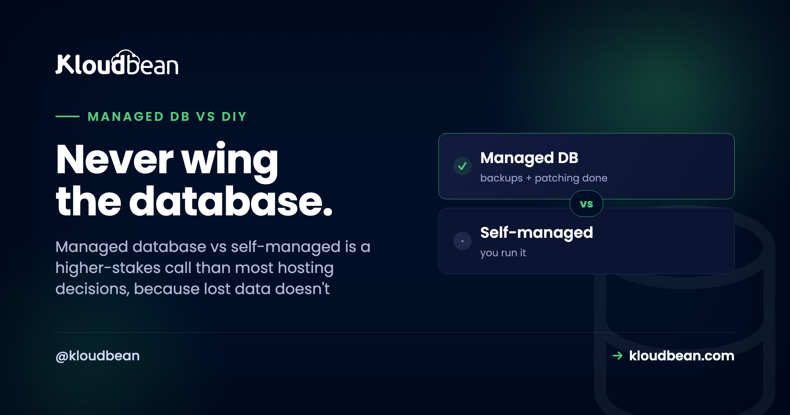
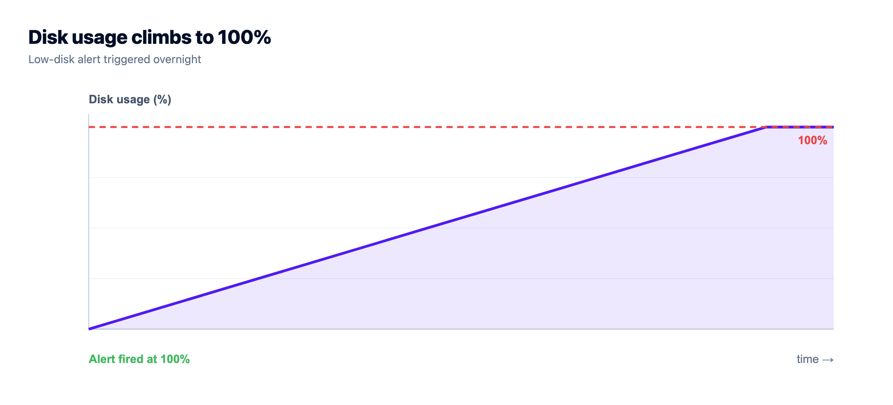
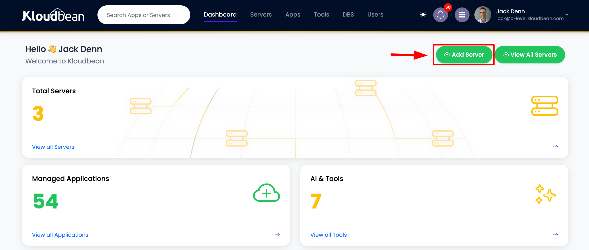
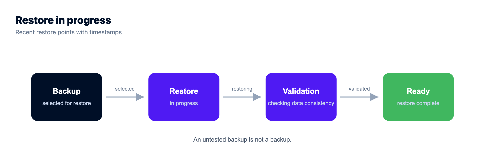
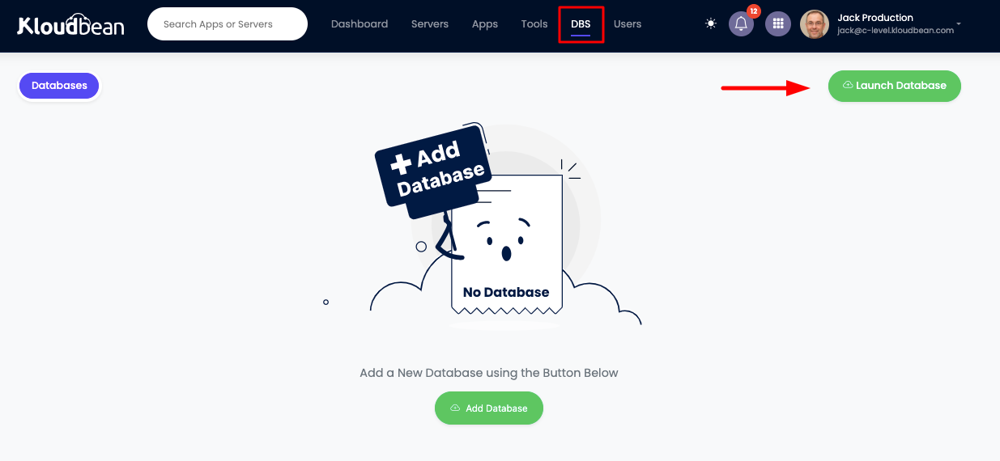
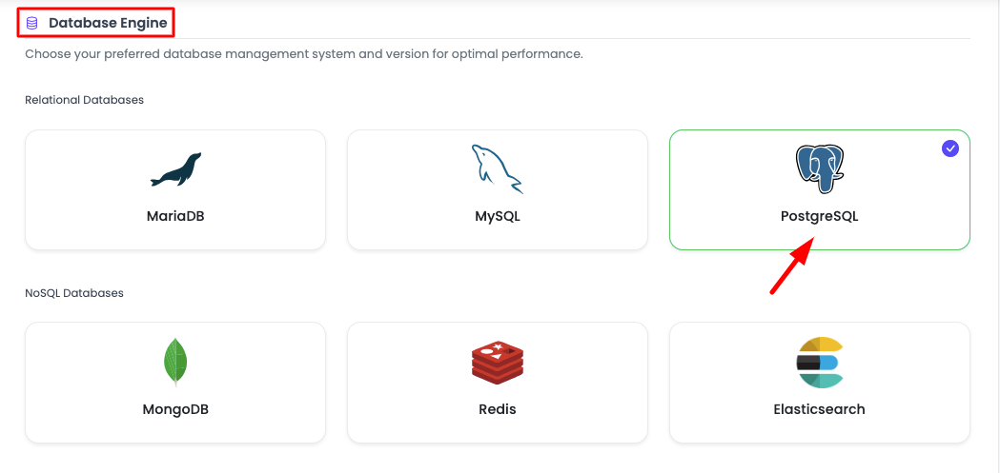
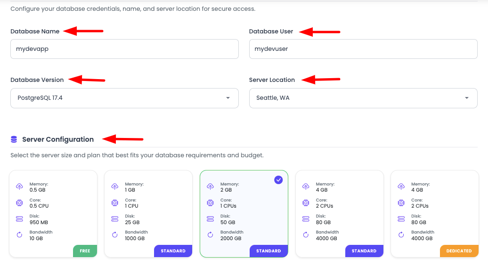

# Managed Database vs Self-Managed: The One Choice You Can't Undo

A crashed app restarts. A misconfigured server rebuilds. A dropped table at 3am, with no good backup? That one doesn't come back.

That asymmetry is the whole reason managed database vs self-managed is a different, higher-stakes decision than picking where to host your app. Most infrastructure choices are reversible. Data loss isn't. So before we compare features, let's be honest about what's actually on the table, because it changes how you should weigh the two.

> **Short answer:** Self-managed means you install the database on a server and own everything after: configuration, security, patching, version upgrades, backups, tested restores, and recovery when it breaks. Managed means you launch it, get a connection string, and the platform runs backups and access control, locking it to your app server's IP for you. For most teams the deciding factor isn't performance or price. It's that a database is the one place where a mistake can be permanent, and managed removes the scariest ways to lose data.

## Why a database is the worst thing to run on vibes

I'll say it plainly: a database is the single worst part of your stack to improvise. Not because it's the hardest to install (it isn't, `apt install postgresql` and you're "done" in a minute), but because the stakes are lopsided. Everything else in your system is replaceable. Lose the web server, rebuild it. Lose the app container, redeploy it. Lose the data, and you might be emailing customers to apologize.

That's the trap with self-managing. The install is easy, so it feels solved. The parts that actually protect you (a backup that restores, a patched engine, a disk that doesn't fill) are invisible right up until the night they aren't. And by then it's too late to start caring.

## The 3am incident, two ways

Here's the same trigger, a disk quietly filling to 100%, playing out on a self-managed box and on a managed one. This is the pattern behind most of the "we lost data" stories, drawn as a timeline.

```
SELF-MANAGED · your night
2:14am disk full ── writes fail ── you're paged ── backup old, never tested ──> DATA LOST

MANAGED · platform's night
nightly backup ── platform handles disk ── you keep sleeping ── restore point ready ──> RECOVERED

Same disk-full trigger. The difference is who was watching, and whether a restore actually existed.
```

The cruel detail is the backup. Almost everyone who loses data *had* backups configured. What they didn't have was a backup they'd ever restored. A dump that silently stopped running weeks ago, or one that restores into a different schema, is worse than none, because it feels like safety. That's the single most expensive lesson in self-managing a database, and it usually gets learned once.



## What "self-managed" actually signs you up for

The word "install" hides a job that never really ends. Run your own Postgres or MySQL on a VM and here's the standing to-do list, forever:

- **Secure it.** Bind it to a private interface, not `0.0.0.0`. An exposed database is found by scanners in minutes, and there's a whole genre of ransom notes left in unsecured MongoDB instances to prove it.
- **Configure and tune it.** Memory, connection limits, work_mem, checkpoints. The defaults are conservative and rarely right for your box.
- **Patch it.** The OS and the engine both. Security releases don't wait for a convenient week.
- **Upgrade major versions.** The genuinely scary one. A botched `pg_upgrade` can corrupt data, so you rehearse it, or you gamble.
- **Back it up, then *prove* the restore.** Scheduling a dump is easy. Confirming it restores cleanly, on a timer, is the part almost nobody does.
- **Watch the disk, the connections, the slow queries.** Because the full disk at 2:14am doesn't announce itself.
- **Plan recovery.** Point-in-time recovery, replication, failover. Real projects, not checkboxes.

None of it is beyond a competent engineer. That's not the point. The point is that it's a recurring, high-consequence job that sits next to your actual work, and it only truly tests you on the worst night. When you self-manage, you also own the server underneath the database, with all of that.





## What "managed" hands you instead

Managed collapses that list to almost nothing. On Kloudbean you open the databases section, pick an engine, and launch. A minute or two later it's provisioned, secured, locked down with IP allow-listing, and already being backed up. You get a connection string and you move on with building.







Six engines are on offer (PostgreSQL, MySQL, MariaDB, Redis, Elasticsearch, and MongoDB), each as a standalone one-click service with automatic backups and controlled access, locked to your app server's IP so it never sits open on the public internet. That's the trade: you keep the parts that need your judgment, and hand off the parts that just need doing on time, every time, without fail. If you want the hands-on version of wiring one into an app, that's [add a managed database to your app](https://www.kloudbean.com/blog/add-managed-database-to-your-app/), with engine-specific guides for [managed PostgreSQL](https://www.kloudbean.com/blog/managed-postgresql-hosting/) and [managed MySQL](https://www.kloudbean.com/blog/managed-mysql-hosting/).

## The ops burden, side by side

Same database engine in both columns. What changes is who carries each job, and how bad it is when it's skipped.

| Database job | Self-managed (you) | Managed (the service) |
| --- | --- | --- |
| **Install + secure** | You, and you'd better not leave it exposed | Provisioned and locked to your app server's IP |
| **Config + tuning** | You, from conservative defaults | Sensible defaults out of the box |
| **OS + engine patching** | You, on the security cycle | Handled for you |
| **Major version upgrades** | You rehearse it, or you gamble | A managed operation, not your gamble |
| **Backups** | You schedule them | Automatic |
| **Tested restores** | You, and most people don't | Restore points you can actually use |
| **Monitoring** | Disk, connections, slow queries: you | Watched for you |
| **Schema, indexes, queries** | Yours | Still yours |
| **Your data** | Yours | Still yours, exportable anytime |

Look at the last two rows. This is the part people fear losing when they hear "managed," and it's exactly the part you keep. You control the schema, the indexes, and the queries, which is where nearly all real database performance is won or lost anyway. You give up the chores, not the craft.

## But is my data trapped? The portability question

The most common fear about managed databases is lock-in, and it's the easiest to put to rest. A managed PostgreSQL or MySQL is the same open-source engine you'd run yourself. Same SQL, same dump formats, same tools. Your data isn't in a proprietary vault, it's in ordinary Postgres or MySQL, and it walks out the door with one command:

```bash
# PostgreSQL: full logical dump, then restore anywhere
pg_dump "$DATABASE_URL" > backup.sql
psql "$NEW_DATABASE_URL" < backup.sql

# MySQL / MariaDB
mysqldump -h HOST -u USER -p appdb > backup.sql
mysql -h NEWHOST -u USER -p appdb < backup.sql
```

There's no lock-in because there's nothing proprietary to be locked into. The service manages the operation of the database, never ownership of the contents. And that `psql ... < backup.sql` line is also the restore you should be rehearsing on a self-managed box, but usually aren't.

## Scaling, without hand-building it

People assume managed databases hit a ceiling. In practice, scaling is a reason to use one. The simplest lever is vertical: resize to a bigger server when CPU or memory gets tight. Beyond that, the usual patterns still apply. Read replicas are the standard next step for read-heavy workloads (the concepts are in [database read replicas and scaling](https://www.kloudbean.com/blog/database-read-replicas-scaling/)), and putting a [managed Redis](https://www.kloudbean.com/blog/managed-redis-hosting/) cache in front of your hottest reads takes real pressure off the primary. The difference is that you're reasoning about your data and your queries, not also hand-building the machinery underneath. Backups, in particular, are one thing you shouldn't be improvising, and the [server backups guide](https://www.kloudbean.com/blog/server-backups-guide/) covers testing a restore before you need it.

## When self-managing is genuinely the right call

Myth-busting shouldn't turn into pretending self-managed is never right. It is, in real cases, and I'd pick it myself in a couple of them.

Run your own when you're **learning**, and getting your hands dirty is the entire goal. Run your own for a **hobby or throwaway** project where a wipe costs you nothing and the effort is trivial. Run your own when you have a **dedicated DBA or platform team** whose actual job is this, and you need control a managed service won't give: an exotic extension, a custom replication topology, a very specific tuning profile. Those are legitimate, and nobody should be shamed off a setup that fits. What doesn't hold up is self-managing your production data by accident, because the install was easy, without a rehearsed restore. That's not a choice, it's a bet you didn't know you placed.

The boundary, stated once: these are standard open-source engines on a Linux stack. Managed means the service runs, patches, and backs up the database and locks it down with IP allow-listing, while your schema, your queries, and your data stay entirely yours and exportable any day. Managed databases take the toil, not the ownership. For the data your business depends on, that's the trade worth making.

<!-- cta:start -->
**Move it once. Own it after.**

Migration assistance is free and there is a free trial to prove the setup first. You keep Git-based deploys, get managed databases beside the app, and pay a flat monthly price on the cloud you choose.

- Free migration assistance
- Free trial
- Seven cloud providers
- Flat monthly price
- Managed databases
- Git deploy

[Start free](https://console.kloudbean.com/register) · [See plans](https://www.kloudbean.com/pricing/)
<!-- cta:end -->

## FAQ

**What's the difference between a managed database and a self-managed one?**
Self-managed means you install the database on a server and own everything after: security, configuration, tuning, patching, version upgrades, backups, tested restores, and recovery. Managed means the service provisions it, locks it down with IP allow-listing, and runs the backups and access control, so you get a connection string and keep control of your schema, queries, and data.

**Is a managed database worth it, or should I just run my own?**
If it's production data your business depends on, managed is usually worth it, because it removes the failure modes that cause permanent data loss: the missed patch, the full disk, and above all the backup that was never tested. Run your own when you're learning, it's throwaway, or you have a dedicated team that needs deep control.

**Does a managed database lock in my data?**
No. Managed MySQL and PostgreSQL are the standard open-source engines, so your data is in ordinary, portable formats. You can export the whole database with a normal mysqldump or pg_dump and load it anywhere. The service manages operation, not ownership. There's nothing proprietary to be trapped in.

**Are managed databases slower than self-hosted ones?**
Usually not, and often the reverse. Managed databases arrive with sensible defaults on real infrastructure, while self-run instances frequently sit on untuned settings nobody adjusted. It's the same engine underneath, so unless you'll invest real DBA time tuning your own, the managed one tends to be as fast or faster.

**Do I lose control with a managed database?**
You keep the control that matters: your schema, indexes, and queries, which drive most real performance. What you give up is the operating system and the maintenance chores, which is the intended benefit. You lose sysadmin duties, not database design.

**What happens if I never test my backups?**
You find out whether they work at the worst possible moment. An untested backup can be silently broken: stopped running weeks ago, or restoring into the wrong schema. That's the most common way self-managed databases lose data despite "having backups." Managed services keep usable restore points, and you should still confirm a restore before you rely on it.

**Which databases can I run as managed?**
On Kloudbean, six engines are available as one-click managed services: PostgreSQL, MySQL, MariaDB, Redis, Elasticsearch, and MongoDB. Each comes with automatic backups and controlled access, and you lock it to your app server's IP so it isn't exposed to the public internet.

**Can a managed database scale for a large app?**
Yes. The simplest move is resizing to a bigger server as CPU or memory gets tight. For read-heavy workloads, read replicas are the standard pattern, and caching hot reads in a managed Redis takes pressure off the primary. You reason about your data and queries instead of hand-building the machinery.

**How do I migrate an existing database to a managed one?**
Export with pg_dump or mysqldump, import into the new managed database with psql or mysql, then repoint your connection string and redeploy. Because these are standard engines, the move is a plain export and import. Kloudbean also offers free migration assistance if you'd rather not run it yourself.

**Can I connect with my usual database client or GUI?**
Yes. It's a standard engine, so any normal client or GUI connects with the usual connection string. For admin access from your own machine you tunnel in through the app server rather than opening the database to the public internet, which keeps access limited to the IP you've allow-listed.

---

*Kloudbean · Never wing the database.*
