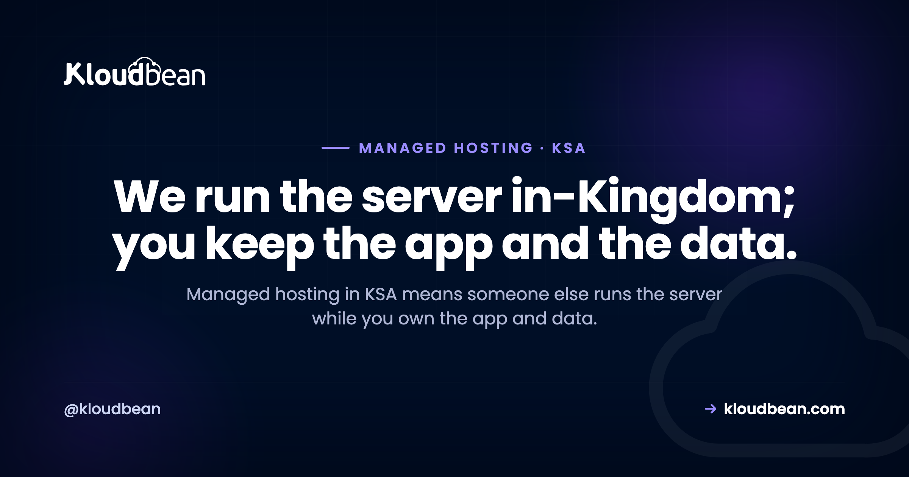

**Managed hosting · Saudi Arabia (KSA)**

# Managed Hosting in KSA: Who Runs Your Server, and What Stays Yours

By Kloudbean MENA · We run the server in-Kingdom; you keep the app and the data.

Most Saudi businesses that need a server have no interest in becoming a server company. You run a store, an agency, a clinic's booking system, or a SaaS for Riyadh clients. What you don't have is a DevOps bench sitting idle, waiting to patch Linux at midnight. That gap is what managed hosting in KSA fills. Someone else runs the box, keeps it patched and backed up, and keeps it in-Kingdom, while your team ships. This is the honest version: what "managed" actually buys a Saudi team, what stays your job no matter who you pay, and when running it yourself is still the smarter move.

> **What is managed hosting in Saudi Arabia, and who runs the server?**
> Managed hosting means the platform operates the server for you: provisioning, the stack, SSL, patching, backups, and health monitoring. You own the app and the data. On Kloudbean that managed server can sit in-Kingdom on Google Cloud's Dammam region (me-central2), so a Saudi team gets the operations handled and the data on Saudi soil, all from one dashboard.

## What does managed hosting in KSA actually cover?

Strip off the marketing and managed hosting is a division of labor. You rent the same class of Linux server you'd get anywhere. The difference is that a platform does the operating work on it instead of you. On a managed plan the provider provisions the machine, installs and maintains the stack (web server, runtime, database), issues and renews SSL, patches the OS, runs backups, and watches the server's health. You log in to your application, not to a bare box that needs a weekend of setup before it serves a single request.

Here's the line that matters most for a Saudi team. Managed changes who does the ops, never who owns the work. Your application code is yours. Your data is yours. Your users, your business logic, and the app-level compliance decisions stay with you. Managed cloud hosting in Saudi Arabia takes the plumbing off your plate. It does not take your product, and a good host will let you export everything the day you ask.

<!-- SVG: "who runs what" managed split inside a dashed in-Kingdom (GCP Dammam me-central2) boundary. Left column (Kloudbean runs, navy): provisioning + OS patching, the stack, free SSL, firewall + Fail2ban, automatic backups, health monitoring. Right column (you own, green): your application code, your data + database, your users + logins, app-level PDPL choices. Brand navy #000f27, purple #4F1AF3, green #40b75f. -->

*Managed hosting splits the work. Kloudbean runs the left column; you keep the right. On the Dammam region, both sides sit in-Kingdom.*

<!-- ADD IMAGE: your server list in the console, showing a running managed server with green health. -->

## Managed hosting vs doing it yourself: the honest split for a Saudi team

The real choice isn't managed hosting against some abstract ideal. It's managed against you and two engineers doing it after hours. So let's put the jobs side by side. Same Linux box underneath both columns. What changes is the name next to each chore.

| The job | Do it yourself (raw VPS) | Managed hosting (Kloudbean) |
| --- | --- | --- |
| **Provision + harden** | You spin it up and lock it down | Launched and hardened for you |
| **Install the stack** | Web server, runtime, database, by hand | Preinstalled and configured |
| **SSL certificates** | You issue and renew, or it lapses | Free SSL, issued and auto-renewed |
| **OS + security patching** | You patch, or you stay exposed | Patched for you |
| **Backups + restore** | You script them, and test them | Automatic backups, kept in-region |
| **Monitoring + on-call** | Your phone rings at 2am | The infra side is watched for you |
| **In-Kingdom setup** | You research regions and pray you picked right | Pick GCP Dammam once, done |
| **Your app + data** | Yours | Still yours |

Read the last row twice. Ownership of your code and data never moves. You outsource the operations, not the thing you built.

My honest opinion, after watching a lot of small teams make this call: most Saudi SMEs and agencies have no business patching their own servers. Not because they can't. Because every hour spent on `apt upgrade` and cert renewals is an hour not spent on the product or the client. The ops work on a DIY box is rarely hard. It's relentless, it's boring, and it never stops:

```bash
# the checklist that quietly becomes your problem on a raw VPS
sudo apt update && sudo apt upgrade -y   # OS + security patches
sudo certbot renew                        # before the cert expires
df -h                                     # is the disk about to fill up?
journalctl -u nginx --since "1 hour ago" # why did it 502?
```

And the failure mode we see over and over is dull and expensive. A small team spins up a cheap VPS in a Frankfurt region to save a few riyals. Months pass. Then a Saudi client asks where the data physically lives, and the same week the SSL certificate quietly lapses, so every visitor hits a browser wall reading `NET::ERR_CERT_DATE_INVALID`. Now you're migrating a live database and chasing a certificate the night before a demo. Managed hosting exists so that particular night never happens. If you want the full fundamentals of this split, we wrote the deep version in [managed vs unmanaged hosting](https://www.kloudbean.com/blog/managed-vs-unmanaged-hosting/).

## Why managed and in-Kingdom belong together in KSA

Plenty of hosts will run a server for you. Fewer will run it for you inside Saudi Arabia. That combination is the whole reason this article is KSA-specific rather than generic. Among the seven clouds Kloudbean provisions on (AWS, AWS Lightsail, Google Cloud, Linode, Vultr, DigitalOcean, and UpCloud), the one with a region physically inside the Kingdom is Google Cloud, through its Dammam region, code-named `me-central2`. Pick that region when you add a server and your managed stack lives on Saudi soil.

The screenshot below is the moment that decides it. Seven clouds on the left, and Google Cloud's **Dammam (me-central2), Saudi Arabia** selectable as the in-Kingdom region. It's a single click, and it happens once, at launch.


Managed makes that in-Kingdom promise real, not just a label on the app server. Because the platform runs the whole stack, the managed database launches into the same Dammam region on a private network. Free SSL is issued and auto-renews. And the automatic backups, which are the copies people most often forget, are taken and kept in the same region. That last detail matters more than it sounds. A backup that quietly lands in another country undoes your residency without anyone noticing. On a managed plan pinned to Dammam, the primary and its copies stay together, in-Kingdom.

Two things are worth being precise about, because marketing tends to blur them. Kloudbean does not own data centers in Saudi Arabia. The in-Kingdom capability comes from provisioning on Google Cloud's Dammam region, one option among the seven clouds. And hosting in the Kingdom is a strong foundation for the residency and infrastructure parts of PDPL (the Personal Data Protection Law, overseen by SDAIA) and NCA ECC, but it is not a certificate and it does not do your app-level compliance for you. That's shared responsibility, and the full picture lives in the pillar guide, [cloud hosting in Saudi Arabia](https://www.kloudbean.com/blog/cloud-hosting-saudi-arabia/). For the residency specifics, see [data residency in Saudi Arabia](https://www.kloudbean.com/blog/data-residency-saudi-arabia/), and for the latency case to Riyadh and Jeddah users, [low-latency hosting for Riyadh and Jeddah](https://www.kloudbean.com/blog/low-latency-hosting-riyadh-jeddah/).

<!-- ADD IMAGE: a close crop of the region selector with Dammam (me-central2) highlighted and confirmed. -->

## What managed hosting looks like day to day

Once the server's up, the daily experience of fully managed hosting in Riyadh or anywhere else in the Kingdom is mostly that you stop thinking about the server. You watch the whole stack from one dashboard: servers, applications, managed databases, storage, SSL, and backups, all under one login. No juggling a cloud console, a separate database service, and a certificate provider.


The parts that used to be a chore become settings. Backups run on a schedule you can see and adjust, and you can restore from the same screen. Do go test a restore before you need one. That's the step everybody skips, and it's the difference between a bad afternoon and a catastrophe.


Beyond that, a managed platform hands you the conveniences a Saudi team would otherwise wire up by hand: Git deploys with live build logs, staging for WordPress and Laravel, cron jobs from the UI without SSH, and subusers with granular access control. None of it needs an SSH session. The server is there when you want it and invisible when you don't.

<!-- ADD IMAGE: the backup schedule set to daily, or a completed restore confirmation. -->

## Who should choose managed hosting in KSA, and who shouldn't

Managed isn't automatically right for everyone, and I'd rather you spend the money where it earns its keep. Here's the honest read on fit.

- **SMEs and startups without an ops team.** If nobody on staff wants to be the sysadmin, managed servers in KSA are the obvious call. You get a production-grade box without hiring for it.
- **Agencies with Saudi clients.** One dashboard, many client sites, all provably in-Kingdom, is an easy story to tell a local client who asks the residency question. You bill for building, not for babysitting servers.
- **Ecommerce and WooCommerce stores.** Your buyers are in the Kingdom, checkout latency is money, and customer and payment data is exactly what you want on Saudi soil with backups you didn't have to script.
- **SaaS serving Saudi users.** Managed keeps you shipping features while the platform handles patching and uptime, and in-Kingdom hosting becomes a line in your own sales calls.
- **Government and enterprise tenders.** When residency is in the requirements, a managed in-Kingdom stack gives procurement a clean answer. Heavier needs can extend, on Enterprise, to Kubernetes, autoscaling, custom architectures, and an audit trail.
- **You can probably skip managed if** you have a real DevOps team that wants deep, unusual control, a custom kernel, or an exotic stack, or the box is a throwaway lab where a wipe costs you nothing. In those cases the control of a raw server is the point, and paying for management is paying someone not to do a job you enjoy.

The pattern underneath all of this: managed hosting is often the experienced choice, not the beginner one. Plenty of people who know Linux perfectly well still pick managed, because they've decided their attention is worth more on the product than on the pager. If you're weighing hosts for the region, [how to choose managed cloud hosting](https://www.kloudbean.com/blog/best-managed-cloud-hosting/) lays out the criteria that actually matter, and if you're specifically comparing platforms, [this look at Cloudways alternatives](https://www.kloudbean.com/blog/cloudways-alternatives/) is a fair sanity check.

## Where managed hosting stops: the honest edges

To keep this trustworthy, here are the boundaries. Kloudbean runs Linux stacks (PHP, WordPress, WooCommerce, Laravel, Node, Python, Ruby, Java, and their databases), not Windows or .NET and IIS. "Managed" means the platform handles the server, the stack, SSL, backups, and patching, while your application code and your data stay yours to export any day you like.

On compliance, be careful how you phrase it in a tender. Hosting in the Dammam region is a genuine, defensible foundation for the infrastructure-shaped parts of PDPL and NCA ECC. It is not a certification a host grants you, and Kloudbean makes no such claim on your behalf. You still own consent, lawful basis, retention, and the rest of the app-level work. And autoscaling and Kubernetes aren't automatic on a standard plan. They're part of Enterprise and custom setups, so don't promise a stakeholder that a normal managed server scales itself. What managed hosting reliably gives a Saudi team is the boring, valuable thing: a production server run properly, in-Kingdom, so the people who built the product can keep building it.

---

**Let someone else run the server. Keep shipping.** Launch a fully managed server and database in Google Cloud's Dammam region (me-central2), keep backups and SSL in-Kingdom, and manage the whole stack from one dashboard. Plans start from $8/mo, Enterprise is custom. Start at [kloudbean.com](https://www.kloudbean.com/), see options on [pricing](https://www.kloudbean.com/pricing/).

In-Kingdom GCP Dammam region · Managed patching · Automatic backups · Free SSL · Private networking · Free migration assistance · Free trial

## FAQ

**What is managed hosting in KSA?**
Managed hosting in KSA is a server that a platform runs for you inside Saudi Arabia. The provider handles provisioning, the stack, SSL, OS patching, backups, and monitoring, while you own your application and data. On Kloudbean the managed server can sit in-Kingdom on Google Cloud's Dammam region (me-central2), so the operations are handled and the data stays on Saudi soil.

**Who actually runs the server on a managed plan?**
The platform does. Provisioning, patching, SSL renewals, firewall, backups, and health monitoring are the platform's job on a managed plan. You interact with your application, not the bare Linux box. Your code, your data, and your business decisions stay yours, which is the part that never moves regardless of who runs the server.

**What does managed include, and what stays mine?**
Managed typically includes the operating system, the stack (web server, runtime, database), OS and security patching, SSL issuance and renewal, firewall and intrusion blocking, automatic backups, and monitoring. On Kloudbean that means a Shorewall firewall and Fail2ban on by default, free SSL, and automatic backups from launch. Your application code, your data, and your app-level compliance choices stay yours.

**Is managed hosting in Saudi Arabia the same as in-Kingdom hosting?**
Not automatically. Managed describes who runs the server. In-Kingdom describes where it physically sits. You get both when the managed server is provisioned in Google Cloud's Dammam region (me-central2), which is inside Saudi Arabia. A managed server in a Europe region is still managed, just not in-Kingdom, so confirm the region rather than the marketing label.

**Managed vs unmanaged: which should a small Saudi team pick?**
If nobody on the team wants to be the sysadmin, managed is usually the right call. Unmanaged is cheaper on the invoice but hands you patching, SSL, backups, and the 2am pager. Managed buys those hours and that risk back for a higher sticker price. Choose unmanaged only if you have the ops skill and genuinely want deep control of the server.

**Does managed hosting mean I lose control or root access?**
You keep control of what matters: your application, your data, your deploys, and your configuration. Managed takes over the operations underneath, which is the point. If you specifically need deep, unusual control over the OS or a custom kernel, that is one of the real cases where an unmanaged server fits better.

**Can managed hosting keep my data in-Kingdom?**
Yes. When you launch the managed server in Google Cloud's Dammam region (me-central2), the server, the managed database, and the automatic backups all stay in that region, inside Saudi Arabia. Because the whole stack is managed from one dashboard, there is no separate backup service quietly storing copies in another country.

**Does managed hosting make me PDPL compliant?**
No, not on its own. Hosting in-Kingdom gives you a strong foundation for the residency and infrastructure parts of PDPL and NCA ECC, but compliance is shared responsibility. The platform provides infrastructure controls; you own consent, lawful basis, retention, disclosures, and data-subject rights at the application level. Managed hosting is not a certificate, and no host grants you one.

**How much does managed hosting in KSA cost?**
Standard plans start from $8 a month, and Enterprise is custom pricing depending on scale and requirements. In-Kingdom hosting on the Dammam region follows the same plan structure. Cloud pricing changes and the region you pick can affect the underlying cost, so check the current numbers on the pricing page before you commit.

**Can you migrate my existing server to managed hosting in the Kingdom?**
Yes. Free migration assistance can move an existing site or app onto a managed server in the Dammam region with minimal downtime, and there is a free trial to test the setup first. Your app and data are portable, so moving to managed hosting is a migration, not a rewrite.

---

*Kloudbean MENA · Managed hosting inside the Kingdom, so your team ships instead of patching.*
