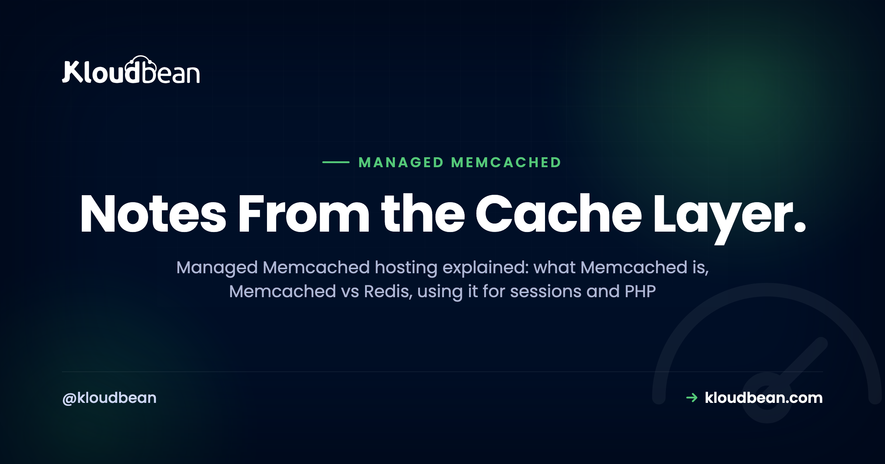

# Managed Memcached Hosting: When It's the Right Cache, and When It Isn't



You run a busy PHP app or a WordPress site, and the database is the bottleneck. The same queries fire over and over for data that barely changes. A cache fixes that, and Memcached is one of the oldest, simplest tools for the job. This guide covers managed Memcached hosting: what Memcached is, where it beats Redis, where it loses, and how to launch one and connect without treating a volatile cache like a database.

> **The short version**
> Managed Memcached hosting gives you a fast, in-memory key/value cache that the platform runs, patches, and keeps on a private network. Memcached is multi-threaded and dead simple: great for a big read cache, a session store, or a PHP object cache. It has no persistence and no data structures, so if you need either, reach for Redis.

## What Memcached actually is

Memcached is an in-memory key/value cache. You hand it a key and a small value, it holds that value in RAM, and it hands it back in a fraction of a millisecond. That's the whole job. It came out of LiveJournal in 2003, built to take read load off overworked databases, and the design has barely changed since. Simple tools age well.

Two properties define it. It's **multi-threaded**, so it uses every core on the box you give it. And it's **volatile**: nothing touches disk, so a restart leaves you with an empty cache. People read that as a weakness. It isn't. A cache is disposable by design. If losing its contents on a restart would hurt, the data never belonged in a cache.

The mental model to keep: if Memcached vanished this second, your app should get slower, not lose data. Durable records belong in a real database, covered in [adding a managed database to your app](https://www.kloudbean.com/blog/add-managed-database-to-your-app/). Memcached sits in front and absorbs the repeat reads.

<!-- SVG diagram: decision fork. "Do you need more than a plain key/value cache?" NO points to Memcached (big volatile LRU cache, multi-threaded, sessions/object cache/read cache, no persistence, no data structures). YES points to Redis (lists/sets/sorted sets/hashes, optional persistence and replication, queues/rate limits/pub/sub, the default when in doubt). Brand colors navy #000f27, purple #4F1AF3, green #40b75f. -->

_The fork that decides it: a plain fast cache points at Memcached, anything richer points at Redis._

## Memcached vs Redis, honestly

Both are in-memory stores you put in front of a database, so they get compared constantly. They started on slightly different problems and grew toward each other. Redis picked up features; Memcached stayed lean. Here's how they differ.

|  | Memcached | Redis |
| --- | --- | --- |
| **Threading** | Multi-threaded, scales across cores | Single-threaded for commands (I/O threads in 6+) |
| **Data types** | Opaque values (strings / blobs) | Strings, lists, sets, sorted sets, hashes, streams |
| **Persistence** | None, fully volatile | Optional (RDB snapshots, AOF) |
| **Eviction** | LRU within slabs | Configurable (LRU, LFU, TTL, noeviction) |
| **Pub/sub** | No | Yes |
| **Replication / cluster** | None built in, client-side sharding | Replication, Sentinel, Cluster |
| **Max value (default)** | About 1 MB | Up to 512 MB per string |
| **Best at** | Huge, simple read cache; sessions; object cache | Cache plus queues, counters, rate limits, leaderboards |

My position, plainly: for most apps, I'd start with Redis. It does everything Memcached does and more, and one managed Redis can be your cache, session store, rate limiter, and job queue at once. Memcached earns its slot when you want exactly one thing, a large no-frills cache that spreads across many CPU cores without tuning. Narrow, but real. If that's not you, read [managed Redis hosting](https://www.kloudbean.com/blog/managed-redis-hosting/) and pick Redis.

<!-- ADD IMAGE: show the Memcached stats command over telnet, with get_hits and get_misses visible. -->

## When NOT to use Memcached

This is the part most tutorials skip. Skip Memcached the moment you need any of these:

- **Persistence.** It never writes to disk. A job queue you can't afford to lose, or anything that has to survive a restart, does not belong here. Redis can persist. Memcached can't.
- **Data structures.** Memcached values are opaque blobs. No lists, sets, sorted sets, or hashes. Want a leaderboard or an atomic counter list? That's Redis.
- **Pub/sub or streams.** There are no messaging primitives at all. If services need to talk through the cache, look elsewhere.
- **Large values.** The default max value is about 1 MB, and keys top out at 250 bytes. Try to store a 3 MB serialized object and the write just fails in a lot of clients. You can raise the slab limit, but if you're fighting it, you picked the wrong tool.
- **Built-in replication or failover.** No primary/replica, no Sentinel, no cluster mode in the box. You scale by sharding across nodes client-side, and if a node dies, the keys it held are gone and get refetched from the database.

The mistake I see most often: treating Memcached as a system of record. Someone stashes the only copy of a cart or an auth token in it, the process restarts on deploy, and the data's gone. Volatile means volatile. If you read that list and thought "I need two of those," you want Redis.

## So when is Memcached the right pick?

It shines in a narrow, common slot. Three jobs, mainly:

- **A huge, hot read cache.** Cache the results of expensive queries or rendered page fragments. Memcached's multi-threaded design means a big multi-core instance keeps scaling where a single-threaded engine would peg one core and stall.
- **Sessions at scale.** A shared session store so users don't get logged out when they hit a different app server next. Fast and simple, and losing a session on a rare restart is a minor annoyance, not a disaster.
- **PHP object cache.** WordPress and other PHP apps repeat the same database queries on nearly every page load. Memcached answers them from RAM instead.

The common thread: the data is rebuildable, and you value raw throughput and simplicity over features. So "when to use Memcached" almost always resolves to "as a cache, and only a cache."

## How managed Memcached hosting works on Kloudbean

Memcached is one of seven managed database engines on Kloudbean, alongside MySQL, MariaDB, PostgreSQL, Redis, Elasticsearch, and MongoDB. You launch it the same way you'd launch any of them. Open the **DBS** section, pick Memcached, give it a name, create it. A minute or two later it's running on your server, with the host and port to connect with.


_DBS then Launch Database: Memcached is one of seven managed engines, provisioned on your server in a couple of minutes._

Two things here are easy to miss.

First, **private networking**. Your Memcached instance sits on a private network with your app, not on the public internet. That's not a nice-to-have. Memcached historically shipped with weak-to-no authentication and has a long history of being abused in UDP amplification attacks when exposed, so a public instance is a real risk. Keep it internal and that whole category of problem disappears. Access stays reachable by your app, not by port scanners.

Second, **backups**. For the durable engines, automatic backups are the headline. For a pure Memcached cache there's nothing worth backing up: the data is a disposable copy of what already lives in your database. So there's no restore button on a cache, and that's fine. It's the nature of a volatile cache.

<!-- ADD IMAGE: show the managed databases list with Memcached running next to a MySQL or Postgres instance. -->

The real win: cache, database, and app in one dashboard, on one server, on one bill. No separate cache vendor, no second login, no cross-provider network to reason about. Running Memcached on cloud for a WordPress store or a Laravel API uses the same console you already have.


_One dashboard for the whole stack: servers, apps, and managed engines like Memcached in the same place._

## Connecting to Memcached (port 11211)

Memcached listens on **port 11211** by default and speaks a simple text protocol (there's a binary one too). You don't build a single connection string like a database. You point a client at a host and a port. Keep that host and port in environment variables, never hard-coded, the discipline covered in [environment variables done right](https://www.kloudbean.com/blog/environment-variables-done-right/).

Here are the three clients you'll meet most, all doing the same cache-aside dance.

### PHP (the Memcached extension)

```php
// PHP: the Memcached extension (note the trailing "d"), not the older Memcache
$mc = new Memcached();
$mc->addServer('10.0.0.5', 11211);

$user = $mc->get('user:42');
if ($user === false) {              // cache miss
    $user = $db->findUser(42);      // read the source of truth
    $mc->set('user:42', $user, 300); // cache for 5 minutes
}
```

### Node.js (memjs)

```js
// Node: memjs speaks the Memcached binary protocol
import { Client } from "memjs";
const mc = Client.create(process.env.MEMCACHED_SERVERS); // "10.0.0.5:11211"

const { value } = await mc.get("user:42");
if (!value) {
  const user = await db.getUser(42);
  await mc.set("user:42", JSON.stringify(user), { expires: 300 });
}
```

### Python (pymemcache)

```python
# Python: pymemcache is a fast, well-maintained client
from pymemcache.client.base import Client
mc = Client(("10.0.0.5", 11211))

user = mc.get("user:42")
if user is None:                     # cache miss
    user = db.get_user(42)
    mc.set("user:42", user, expire=300)  # 5-minute TTL
```

Same shape every time: check the cache, and on a miss read the database and store the result with a TTL. The rest of the ecosystem:

| Language / stack | Common client | Points at |
| --- | --- | --- |
| **PHP** | Memcached extension (php-memcached) | host + 11211 |
| **Node.js** | memjs | `MEMCACHED_SERVERS` env |
| **Python** | pymemcache | `(host, 11211)` |
| **Ruby** | dalli | `host:11211` |
| **Java** | spymemcached / xmemcached | `host:11211` |
| **Go** | gomemcache | `host:11211` |
| **WordPress** | W3 Total Cache + object-cache.php drop-in | `host:11211` |

One habit worth forming: create the client once and reuse it, rather than opening a fresh connection per request. It's the same reasoning behind [database connection pooling](https://www.kloudbean.com/blog/database-connection-pooling/), just gentler, because Memcached connections are cheap and you keep one persistent client around.

## Memcached as a WordPress object cache

WordPress is the classic Memcached use case. On every page load it fires a pile of repeat queries at MySQL. A persistent object cache parks those results in memory so the next load skips them. Drop in a Memcached-backed `object-cache.php` (W3 Total Cache and similar plugins ship one), point it at your instance on port 11211, and a busy blog or WooCommerce store gets noticeably quicker. There's a fuller treatment in [speeding up WordPress](https://www.kloudbean.com/blog/speed-up-wordpress/).

Redis does the same job through the Redis Object Cache plugin. For WordPress specifically, either is fine. Pick Memcached for pure simplicity, Redis if you'll also use it for a queue or rate limiting. Don't run both for the object cache. One backend, chosen on purpose.

<!-- ADD IMAGE: show a WordPress object cache setting (W3 Total Cache) pointed at Memcached with status enabled. -->

## Caching patterns that actually hold up

Whatever the language, most Memcached code is the **cache-aside** pattern (also called lazy loading). Check the cache. On a hit, return it. On a miss, read the database, store the answer with a TTL, and return it. The next request for the same key is a hit.

```
value = cache.get(key)          # 1. check Memcached
if value is None:               # 2. miss
    value = db.query(key)       # 3. read the source of truth
    cache.set(key, value, ttl)  # 4. remember it, with a TTL
return value
```

Three habits keep this healthy:

- **Always set a TTL.** A cache with no expiry and no invalidation hands out stale data forever, so a user updates their profile and sees the old one for an hour. Match the TTL to how fresh the data needs to be. Thirty seconds for something hot, an hour for something that barely moves.
- **Mind the stampede.** When a popular key expires, every request misses at the same moment and they all hammer the database together. It's called a cache stampede, or dogpiling. For genuinely hot keys, a short lock or a slightly staggered TTL smooths it out.
- **Never make it the source of truth.** Said it already, saying it again, because it's the one that bites people hardest. The database is the record. Memcached is a fast, disposable copy sitting in front of it.

Get those three right and Memcached quietly lifts a big slice of repeat load off your database. For richer strategies (write-through, tag-based invalidation, warming a cold cache), [Redis caching patterns](https://www.kloudbean.com/blog/redis-caching-patterns/) goes deeper on caching design, most of which applies to Memcached too.

---

**Put a cache in front of your database in a couple of clicks.**

Launch managed Memcached next to your app, on the same private network, in the same dashboard as your database. One login, one server, one bill. Start free at [kloudbean.com](https://www.kloudbean.com/), see plans on [pricing](https://www.kloudbean.com/pricing/).

One-click cache engines · Memcached and Redis · Private networking · Free migration · Free trial

## FAQ

### What is managed Memcached hosting?

Managed Memcached hosting means the platform launches, patches, and runs a Memcached cache for you, usually on a private network, so you just point your app at it. Memcached is an in-memory key/value cache that answers in a fraction of a millisecond and takes repeat load off your database. On Kloudbean it's one of seven managed engines you launch from the dashboard.

### Memcached vs Redis: which should I use?

For most apps, start with Redis. It does everything Memcached does plus data structures, optional persistence, and pub/sub, so one instance can cache, hold sessions, and run a job queue. Choose Memcached when you want exactly one thing: a large, simple, multi-threaded cache with minimal fuss. Both are managed engines on Kloudbean, so you can try either.

### Is Memcached persistent, or does it save data to disk?

No. Memcached keeps everything in memory and writes nothing to disk, so a restart empties it completely. That's by design, because a cache is meant to be disposable. If you need data to survive restarts, use a database, or Redis with persistence turned on.

### What port does Memcached use?

Memcached listens on port 11211 by default, over TCP (and historically UDP, which is usually disabled now). You connect by pointing a client at the host and port 11211 rather than building a database-style connection string. Keep the host and port in environment variables instead of hard-coding them in your app.

### Can I use Memcached for session storage?

Yes, and it's a common use. A shared Memcached session store keeps users logged in no matter which app server handles their next request. The tradeoff is that a restart clears active sessions and logs people out, so if that's unacceptable, use Redis with persistence.

### Does WordPress support a Memcached object cache?

Yes. WordPress supports a persistent object cache, and plugins like W3 Total Cache ship a Memcached-backed drop-in (object-cache.php). It caches repeated database queries in memory, which speeds up dynamic sites and WooCommerce stores. Redis is an equally good backend through the Redis Object Cache plugin, so pick one, not both.

### What is the maximum value size in Memcached?

By default the largest value you can store is about 1 MB, and keys are capped at 250 bytes. You can raise the value limit by changing the slab configuration, but if you routinely need multi-megabyte objects, Memcached is the wrong tool. Store large files in object storage and cache only small, hot values.

### Is Memcached a distributed cache?

Yes, in the sense that clients can shard keys across several Memcached nodes to pool memory and throughput. There's no built-in replication or failover, though, so if a node goes down, the keys it held are gone and get refetched from the database. That's fine for a cache and a dealbreaker for durable data.

### Is Memcached faster than Redis?

For a plain key/value cache they're both extremely fast, and the difference rarely matters in practice. Memcached's multi-threaded design can edge ahead on a big multi-core box under heavy load, but Redis wins the moment you need data structures. Choose on features, not micro-benchmarks.

### Do I still need a database if I use Memcached?

Yes. Memcached is an accelerator, not a store of record. Your durable data lives in a database like PostgreSQL or MySQL, and Memcached sits in front to serve repeat reads. If Memcached disappeared, your app should slow down, not lose anything.

_By Kloudbean · Notes From the Cache Layer._
