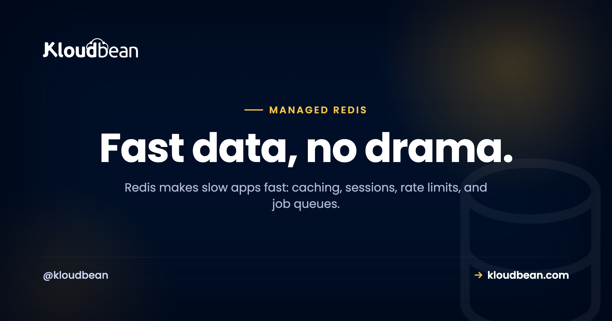

# Managed Redis Hosting: The Fast Layer Beside Your Database

Your app got slow. You open the logs and there it is: the same query, for the same data, thousands of times an hour, hammering a database that hasn't changed its answer all day. That's the moment most teams reach for Redis.

Redis is an in-memory store that answers in well under a millisecond and sits beside your real database, not in place of it. Managed Redis hosting means you launch one, get a connection URL, and it stays running, patched, and backed up while you use it. Let's walk through what Redis is genuinely good at, and the two gotchas that trip people up.

> **The short version:** Redis is an in-memory data store you put in front of your database to make things fast. Caching, sessions, rate limits, and job queues are its bread and butter. It's an accelerator, not your source of truth. Managed Redis hosting launches one right next to your app in the same account, locked to your app server's IP, kept running and backed up, connected with a single `REDIS_URL`.

## What Redis is, and what it isn't

Redis keeps its data in memory, which is the whole reason it's fast. A lookup that would cost a database a disk read and a query plan is, in Redis, just reading a value out of RAM. That buys you microsecond responses. The tradeoff is that memory is finite and volatile, so you treat Redis as a helper, not a vault.

Here's the mental model I'd tattoo on every new backend dev: if Redis vanished right now, your app should get slow, not lose data. Your durable records belong in [PostgreSQL](https://www.kloudbean.com/blog/managed-postgresql-hosting/) or [MySQL](https://www.kloudbean.com/blog/managed-mysql-hosting/). Redis sits in front of that database and absorbs the repetitive work. Get that boundary right and Redis is one of the highest-impact things you can add to an app. Get it wrong, treat Redis as your only copy of something important, and you'll eventually learn why that's a bad idea.

```
  request --> [ App ] --> check [ Redis ]
                             |          |
                       hit (fast)     miss
                             |          |
                        response   [ Database ] --> store in Redis --> response
```

## The jobs Redis is genuinely good at

Redis is a Swiss-army key-value store, but a handful of jobs are where it shines and where you'll actually use it:

| Job | What it does | Common tools |
| --- | --- | --- |
| Caching | Serve expensive query results from memory | Cache-aside, framework cache drivers |
| Sessions | Share login state across app servers | Framework session store |
| Rate limiting | Count requests per user or IP in a time window | INCR with an expiry |
| Job queues | Hand background work to worker processes | Sidekiq, BullMQ, Celery, RQ |
| Leaderboards and counters | Ranked sets and live tallies | Sorted sets, INCR |

## Caching: the cache-aside pattern

The pattern behind most Redis caching is **cache-aside**, and it's worth internalizing because it's everywhere. Check Redis first. On a hit, return instantly. On a miss, query the database, store the answer in Redis with a time-to-live, and return it. The next request for the same thing is a hit.

```js
// cache-aside: check Redis, fall back to the DB, then remember the answer
let user = await redis.get(`user:${id}`);
if (!user) {
  user = await db.query("SELECT * FROM users WHERE id = $1", [id]);
  await redis.set(`user:${id}`, JSON.stringify(user), "EX", 300); // 5 min TTL
}
return user;
```

Notice the `EX 300`. That five-minute expiry is not optional decoration. The classic caching bug is caching with no TTL and never invalidating, so a user updates their profile and sees the old one for hours because Redis is still handing out a stale copy. Set a TTL that matches how fresh the data needs to be, and invalidate the key when the underlying record changes. Do that, and cache-aside quietly removes a huge chunk of repetitive load from your database.


## Redis as a WordPress object cache

WordPress is a great concrete example, because it repeats the same database queries on nearly every page load. The Redis Object Cache plugin points WordPress's object cache at Redis, so those repeated queries get answered from memory instead of hitting MySQL again and again. On a busy dynamic site or a WooCommerce store, that's often the single biggest speedup available, and it's exactly the kind of thing covered in [speeding up WordPress](https://www.kloudbean.com/blog/speed-up-wordpress/) and [scalable WordPress hosting](https://www.kloudbean.com/blog/scalable-wordpress-hosting/). Run Redis in the same account as the site and the object cache is a config value away.

## Sessions that survive more than one server

By default a lot of frameworks store user sessions in a file or in local memory on one server. That works right up until you run a second app server, at which point a user's session might live on a machine they don't hit next, and they get logged out at random. Point the session store at Redis and every app server shares one fast store. It's usually a one-line config change, and it becomes close to mandatory the moment you scale past a single server.


## Rate limiting and job queues

Two more everyday jobs. For **rate limiting**, Redis `INCR` plus an expiry gives you a per-user or per-IP counter that resets on a window, so you can cap requests without touching your database at all:

```
INCR   ratelimit:user:123      # count this request
EXPIRE ratelimit:user:123 60   # reset the count every 60 seconds
```

For **job queues**, your app pushes background work (an email, a thumbnail, a report) into Redis and responds to the user right away. A separate worker process pops jobs off and does the slow part out of the request path. Sidekiq for Ruby, BullMQ for Node, Celery or RQ for Python all use Redis as the broker. One caveat worth stating: a queue you can't afford to lose is one case where you do want Redis persistence turned on, which brings us to the memory tradeoff.

## The memory-first tradeoff (the part people miss)

Redis lives in RAM, and that forces two decisions most tutorials gloss over.

First, **eviction**. Redis has a `maxmemory` limit and a policy for what to drop when it fills. For a pure cache, letting it evict the least-recently-used keys is exactly right, because old cache entries disappearing is harmless:

```
maxmemory-policy allkeys-lru   # drop least-recently-used keys when full (good for a cache)
```

Second, **persistence**. Redis can snapshot to disk (RDB) or append every write to a log (AOF) so data survives a restart. A pure cache doesn't need it, the data can always be rebuilt from the database. A job queue or anything you can't recompute does. Pick based on whether losing the data on a restart is annoying or a disaster. And size your instance to your working set: if your cache needs 3GB of hot keys, don't run it on a box with 1GB and wonder why it's constantly evicting.

<!-- ADD IMAGE: redis-cli INFO memory output showing used_memory and maxmemory -->

## error establishing a redis connection

You will see this one, probably from a WordPress plugin or your app's Redis client. It's noisy but almost always configuration, not a broken Redis. Work down the short list:

- **Wrong URL.** The host, port, or password in `REDIS_URL` doesn't match the instance. This is the usual culprit, especially right after moving environments.
- **TLS mismatch.** Many managed instances require an encrypted connection. If your client connects without TLS, or tries TLS when the instance doesn't use it, it fails. Match what the instance expects.
- **Network or firewall.** The app can't reach the Redis host. When the app and Redis run in the same account this is handled for you; across separate providers, check the routing.
- **Out of memory or maxed connections.** Under heavy load Redis can refuse new connections until there's room.

Check the URL and the TLS setting first. Those two account for the large majority of these errors. Running the app and Redis in the same account takes the whole network category off the table.

<!-- ADD IMAGE: cache hit-rate chart or the WordPress object-cache status screen -->

## Managed Redis, Upstash, or self-host?

Upstash is a genuinely nice serverless Redis if your whole app is built around per-request serverless functions and pay-per-command pricing. Credit where it's due. But most apps don't run that way. They run on an always-on server, and for those a managed Redis sitting right next to your database in the same account, in the same dashboard, is simpler and keeps everything on infrastructure you actually control. You launch it, you get a `REDIS_URL`, and it's patched and backed up without you thinking about it. If you're already connecting a database, the flow is identical, and [adding a managed database to your app](https://www.kloudbean.com/blog/add-managed-database-to-your-app/) walks through the same env-var wiring.

The honest boundary, once: managed Redis is a Linux-based service where the platform runs and patches the engine and handles memory and backups. You own your keys and data. It's in-memory, so treat it as fast, possibly-transient storage unless you deliberately turn on persistence. For read-heavy growth beyond caching, the next lever is usually your primary database, covered in [read replicas and scaling](https://www.kloudbean.com/blog/database-read-replicas-scaling/).

---

**Stop asking the database the same question twice.** Add a managed Redis next to your app, connect it with one URL, and watch the repeat load lift off your database. Start free at [kloudbean.com](https://www.kloudbean.com/), see plans on [pricing](https://www.kloudbean.com/pricing/).

One-click Redis · IP allow-listing · Automatic backups · Free migration · Free trial

## FAQ

**What is managed Redis hosting used for?**
Caching, sessions, rate limiting, and job queues, mostly. It's an in-memory store, so it answers in microseconds and takes repetitive load off your database. Managed Redis hosting means the platform runs and patches the engine and handles memory and backups, so you just launch one and connect with a URL.

**Is Redis a database or a cache?**
It's an in-memory data store most often used as a cache and a helper, not as your primary database. It's brilliant for caching, sessions, and queues. Your durable, authoritative data belongs in PostgreSQL or MySQL. The safe model is that if Redis disappeared, your app should slow down, not lose data.

**How do I connect my app to managed Redis?**
Install the Redis client for your language, then read the connection URL (usually REDIS_URL) from an environment variable rather than hard-coding it. The client connects using that URL. Many frameworks only need a config value pointing at the URL to start using Redis for caching and sessions automatically.

**Why do I get error establishing a redis connection?**
Almost always configuration. A wrong host, port, or password in the connection URL; a TLS mismatch where the instance requires encryption and the client isn't using it or vice versa; a network or firewall block between app and Redis; or Redis being out of memory or connections under load. Check the URL and the TLS setting first.

**Does Redis lose data when it restarts or fills up?**
By default Redis holds data in memory and uses an eviction policy to drop keys when it hits its memory limit, which is ideal for a cache. It can be configured with persistence (RDB snapshots or AOF) to survive restarts when you need that. Use persistence for data you can't recompute, like a job queue, and skip it for a pure cache.

**What eviction policy should I use for a cache?**
For a pure cache, allkeys-lru is a sensible default. It drops the least-recently-used keys when memory fills, so cold entries make way for hot ones and nothing important is lost. If you rely on key expiries, volatile-lru is an alternative. Match the policy to how you use the keys.

**Can I use Redis as a WordPress object cache?**
Yes, and it's one of the best speedups for a dynamic WordPress or WooCommerce site. The Redis Object Cache plugin points WordPress's object cache at Redis, so repeated database queries are answered from memory. Run Redis in the same account as the site and it's a quick configuration.

**Managed Redis vs Upstash vs self-hosting, which should I pick?**
Upstash suits apps built entirely on serverless functions with pay-per-command pricing. For the more common always-on server app, a managed Redis right next to your database in the same account, in one dashboard, is simpler and keeps everything on infrastructure you control. Self-hosting is fine for learning or throwaway projects, less so for anything users depend on.

**Is Redis free?**
Redis the software is open source and free to run. Managed Redis hosting isn't free, because you're paying for the always-on server plus patching, memory management, and backups. As with any managed engine, the engine costs nothing; having it run reliably for you is the paid part.

**Do I still need a regular database if I have Redis?**
Yes. Redis is an accelerator, not a replacement. Your durable, authoritative data lives in a primary database like PostgreSQL or MySQL, and Redis sits in front of it to serve repeat reads, hold sessions, and back queues. They work together; one doesn't remove the need for the other.

---

*Kloudbean · Fast data, no drama.*
