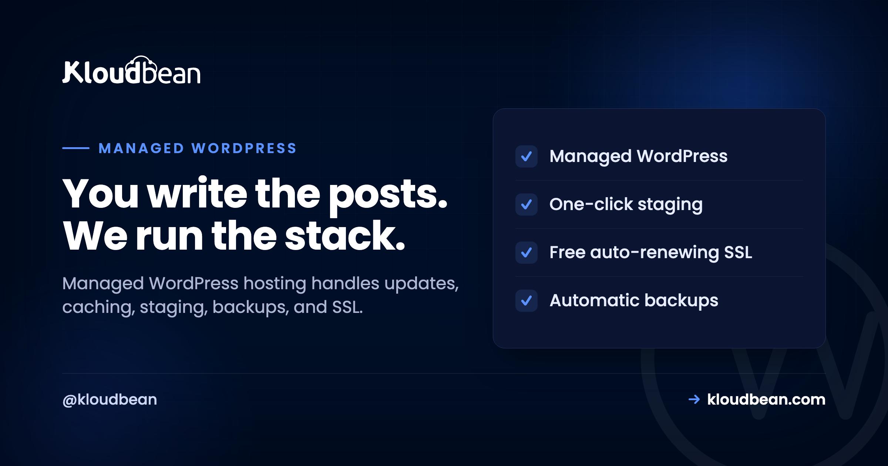
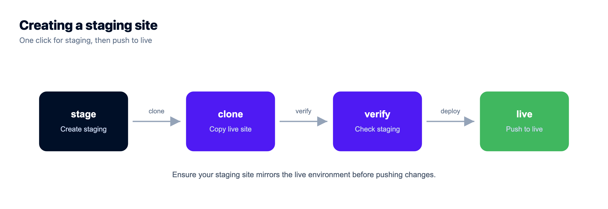
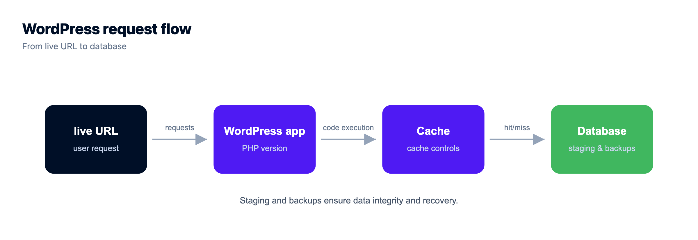
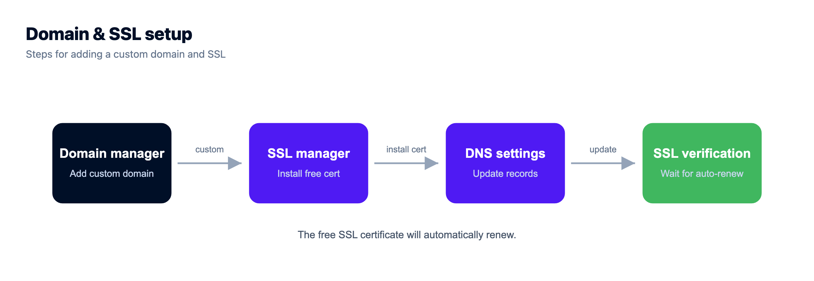

# Managed WordPress Hosting: What It Handles, and When You Need It

WordPress runs a huge slice of the web, which means a huge number of people are quietly doing sysadmin work they never signed up for: chasing plugin updates, wrestling caching, praying the last backup actually works.

Managed WordPress hosting is the deal where someone else takes that work. You keep the part you care about (the content, the design, the store) and the host runs the server underneath it: caching, updates, staging, backups, SSL, and security. This guide is a straight look at what managed WordPress hosting actually covers, how it's different from the cheap shared plan you might be on now, when it's genuinely worth paying for, and when it honestly isn't. Then how Kloudbean does it.

> **The short answer:** Managed WordPress hosting is hosting tuned for WordPress where the provider runs the server layer and the operational chores for you: server-level caching, update orchestration, one-click staging, automatic backups, free SSL, and security hardening. You keep control of your content, plugins, and design. It trades a little more cost for a lot less maintenance and risk.

## What managed WordPress hosting actually is

A plain definition first, because the phrase gets stretched to mean almost anything. Managed WordPress hosting is a hosting service built specifically around WordPress, where the provider tunes the stack for it and takes on the recurring operational jobs a WordPress site needs to stay fast, current, and safe. That's the whole idea: the server is configured for WordPress out of the box, and the boring-but-critical maintenance is somebody's job besides yours.

Contrast that with generic hosting, where you get a blank Linux box or an oversold shared account and WordPress is just one of a thousand things it could run. Generic hosting doesn't know or care that you're running WordPress. Managed WordPress hosting is opinionated on purpose: it assumes WordPress, so it can cache like WordPress wants, secure the paths attackers actually hit, and give you WordPress-shaped tools like staging and one-click restores. You're paying for that opinion, and for the hours it saves you.

## The jobs it takes off your plate

Here's the concrete work that "managed" refers to. None of it is glamorous. All of it is the difference between a site that quietly runs and a site that quietly rots.

**Update orchestration.** WordPress core, plugins, and themes ship updates constantly, and many are security fixes. A managed host helps you apply them safely, ideally by testing on a staging copy before they touch the live site, so you're current without playing roulette every Tuesday. **Caching and speed.** This is the big one, and it lives at the server level where a plugin can't reach: page caching, PHP workers sized for real traffic, and an object cache (usually Redis) for the database queries WordPress repeats endlessly. **Staging.** A one-click copy of your live site to test changes on, so "I'll just update this plugin on production" stops being a sentence you regret. **Backups.** Automatic, off the box, and actually restorable, because the day you need one you'll need it badly. **SSL.** Free certificates that renew themselves, so HTTPS is never something you forgot. **Security hardening.** A firewall, brute-force banning, and sensible defaults protecting the login and the file system.

The clean way to think about all of it is a stack, split down the middle. Some layers are yours. The rest belong to the host.

<!-- Inline SVG in the HTML version: a WordPress hosting stack drawn as a tower. Top three layers (your content and posts; plugins and theme; users and roles) are green and bracketed "YOU MANAGE". A dashed divider separates them from the bottom five layers (WordPress core + update orchestration; PHP runtime + workers; web server + page & object cache; OS, firewall, free SSL; server, network & automatic backups) bracketed "MANAGED HOST HANDLES". -->

Read the tower and the value is obvious: the top three layers are the fun, creative part you actually wanted to do. The five below are the reason people burn out on self-hosting WordPress. Managed hosting hands those five to someone whose job is to get them right.

## Managed vs generic WordPress hosting, side by side

The difference is easiest to see as a table. "Generic" here means cheap shared hosting or a raw VPS you set up yourself: hosting that doesn't know it's running WordPress.

| | Generic shared / unmanaged | Managed WordPress |
|---|---|---|
| **Caching** | A plugin you configure and hope | Server-level page + object cache, tuned |
| **Updates** | All on you, live, fingers crossed | Helped along, tested on staging first |
| **Staging** | Set it up yourself, if ever | One click to a safe copy |
| **Backups** | Often manual or an add-on | Automatic, off-box, restorable |
| **SSL** | Sometimes, sometimes extra | Free, auto-renewing, on by default |
| **Security** | Your problem entirely | Firewall + brute-force banning baseline |
| **When it breaks** | "Contact your developer" | Support that owns the server layer |
| **Your time** | Spent on maintenance | Spent on the site |

Notice the pattern. Generic hosting is cheaper on the invoice and more expensive in your evenings. Managed hosting moves the recurring work off you and onto a system built to do it. Whether that trade is worth it depends entirely on the next question.

## When you actually need it (and when you don't)

I'll be honest, because over-selling this helps nobody. Not every WordPress site needs managed hosting. If you're running a personal blog that gets a few dozen visits a week, where a day of downtime costs you nothing and you enjoy tinkering, cheap shared hosting is genuinely fine. Paying a premium to manage a site nobody's relying on is spending money to solve a problem you don't have.

You need managed WordPress hosting when the site starts to matter. A few clear signals:

- **The site makes or supports money.** A store, a lead-gen site, a membership. Downtime and slow pages now cost real revenue, and a lost database is a genuine emergency.
- **Traffic is real or spiky.** Shared hosting chokes under load, and a launch or a viral post is exactly when you don't want it falling over.
- **You're running WooCommerce.** A store is dynamic, database-heavy, and can't be fully page-cached, so it leans hard on the server tuning managed hosting provides.
- **You maintain sites for clients.** Manual updates and backups across a dozen sites is a part-time job you're not billing for, and one missed update is a client's bad day.
- **You'd rather build than maintain.** If server chores are pulling you away from the work you're actually good at, that's the whole pitch.

My rule of thumb: the moment a WordPress site has an audience or a revenue number attached, the maintenance stops being a hobby and starts being a liability. That's the line where managed pays for itself.

## Speed: what the server does that a plugin can't

WordPress speed is where managed hosting earns its keep, and it's the most misunderstood part, so let's be precise. A caching plugin can do some real work inside WordPress. It cannot do the parts that live below WordPress, and those parts are where most of the speed is.

Server-level page caching serves a ready-made copy of a page without booting PHP at all, which is far faster than any in-app plugin cache. PHP workers decide how many requests your site can handle at once; too few and visitors queue during a rush. An object cache like Redis stores the results of the database queries WordPress runs over and over, so the database isn't asked the same thing a thousand times a minute. And an edge network or CDN puts your static assets physically closer to visitors. Those four levers are server and infrastructure decisions. A plugin sits too high in the stack to pull them.

> **The anti-pattern I see constantly:** five caching and "optimization" plugins stacked on a slow $3 shared plan, fighting each other, while the actual bottleneck is a starved server with two PHP workers and no object cache. More plugins won't fix underpowered hosting. Faster hosting plus one good caching layer will. If you want the full playbook, we wrote [speed up WordPress](https://www.kloudbean.com/blog/speed-up-wordpress/) and [how to clear WordPress cache](https://www.kloudbean.com/blog/how-to-clear-wordpress-cache/) for exactly this.

## Staging, backups, and the safety net

The two features that save the most weekends are staging and backups, and they work as a pair. Staging is a copy of your live site you can break freely. The rule that prevents most WordPress disasters is boring and absolute: if a change is going to touch the live site (a plugin update, a theme edit, a PHP version bump), it goes through staging first. Test there, confirm nothing broke, then push. Kloudbean gives you one-click staging for WordPress (and Laravel), so there's no excuse to test on production.

Backups are the net for when something slips through anyway. The three things that make a backup real: it runs automatically (a backup you have to remember isn't one), it lives off the box it's protecting (a backup on the same disk dies with the disk), and you can actually restore it yourself. That last one is the step people skip. Test a restore once, before you need it, so you know the path works. When a bad update or a bad query hits, restoring a clean copy is almost always faster and safer than hand-cleaning a broken site.

## Security, kept brief

WordPress security is a big topic on its own, and it's mostly the boring basics done consistently. On the managed side, a good host ships the server hardened: on Kloudbean every server gets a Shorewall firewall and Fail2ban brute-force banning configured automatically, free SSL, site isolation, and session cookies set HttpOnly to blunt common session-theft tricks. You can fence the login with IP Access Control or a Basic Auth gate, and scope who touches what with subusers and User Access Control. Teams that want an extra layer can add BitNinja on the higher tiers; it's a real option, not a headline.

Your half stays yours: keep plugins and core current, use strong logins with two-factor, assign least-privilege roles, and delete plugins you don't use. Security is shared, and a site is only as strong as the weaker half. The full field guide, including how sites actually get hacked, is in [secure WordPress hosting](https://www.kloudbean.com/blog/secure-wordpress-hosting/).

## How Kloudbean does managed WordPress

WordPress has been a first-class stack on Kloudbean since launch, alongside WooCommerce, so this isn't a bolt-on. Here's the path, with the actual screens.

You start by launching a server on the cloud you want (seven providers: AWS, Amazon Lightsail, Google Cloud, DigitalOcean, Vultr, Akamai Linode, and UpCloud) in a region near your audience, then add WordPress as an application. The stack comes tuned, hardened, and SSL-ready, not a bare box you configure.

WordPress stores its data in MySQL or MariaDB, and on Kloudbean those are managed engines: provisioned, secured, kept off the public internet, and backed up. Add a managed Redis alongside it and you've got the object cache that keeps a busy site quick. That's the caching layer a plugin can't reach, running as real infrastructure.

From there you get the managed WordPress toolkit: one-click staging, automatic backups with self-serve restore, free auto-renewing SSL, cron jobs from the dashboard without SSH, and WP-CLI when you want the command line (see the [WordPress CLI guide](https://www.kloudbean.com/blog/wordpress-cli-guide/)). Cloudflare, including its Enterprise edge caching, is available as an add-on for extra speed at the edge (included for Enterprise accounts). And it's all in one dashboard next to any other apps, databases, and storage you run, with one login and one bill.

If a WordPress database ever refuses to connect, the fix is usually a config detail, and we walked the whole thing in [error establishing a database connection](https://www.kloudbean.com/blog/fix-error-establishing-database-connection-wordpress/).

## Scaling up, and running many sites

Managed WordPress isn't only for one small site. As traffic grows you resize the server or put the built-in load balancer in front, and the same dashboard handles it. Agencies run a stack of client sites from one login with scoped access per person. Bigger builds go headless, or span a network of sites. Wherever you're headed, there's a path:

- Growing traffic: [scalable WordPress hosting](https://www.kloudbean.com/blog/scalable-wordpress-hosting/) and [enterprise WordPress hosting](https://www.kloudbean.com/blog/enterprise-wordpress-hosting/).
- Running client sites: [agency WordPress hosting](https://www.kloudbean.com/blog/agency-wordpress-hosting/), and the wider [hosting for agencies playbook](https://www.kloudbean.com/blog/hosting-for-agencies-playbook/).
- A network of sites: [WordPress multisite hosting](https://www.kloudbean.com/blog/wordpress-multisite-hosting/).
- WordPress as a headless backend: [headless WordPress hosting](https://www.kloudbean.com/blog/headless-wordpress-hosting/).

Weighing us against the usual managed-WP names? The honest head-to-heads are [Kloudbean vs Kinsta](https://www.kloudbean.com/blog/kloudbean-vs-kinsta/) and [Kloudbean vs WP Engine](https://www.kloudbean.com/blog/kloudbean-vs-wp-engine/).

## What is still your problem

Two things, plainly. Kloudbean runs WordPress on a **Linux and PHP** stack, the environment WordPress was built for, so this is a strong fit, not a stretch. And "managed" is a split, not a takeover: the platform runs the server, the stack, caching, SSL, and backups, while you still own your content, your plugin choices, your theme, and your users. On compliance, treat it as shared responsibility. The platform provides the infrastructure controls and keeps maturing them; the application-level compliance of your specific site stays yours. That division is the honest version of "managed," and it's a good deal precisely because it's clear about who does what.

<!-- cta:start -->
**WordPress, without the server admin.**

Run WordPress and WooCommerce on a managed server with a staging site, automatic backups, free auto-renewing SSL, and a managed MySQL or MariaDB beside it. Pick the cloud and the region yourself.

- Managed WordPress stack
- One-click staging
- Managed MySQL and MariaDB
- Automatic backups
- Free SSL
- Built-in load balancer

[Start free](https://console.kloudbean.com/register) · [See plans](https://www.kloudbean.com/pricing/)
<!-- cta:end -->

## FAQ

**What is managed WordPress hosting?**
It's hosting built specifically for WordPress, where the provider tunes the stack for it and handles the recurring operational work: server-level caching, update orchestration, staging, automatic backups, free SSL, and security hardening. You keep control of your content, plugins, and design. The point is that the maintenance that keeps a WordPress site fast and safe becomes someone else's job.

**How is managed WordPress hosting different from regular hosting?**
Regular (generic or shared) hosting doesn't know it's running WordPress, so caching, updates, staging, and backups are all on you. Managed WordPress hosting is opinionated for WordPress: it caches the way WordPress needs, ships with a security baseline, and gives you WordPress-shaped tools like one-click staging and restores. You pay a bit more and get back your evenings.

**Do I really need managed WordPress hosting?**
Not always. A tiny personal blog with little traffic and no revenue is fine on cheap shared hosting. You need managed hosting once the site matters: when it makes money, gets real or spiky traffic, runs WooCommerce, or you maintain sites for clients. The rule of thumb: the moment a site has an audience or a revenue number, its maintenance stops being a hobby and becomes a liability.

**Does managed WordPress hosting make my site faster?**
Yes, mostly through things a plugin can't touch: server-level page caching, enough PHP workers to handle concurrent visitors, an object cache like Redis for repeated database queries, and an edge network for static assets. Those are infrastructure decisions below WordPress. A caching plugin helps at the app layer, but it can't fix an underpowered server, which is where most slow WordPress sites actually lose their speed.

**Can I still install my own plugins and themes?**
Yes. Managed WordPress hosting manages the server layer, not your creative choices. You install whatever plugins and themes you want and control your content and design exactly as you would anywhere. The host handles the stack, caching, SSL, security baseline, and backups underneath. The sensible habit is to test new plugins and updates on a staging copy before pushing them live.

**Does it include backups and staging?**
On a good managed host, yes. Kloudbean includes automatic backups you can restore yourself, and one-click staging for WordPress so you can test changes on a copy before they touch the live site. Together they're the safety net: staging catches most problems before they ship, and a tested backup recovers you if something slips through anyway.

**Is managed WordPress hosting good for WooCommerce?**
Especially good, actually. A store is dynamic and database-heavy, so pages can't be fully cached the way a blog can, which means it leans on server tuning: PHP workers, an object cache, and a managed database that's backed up. WooCommerce is a first-class stack on Kloudbean alongside WordPress, and the managed database plus Redis object cache are exactly what a busy store needs.

**How much does managed WordPress hosting cost?**
It ranges widely by provider and server size. On Kloudbean, standard plans start from $8/mo, with Enterprise priced custom. The figure to plan around isn't the base price but the cost of a busy month with the features you actually use. Always confirm the current numbers on the pricing page before you commit.

**Can I migrate my existing WordPress site without downtime?**
Yes. The safe pattern is to set up the new environment, copy the site and database over, test it on the new host, then switch DNS once it's verified. Kloudbean offers free migration assistance to do this with minimal downtime. Testing on the destination before flipping the domain is what keeps visitors from ever hitting a half-moved site.

**Who handles security, me or the host?**
Both, and it's worth being clear on the split. The host owns the server layer: firewall, brute-force banning, patching, SSL, and isolation. You own the app layer: keeping core and plugins updated, strong logins with two-factor, least-privilege roles, and removing unused code. A site is only as secure as the weaker of the two halves, so neither side can coast.

---

*Kloudbean · You write the posts. We run the stack.*
