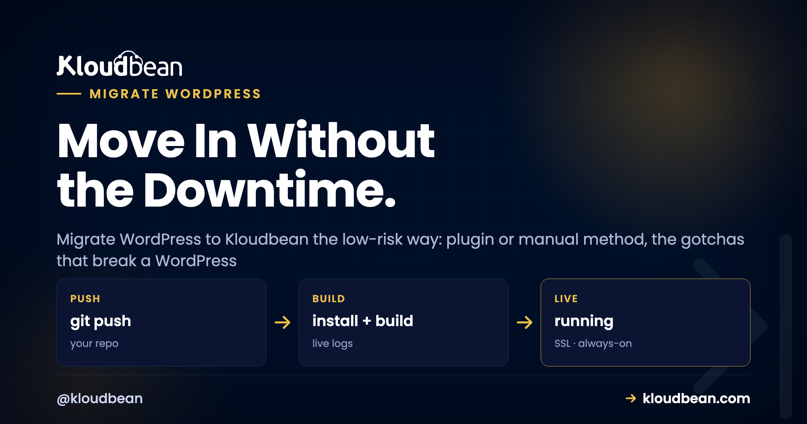
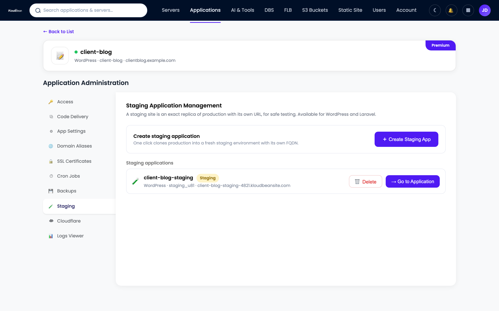

# How to Migrate WordPress to Kloudbean Without Downtime

By Kloudbean · Move In Without the Downtime.



You've outgrown your shared host, or the renewal price just doubled, and now you have to move a live WordPress site without breaking it. That's the scary part. Not the copying, the fear of visitors hitting a half-moved site or a plain white screen.

This guide walks the whole job. Two honest ways to migrate a WordPress site, the handful of mistakes that cause the classic broken migration, and how to migrate WordPress to Kloudbean with a cutover that keeps the old site live until the new one is proven. If you've never moved WordPress to a new host before, read the gotchas section twice. That's where the evenings get lost.

> **The short version**
>
> There are two ways to move WordPress: a migration plugin (easiest for small and medium sites) or the manual files-plus-database method (more control, better for large or broken sites). Either way the safe pattern is identical. Build and test the new site on a temporary URL first, lower your DNS TTL a day ahead, then switch DNS while the old host stays live as an instant rollback. Kloudbean adds free migration assistance, a free trial, one-click staging, and automatic backups so nothing rides on a single risky flip.

<!-- Bespoke inline SVG in the HTML: migration + cutover pipeline in two labeled bands. Step 1 (built while the old site stays live): Old host -> Copy files + export DB -> Import on Kloudbean -> Test on temp URL. Step 2 (the cutover): Lower DNS TTL -> Switch DNS -> Live on Kloudbean. A dashed green loop shows the old host staying live as an instant rollback. Brand colors navy #000f27, purple #4F1AF3, green #40b75f. -->

_Copy the files and database, import on Kloudbean, and test on a temporary URL. Only then lower your DNS TTL and switch the record. The old host stays live as an instant rollback._

## Two ways to migrate a WordPress site

Every WordPress site is the same two things under the hood. A pile of **files** (WordPress core, your theme, your plugins, and everything you've uploaded) and a **database** (your posts, pages, settings, users, comments). Move both to the new server, tell WordPress where they now live, and you've migrated. That's the whole job.

You've got two routes to do it. A migration plugin that packages everything for you, or the manual method where you copy the files and the database by hand. Neither is "better" in the abstract. They fit different sites. Here's how I'd choose.

| | Migration plugin | Manual files + database |
| --- | --- | --- |
| **Best for** | Small and medium sites | Large sites, big media, or a broken site |
| **Effort** | Point and click, no terminal | SFTP plus a database export |
| **The usual wall** | Upload size limits, PHP timeouts | You handle wp-config and the URL yourself |
| **Serialized URL handling** | Done for you by the plugin | You run a proper search-replace |
| **Control** | Less, but simpler | Total, but more to get right |

> **Coming from shared hosting or cPanel?** Your files are usually in `public_html` and your database is in phpMyAdmin. Both routes below work from there. The plugin route never makes you open phpMyAdmin at all, which is why beginners tend to start there.

## Path 1: the migration plugin route

This is the easiest safe path for most sites, and honestly it's what I'd suggest first if your site is a few gigabytes or less. A migration plugin exports your entire site (files and database together) into one package, then imports that package on the new host in a few clicks. No terminal, no phpMyAdmin, no editing config files.

The common tools are **All-in-One WP Migration**, **Duplicator**, and **Migrate Guru**. They differ in the details but the shape is the same:

1. Install the plugin on your **old** site and export. You get a single downloadable file (or a push to the new host).
2. Install a fresh WordPress on Kloudbean, add the same plugin, and import the package.
3. The plugin unpacks the files, loads the database, and rewrites the site URL for you, including the tricky serialized data.

That last point is the quiet reason plugins are popular. They handle the URL rewrite correctly, which is the single most common way a manual migration goes wrong (more on that below).

So what's the catch? Size. The free tier of most migration plugins caps how large a package it will import, and a big media library blows past that fast. You either buy the paid extension, bump PHP memory and upload limits, or switch to the manual route. Very large sites also hit PHP execution timeouts mid-import, leaving you with a half-loaded database and a bad afternoon. My rule: plugins for small and medium sites, manual for anything multi-gigabyte or already misbehaving.

<!-- ADD IMAGE: the migration plugin export screen (e.g. All-in-One WP Migration or Duplicator) with the Export button. -->

## Path 2: the manual files-and-database method

The manual method sounds intimidating and isn't. You're moving two things and repointing one config file. It's more reliable than a plugin on large sites because nothing has to fit inside a single upload, and it gives you total control when a site is broken and won't run a plugin at all.

### Step 1: copy the files

Grab your WordPress files over SFTP, or with `rsync` if you have SSH on both ends. The part that truly matters is `wp-content`: your themes, plugins, and the `uploads` folder where every image and PDF lives. WordPress core you can reinstall fresh, but `wp-content` is irreplaceable.

```
# copy wp-content (themes, plugins, uploads) to the new server
rsync -avz wp-content/ user@new-host:/path/to/new/wp-content/
```

If you're on shared hosting with no SSH, download `wp-content` over SFTP and upload it to the new server the same way. Slower, same result.

### Step 2: export the database

Export with `mysqldump` if you have shell access, or use phpMyAdmin's Export tab if you don't. Two flags earn their keep: `--single-transaction` takes a consistent snapshot without locking a busy site, and `--default-character-set=utf8mb4` keeps emoji and accented characters intact.

```
# on the old server, export the WordPress database
mysqldump --single-transaction --default-character-set=utf8mb4 \
  -u db_user -p old_wordpress_db > wordpress.sql
```

The full breakdown of dump flags and the charset traps lives in the [pg_dump and mysqldump field guide](https://www.kloudbean.com/blog/database-migration-pg_dump-mysqldump/). WordPress runs on MySQL or MariaDB, so that guide's MySQL half applies directly here.

### Step 3: import on the new server

Create an empty database on Kloudbean, then load the SQL file into it:

```
# on the new server, import into an empty database
mysql -u db_user -p new_wordpress_db < wordpress.sql
```

### Step 4: point wp-config.php at the new database

This is the file that connects WordPress to its database, and its credentials change on the new server. Update the four constants to match the database you just imported into. Get one wrong and you'll see the infamous "Error establishing a database connection".

```
// wp-config.php: point WordPress at the new database
define( 'DB_NAME', 'new_wordpress_db' );
define( 'DB_USER', 'db_user' );
define( 'DB_PASSWORD', 'your-strong-password' );
define( 'DB_HOST', 'localhost' ); // or your managed database host
```

### Step 5: update the site URL the safe way

If your domain isn't changing, you may skip this. If you're testing on a temporary URL or moving domains, the URL stored in the database has to change, and you must not do it with a raw SQL find-and-replace. Use `wp-cli` instead:

```
# rewrite the URL everywhere, including serialized data
wp search-replace 'https://old-domain.com' 'https://new-domain.com' --all-tables --dry-run
# happy with the count? run it for real by dropping --dry-run
wp search-replace 'https://old-domain.com' 'https://new-domain.com' --all-tables
```

Why `wp search-replace` and not a SQL `UPDATE`? That's the next section, and it's the most important paragraph in this guide.

<!-- ADD IMAGE: editing wp-config.php DB constants in an editor or the file manager. -->

## Why WordPress migrations break (and how to dodge each one)

A migration rarely fails at the copy. It fails afterward, when the site loads wrong and you can't see why. Almost every broken WordPress migration traces back to one of the items below. Read them before you start, not at midnight after.

### The serialized-data trap (the number one cause)

WordPress stores some settings as PHP **serialized** data: arrays and objects flattened into text, where each string is prefixed with its exact byte length. A value might look like `s:22:"https://old-domain.com";`. See that `22`? It's the character count.

Now run a plain SQL find-and-replace to swap the domain. The text changes but the number doesn't. WordPress reads `s:22`, counts a different length, and the serialized blob is corrupt. Widgets vanish, theme options reset, plugin settings break. And the ugly part is the rest of the site looks fine, so you don't notice until a client asks where the slider went.

The fix is simple: never touch the URL with raw SQL. Use `wp search-replace` or a migration plugin. Both unserialize the data, replace the string, recompute the length, and re-serialize it correctly. This one mistake causes more broken migrations than everything else combined.

### The rest of the usual suspects

Here's the fast reference. Match the symptom, apply the fix.

| Symptom | What actually caused it | The fix |
| --- | --- | --- |
| **Broken layout or a redirect loop** | `siteurl`/`home` still point at the old domain | Run `wp search-replace`, never a raw SQL update |
| **Error establishing a database connection** | wp-config.php has old DB name, user, password, or host | Fix the four `DB_` constants |
| **Images missing or 404** | The `uploads` folder didn't come across, or URLs weren't rewritten | Re-copy `wp-content/uploads`, then search-replace |
| **White screen of death** | PHP version mismatch, or a plugin incompatible with the new PHP | Match the PHP version, or disable the plugin |
| **Mixed-content warning, no padlock** | Site moved to HTTPS but assets still request `http://` | Install SSL, then search-replace http to https |
| **Garbled accents or emoji** | Charset drift, usually latin1 to utf8mb4 | Export and import as `utf8mb4` |
| **Permission denied writing files** | Wrong file ownership after the copy | Reset ownership and set folders 755, files 644 |

Two of those deserve a sentence more. **PHP version** is a silent killer: a site built on PHP 7.4 can throw fatal errors on PHP 8.2 because a plugin used syntax that got removed. Check your old PHP version and match it, then upgrade deliberately later. And **stale caches** catch people after everything else works: an old object cache or leftover transients can serve you the pre-migration site, so flush the cache and clear transients before you panic.

## The zero-downtime cutover: DNS, TTL, and not dropping a visitor

Copying the site is the easy half. Switching the world onto the new server without anyone hitting a broken page is where the care goes. The trick is that you test _before_ you flip anything public.

### Test on a temporary URL first

Before you touch DNS, prove the migrated site works on the new server. Two ways to do it. Kloudbean gives every WordPress app a temporary URL and one-click staging, so you can open the migrated site there and click around. Or use the classic hosts-file trick: point your own machine at the new server's IP for that domain, so only you see the new site while the rest of the world still sees the old one.

```
# test the new server before touching DNS: edit your local hosts file
# /etc/hosts on macOS or Linux, or the Windows equivalent
203.0.113.42   your-domain.com www.your-domain.com
```

Load the site, log into `wp-admin`, click through key pages, submit a test form. You're confirming the migration landed before a single real visitor is involved. Never let the public cutover be the first time you've seen the site run on the new host.

### Understand TTL before you flip DNS

Your domain's **A record** points at your host's IP address. Migrating means changing that record to the new server's IP. The wrinkle is **TTL**, the "time to live", which tells resolvers around the world how long to cache the old answer. If your TTL is 24 hours, some visitors keep hitting the old server for up to a day after you change the record.

So you plan ahead. A day or two before the move, lower the TTL to something small like 300 seconds. Then when you flip the record, the internet picks up the change in minutes instead of hours. This is the closest thing to a zero-downtime WordPress migration, and it costs you nothing but a little foresight.

### Flip it, and keep the old site as a net

With a low TTL set and the new site verified, the cutover is calm:

1. Change the **A record** to the new server's IP at your DNS provider.
2. Watch propagation. With a 300-second TTL, most visitors move over within minutes.
3. **Leave the old host running** for a day or two. During propagation both servers may get traffic, and anyone still cached to the old IP should see a working page, not an error.
4. Once traffic has fully shifted and everything looks right, decommission the old host.

> **The one honest caveat.** While both servers are live, a visitor could submit a form or place an order on the old site and it won't exist on the new one. For a blog or brochure site that's a non-issue. For a busy store, either pick a quiet hour, or put the old site into maintenance or read-only mode for the short propagation window. Don't over-engineer a replication pipeline for a site that gets a handful of orders a day.

## The post-migration checklist

A site that loads on the temporary URL isn't a finished migration. Run this list once DNS has moved, and again the next morning:

- **Pages load** across templates: home, a post, an archive, a landing page.
- **Images resolve** and no broken thumbnails. That catches a missed `uploads` folder.
- **Permalinks work.** If inner pages 404, flush rewrite rules: save Settings, Permalinks, or run `wp rewrite flush`.
- **Forms and checkout** submit. Send a test email, place a test order.
- **Admin login** works and the dashboard is intact.
- **SSL padlock** is green with **no mixed-content** warnings in the browser console.
- **Backups are running** on the new host. You want a restore point before you decommission the old one.

```
# if inner pages 404 after the move, flush rewrite rules
wp rewrite flush
```

<!-- ADD IMAGE: the migrated site loading correctly on the temporary URL or staging domain. -->

## How to migrate WordPress to Kloudbean, specifically

Everything above is host-agnostic. Here's how it maps to Kloudbean, and where the platform quietly removes the risky parts. WordPress has been a first-class stack here since launch, so it's a home the CMS was built for, not a bolt-on.

### Start free, launch the server, add WordPress

A free trial lets you build and verify the whole new site before you commit or cut over, which is exactly the safety you want during a migration. You launch a server on the cloud closest to your audience (seven providers: AWS, Amazon Lightsail, Google Cloud, DigitalOcean, Vultr, Akamai Linode, and UpCloud) and add WordPress as a one-click application. The stack comes tuned and hardened, not a bare box you configure.


_Add WordPress as a one-click app, then drop your migrated files and database into it._

Your database lands on a managed engine. WordPress uses MySQL or MariaDB, and on Kloudbean both are managed: provisioned, kept off the public internet, and backed up. Import your `wordpress.sql` into it and update wp-config.php to match. The deep dive is [managed MySQL hosting](https://www.kloudbean.com/blog/managed-mysql-hosting/).

### Test on staging, not on your visitors

This is where a migration stops being scary. One-click staging gives you a copy of the site to load, click through, and break freely, on the new server, before anything public changes. Verify the migrated site here, fix whatever the checklist flags, and only then think about DNS.



_One-click staging: confirm the migrated site works before a single real visitor sees it._

### Free SSL fixes the HTTPS step, backups are your net

Moving to HTTPS is where mixed-content warnings appear. Kloudbean issues free auto-renewing SSL, so the padlock is handled and you just search-replace any lingering `http://` asset URLs to `https://`. If a certificate ever misbehaves, the fixes are in [fix SSL certificate errors](https://www.kloudbean.com/blog/fix-ssl-certificate-errors/). And automatic backups start immediately, so the moment your data lands you already have a restore point. That's the safety net most people bolt on far too late; the full picture is in the [server backups guide](https://www.kloudbean.com/blog/server-backups-guide/).


_Automatic backups mean the freshly migrated site has a rollback point from minute one._

<!-- ADD IMAGE: the DNS provider A record edit with a lowered TTL, ready for cutover. -->

### Or let the team run it with you

Rather not do the cutover alone? Kloudbean offers **free migration assistance**. Send your source details and the team helps move the site, which genuinely matters for a large or production site where the propagation window has to be tight. To be clear about what that is: it's real people helping, plus the platform primitives (staging, managed databases, free SSL, automatic backups) that make the move low-risk. It isn't a blind one-click "import my whole site" button, and any host that promises that is glossing over the serialized-data and DNS realities you just read about.

Once you've landed, the natural next step is speed. A migrated site inherits its old plugins and habits, and this is a good moment to tune them: [speed up WordPress](https://www.kloudbean.com/blog/speed-up-wordpress/) walks the server-level wins. Weighing hosts before you move? The honest head-to-head is [Kloudbean vs WP Engine](https://www.kloudbean.com/blog/kloudbean-vs-wp-engine/), and the wider view of what managed actually covers is in [managed WordPress hosting](https://www.kloudbean.com/blog/managed-wordpress-hosting/).

---

**Move WordPress in without the downtime.**

Build and test the migrated site on a free trial, cut over on your schedule, and keep the old host as a rollback. Start at [kloudbean.com](https://www.kloudbean.com/); check current plans on [pricing](https://www.kloudbean.com/pricing/).

Free migration assistance · Free trial · One-click WordPress · Managed MySQL & MariaDB · One-click staging · Automatic backups · Free auto-renewing SSL

## FAQ

### How do I migrate a WordPress site to a new host?

Copy two things and repoint one. Move the files (`wp-content`: themes, plugins, uploads) and the database (a mysqldump export), then edit wp-config.php on the new host and update the site URL with a proper search-replace tool. Test on a temporary URL first, then switch DNS. A migration plugin bundles those steps into one export-and-import if you'd rather not touch the command line.

### Should I migrate WordPress with a plugin or manually?

For small and medium sites, a plugin like All-in-One WP Migration or Duplicator is the fastest safe path: it exports one package and imports it on the new host. For very large sites, huge media libraries, or a site that's already broken, the manual files-plus-database method is more reliable because it doesn't hit plugin upload limits or PHP timeouts. Both are legitimate; pick by size and comfort.

### How do I migrate WordPress without downtime?

Build and verify the new site before you touch DNS. Import everything onto the new host, test it on a temporary URL or staging, and only then switch DNS. Lower your DNS TTL a day ahead so the change propagates in minutes, and leave the old site live during propagation so anyone still hitting the old IP sees a working page. Nobody lands on a half-moved site.

### Why did my migration break the site?

Almost always one of a few things: the site URL was changed with a raw SQL update that corrupted serialized data, wp-config.php still has the old database credentials, the uploads folder didn't come across, or the new server runs a different PHP version. A broken layout usually means the URL wasn't rewritten properly. A white screen usually means PHP or a plugin. Work down the checklist and each has a clear fix.

### Does Kloudbean migrate my WordPress site for me?

Kloudbean offers free migration assistance: send your source details and the team helps move the site with you, which is genuinely useful for a large or production site where the cutover window matters. On top of that you get the primitives that make a move low-risk: a free trial to build and test first, one-click staging, managed MySQL or MariaDB, free SSL, and automatic backups. It's help plus a safety net, not a blind one-click import.

### How do I move the WordPress database?

Export it with mysqldump (add --single-transaction and --default-character-set=utf8mb4), or use phpMyAdmin's export if you prefer a GUI. Create an empty database on the new host, import the SQL file, then point wp-config.php at it. If your old database was latin1, export and import as utf8mb4 or accented characters and emoji can arrive garbled.

### Do I have to change wp-config.php after migrating?

Yes, almost always. wp-config.php holds the database name, user, password, and host, and those change on the new server. Update the four DB_ constants to match the database you just imported into. If you skip this you'll see "Error establishing a database connection", because WordPress is still trying to reach the old database.

### How does DNS work during a WordPress migration?

Your domain's A record points at your host's IP address, and migrating means changing that record to the new server's IP. The catch is TTL, the time resolvers cache the old record. Lower the TTL to around 300 seconds a day before you cut over, so when you flip the record the internet picks it up in minutes instead of hours. During propagation both hosts may get traffic, which is why you keep the old one live.

### Why can't I just find-and-replace the URL in the database?

Because WordPress stores some settings as PHP serialized arrays, and those encode the length of each string. A raw SQL find-and-replace changes the text but not the length prefix, which corrupts the data and can break widgets, theme options, and plugin settings. Use wp-cli's search-replace or a migration plugin instead; they unserialize the data, replace safely, and re-serialize it. This mistake causes more broken migrations than anything else.

### How long does a WordPress migration take?

The copy itself is usually minutes to an hour, depending on the size of your media library and database. DNS propagation is the variable part: with a low TTL set ahead of time, most visitors move over within minutes, though some resolvers can lag a few hours. Keep the old host live for a day or two afterward as a rollback, then decommission it once traffic has fully shifted.

---

By Kloudbean · Move In Without the Downtime.
