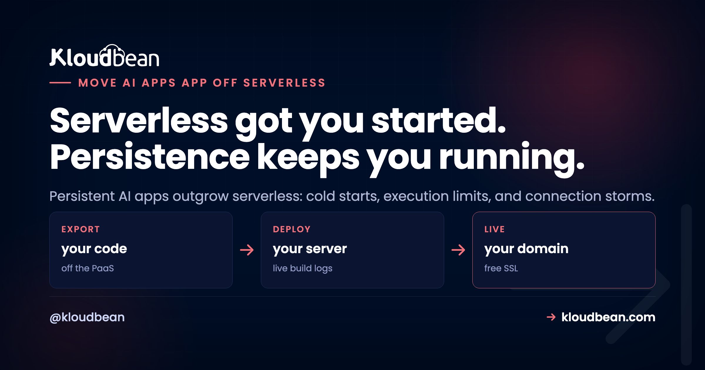

# How to Move an AI App Off Serverless When It Needs Persistent Processes

You put your AI app on serverless because it was the easy button. One push, a URL, nothing to babysit. Then it grew a chatbot, a document pipeline, a couple of background jobs, and the cracks showed up. The first request after a quiet spell crawls. Long generations die halfway. The database starts complaining about too many connections. And the bill climbs even on calm days. This is the guide to move your AI app off serverless onto an always-on process: the signals that say it's time, the migration itself, and the honest case for staying put.

If you just want to match a symptom to a fix, the broader [why AI apps fail in production](https://www.kloudbean.com/blog/why-ai-apps-fail-in-production/) field guide does that, and cold starts are one row in it. This page lives one level up from a single fix. It's about the decision to leave serverless and the steps to actually move, which is a different question from the whole-stack map in [the last mile of vibe coding](https://www.kloudbean.com/blog/last-mile-of-vibe-coding/).

> **The short version:** Serverless is a great default for spiky, event-driven work. Persistent AI apps, the ones with steady traffic, long generations, live streaming, and background jobs, fight its shape and pay for it in cold starts, execution limits, and connection storms. When those signals show up, move to an always-on server, put the database behind a connection pool, push long work to a queue, set your env vars on the host, and point your domain. Stay on serverless only if your traffic is genuinely occasional.

## Serverless is a great default. A persistent AI app is where it stops fitting

Serverless is built on a clean idea: your code is a short function that wakes on a request, runs fast, and disappears. No servers to run, it scales to zero when idle, and you pay per invocation. For a webhook, a scheduled task, or an API that gets called now and then, that's close to perfect. Credit where it's due.

An AI app that has found even a little traction is the opposite animal. It wants to stay warm so the model SDK and the database connections are ready. It runs long generations that don't fit in a few seconds. It streams tokens back over a live connection. It has background work that keeps going after the user closes the tab. Every one of those wants a process that persists, and serverless is designed to not persist. The fit was great at the prototype stage. The friction grows with the app.

So this isn't serverless being bad. It's a shape mismatch. You're asking a stateless, short-lived box to hold state and stay alive, and the workarounds pile up until the platform is fighting you.

## The signals it's time to move off serverless

You rarely get one clean alarm. You get a handful of these at once, and they compound. Here's my flag in the ground: once an AI app has steady users and real background work, serverless stops saving you money or effort and quietly starts charging you for both.

- **Cold starts on every idle gap.** Traffic goes quiet, the platform scales you to zero, and the next visitor pays to boot the runtime, load a chunky AI SDK, and reopen database connections before anything happens. For a chat or agent backend that gets sporadic use, that cold-start tax lands on real users, often on a first impression. Some platforms let you pay to keep instances warm, and Google Cloud Run's minimum-instances setting is the obvious example, but once you're paying for a process that never sleeps you should compare it with [an always-on alternative to Google Cloud Run](https://www.kloudbean.com/blog/google-cloud-run-alternative/) before renewing.
- **Execution limits killing long generations.** Functions cap how long they can run. AWS Lambda, for example, tops out at 15 minutes per run, and the HTTP gateway in front usually gives up far sooner, often around 30 seconds. A big completion, a multi-step agent, or a document summary outruns that ceiling and dies with a timeout, while short prompts look fine.
- **Connection storms from isolated instances.** Serverless scales by spinning up many separate instances, and each one opens its own database connections. Under a little load you blow past the database's limit and see `sorry, too many clients already`. It works in your demo and falls over the first busy hour.
- **Streaming that fights the platform.** Token-by-token streaming needs a connection held open and bytes flowing. Plenty of serverless setups buffer the response or cap how long a function can stream, so the reply lands in one lump or the stream just stalls. You end up bending the platform to do the one thing your UX depends on.
- **Cost climbing at steady traffic.** Per-invocation pricing is cheap when you're occasional and unfriendly when you're constant. Once traffic is steady and requests are long-running (AI calls are), the meter runs the whole time, and a right-sized always-on server at a flat price often wins on the monthly bill. Do the math on your real traffic, not the free-tier daydream.
- **Background jobs that don't fit a function.** Ingesting a PDF, building embeddings, sending a batch of email, running a nightly cleanup. None of that belongs in a request, and stretching functions to cover it (chaining, step orchestrators, ever-longer timeouts) gets baroque fast. A worker beside a queue is the plain answer, and serverless makes the plain answer awkward.

One or two of these and you can patch around it. Four or five and you're spending more engineering time appeasing the platform than building the app. That's the tell.

## Serverless vs an always-on server for an AI app

Same app, two hosting shapes. This is where each one helps and where it hurts, for the specific workload an AI app throws off.

| Concern | Serverless functions | Always-on server |
| --- | --- | --- |
| First request after idle | Cold start: boot, load SDK, reopen connections | Already warm, no startup tax |
| Long generations | Capped by function and gateway timeouts | Runs as long as you allow, or offload to a queue |
| Streaming tokens | Often buffered or time-limited | A held-open connection, streams cleanly |
| Database connections | Many isolated instances, easy to exhaust | One process, one shared connection pool |
| Background work | Awkward: chaining and orchestration hacks | A worker running beside the app on a queue |
| Cost at steady traffic | Per-invocation meter runs the whole time | Flat, predictable price for the box |
| In-memory cache or state | Lost between invocations | Persists for the life of the process |
| Best fit | Spiky, occasional, event-driven work | Steady traffic, long work, persistent connections |

## What actually changes when you move

The core shift is small to describe and big in effect. Serverless answers a request by conjuring a short-lived instance, and under load it conjures many of them, each dialing the database on its own. An always-on server is one process that's already running, holding a single connection pool that every request borrows from and returns to. Cold starts vanish because nothing scaled to zero, and the connection storm settles into one tidy, capped set of connections.

<!-- ADD IMAGE: side-by-side diagram. Left, serverless scale-to-zero: requests fan out to several short-lived functions (first one cold-starting), each opening its own DB connection into a connection storm. Right, always-on: one warm process to one connection pool to the managed DB. -->

## The migration, step by step

The good news: you almost never rewrite the app. You change where it runs and add the two things serverless made hard, a pool and a queue. Here's the order I'd do it in.

1. **Stand up an always-on server for the app.** Pick your runtime (Node or Python for most AI apps), deploy the same codebase, and make it a long-running process instead of a function. Two config details trip people up: bind to `0.0.0.0` rather than `127.0.0.1` so the platform can route to you, and read the port from the environment instead of hard-coding it.
2. **Put the database behind a connection pool.** This is the fix for the connection storm. Instead of opening a client per request, open one pool when the process starts and let every request borrow from it. Size it well under the database's limit. Our [database connection pooling](https://www.kloudbean.com/blog/database-connection-pooling/) guide covers sizing, but the shape is small:

```js
import { Pool } from 'pg';

const pool = new Pool({
  connectionString: process.env.DATABASE_URL,
  max: 10,                 // stay well under the database connection ceiling
  idleTimeoutMillis: 30000
});

export function query(text, params) {
  return pool.query(text, params);   // reuse the pool, never a client per request
}

// bind to all interfaces so the platform can reach you
app.listen(process.env.PORT || 8080, '0.0.0.0');
```

3. **Move long work to a queue with a worker.** Anything that outran a function timeout (embedding a document, a multi-step agent, a mailout) becomes a job. The web request enqueues it and returns an id immediately; a worker process runs the slow part and the client polls or subscribes for the result. In Node, BullMQ on Redis is the standard shape, walked through in [background jobs with BullMQ](https://www.kloudbean.com/blog/nodejs-background-jobs-bullmq/).

```js
import { Queue } from 'bullmq';

const jobs = new Queue('generations', {
  connection: { url: process.env.REDIS_URL }
});

// the web request enqueues and returns right away
await jobs.add('summarize-doc', { docId: 42 });
```

4. **Set your environment variables on the host.** On serverless these lived in the platform's function config. On an always-on server they live on the box (in a managed dashboard, the runtime config, not baked into the build). Move every secret and connection string across: the database URL, the Redis URL, your model provider keys. A missing one is the most common reason a fresh deploy boots and immediately crashes.
5. **Point the domain and cut over.** Get a certificate, put your domain on the new server, and shift traffic. Keep the old serverless endpoint alive for a short window so you can roll back if something's off, then retire it once the new box is steady. Wire deploys to your Git repo so a push ships the app the same way every time.

> **The anti-pattern: a lift and shift with no pool and no queue.** The move that disappoints is copying the exact same code onto an always-on box and calling it done. You still open a fresh database connection per request, you still run the long generation inline in the request, and you're honestly surprised it still falls over under load. Leaving serverless only pays off if you add the two things it made awkward: a shared connection pool and a background queue. Skip those and you've just moved the same problems to a different bill.

## When serverless is still the right call

Moving isn't a moral upgrade. If your app is genuinely spiky or occasional, serverless is still the better tool, and you should stay. A webhook receiver that fires a few hundred times a day, an internal API nobody hits at night, a scheduled task, a side project with real gaps between visitors: scale-to-zero is a feature there, not a bug, and you'd be paying for an idle box you don't need.

The honest test is your traffic shape and your workload, not the trend. If requests are short, bursty, and unpredictable, keep the function model. If they're steady, long-running, connection-heavy, and streaming, that's when persistent wins. Some teams even split the difference: an always-on core for the chat and database work, plus a function or two for the genuinely occasional edges. Right tool, right job.

## Where Kloudbean fits

Most of the pain here comes from a hosting shape that scales to zero and scatters the database somewhere else. Kloudbean's default shape is the always-on one this whole guide points at. Apps run as persistent processes, so there are no cold starts and the first request isn't the slow one. You add a managed Postgres or MySQL that lives outside the app with room for a connection pool, and a managed Redis to back your job queue, all in one dashboard. Node and Python runtimes, environment variables set in the dashboard, free SSL, automatic backups, and deploys from Git on every push. If you're coming from another host, migration assistance is free. And you lock the database down by whitelisting your app server's IP, so only it can connect, rather than leaving it open. If you're building a chat product specifically, [how to host an AI chatbot in production](https://www.kloudbean.com/blog/host-ai-chatbot-in-production/) walks the architecture end to end.

The honest boundary, because it's what earns trust: managed hosting removes a class of infrastructure headaches, the cold starts, the vanished environment variable, the database with nowhere to pool. It doesn't remove your code's bugs. A query with no pool, a job you left in the request, a hard-coded provider with no fallback, those stay yours. Full network isolation in a private VPC is an Enterprise capability; on a standard plan the IP allow-list is how you keep the database off the open internet. Kloudbean makes the running steady. It can't rewrite an app that was fighting its host.

## Give your AI app a home that stays awake

**If cold starts, timeouts, and connection storms are the reason you're here, move to an always-on process.** Run it with a managed database, managed Redis for your queue, free SSL, and Git deploys, all in one dashboard. No scale-to-zero tax, no scattered stack. Start free at [kloudbean.com](https://www.kloudbean.com/); see plans on [pricing](https://www.kloudbean.com/pricing/).

Always-on (no cold starts) · Managed database + pool · Managed Redis · Free SSL · Git deploy · Automatic backups · Free migration · IP allow-listing

## FAQ

**Should I move my AI app off serverless?**
Move it if you're hitting several of these at once: cold starts on the first request after idle, long generations timing out, the database throwing too-many-connections errors, streaming that buffers or stalls, and a bill that climbs at steady traffic. Those are signs the workload is persistent and serverless is the wrong shape. If your traffic is genuinely occasional, stay put.

**What are the signs an AI app has outgrown serverless?**
The common ones are cold-start slowness on idle gaps, execution-time limits killing long model calls, connection storms from many isolated instances, streaming that fights the platform, per-invocation cost that rises with steady traffic, and background jobs that no longer fit inside a function. One or two are patchable. Four or five means you're spending more effort appeasing the platform than building the app.

**Why do serverless functions time out on long AI generations?**
Functions cap how long a single run can last, and the HTTP gateway in front usually cuts off even sooner, often around 30 seconds. A long completion, a multi-step agent, or a document summary can outrun that ceiling, so it dies with a timeout while short prompts look fine. The durable fix is to move long work to a background queue and stream partial output for interactive calls.

**What is a cold start and why does it hurt AI apps?**
A cold start is the delay when a serverless platform, having scaled to zero during a quiet spell, has to boot a fresh instance for the next request. For an AI app that means loading a heavy SDK and reopening database connections before any work begins. Because AI apps often get sporadic traffic, that tax lands on real users, frequently on a first impression. An always-on process stays warm and skips it.

**Why does serverless cause too many database connections?**
Serverless scales by running many separate instances, and each one opens its own database connections instead of sharing. Databases cap how many they accept, so under load you exhaust the limit and see errors like sorry, too many clients already. An always-on server runs as one process with a single shared connection pool, which keeps the connection count capped and predictable.

**Is an always-on server cheaper than serverless?**
It depends on traffic shape. Serverless is cheap when you're occasional because you pay per invocation and nothing when idle. Once traffic is steady and requests run long, as AI calls do, that meter runs constantly and a flat-priced always-on server often costs less per month. Do the math on your real usage rather than the free-tier estimate.

**How do I migrate an AI app from serverless to an always-on server?**
You rarely rewrite. Stand up an always-on server and deploy the same code as a long-running process, put the database behind a connection pool, move long work to a queue with a worker, set your environment variables on the host, then point your domain and cut over. Keep the old endpoint alive briefly so you can roll back if needed.

**Do I still need a connection pool on an always-on server?**
Yes, and it's one of the two changes that make the move worth it. Open one pool when the process starts and let every request borrow from it, sized well under the database's connection ceiling. Without a pool you can still exhaust connections under load, just from a different host. The pool is what turns the connection storm into one tidy, reusable set.

**Where should background jobs run after leaving serverless?**
In a queue with a dedicated worker running beside the app. The web request adds a job and returns an id immediately, the worker does the slow part like embedding a document or a multi-step agent run, and the client polls or gets notified when it's done. In Node, BullMQ backed by Redis is the standard pattern, and it also lets you retry a failed job without the user resubmitting.

**Is serverless ever the right choice for an AI app?**
Absolutely. For genuinely spiky or occasional work, a webhook, an infrequent internal API, a scheduled task, scale-to-zero saves you money and effort, and moving would be a step backward. Some teams even run an always-on core for chat and data work plus a function or two for the occasional edges. Match the tool to the traffic, not the trend.

---

*Kloudbean · Serverless got you started. Persistence keeps you running.*
