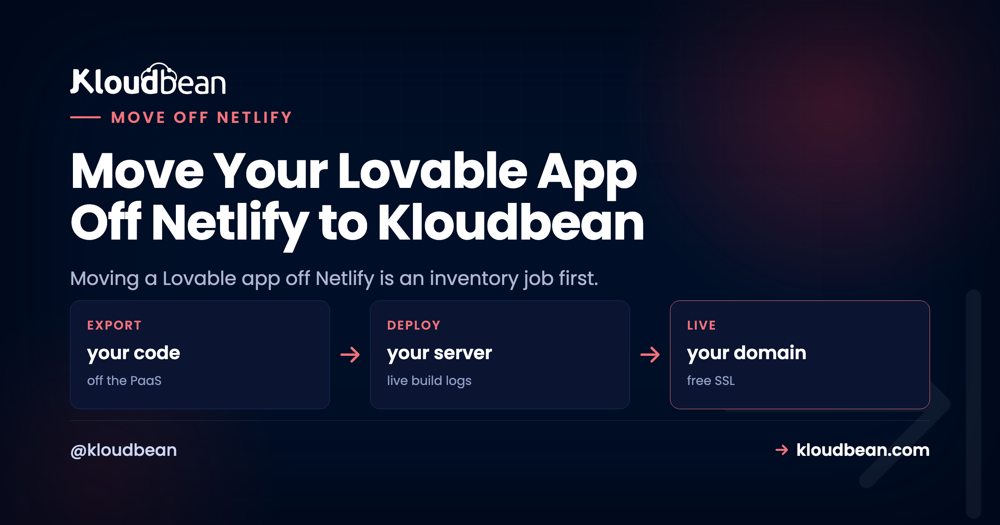

# Move Your Lovable App Off Netlify to Kloudbean (Migration Guide)

Here's the thing most people get backwards when they move a Lovable app off Netlify: the React code is the easy part. It barely changes. What trips up the migration is the handful of Netlify conveniences hiding in your repo and dashboard, the ones you set up once and forgot about. A redirect rule. A form handler. An Identity widget. So this guide isn't a step-by-step build. It's an inventory. Find these pieces first, decide where each one lives on a server you own, and the actual move becomes almost boring.

If you're still weighing whether to leave, the [Netlify alternative breakdown](https://www.kloudbean.com/blog/netlify-alternative-for-full-stack-apps/) covers when Netlify is genuinely the right home and when it isn't. This is for when you've decided, and you want nothing left behind.

> **The short version:** A Lovable app on Netlify usually leans on a few platform-specific pieces: `netlify.toml`, a `_redirects` file, Netlify Identity, Netlify Forms, Netlify Functions, and sometimes Netlify DNS. Inventory them before you move a single file, map each to its home on a server you own (Functions become routes, redirects become server routing, Identity becomes your own auth), then deploy, test on a temp URL, and cut over DNS. The pieces that bite are the ones that fail silently.

## Why moving a Lovable app off Netlify is an inventory job

Netlify's whole appeal is that it quietly handles things for you. Push a repo and it detects the build, serves the static output, applies your redirects, runs your functions, catches your form posts. That's lovely right up until you leave, because a chunk of your app's behavior lives in Netlify's configuration rather than in your code. Copy the code to a new server and that behavior doesn't come with it. It just goes missing.

So the reliable way to move is to list every Netlify-specific piece first, then give each one a new home. Here's the whole map on one screen.

*Two-column inventory. On Netlify: netlify.toml, the _redirects file, Netlify Identity, Netlify Forms, and a hosted database, each with a checkbox. Arrows map each to its new home on your own server: build and start commands, an SPA catch-all route, your app's own auth, a form endpoint, and keeping the database or moving to managed Postgres.*

## The Netlify-specific pieces to inventory first

Open your repo and your Netlify site settings side by side, and go looking for each of these. Here's what every piece was doing, and where it lands on a server you own.

| Netlify piece | What it was doing | Its new home |
| --- | --- | --- |
| `netlify.toml` | Build config, redirects, headers, function directory | Your Build and Start commands set the build; routing and headers move into the app or web server. |
| `_redirects` | SPA fallback and URL redirects | A catch-all route serving `index.html` for a single-page app; explicit redirects as server rules. |
| Netlify Functions | Serverless API endpoints at `/.netlify/functions/*` | Normal routes (like `/api/*`) in one always-on Node server. No per-invocation model, no timeout. |
| Edge Functions | Logic run at the edge | Regular routes in your server. You trade edge-locality for one place to reason about the code. |
| Scheduled Functions | Cron-triggered functions | A normal entry in the Cron Jobs tab, calling a route or script on a schedule. |
| Netlify Identity | Hosted login and the user list | Your app's own auth. This is the one that takes real time, so budget for it. |
| Netlify Forms | Catches form submissions with no backend | A route in your server that receives the POST and stores or emails it. |
| Large Media / assets | Asset pipeline and CDN delivery | Served by your app, or from an [S3-compatible bucket](https://www.kloudbean.com/blog/s3-compatible-object-storage/) for a CDN-backed store. |
| Netlify DNS | DNS for your domain | Your registrar's DNS, or the DNS at your new host. You'll repoint records at cutover. |
| Deploy previews | A URL per pull request | A second application from a staging branch on the same server, giving a stable preview URL. |

If your inventory only turns up `netlify.toml`, a `_redirects` file, and a hosted database, you've got an easy move. Every extra row is a little more work, and Identity is the one that's genuinely a project rather than a config tweak.

<!-- ADD IMAGE: Netlify site settings showing Identity, Forms, and the build/redirects config, with the pieces you'll be migrating highlighted. -->

## The one that bites: pieces that fail silently

Most Netlify features fail loudly when they go missing. A missing API route throws a clear error, and you fix it. The dangerous ones are the pieces that fail *quietly*, because nothing errors, so you don't notice until it matters.

Two examples we see constantly. First, the SPA fallback. Netlify's `_redirects` quietly rewrote every unknown path to `index.html` so client-side routing worked on a refresh. Move the app without recreating that catch-all, and the homepage loads fine, but a hard refresh on `/dashboard` returns a 404. It looks like a broken deploy. It's a missing redirect.

Second, and worse, Netlify Forms. If your contact or signup form was a Netlify Form, submissions were being caught by Netlify with no backend of your own. After the move, that form posts into the void. No error, no crash, the user even sees a success message, and every lead silently vanishes. That's the failure that hurts, because you find out weeks later when someone asks why you never replied. When you inventory, treat any form as guilty until proven innocent: confirm where its submissions actually go.

## Standing the app up on a server you own

With the inventory done, the deploy itself is the same clean flow any Lovable app uses. In the [Kloudbean](https://www.kloudbean.com/) console, click **Add Server**, pick a cloud provider, choose **Node.js**, select the datacenter nearest your users, and give the build 2 to 4 GB of headroom. Then open the app and go to **Application Administration, Deploy Code**.

Connect GitHub, pick the branch, and set the runtime fields: app directory, the assigned `process.env.PORT`, Node version, and your install, build, and start commands (usually `npm install`, `npm run build`, `npm start`). This is where your `netlify.toml` build settings turn into explicit commands.

Recreate your Netlify environment variables under **Runtime Configuration, Environment Variables**. The **Paste .env Content** tab makes it quick.

On the database, you've got a choice. Keep pointing at your existing Supabase (change nothing), or launch a managed [Postgres](https://www.kloudbean.com/blog/managed-postgresql-hosting/) and bring the data onto your own server. The tradeoffs there, especially around Supabase auth and storage, are mapped in the [deploy-a-Lovable-app guide](https://www.kloudbean.com/blog/deploy-lovable-app-to-your-own-server/), so I won't repeat them here.

<!-- ADD IMAGE: The migrated app on its temporary URL, with a hard refresh on a deep route (like /dashboard) loading correctly instead of 404ing. -->

## Test on the temp URL, then cut over DNS

Test on the app's temporary `*.kloudbeansite.com` URL before touching your domain. Walk the whole inventory: log in (Identity replacement), submit the contact form (Forms replacement), hard-refresh a deep route (redirects replacement), hit every former Function path. If a route 503s, the app isn't running, so open **Application Administration**, then **Logs Viewer**, and read the **App Errors** tab (`app.error.log`). Search it for the Function name or variable you just moved. **App Info** (`app.info.log`) and **Web Requests Logs**, the access log for every request served, sit in the same viewer. The two log files are also on disk at `/home/admin/hosted-sites/<app_system_user>/app-logs` via the File Manager.

When it all holds, add your domain and a free **Let's Encrypt** certificate under **Domain Aliases**, then repoint DNS. For a genuinely zero-downtime switch, lower your DNS TTL a couple of days ahead and flip the record last, with Netlify still live. The full timed method is in the [Vercel cutover playbook](https://www.kloudbean.com/blog/move-lovable-app-off-vercel/) and the [zero-downtime migration guide](https://www.kloudbean.com/blog/how-to-migrate-hosting-zero-downtime/); the DNS mechanics are identical here. Keep the Netlify site up until the domain is confirmed serving from the new box, then retire it.

Turn on **automated deployment** so a push to your branch rebuilds and ships, the same git-driven flow you had on Netlify. If you want it wired to GitHub cleanly, that's [managed CI/CD from GitHub](https://www.kloudbean.com/blog/ci-cd-auto-deploy-from-github/).

## A worked example, start to finish

Picture the most common Lovable-on-Netlify shape: a React front end, two or three Netlify Functions behind an API and a contact form, and Supabase holding the data. Here's the whole move in concrete terms. The React app is unchanged, still building with `npm run build`. The Functions become Express routes under `/api/*` in the Node server that now serves the app, and the code inside barely changes, because a Function handler and a route handler do the same job. The contact form that posted to `/.netlify/functions/contact` now posts to `/api/contact`, a one-line change in the frontend, and crucially it now hits a route you control instead of Netlify's silent catcher. Supabase either stays exactly as it is or moves to a managed Postgres with a one-time export and import. That's the entire migration for a typical app: one build command, a couple of route moves, one form path, a redirect fallback, and a database decision.

## A quick, honest note on cost

Don't expect a smaller number in every case. Netlify's free and starter tiers are genuinely cheap at low traffic, and a managed server is a flat monthly price for the box whatever the traffic. The flat model tends to win as usage and team size grow, because it isn't metered per build minute, per function, or per seat, and you can run several apps on one server. The real prize is a bill you can forecast and own, not necessarily the lowest one.

## When this is the wrong answer

Kloudbean runs Linux stacks: Node and the modern web toolkit (React, Vue, Next.js) that Lovable produces, plus PHP, Python, Ruby, and Java when you need them. Windows Server belongs to Premium and Enterprise; .NET does not need it. "Managed" means Kloudbean runs the server, the stack, SSL, patching, and automatic backups; you own and maintain the application and its data. That split is the whole point: the pieces Netlify used to hide are now yours, in one place you can actually see into.

**Nothing left behind.** Move your app at [kloudbean.com](https://www.kloudbean.com/). Databases in a click, backups on by default, IP allow-listing, migration help, Git deploys. Deploy walkthrough [here](https://www.kloudbean.com/blog/deploy-ai-built-app-to-production/); plans on [pricing](https://www.kloudbean.com/pricing/).

## FAQ

### What do I need to check before moving a Lovable app off Netlify?
Inventory the Netlify-specific pieces first: netlify.toml, the _redirects file, Netlify Identity, Netlify Forms, any Functions (including scheduled and edge), asset handling, and Netlify DNS. Each one maps to a home on your own server. The code is standard React and Node, so the pieces you configured on Netlify are the real work, not the app itself.

### What happens to my Netlify Functions on a server?
They become normal routes in one always-on Node server, with no per-invocation model and no execution timeout. Update the frontend to call the new paths, like /api/contact, instead of /.netlify/functions/contact. The handler code inside usually needs little or no change.

### Will my single-page app still route correctly after the move?
Only if you recreate Netlify's SPA fallback. The _redirects file quietly rewrote unknown paths to index.html so client-side routing survived a refresh. On your own server, add a catch-all route that serves index.html, or a hard refresh on a deep route will 404.

### What about Netlify Identity and Netlify Forms?
Identity becomes your app's own auth, which is the piece that takes real time, so budget for it. Forms becomes a route in your server that receives the POST. Watch Forms especially: after the move a form left unwired posts into the void with no error, so confirm submissions land somewhere you control.

### Do I have to move my database off Supabase too?
No. You can keep pointing at your existing Supabase and change nothing, or move the data to a managed Postgres on your own server with a one-time export and import. The tradeoffs, especially around Supabase auth and storage, are covered in the deploy-a-Lovable-app guide.

### How do I avoid downtime during the Netlify move?
Test on the temporary kloudbeansite.com URL first, add your domain and SSL, then repoint DNS. Lower your DNS TTL a couple of days ahead and flip the record last, with the Netlify site still live, so the switch propagates fast and no user hits a dead server. Retire Netlify only after the domain is confirmed serving from the new box.

By Kloudbean · Managed multi-cloud hosting. Build. Deploy. Scale. Faster Than Ever.
