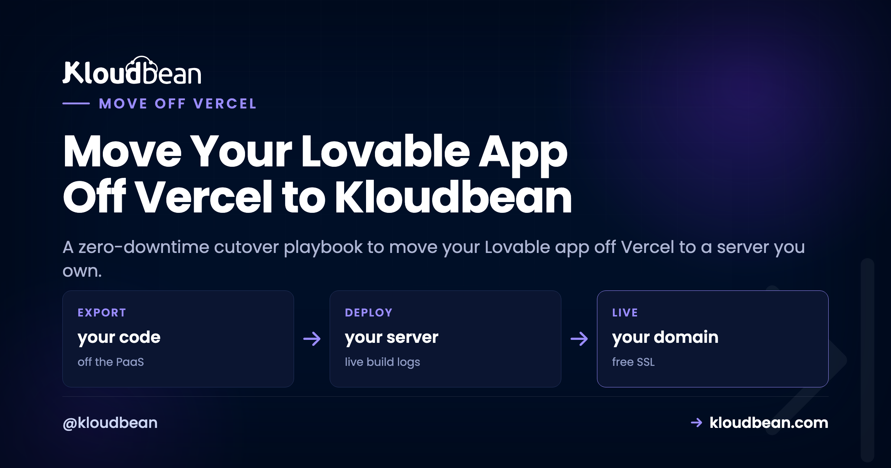

# Move Your Lovable App Off Vercel to Kloudbean (Migration Guide)

You want to move your Lovable app off Vercel and you want your users to notice nothing. That's the whole job. And here's the surprising part: the deploy isn't what makes it risky. A Lovable project is plain React and Node underneath, so getting it running on a server you own takes an afternoon. Whether anyone sees a blip comes down to DNS, and DNS is all about timing. So this isn't a "concepts" piece. It's the cutover runbook I'd actually follow, in order.

If you're still deciding whether to leave at all, the [Vercel alternative breakdown](https://www.kloudbean.com/blog/vercel-alternative-for-full-stack-apps/) makes that case honestly. This guide assumes you've decided, and you want a clean, boring, zero-drama migration. Boring is the goal.

> **The runbook, in order:** 1) Inventory the Vercel project: env vars, build settings, the domain, and its current DNS records. 2) Two days out, drop your DNS TTL so the switch propagates in minutes, not hours. 3) Deploy to the new server and test everything on the temporary URL. 4) Add your domain and SSL on the new box, then change the DNS record while Vercel stays live. 5) Confirm the domain is served by the new server, then retire Vercel. Lowering the TTL early is the single move that makes it zero-downtime.

## A zero-downtime plan to move your Lovable app off Vercel

Most "migrations gone wrong" are really DNS gone wrong. The build succeeds, the app runs on the new server, and then traffic limps between the old host and the new one for hours because a cached DNS record won't let go. The fix isn't cleverness. It's sequence. You get the new box fully working and provable first, you make DNS able to switch fast, and you change the record dead last with the old deployment still up as a safety net.

Here's the shape of the window you're aiming for. Old and new run at the same time. Nobody hits a dead server.

*Timeline: 48h before, lower DNS TTL; cutover, deploy the new server; verify, test on the temp URL; the flip, point DNS at the new server; after, retire Vercel. Vercel and Kloudbean both serve during the overlap window, so there's zero downtime.*

## Step 1: Inventory the Vercel project before you touch anything

The migrations we see go sideways almost never fail on the build. They fail on something the old platform was quietly doing that nobody wrote down. So start by making the invisible visible. Open the Vercel project and copy out four things.

- **Environment variables.** Every one, across every environment (Production, Preview, Development). This is the number-one cause of a broken first deploy, so grab them all, including the ones you forgot you set.
- **Build settings.** The install command, build command, output directory, root directory, and Node version. You'll set these by hand on the new server, so write down what Vercel was auto-detecting.
- **Domains.** Which domains and subdomains point here, and whether Vercel is your DNS or just the target of a record you manage elsewhere.
- **The current DNS records and their TTL.** The A or CNAME record for your domain, and its TTL value. You need this in Step 2.

One thing that does *not* move in this cutover: your Supabase backend. It keeps running exactly where it is, and the new frontend talks to it the same way the old one did. If you also want to pull Supabase onto your own server, that's a separate decision, and the [deploy-a-Lovable-app guide](https://www.kloudbean.com/blog/deploy-lovable-app-to-your-own-server/) maps that Supabase coupling in full. For a clean flip, leave it in place. One less variable in flight.

<!-- ADD IMAGE: The Vercel project's Settings, with Environment Variables and Domains open side by side. -->

## Step 2: Lower your DNS TTL, two days before the flip

This is the step people skip, and it's the one that decides everything. TTL, time to live, is how long a DNS resolver is allowed to cache your record before checking again. If your domain's TTL is the common default of 3600 seconds, then after you change the record, resolvers around the world can keep sending users to the old Vercel deployment for up to an hour. Some longer.

So you lower it ahead of time. Two days out (comfortably longer than the old TTL), drop the record's TTL to something small like 300 seconds, or 60 if your provider allows it. Change nothing else. Just the TTL. By the time you actually flip, every resolver has picked up the short value, and the switch propagates in minutes.

Here's the anti-pattern, and it's common: someone flips DNS with a 3600s or even 24-hour TTL still set, watches half their traffic keep hitting Vercel for the rest of the day, and concludes the migration "half worked." It worked fine. The record just hadn't expired from caches yet. Lower the TTL first and that whole class of confusion disappears.

<!-- ADD IMAGE: Your DNS provider's record editor with the TTL field lowered to 300 seconds ahead of the cutover. -->

## Step 3: Stand up the new server and prove it on a temp URL

Now the part that feels like the migration but is actually the easy half. In the [Kloudbean](https://www.kloudbean.com/) console, click **Add Server**, pick a **Cloud Provider**, choose **Node.js**, select the datacenter closest to your users, and give the build a size with 2 to 4 GB of headroom.


Open the app, go to **Application Administration, Deploy Code**, connect the GitHub repo Lovable syncs to, and set the runtime fields you wrote down in Step 1: app directory, port (your app listens on the assigned `process.env.PORT`), Node version, and your install, build, and start commands. Then **Pull & Deploy**.


Recreate your environment variables under **Runtime Configuration, Environment Variables** (the **Paste .env Content** tab makes this quick), and point them at the same Supabase project as before. If env vars are new territory, [environment variables, done right](https://www.kloudbean.com/blog/environment-variables-done-right/) covers what's safe to expose and what isn't.

Now test on the app's temporary `*.kloudbeansite.com` URL, before you go anywhere near your domain. Click through every real flow: log in, read data, write data, hit each API route, submit any form. This is the whole point of the temp URL. It's where you catch the things that only worked because they were on Vercel, while the old site is still safely serving your users.

My honest opinion: the flip is the safe part. The scary part is discovering, an hour *after* cutover, that something depended on Vercel. That's exactly why you verify on the temp URL now, not later. If a route 503s, the app isn't running, and it will have said why. Open **Application Administration**, then **Logs Viewer**, and read the **App Errors** tab, which is `app.error.log`. The search box gets you to the failing variable fast. **App Info** (`app.info.log`) and **Web Requests Logs**, the access log for every request served, are tabs in the same viewer. If you'd rather read files, both logs sit at `/home/admin/hosted-sites/<app_system_user>/app-logs` in the File Manager. The full triage is in [fixing a 503 after deploying](https://www.kloudbean.com/blog/fix-503-after-deploying-your-app/).

## The Vercel-only assumptions to hunt for on the temp URL

A Lovable app is standard code, so most of it just runs. A few Vercel conveniences don't exist on a plain server, and each one is a quick fix once you know to look. This is your checklist while testing.

| Vercel was doing this | What to change on your server |
| --- | --- |
| Auto-detecting how to build and run | You set the build and start commands explicitly. For Next.js that's `next build` then `next start`, no adapter. |
| Serverless functions per request | They become normal routes in one always-on process. Usually less code, and no cold starts or timeouts. |
| A `VERCEL_URL` or hard-coded `*.vercel.app` base URL in the frontend | Point any `NEXT_PUBLIC_` or public base-URL variable at your new domain, or use relative `/api/...` paths. |
| Vercel Cron | A normal cron job from the console's Cron Jobs tab. |
| Edge functions | Regular routes in your server. You trade edge-locality for one place to reason about the code. |

## Step 4: Add the domain and SSL, then flip DNS last

Everything checks out on the temp URL. Now, and only now, do you touch the domain. Do it in this order so HTTPS never breaks.

1. On the new server, under **Domain Aliases**, add your custom domain and install a free **Let's Encrypt** certificate. Get the cert ready *before* traffic arrives so there's no window of certificate errors.
2. In your DNS provider, change the A or CNAME record to point at the new server's public address. Because you lowered the TTL in Step 2, this catches on in minutes.
3. Leave the Vercel deployment running. This is the overlap window from the diagram. Stragglers still on the cached record land on Vercel and see the working app; everyone else lands on the new box. Nobody hits a dead server.

The [zero-downtime migration guide](https://www.kloudbean.com/blog/how-to-migrate-hosting-zero-downtime/) goes deeper on the DNS mechanics if you want the general version that isn't specific to Lovable.

## Step 5: Confirm it's really the new box, then decommission Vercel

Don't tear down Vercel on faith. Confirm the flip landed. Two commands tell you almost everything.

```
# is the domain resolving to the new server's IP yet?
dig +short yourdomain.com

# who's actually answering, and is the certificate the new one?
curl -sI https://yourdomain.com
```

When `dig` shows the new IP and the site loads over HTTPS served by the new server, click through the live domain one more time. Then, and this is the part people rush, raise your TTL back up to something normal (3600s) now that the churn is over, and only *then* delete the Vercel deployment. The failure mode we see most is decommissioning too early, while a chunk of traffic is still riding the cached record. Give it a day. The old deployment is costing you nothing by sitting there idle for another 24 hours.

## Turn on auto-deploy, and remember the box isn't single-use

Enable **automated deployment** so a push to your branch rebuilds and ships, the same `git push` loop you liked on Vercel, now on a server you own. If you want it wired to GitHub properly, [managed CI/CD from GitHub](https://www.kloudbean.com/blog/ci-cd-auto-deploy-from-github/) walks through it.

And here's a benefit that shows up later: the server isn't a slot for one app. Your next Lovable, Bolt, or Cursor project can deploy right beside this one from **Applications, Add Application**, with its own domain and database. No new signup, no second per-project bill. For anyone shipping more than one thing, that's the quiet win of owning the box instead of renting a slot per app.

## A fair, honest note on cost

Don't expect a smaller number in every case, because that's not always true. Vercel bills by usage and seats; a managed server is a flat monthly price for the box whatever the traffic. At genuinely tiny traffic, a hobby plan can undercut any always-on server. As usage and the team grow, the flat server tends to win, and it wins on predictability at any size, since a quiet month and a launch month cost the same. If a bill you can actually forecast is what you're after, that's the real prize here, not the lowest possible line item. Weighing the numbers for a smaller project? The [cost of running a side project](https://www.kloudbean.com/blog/cost-of-running-a-side-project/) breaks it down.

## The honest limits

Kloudbean runs Linux web stacks: Node and the modern web toolkit (React, Next.js, Vue) plus PHP, Python, Ruby, and Java when you need them. That's exactly what Lovable produces, so you're in the right place. Windows Server is a Premium and Enterprise option rather than a standard one, and .NET runs on Linux. "Managed" means Kloudbean runs the server, the stack, SSL, patching, and automatic backups; you own the application and its data. And because it's a standard Linux box running standard code, you can move it again later. This migration off Vercel is the same move in reverse whenever you want it.

**A rehoming, not a rebuild.** Move your app at [kloudbean.com](https://www.kloudbean.com/). One-click databases, automatic backups, IP allow-listing, free migration, free trial, and simple Git deploy. Fresh-deploy walkthrough [here](https://www.kloudbean.com/blog/deploy-ai-built-app-to-production/); plans on [pricing](https://www.kloudbean.com/pricing/).

## FAQ

### How do I move a Lovable app off Vercel without downtime?
Lower your DNS TTL a couple of days ahead, deploy the app to the new server, and test it fully on the temporary URL. Then add your domain and SSL on the new box and change the DNS record while Vercel is still live. The low TTL makes the switch propagate in minutes, and the overlap means no user hits a dead server.

### Why lower the DNS TTL before migrating?
TTL is how long resolvers cache your DNS record. At a default of 3600 seconds, users can keep hitting the old Vercel deployment for up to an hour after you switch. Dropping the TTL to 300 or 60 seconds two days early means every resolver has the short value by cutover, so the flip takes effect almost immediately.

### Will my Vercel serverless functions still work on a server?
They become normal routes in one always-on Node process, usually with little or no change to the code inside them. You also drop the cold starts and execution timeouts that come with the serverless model. Update the frontend to call the new route paths if any were hard-coded.

### Do I have to move Supabase when I leave Vercel?
No. In this cutover Supabase keeps running exactly where it is, and the new frontend points at the same project. Moving Supabase onto your own server is a separate, optional decision covered in the deploy-a-Lovable-app guide. Leaving it in place keeps the migration to one variable.

### How do I confirm the domain is served by the new server?
Run dig +short yourdomain.com to check it resolves to the new IP, and curl -sI https://yourdomain.com to see who answers and that the new certificate is live. Only after that resolves correctly and loads over HTTPS should you raise the TTL back up and retire the Vercel deployment.

### Is a managed server cheaper than Vercel?
Not always, and it's fair to say so. At very low traffic a hobby plan can be cheaper than any always-on server. A flat server usually wins as traffic and team grow, and it's more predictable at any size, since the price is the same in a quiet month and a busy one, with several apps able to share one box.

By Kloudbean · Managed multi-cloud hosting. Build. Deploy. Scale. Faster Than Ever.
