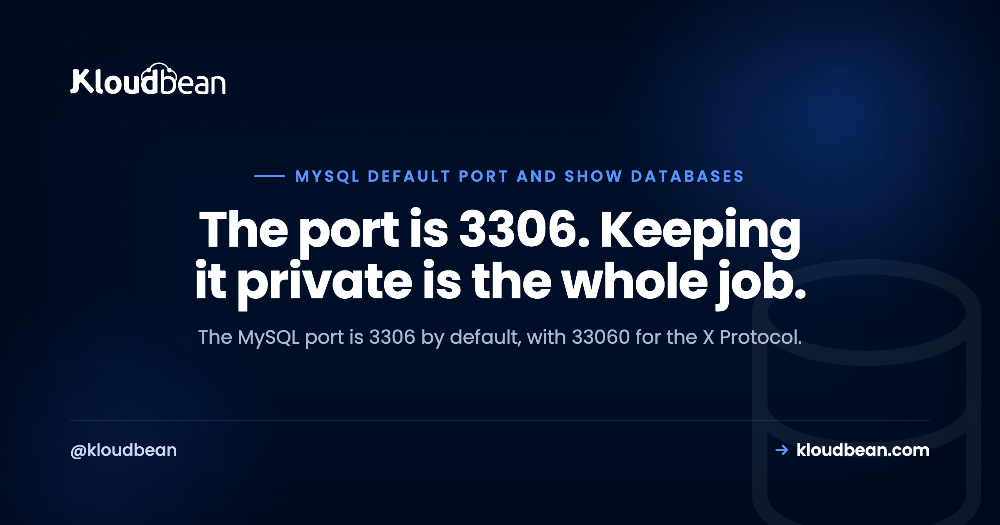

# MySQL Port 3306, and How to List Databases and Tables

*By Kloudbean Engineering · The port is 3306. Keeping it private is the whole job.*

Two questions bring most people to this page, and they're close cousins. What port does MySQL use, and how do I see what's inside it. The short answers: the MySQL port is 3306, and you list databases with SHOW DATABASES. But the version of this page worth reading is the part most guides skip, which is why 3306 should almost never face the public internet, and why a database can be sitting right there and still not show up in your list.

> **MySQL port and the quick commands, up front.**
> MySQL and MariaDB listen on TCP port 3306 by default. The classic X Protocol, used by MySQL Shell and some newer clients, listens on 33060. List databases with `SHOW DATABASES;`, pick one with `USE dbname;`, then list tables with `SHOW TABLES;`. Connect from the shell with `mysql -h host -P 3306 -u user -p`. And bind 3306 to localhost or a private address, because an open 3306 gets found by scanners fast.

## The MySQL port: 3306, 33060, and the socket you might use instead

MySQL's default port is 3306. That's the TCP port the server listens on, and it's the one your app's driver connects to unless you tell it otherwise. MariaDB uses the same 3306, because it grew out of MySQL and kept the wire protocol compatible.

There's a second port worth knowing about: 33060. That's the MySQL X Protocol, used by the X DevAPI and the document-store features in MySQL Shell. Most classic apps never touch it. If you spotted 33060 in a listening-ports list and wondered what it was, that's your answer, and it's normal for a default MySQL 8 install to have both open locally.

Now the part that trips people up. On the same machine as the server, MySQL often doesn't use TCP at all. It uses a Unix domain socket, a special file such as `/var/run/mysqld/mysqld.sock`. This matters because of one quiet rule in the client: `-h localhost` tells the mysql client to use the socket, while `-h 127.0.0.1` tells it to use TCP on 3306. They look identical. They are not. I've watched people swear the port is broken because connecting to `localhost` works and `127.0.0.1` gets refused, when the real story was that the socket was fine and TCP simply wasn't listening.

> **On MariaDB?** All of this applies unchanged. MariaDB kept the same default port 3306, the same `SHOW DATABASES` and `SHOW TABLES`, and the same client flags. If you run it as a service, [managed MariaDB hosting](https://www.kloudbean.com/blog/managed-mariadb-hosting/) covers the operational side.

## Is MySQL actually listening on 3306? Check, don't guess

Before you debug a connection, confirm what the server is actually doing. On Linux, one line answers it:

```bash
# List listening TCP sockets and filter for the MySQL port
ss -ltnp | grep 3306
```

If MySQL is listening on TCP, you'll see a line with an address and port, something like `127.0.0.1:3306` or `0.0.0.0:3306`. That address matters as much as the port, and I'll come back to why in a second. If the command prints nothing, MySQL isn't listening on TCP at all, which usually means it's socket-only or not running.

Two settings decide this, and they live in `my.cnf` (often `/etc/mysql/my.cnf`, or a file under `/etc/mysql/mysql.conf.d/`):

```ini
[mysqld]
port = 3306
bind-address = 127.0.0.1
```

`port` is the obvious one, and you rarely change it. `bind-address` is the one that matters for safety. Bound to `127.0.0.1`, MySQL accepts connections only from the same machine. Bound to `0.0.0.0`, it accepts them from anywhere the firewall lets through. Read the next section before you touch that, because flipping it to `0.0.0.0` is the single most common way a database ends up exposed.

<!-- ADD IMAGE: a terminal running ss -ltnp with the 3306 line highlighted, showing 127.0.0.1:3306 versus 0.0.0.0:3306 -->

## Never put 3306 on the public internet

The opinion this whole page is built around: port 3306 should almost never be reachable from the open internet. Not secured-with-a-strong-password-and-then-exposed. Just not exposed.

Databases get scanned around the clock. Automated bots sweep huge ranges of addresses looking for an open 3306, throw a list of common credentials at whatever answers, and if they get in, they exfiltrate or ransom what they find. This isn't rare, and it isn't targeted. Leave 3306 open on a public IP and it will be probed within hours, sometimes minutes.

So here is the anti-pattern to burn into memory: setting `bind-address = 0.0.0.0` and then opening 3306 in the firewall so your app server, or your laptop, can reach it. It works, which is exactly why people do it. It also hands your data to the internet.

The fix is structural, not a longer password. Keep MySQL bound to localhost or a private address, and let only your application tier reach it. If the app and database share a server, bind to `127.0.0.1` and you're done. If they sit on separate machines, put the database on a private address and allow only the app server's IP through the firewall. You reach the database from your app, never from a browser or a public client.

<!-- ADD IMAGE: inline SVG in the HTML shows two exposures of port 3306, an unsafe public 0.0.0.0 bind versus a private bind reachable only from the whitelisted app server -->

Need to reach a private database from your own machine now and then? Tunnel over SSH instead of opening the port. This forwards your local 3306 through an encrypted SSH session to the server, so the database port never touches the public internet:

```bash
ssh -L 3306:localhost:3306 user@your-server
# then point your client at 127.0.0.1:3306 as usual
```

The deeper version of this, locking a managed database to a single app server with IP allow-listing, is in [database private access control](https://www.kloudbean.com/blog/database-private-access-control/).

<!-- ADD IMAGE: a firewall rule list showing 3306 allowed only from the app server IP, not from 0.0.0.0/0 -->

## List databases: SHOW DATABASES and the information_schema way

With a connection open, listing databases is one command:

```sql
SHOW DATABASES;
```

You'll get your own databases plus a few that ship with the server: `information_schema`, `mysql`, `performance_schema`, and usually `sys`. Those last ones are the server's own metadata and internals. Leave them be unless you know why you're in there.

There's a second way that's handy in scripts and application code, because it returns a normal result set you can filter, sort, and join:

```sql
SELECT schema_name FROM information_schema.schemata;
```

`information_schema` is a virtual database that describes every other database: their schemas, tables, columns, indexes, and sizes. `SHOW DATABASES` is the quick interactive answer; `information_schema` is the programmable one. Same information, two front doors.

<!-- ADD IMAGE: a mysql client session showing SHOW DATABASES output, including information_schema, mysql, and performance_schema -->

## List tables, describe them, and check their size

Pick a database, then list its tables:

```sql
USE appdb;
SHOW TABLES;
```

`SHOW TABLES` gives you bare names. `SHOW FULL TABLES` adds a column that tells you whether each entry is a real table or a view, which matters the moment someone hands you a schema full of views and you can't work out why a table won't take an insert:

```sql
SHOW FULL TABLES;
```

To see a table's structure, any of these work, from terse to complete:

```sql
DESCRIBE orders;
SHOW COLUMNS FROM orders;
SHOW CREATE TABLE orders;
```

`DESCRIBE` (or `DESC`) and `SHOW COLUMNS` give you the column list, types, and keys. `SHOW CREATE TABLE` gives you the exact DDL, the full statement that would recreate the table. That's the one I reach for before a migration, or when I need to copy a table's shape somewhere else.

For sizes, `SHOW TABLE STATUS` reports per-table row counts and lengths, and `information_schema` turns that into something readable. This ranks a database's tables by how much space they take on disk:

```sql
SELECT table_name,
       ROUND((data_length + index_length) / 1024 / 1024, 2) AS size_mb
FROM information_schema.tables
WHERE table_schema = 'appdb'
ORDER BY size_mb DESC;
```

One caveat that saves an argument later: for InnoDB tables, the row counts from these sources are estimates, not exact figures. Close enough to find the bloated table. Not something to bill a customer on. If your tables are big enough that size is a live concern, [MySQL performance tuning](https://www.kloudbean.com/blog/mysql-performance-tuning/) covers indexing and the buffer pool.

## Why a database is missing from SHOW DATABASES

This one burns hours, so it gets its own section. `SHOW DATABASES` does not list every database on the server. It lists the databases your user holds some privilege on. So a database can be alive and well and simply invisible to you.

If a database you know exists isn't in the list, it's almost always a permissions problem, not a missing database. Check what your user can actually do:

```sql
SHOW GRANTS;
SELECT CURRENT_USER();
```

`CURRENT_USER()` is worth a look on its own, because MySQL can authenticate you as a different account than the username you typed, thanks to how it matches host patterns. If you connected as `root` and still can't see a database, you're probably not the root you think you are, or you're on the wrong server entirely.

The fix is a `GRANT` from an account that has the rights, followed by `FLUSH PRIVILEGES` if you edited the grant tables directly. If you're hitting this because an app can't connect at all rather than because a database is hidden, the connection itself is the thing to chase, and [error establishing a database connection](https://www.kloudbean.com/blog/fix-error-establishing-database-connection-wordpress/) walks that path.

## Quick reference: task to command

The whole page in one table. Keep it near your terminal.

| Task | Command | Note |
|---|---|---|
| See the listening port | `ss -ltnp`, then look for 3306 | Or `SHOW VARIABLES LIKE 'port';` from inside MySQL |
| List all databases | `SHOW DATABASES;` | Only shows what your user can see |
| List databases as a result set | `SELECT schema_name FROM information_schema.schemata;` | Good for scripts and joins |
| Switch database | `USE dbname;` | Sets the default for later commands |
| List tables | `SHOW TABLES;` | Bare names |
| Tables and views | `SHOW FULL TABLES;` | Adds base table versus view |
| Describe a table | `DESCRIBE tablename;` | Columns, types, keys |
| Full table definition | `SHOW CREATE TABLE tablename;` | The exact DDL |
| Table sizes | `information_schema.tables` query | Row counts are estimates on InnoDB |
| Who am I, what can I see | `SHOW GRANTS;` and `SELECT CURRENT_USER();` | Explains a missing database |

## Connecting to a remote or managed MySQL

Connecting to a database on another host is the same client, with the host and port spelled out:

```bash
mysql -h db.example.com -P 3306 -u appuser -p appdb
```

Note the capital `-P` for port. Lowercase `-p` is the password flag, and mixing the two up is a rite of passage. Leave the value off `-p` so the client prompts you, rather than typing the password on the command line, where it lands in your shell history and process list for anyone on the box to read.

For anything crossing a network, require TLS so the connection is encrypted in transit:

```bash
mysql -h db.example.com -P 3306 -u appuser -p --ssl-mode=REQUIRED appdb
```

A few habits that save you later. Give the app its own least-privileged user rather than `root`. Keep the credentials in an environment variable in your app, never committed to Git. And if a lot of connections are in play, put a pool in front so MySQL isn't drowning in them, which is covered in [database connection pooling](https://www.kloudbean.com/blog/database-connection-pooling/). The full app-side wiring, env vars and all, is in [how to add a managed database to your app](https://www.kloudbean.com/blog/add-managed-database-to-your-app/).


## Where hosting fits, honestly

Everything above is plain MySQL and works on any server you run. What a managed platform changes is who handles the parts that fail quietly, and the security default this page keeps hammering on.

On Kloudbean, MySQL and MariaDB are two of seven managed engines (the others being PostgreSQL, Redis, Memcached, Elasticsearch, and MongoDB), provisioned in a few clicks with automatic backups on from the start. Access is locked down rather than open to the world: you whitelist your app server's IP so only that server can reach the database, which is the keep-3306-off-the-public-internet rule handled for you instead of left as a firewall chore you might forget. It runs across seven clouds (AWS, AWS Lightsail, Google Cloud, Linode, Vultr, DigitalOcean, and UpCloud) from one dashboard, with free SSL, and free migration assistance if you're moving an existing database in. Standard plans start at $8 a month, and it's worth checking the current numbers on the [pricing page](https://www.kloudbean.com/pricing/). More on the service itself is in [managed MySQL hosting](https://www.kloudbean.com/blog/managed-mysql-hosting/).

The honest boundary, said once. Managed covers the server, the engine, backups, and patching. Your schema, your data, and the queries you run stay yours, and a plain `mysqldump` export walks out the door with you whenever you want.

**Run MySQL on a database you don't have to babysit.** Managed MySQL and MariaDB across seven clouds, provisioned in a few clicks, with automatic backups on from minute one and access locked to your app server's IP instead of the open internet. Free SSL. Free migration assistance. Start at [kloudbean.com](https://www.kloudbean.com/) or see [pricing](https://www.kloudbean.com/pricing/).

One-click MySQL and MariaDB · Automatic backups · IP allow-listing · Free SSL · Free migration · One dashboard

## Related reading

More on the database side of things: [managed MySQL hosting](https://www.kloudbean.com/blog/managed-mysql-hosting/) for what running it as a service actually covers, and [managed MariaDB hosting](https://www.kloudbean.com/blog/managed-mariadb-hosting/) if you're on the fork. Still choosing an engine? [MySQL vs PostgreSQL](https://www.kloudbean.com/blog/mysql-vs-postgresql/) is the honest head to head. When queries get slow, [MySQL performance tuning](https://www.kloudbean.com/blog/mysql-performance-tuning/) takes it from the slow query log onward. On the connection side, [database connection pooling](https://www.kloudbean.com/blog/database-connection-pooling/) and [database private access control](https://www.kloudbean.com/blog/database-private-access-control/). Working in Postgres instead? The psql equivalent is [Postgres list tables and databases in psql](https://www.kloudbean.com/blog/psql-list-databases-and-tables/).

## FAQ

**What port does MySQL use by default?**
By default MySQL and MariaDB listen on TCP port 3306. That is the port your driver or the mysql client connects to unless you set a different one. A second port, 33060, is used by the MySQL X Protocol and is separate from the classic 3306 connection.

**What is port 33060 in MySQL?**
Port 33060 is the MySQL X Protocol port, used by the X DevAPI and the document-store features in MySQL Shell. Most traditional apps only ever use 3306 and never touch 33060. Seeing both open locally on a default MySQL 8 install is normal.

**How do I list all databases in MySQL?**
Run SHOW DATABASES; from the mysql client. For a result set you can filter or use in scripts, query the catalog instead with SELECT schema_name FROM information_schema.schemata. Both return the same databases, though SHOW DATABASES only lists the ones your user has privileges to see.

**How do I show all tables in a MySQL database?**
Select the database with USE dbname; then run SHOW TABLES; to list its tables. SHOW FULL TABLES; adds a column that tells you whether each entry is a base table or a view. To inspect one table, use DESCRIBE tablename or SHOW CREATE TABLE tablename.

**Why is my database missing from SHOW DATABASES?**
SHOW DATABASES only lists databases your user holds some privilege on, so a missing database is usually a permissions problem rather than a deleted one. Check SHOW GRANTS and SELECT CURRENT_USER() to see who you actually connected as and what you can reach. Granting the right privileges makes it appear.

**Should I open port 3306 to the internet?**
No. An open 3306 on a public IP gets scanned and brute-forced within hours, and a strong password alone is not enough. Keep MySQL bound to localhost or a private address and let only your application server reach it. To connect from your own machine, tunnel over SSH instead of opening the port.

**How do I connect to MySQL on a different port?**
Pass the port with a capital -P, for example mysql -h host -P 3307 -u user -p. Lowercase -p is the password flag, which is a common mix-up. For a network connection, add --ssl-mode=REQUIRED and leave the password off the command line so it prompts you.

**What is the difference between localhost and 127.0.0.1 in MySQL?**
With the mysql client, -h localhost tells it to use a local Unix socket file, while -h 127.0.0.1 tells it to use TCP on port 3306. They look the same but take different paths, which is why one can work while the other refuses. If TCP is not listening, localhost may connect while 127.0.0.1 fails.

**How do I see the columns in a MySQL table?**
Use DESCRIBE tablename or its alias DESC, or SHOW COLUMNS FROM tablename, to list columns, types, and keys. For the full definition, including indexes and options, run SHOW CREATE TABLE tablename. That last one is handy right before a migration or when copying a table structure.

**How do I check what port MySQL is listening on?**
On Linux, run ss -ltnp and look for the line with 3306, which also shows the bind address such as 127.0.0.1 or 0.0.0.0. From inside MySQL, SHOW VARIABLES LIKE 'port'; reports the configured port. The my.cnf settings port and bind-address are where both are defined.

---

*Kloudbean Engineering · Know the port, list the tables, and never expose 3306.*
