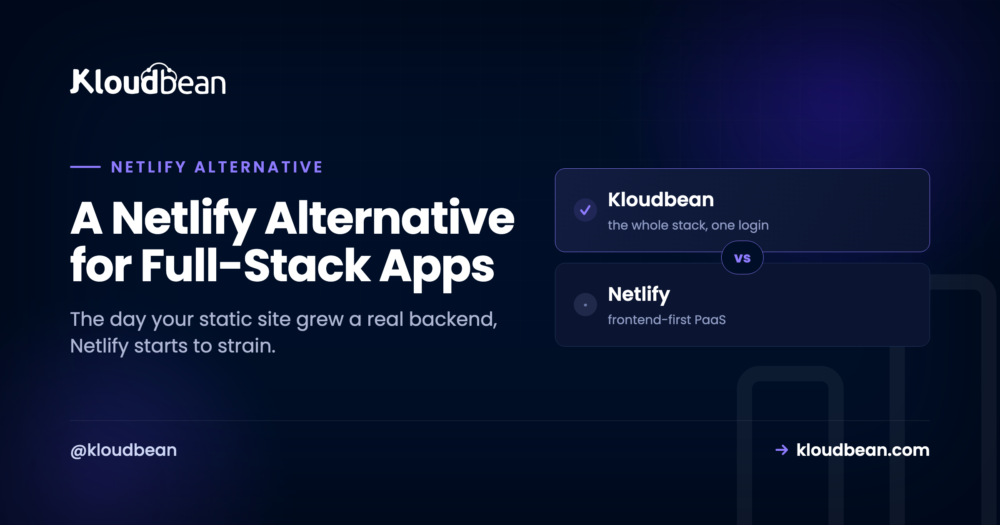

# A Netlify Alternative for Full-Stack Apps

Most people looking for a Netlify alternative aren't unhappy with Netlify. They just crossed a line. The site that started as a few static pages picked up a login, then a database, then a job that needs to run at midnight, and the platform that made shipping a static site feel effortless is now bending to hold something it wasn't shaped for. This guide is organized around that line: the specific signs you've outgrown a static-first host, and where a persistent server you own takes over.

> **Short answer:** Netlify is excellent for static sites and JAMstack front ends. You outgrow it the day you need a process that's always running, a real database next to your code, or more than serverless functions can comfortably do. The best Netlify alternative for that moment is a server you own: your backend, database, auth, and routing in one place, at a flat price, still deployed by pushing to Git.

## Netlify is great, right up until one specific day

Let me be fair before the critique, because the strengths are real. Netlify took the pain out of shipping the modern web. Connect a repo, and every push builds and lands on a fast global edge with SSL, previews, and rollbacks for free. For a marketing site, a docs site, a blog, or a front end that talks to third-party APIs, it's a genuinely good tool. If that's your project, close this tab and keep using it. I mean that.

The trouble starts on a particular day. Not gradually. There's usually a single feature request, or a single 3am bug, where you realize the platform and your app want different things. It tends to arrive in stages, and it looks like this.

| Stage | What it is | On a static-first host |
| --- | --- | --- |
| Static site | pages, assets | perfect fit |
| + form, function | a little dynamic | still great |
| + auth, real DB | stateful now | straining |
| Full app | jobs, websockets | fighting it |

*A static host is a perfect fit at the top. The trouble is that most projects don't stay there. Somewhere around "real database plus stateful auth," a static-first model starts working against you.*

## Five signs you've outgrown Netlify

You don't decide to leave Netlify on a whim. Something specific pushes you. In my experience it's one of these five, and usually more than one at once.

### 1. You need something running when nobody's visiting

Netlify Functions spin up per request, do their thing, and stop. That's fine for a form handler. It falls apart the moment you need a process that's just... on. A websocket connection that stays open. A queue worker chewing through jobs. A cron task that fires at midnight whether or not a single person is on the site. A per-request function has nowhere to keep any of that alive. This is the sign that most cleanly says "you want a server, not functions."

### 2. The build-minute and bandwidth meters started mattering

On a static-first platform, you pay for build minutes every time the site rebuilds, and bandwidth is metered. When you were pushing twice a week nobody noticed. Now you deploy ten times a day, the build got slower as the app grew, and a good traffic spike (the kind you wanted) shows up as an overage in the same month you were celebrating. The bill moves with how often you ship and how popular you are, which are exactly the things you don't want to ration.

### 3. Your data outgrew a hosted add-on

Early on, wiring in a hosted database somewhere else is fine. Then the app gets data-heavy, every request makes a round trip across the public internet to that separate service, and you're paying for it as its own metered line item. At that point you want the database next to the app, not a network away. That's a different architecture than a static host is built to offer.

### 4. Netlify Identity or Forms quietly became load-bearing

This is the sneaky one. Netlify Identity for logins and Netlify Forms for submissions are convenient, so you lean on them. Then one day a real chunk of your app depends on platform features you can't take with you. That's the definition of lock-in, and it's easy to walk into without noticing because each individual use felt harmless.

### 5. You're writing redirects to make a site behave like an app

If your `netlify.toml` and `_redirects` file have grown into a small routing engine, that's a tell. You're using platform config to fake behavior your own server would just do. Rewrites, proxying, SPA fallbacks, all of it is the app straining against a model that assumes it's serving files.

> **Coming from Netlify Identity or Forms?** Don't panic, and don't treat it as lost work. Both map to standard pieces: Identity becomes your app's own authentication (sessions, social login), and Forms becomes an ordinary form endpoint writing rows to your database. You're getting your auth and your data back under your own roof, where they were going to have to live eventually anyway.

<!-- ADD IMAGE: A Netlify dashboard showing build minutes and bandwidth usage climbing toward the plan limit. -->

## Choosing a Netlify alternative: what to move to

Once two or three of those signs are true, you don't want another static-first platform. You want the opposite: a persistent process, a database on the same machine, your own auth and routing, a flat price, and standard code you can pick up and move. The catch most people fear is losing the deploy experience. You don't have to.

That's the model [Kloudbean](https://www.kloudbean.com/) runs. Your app lives as a normal always-on process on a real server it provisions and manages, on the cloud you pick (seven of them: AWS, Google Cloud, DigitalOcean, Linode, Vultr, UpCloud, Lightsail). You still connect a Git repo and deploy from a console, with auto-deploy on push and live build logs. The familiar part stays familiar.

The database launches right beside the app instead of across a network. Pick from six managed engines (Postgres, MySQL, MariaDB, Redis, MongoDB, Elasticsearch) and connect over localhost.

## What moves where

The migration is less scary once you see it as a mapping. Each Netlify-specific piece has a plain, portable equivalent on a server.

| On Netlify | On a server you own |
| --- | --- |
| Netlify Functions (per request) | Routes in your always-on app process |
| Routing via `_redirects` and `netlify.toml` | Your app (or web server) routes directly |
| Netlify Identity for auth | Your app's own auth: sessions, social login |
| Netlify Forms for submissions | A normal form endpoint writing to your database |
| A separate hosted database | Managed Postgres or MySQL on the same box |
| Build minutes and bandwidth meters | Build runs on the server you already pay for |

The gotcha we watch people hit: they forget Identity and Forms were doing real work until the app breaks in the new place with nobody able to log in. Inventory those two before you move, not after. Once you've mapped them, the step-by-step [move-off-Netlify guide](https://www.kloudbean.com/blog/move-lovable-app-off-netlify/) covers the mechanics, and [adding a managed database](https://www.kloudbean.com/blog/add-managed-database-to-your-app/) and [putting the app and database on one server](https://www.kloudbean.com/blog/host-app-api-and-database-on-one-server/) fill in the data layer. A fresh build instead? The [deploy walkthrough](https://www.kloudbean.com/blog/deploy-ai-built-app-to-production/) starts from scratch.

## When staying on Netlify is the right call

I'll say it plainly, because a fair guide has to: if your project is genuinely a static site or a JAMstack front end, moving it to a server is a downgrade. Don't do it to yourself. Stay on Netlify when the site is mostly static, your backend is a couple of Functions that fit the model comfortably, and the build pipeline and edge are worth what you pay. None of the five signs above apply to a brochure site, and forcing one onto a server buys you maintenance you didn't need.

The alternative is for the other case, the app that quietly became an application. There, one server holding your backend, database, auth, and routing is simpler to reason about than a static host plus a functions layer plus a hosted database spread across three bills.

<!-- ADD IMAGE: Your app live on its own domain with the SSL padlock, a login working, and data served from your own server instead of a platform feature. -->

## A fair word on cost, and the honest limits

No promise of a smaller number every time. Netlify's free and starter tiers are hard to beat at very low traffic, and a server you rent by the month costs the same in a dead week as a busy one. A flat server tends to win as build minutes, function usage, bandwidth, and seats climb, and it wins on predictability at any size. Predictable, not always cheapest, is the honest claim.

The limits, straight: Kloudbean runs Linux web stacks (Node, PHP, Python, Ruby, Java, plus React, Next.js, Vue, Laravel, Django), which covers what nearly every Netlify app is built on. It isn't for Windows, .NET, or IIS. "Managed" means Kloudbean runs the server, stack, SSL, patching, and backups; you own and maintain the app and its data. A single server isn't a global edge CDN either. It lives in the regions you pick, and if you want edge-class delivery you can put Cloudflare Enterprise edge caching in front (a paid add-on, free on Enterprise). Prefer this evaluated against a purely serverless platform? The sibling [Vercel alternative](https://www.kloudbean.com/blog/vercel-alternative-for-full-stack-apps/) piece runs the same reasoning from the serverless angle.

## Beyond static-first

Bring your backend, database, and auth under one roof at [kloudbean.com](https://www.kloudbean.com/). One-click databases, automatic backups, private networking, free migration, free trial, and git deploy. Plans on [pricing](https://www.kloudbean.com/pricing/).

## FAQ

**What's the best Netlify alternative for a full-stack app?**
A managed server rather than another static-first platform. You want a real always-on backend, a database launched next to the app, your own auth and forms, a flat price, and standard code you can move, while keeping git-push-to-deploy. Kloudbean offers that model across seven cloud providers.

**When should I move off Netlify?**
When you hit the signs: you need a process that stays running, the build-minute or bandwidth meters start to pinch, your data wants to sit next to the app, or Netlify Identity and Forms have quietly become load-bearing. For a genuinely static site, none of that applies and you should stay.

**What happens to Netlify Identity and Forms?**
They become standard, portable pieces of your own app. Identity turns into your app's authentication (sessions and social login), and Forms turns into an ordinary form endpoint that writes submissions to your database. Auth and data come back under your control instead of living in platform features.

**Do I keep push-to-deploy and preview builds?**
Yes. You connect your repo, deploy from the console, and enable auto-deploy so every push builds and ships, with logs streaming live. For previews, run a second application from a staging branch on the same server to get a stable preview URL.

**Can I still host my static or JAMstack front end this way?**
Yes. A server runs a static front end perfectly well, and Kloudbean also has free static site hosting with custom domains and SSL. The point of moving isn't to abandon static. It's that your app is no longer only static, so it wants a backend and database in the same place.

**Is a server cheaper than Netlify?**
Not always. At very low traffic Netlify's free tier can be cheaper than any always-on server. A flat server usually wins as usage and team grow, and it's more predictable regardless, since it costs the same whether the month was quiet or busy.
