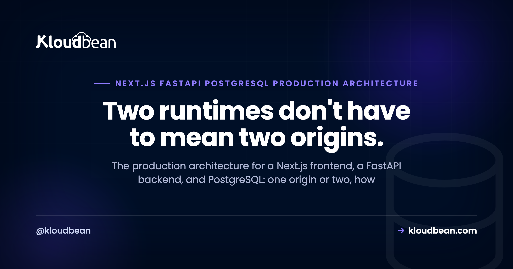

# Next.js + FastAPI + PostgreSQL: The Production Architecture

By Kloudbean Engineering · Two runtimes don't have to mean two origins.

You built the frontend in Next.js and the backend in FastAPI, and now you have to run both in production with a real database behind them. That is a different problem from a single-runtime app, because a Next.js FastAPI PostgreSQL production architecture involves two separate processes in two languages that still have to feel like one product to the browser. This guide walks the decisions that specific split forces on you: one origin or two, how FastAPI actually runs, where Next.js should call the API, and how PostgreSQL sits behind it all. No fluff, no invented benchmarks, just the shape that holds up.

> **The short version**
> Run Next.js and FastAPI as two long-lived processes and put PostgreSQL behind them as a managed database. The cleanest default is to keep both on one server behind a reverse proxy so they share an origin, which skips CORS and keeps your secrets server-side. Split to separate origins only when you have a concrete reason, then add connection pooling, a background worker if you need one, SSL, and backups as the app grows.

## Why a Next.js and FastAPI app is always two processes

Next.js runs on Node. FastAPI is a Python app. You can't run Python inside a Node process, so the moment you pick this stack you've committed to two long-running processes in two languages. That single fact drives almost every decision below.

This is what makes the polyglot case different from an all-Node stack. If your backend were Express or Nest, you'd have one runtime and could even collapse everything into a single process. Here you can't, and that's fine. The question is never "one process or two," because it's always two. The real question is where those two processes live and how they talk to each other.

So don't waste energy trying to smuggle FastAPI in as a subprocess of Next.js, or rewriting a perfectly good Python API into TypeScript just to unify the language. The split is normal. You just have to lay it out well.

## One origin or two? The decision that shapes the rest

Here's the fork that matters most, and it's worth deciding on purpose instead of by accident.

**Option A, one origin.** Both processes live on the same server. A reverse proxy (Nginx or Caddy) terminates TLS, serves the Next.js app, and forwards a path like `/api` to FastAPI on an internal port. To the browser it's all one domain, one origin.

**Option B, two origins.** The frontend sits on `app.example.com` and the API on `api.example.com`, often on separate servers. Now the browser sees two origins, and that's genuinely cross-origin.

My opinion, stated plainly: colocate on one origin unless you have a real reason to split. Same origin means no CORS to configure, cookies just work, your secrets stay on the server, and you manage one certificate and one deploy target. The moment you go cross-origin you inherit CORS and cross-origin auth (SameSite cookies, credentialed requests, preflights), which is a whole class of "works locally, breaks in production" bugs. That exact failure and its fix are covered in [CORS errors in production](https://www.kloudbean.com/blog/fix-cors-error-node-production/); the browser rule is identical whether your API is Node or FastAPI, you just configure it with FastAPI's `CORSMiddleware` instead.

Good reasons to split do exist: the API also serves a mobile app or third parties, two teams ship on very different cadences, or you need to scale the API independently of the frontend. If one of those is true, split with your eyes open. The broader version of this call is in [do I need separate frontend and backend servers](https://www.kloudbean.com/blog/do-i-need-separate-frontend-and-backend-servers/), and the case for keeping everything together is in [hosting your app, API, and database on one server](https://www.kloudbean.com/blog/host-app-api-and-database-on-one-server/).

| | One origin (colocated) | Two origins (split) |
| --- | --- | --- |
| Reverse proxy routing | `/` to Next.js, `/api` to FastAPI | Separate hosts, separate proxies |
| CORS | None needed | Must configure allowed origins |
| Cookies and auth | Same-origin, straightforward | SameSite and credentials to manage |
| TLS certificates | One | One per origin |
| Independent scaling | Harder, same box | Easier, scale each side |
| Best for | Most apps, especially early | Multiple clients or separate teams |

One thing that makes starting colocated less of a commitment than it looks: on a managed platform the two processes are two applications on a server, and moving the API to its own server later is a provisioning step plus an environment variable, not a re-architecture. Kloudbean works that way, which is worth knowing mainly because it removes the usual excuse for splitting on day one "so we don't have to later." You will be able to later.

## What the Next.js + FastAPI + PostgreSQL architecture looks like

Top to bottom, the request path is short: the browser talks to Next.js, Next.js (or the browser) talks to FastAPI, and FastAPI talks to PostgreSQL. Each layer has one job and one thing that tends to bite it in production.

<!-- ADD IMAGE: a clean redraw of the layer diagram if desired. src -> images/layers.png -->

*Read it top to bottom: the browser only ever needs your origin, and each layer below it does one job.*

| Layer | What runs there | The production concern |
| --- | --- | --- |
| Browser / client | The user's device | Only sees public data and auth tokens, never DB credentials |
| Next.js | A Node process (SSR, SSG, ISR, route handlers) | Server-side data fetching; holds server-only env secrets |
| Reverse proxy | Nginx or Caddy | TLS termination and routing `/api` to FastAPI for one origin |
| FastAPI | A Python ASGI app under Uvicorn workers | Stateless; validates input; scales by workers and instances |
| PostgreSQL | A managed database | Connection pooling, backups, IP allow-listing, indexes |
| Worker (optional) | Celery plus a broker | Keeps slow tasks off the request path |

You don't need every row on day one. The reverse proxy and worker are the two you add when the shape calls for them. But it helps to see the whole thing at once, because it shows why the "where does Next.js call the API" question and the "how many connections does Postgres get" question are really the same architecture, viewed from different layers. If you want the wider version that adds a vector store, queue, and object storage, see the [AI app reference architecture](https://www.kloudbean.com/blog/ai-app-reference-architecture/).

## How FastAPI actually runs in production

FastAPI is an ASGI application, not a server. It needs an ASGI server to run it, and that's Uvicorn. In production you typically don't run a bare Uvicorn; you run multiple Uvicorn workers, either with Uvicorn's own `--workers` or managed by Gunicorn with the Uvicorn worker class. Then you supervise that process (systemd or the platform's process manager) so it restarts on crash and on boot.

A few sharp edges people hit here. Don't ship `uvicorn --reload`, that's a development convenience and it will hurt you under load. Don't run `python main.py` with the built-in dev server and call it production. And understand what workers buy you: async lets a single worker handle many IO-bound requests concurrently, while multiple workers give you real parallelism across CPU cores. One worker on a multi-core box is leaving capacity on the floor; a hundred workers with a tiny database pool behind them is a different problem (more on that below).

Supervision is the part that's easiest to get wrong by hand and least interesting to own. It's also where a managed platform earns its keep: both processes run always-on rather than spinning down between requests, and the Python and Node runtime versions are set in the console rather than over SSH, which matters here because a Python version bump can invalidate a compiled wheel just like a Node bump breaks a native module. Pinning the runtime deliberately, in a place you can see, beats discovering it from a build log.

Keep the FastAPI process stateless. No in-memory sessions, no local file writes you can't lose, nothing that assumes there's only one worker. Statelessness is what lets you add workers or a second instance later without rewriting anything. I'm keeping this to the architecture role on purpose; the step-by-step and the common myths live in [deploying a FastAPI app](https://www.kloudbean.com/blog/deploy-fastapi-app/), and the "where should this Python app even live" decision is in [where to deploy a Python app](https://www.kloudbean.com/blog/where-to-deploy-a-python-app/).

## Where should the Next.js app call the API from?

Next.js can reach FastAPI from two very different places, and mixing them up is where secrets leak.

**Server-side.** From server components, route handlers, or `getServerSideProps`, the call happens on the Next.js server. It's server-to-server, so if you've colocated, Next.js can even hit FastAPI on localhost. No CORS, and any secret stays on the server.

**Client-side.** From the browser with `fetch`. If you've split origins, this is cross-origin and triggers CORS. More importantly, anything this code touches is visible to the user, so it must never carry a secret key.

The rule that follows: secret credentials (a Stripe secret key, an internal service token) live in server-side environment variables only. Anything prefixed `NEXT_PUBLIC_` is shipped to the browser, so it is public by definition. Never put a secret there. The clean pattern for most apps is a backend-for-frontend: the browser only ever calls your own Next.js server, and Next.js calls FastAPI with the credentials attached. The browser never sees the API key, and you sidestep CORS entirely. Running that Next.js process itself (the `next build` then `next start` part) is covered in [deploying Next.js to your own server](https://www.kloudbean.com/blog/deploy-nextjs-app-to-your-own-server/).

## PostgreSQL and the pooling problem

PostgreSQL sits behind FastAPI as the source of truth, and the thing that surprises people is connections. Every Postgres connection is a real server-side process with its own memory, and Postgres has a `max_connections` ceiling. Now multiply: several FastAPI workers, each opening its own pool, across maybe two instances. The connection count climbs fast, and one day new requests start failing with "too many clients already."

The fix is pooling done deliberately. Use a driver pool (SQLAlchemy's pool, or asyncpg's) sized sanely per worker rather than opening a fresh connection per request. When the worker count grows past what the database comfortably holds, put a pooler like PgBouncer in transaction mode in front of Postgres so hundreds of app-side connections map to a small, steady number of real database connections. Size the pool to the database, not to your optimism.

Run Postgres as a managed database rather than one you babysit. Managed means automatic backups, version patching, and access control handled for you. Lock it down with IP allow-listing so only your application server's address can connect, and pair that with strong credentials and SSL. On Kloudbean that allow-list is the mechanism to use on a standard plan: you whitelist your app server's IP on the database and everything else is refused. Private networking and a VPC exist, they're an Enterprise feature, so don't design a standard-plan setup around the assumption that the database is unreachable from the internet by default. Allow-listing is what does that job for you. One honest opinion: SQLite is lovely in development and wrong for a multi-worker production API, because concurrent writers and a file-based database don't get along. Use Postgres in production. The why-Postgres and what-managed-unlocks detail is in [managed PostgreSQL hosting](https://www.kloudbean.com/blog/managed-postgresql-hosting/).

## Do you actually need background jobs?

Probably not on day one, and that's worth saying because Celery is a whole subsystem people bolt on out of habit.

You need a background worker when a request triggers slow work: sending email, resizing an image, generating a report, or calling a slow third-party or model. If you do that work inside the FastAPI request, you block a worker and eventually time the user out. The answer is to hand the job to a queue: Celery (or RQ, Dramatiq, arq) with a broker like Redis or RabbitMQ, processed by a separate worker process. Yes, that's another persistent process to run, which is exactly why you only add it when there's a real slow task.

Two practical notes on where those pieces live. The broker is usually Redis, and Redis is one of the seven managed engines on the same launch screen as Postgres (MySQL, MariaDB, PostgreSQL, Redis, Memcached, Elasticsearch, MongoDB), so it's a click rather than a second vendor and a second bill. And a lot of what people reach for Celery to do is really just scheduled work, which a cron entry configured from the dashboard handles without a broker or a worker at all. Reach for the queue when a user action triggers the slow thing, not when a nightly job does.

FastAPI's built-in `BackgroundTasks` is fine for tiny fire-and-forget work that can safely vanish if the process restarts. Anything you actually care about finishing wants a real broker and worker. The anti-pattern to avoid: doing heavy work in the request path and then scaling workers to hide the symptom. Move the work off the request instead.

## The layer that saves you: SSL, domains, and backups

The unglamorous parts are the ones that decide whether a bad day is survivable.

Put a real domain in front (one domain if colocated, or app and api subdomains if you split), serve everything over TLS, and redirect HTTP to HTTPS. Free certificates via Let's Encrypt are standard now, so there's no excuse to run plain HTTP. Keep configuration in per-environment variables rather than hardcoded values, so staging and production don't share a database by accident.

Certificates are the one item on this list nobody should still be doing by hand. Free, auto-renewing TLS is table stakes on any managed platform now, and an expired certificate taking a product down in 2026 is an embarrassing way to lose a morning.

Then backups. Automatic backups on the database, plus an on-demand one you take yourself right before a risky migration, which is the backup you'll actually want. And here's the part people skip: restore one at least once, so you know the backup is real and you know the steps before you need them at 2am. Restores are the feature; backups are just the prerequisite. This layer is boring right up until the moment it's the only thing between you and a very bad week.

## Why the line falls between your two processes and everything under them

Look back at the layer table and notice something about it. Every row splits cleanly into two kinds of problem, and the split isn't about who's more capable. It's about where the information lives.

The rows underneath your code are all decisions with one right answer that doesn't depend on your product. TLS termination, HTTP to HTTPS redirects, certificate renewal, starting a process on boot and restarting it on crash, keeping the OS and the Python and Node runtimes patched, taking a database backup on a schedule, refusing connections from IPs you didn't allow-list. None of that needs to know what your app does. That's exactly why it's safe to hand over, and why a managed platform can run your two processes and the Postgres behind them without ever reading your code. It's also why "we'll set up TLS and supervision ourselves" is a strange hill to pick: you inherit a permanent maintenance job in exchange for no differentiation.

The rows at and above your code are the opposite. They can only be answered by something that knows your architecture, and no platform can answer them for you:

- **Which origin the browser is allowed to call.** Colocated or split is your decision, and if you split, the CORS allow-list is a line in your FastAPI config. A host can't guess your frontend's origin.
- **Which environment variables are secrets.** `NEXT_PUBLIC_` is a rule about your intent. The platform stores whatever you put in it, faithfully, including a Stripe secret key you accidentally prefixed for the browser.
- **How big the pool is.** Only your code knows how many workers you run and how many connections each one holds. A managed Postgres will hand out connections until it hits its ceiling and then start refusing them, correctly.
- **Whether a retried job is safe to run twice.** Idempotency is business logic. A broker guarantees delivery, not that charging a card twice is fine.
- **Whether your app boots.** No host fixes this, ours included. A managed server will start your process faithfully every single time, including the build with the import error in it, and restart it just as faithfully in a crash loop.

That's the honest shape of managed hosting: it owns the layers where the correct answer is universal, and it can't touch the layers where the answer is yours. If you'd rather not hand-wire process supervision, TLS, runtime versions, and database backups, Kloudbean runs both processes on managed servers with managed PostgreSQL and Redis behind them, one dashboard, and moving the API to its own server later stays a config change. The architecture above is the same either way, which is rather the point of drawing it first.

<!-- cta:start -->
**One click to a real database.**

Seven managed engines, provisioned and patched for you, with access controlled and backups running automatically. Your schema, your queries, and your data stay exportable with the standard tools.

- Seven managed engines
- One-click launch
- Automatic backups
- Controlled access
- Standard connection strings
- Free migration assistance

[Start free](https://console.kloudbean.com/register) · [See plans](https://www.kloudbean.com/pricing/)
<!-- cta:end -->

## FAQ

**Should Next.js and FastAPI run on the same server or separate servers?**
For most apps, especially early, run them on one server behind a reverse proxy that serves Next.js and forwards `/api` to FastAPI. That gives you one origin, no CORS, and simpler deploys. Split onto separate servers when you need to scale the API independently, serve multiple clients, or let two teams ship on different cadences.

**How do I avoid CORS errors between Next.js and FastAPI?**
The simplest way is to not create the situation: keep both on one origin so requests are same-origin and CORS never triggers. If you split origins, configure FastAPI's CORSMiddleware with your real frontend origin, allow credentials if you send cookies, and handle preflight requests. The browser rule is the same one Node apps hit; only the configuration syntax differs.

**Do I run FastAPI with Uvicorn or Gunicorn in production?**
Both, together, in the common setup. Uvicorn is the ASGI server that runs FastAPI, and Gunicorn manages multiple Uvicorn workers so you get parallelism across CPU cores plus process supervision. You can also use Uvicorn's own workers flag. What you should not do is run the reload flag or the bare development server in production.

**Should Next.js call the FastAPI backend on the server or in the browser?**
Prefer server-side calls from server components, route handlers, or getServerSideProps, because they keep secrets on the server and avoid CORS. Use client-side calls only for data that is safe to expose and never attach a secret key to them. A backend-for-frontend pattern, where the browser only calls your Next.js server, is the clean default.

**Where do I keep API keys in a Next.js and FastAPI app?**
Secret keys belong in server-side environment variables only, read by the Next.js server or by FastAPI. Anything prefixed NEXT_PUBLIC_ is bundled into the browser and is therefore public, so never put a secret there. When the frontend needs data that requires a secret, route the call through the Next.js server so the key stays server-side.

**Do I need connection pooling for FastAPI and PostgreSQL?**
Yes, once you run more than a trivial setup. Each Postgres connection is a real process with a hard ceiling, and multiple FastAPI workers each holding their own pool add up quickly. Use a sanely sized driver pool, and put PgBouncer in transaction mode in front of Postgres when your worker and instance count outgrows what the database holds directly.

**Do I need Celery for a FastAPI backend?**
Only if you have slow work to move off the request path, like sending email, processing media, or calling a slow external service. When you do, Celery or a similar queue with a Redis or RabbitMQ broker and a separate worker process is the right shape. If you have no long-running tasks yet, skip it; it is a real subsystem to operate and adds nothing without a job to run.

**Can one server run both a Next.js process and a FastAPI process?**
Yes. They are two separate long-running processes, and a single server can run both, with a reverse proxy in front routing traffic to each. PostgreSQL usually runs as its own managed database rather than on the same box. This colocated setup is the common starting point, and you can move the API to its own server later if you need to.

**How is a Next.js and FastAPI stack different from an all-Node stack?**
An all-Node stack uses one runtime for both frontend and backend, so it can share a single process and one language. A Next.js and FastAPI stack is polyglot: a JavaScript frontend and a Python backend, which means two runtimes and two processes no matter what. Everything else, the database, pooling, SSL, and backups, is broadly the same; the split is what changes.

---

*Kloudbean Engineering · Two processes, one origin unless you have a reason to split, a managed database behind them.*
