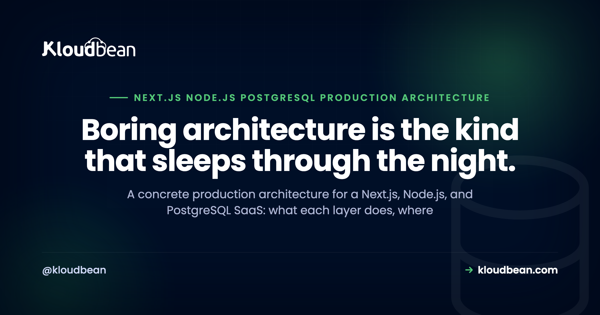

# Next.js, Node, and PostgreSQL: The Production Architecture

By Kloudbean Engineering · Boring architecture is the kind that sleeps through the night.

Next.js on the front, a Node API in the middle, PostgreSQL underneath. It's one of the most common stacks a small SaaS team reaches for, and one of the easiest to over-engineer before it has earned a single user. This is a concrete production architecture for a Next.js, Node.js, and PostgreSQL app: what each layer does, where it runs, and the handful of decisions that actually matter. Opinionated where it helps, honest about the tradeoffs, and no diagram drawn just to have a diagram.

> **The short version.** A Next.js frontend, a Node API, and PostgreSQL is a solid production stack. Start with the API colocated (Next.js route handlers, or one Node server) and one managed Postgres, both behind SSL, with a connection pool and automatic backups. Split the API into its own service only when a real reason shows up.

## The Next.js, Node, and PostgreSQL stack in one diagram

Before any code, it helps to see the shape. Four layers, top of the stack down to the data: the browser, Next.js, a Node API, and PostgreSQL. Requests flow down and the data flows back up the same path. A cache or a job queue can hang off the API later, but it's optional, so leave it out of the picture until you actually need it.

The reason to start with the drawing is simple. Most production problems are really just one layer talking to the next in a way nobody planned for. Get the boundaries right and almost everything else is detail.

<!-- ADD IMAGE: layered architecture diagram. Row of boxes left to right: Browser (navy) -> Next.js (navy) -> Node API (purple) -> PostgreSQL (green). A dashed "Redis: cache / queue (optional)" box above the API, and an "Automatic backups" box below Postgres. Arrows left to right, plus vertical arrows to the cache and backups. Brand colors navy #000f27, purple #4F1AF3, green #40b75f. -->

*Browser to Next.js to Node API to Postgres. A cache or queue is optional, and backups run off the database.*

## Does the API live inside Next.js, or in its own Node service?

This is the first real decision, and people agonise over it far more than they should. Next.js can be your whole backend. Route handlers (the app router's `route.ts` files, or the older `pages/api`) run server-side and can query Postgres directly. For plenty of SaaS apps, that is the entire API, and it works fine.

The other option is a separate Node service, usually Express or Fastify, that Next.js calls over HTTP. That's the right move when the API has a life of its own. A mobile app hits it too. It needs to scale or deploy on a different cadence than the frontend. The team splits along that line.

My honest take: start colocated. One codebase, one deploy, one thing to reason about. Split later, when a concrete reason turns up, not because a diagram on the internet had two boxes. The full version of that call is in [do I need separate frontend and backend servers](https://www.kloudbean.com/blog/do-i-need-separate-frontend-and-backend-servers/), and the case for keeping them together lives in [running the app, API, and database on one server](https://www.kloudbean.com/blog/host-app-api-and-database-on-one-server/).

## Why the Node API has to run as a persistent process

Here's where self-hosting bites people who came from static hosting. A Next.js app in production (with SSR or API routes) and a Node API are not files a web server hands out on request. They're long-running programs. Something has to start the process, keep it alive, and restart it when it crashes or the box reboots.

That something is a process manager. PM2 is the common one for Node. It runs your app, respawns it if it dies, and can run several instances to use more than one CPU core. Without it, your app runs until the first crash or the first reboot, and then it's just gone, quietly, usually at the worst possible time.

This is also the line between a persistent server and serverless. Serverless spins a function up per request and tears it down after; a persistent Node process stays warm and can hold things like a database pool between requests. For a stateful API talking to Postgres, persistent is usually the simpler model to reason about. It's worth checking that whatever you deploy to actually runs a persistent process rather than sleeping it: on Kloudbean the app runs always-on with PM2 supervising it and multi-process mode available when you want more than one core, so the pool you open on boot is still there on the hundredth request. That property is the whole reason the next section is short. More on getting a Node app onto a managed host is in [deploying a Node app to managed cloud](https://www.kloudbean.com/blog/deploy-node-app-to-managed-cloud/).

## PostgreSQL, and the connection pool Node can't skip

PostgreSQL is the easy call here. It's reliable, it handles JSON when you need it, and a managed instance means someone else deals with patching, replication, and the parts you'd rather not babysit. Run it as a managed database sitting right next to the API, and lock it to your app server's IP so nothing else can open a connection. On a Kloudbean standard plan that IP allow-list is the mechanism, one click on the database, and it's the sentence to use instead of "it's on a private network," because a VPC is an Enterprise feature and you shouldn't design around one you don't have.

The part people miss is the connection pool. Every Postgres connection costs memory on the database, and Postgres has a hard ceiling set by `max_connections`. Node's async model makes it very easy to fire off dozens of queries at once, each grabbing its own connection, and you hit that ceiling fast. The symptom is ugly: `sorry, too many clients already`, and requests start failing under exactly the load you were hoping to handle.

A pool fixes it. You open a fixed set of connections once and reuse them across requests. In plain `pg` that's a `Pool`; Prisma, Drizzle, and Sequelize all pool for you once configured. The rule of thumb: one pool per process, sized to your database, not a fresh client per request. The why and the how are in [database connection pooling](https://www.kloudbean.com/blog/database-connection-pooling/), and the managed side is in [managed PostgreSQL hosting](https://www.kloudbean.com/blog/managed-postgresql-hosting/).

## Where secrets and environment variables belong

Your `DATABASE_URL`, API keys, and signing secrets do not belong in the code, and they really don't belong in the Git repo. They belong in environment variables, injected at runtime, kept separate from the build.

Next.js has a sharp edge worth calling out here. Anything prefixed `NEXT_PUBLIC_` gets baked into the browser bundle in plain text, visible to anyone who opens dev tools. So a public key can carry that prefix; a database URL or a secret key never can. Keep secrets server-side, read them in route handlers or the Node API, and keep them off the client entirely.

In practice: set them where your host injects runtime config, keep a `.env` out of version control, and rotate anything that leaks. Boring work. Also the difference between a normal Tuesday and a very bad one.

One ordering detail that catches people out, and it's specific to Next.js rather than to any host. `NEXT_PUBLIC_` values are read at build time, so if your platform injects environment variables only at run time, a public variable added after the build is simply missing from the bundle. Set the variables first, then trigger the build. On Kloudbean the variables live in the app's runtime config in the dashboard and the Git deploy builds after they're set, which is the order you want, and it's still your job to notice when you've added one and not rebuilt.

## Background jobs, and when a request shouldn't wait

Some work has no business happening inside a web request. Sending email, resizing an image, calling a slow third-party API, generating a report. Make a user wait on those and the request either times out or just feels broken.

The fix is to move that work off the request path, and two shapes cover most needs. A scheduled job (a cron entry) handles work that runs on a timer: nightly cleanup, a digest email, a periodic sync. A queue with a worker handles work triggered by a user action: the request drops a job on the queue and returns immediately, then a separate worker (often the same codebase run in a different mode) processes it. Redis is the usual backing store for that queue.

Don't build this on day one if you don't need it. But know the seam is there. When a request starts doing too much, you'll know exactly where that work should move.

## Uploads, static assets, SSL, and the domain

A few smaller layers that still bite if you ignore them.

User uploads should not land on the app server's local disk. It feels fine in development, then you redeploy or add a second server and the files are gone, or invisible to half your traffic. Put them in object storage (an S3-compatible bucket) and store the URL in Postgres. Kloudbean has that storage built in, S3-compatible so the AWS SDK and CLI work unchanged, and data transfer out of those buckets isn't metered, which is a real thing to check for an app that serves images. That last part applies to the built-in S3 storage specifically, not to every service on the platform. Static assets that Next.js builds are fine served by Next.js, and a CDN in front helps with reach.

SSL is not optional. Your domain serves over HTTPS, browsers expect it, and a lot of features (secure cookies, service workers) quietly require it. Point the domain at the server, terminate SSL, redirect HTTP to HTTPS, done. Most platforms issue and renew the certificate for you now, so this is a checkbox rather than a chore.

## Backups, the layer you only notice when it's gone

Backups are the layer nobody thinks about until the one day they'd have saved everything. Your Postgres data is the part of this whole stack you cannot rebuild from a Git push. The app is code. The database is the business.

So: automatic backups on a schedule, kept somewhere separate from the database itself. And then the step people skip, actually restore one, once, into a throwaway environment, so you know the backup is real and you know the steps before you need them at 2am. An untested backup is a guess wearing a plan's clothes.

## Each layer, its job, and its production concern

Here's the whole stack on one page. Read it top to bottom and you have the architecture.

| Layer | Its job | The production concern |
| --- | --- | --- |
| Browser / client | Renders the UI, holds the session | Never trust it; keep secrets off it |
| Next.js | Frontend, SSR, can host the API | Runs as a process, not static files |
| Node API | Business logic, talks to the database | Must stay alive (process manager) |
| PostgreSQL | The source of truth, your data | Connection pool plus backups |
| Cache / queue (optional) | Speeds reads, offloads slow work | Add only when a need appears |
| Object storage | Holds uploads and large files | Not the app server's local disk |
| Secrets / env | Config and credentials at runtime | Out of the code, out of Git |
| Backups | The recovery path | Automatic, and actually tested |

## Start colocated, split when you have a reason

If you take one thing from all this, take this: most teams should start with everything colocated and split later. Next.js plus its route handlers (or one Node server behind it), one managed Postgres, on one server. That single shape carries a real SaaS a surprisingly long way.

The anti-pattern I see most is splitting too early. Someone reads about microservices, or copies a big-company architecture diagram, and starts with a frontend, an API, three services, and a queue before they have any users. Now every feature touches four deploys and a network hop, and the thing that was meant to scale just slowed the team down.

Split when there's a reason you can say out loud. The API needs to scale on its own. A worker is heavy enough to starve the web process. Another client depends on the API. A separate team owns the backend. Those are real reasons. A diagram is not.

## The cheapest version of this that actually holds up

Since the advice throughout has been "add it when you need it," it's fair to say exactly what the floor looks like. Here's the smallest setup I'd be willing to put real users on, with nothing in it that's there for show.

1. **One server, running both processes.** Next.js and the Node API on the same box, always-on under a process manager. Not two servers. Not a Kubernetes cluster. One.
2. **One managed PostgreSQL, allow-listed to that server.** One pool per process, sized to the database. Nothing else may open a connection.
3. **Environment variables injected at runtime, `.env` out of Git.** Nothing with `NEXT_PUBLIC_` in front of it that you'd mind a stranger reading.
4. **A domain with free auto-renewing TLS, HTTP redirecting to HTTPS.** Certificate renewal is not a calendar reminder.
5. **A bucket for uploads.** Even if there are three uploads a week. The disk-loss failure only needs to happen once.
6. **Automatic backups, plus one restore you have actually performed.** The restore is the item, not the backup.

That's it. No Redis, no queue, no CDN, no replicas, no separate API service. Each of those is a real tool with a real trigger: Redis when a read is hot enough to cache or a user action triggers slow work, a replica when reads outgrow one box, a split service when you can name why out loud. Adding them before the trigger buys you deploys and network hops and nothing else.

On a managed platform that list is close to the default rather than a project. Kloudbean's standard plans start at $8/mo for the server, with the managed database, the S3-compatible bucket, free SSL, Git deploys, and automatic backups in the same dashboard, so the six items above are mostly checkboxes and a connection string. Vertical resize up is self-serve when the box gets busy, though note disk only grows: you can't shrink it later, so step up rather than guessing high.

Three things stay yours no matter how much of this you hand over, and they're the three most likely to break your launch. A missing index will be slow on any host. A pool sized wrong will exhaust any Postgres. And your app crashing on boot is not something any host fixes, ours included, because a managed server starts the process you gave it faithfully, including the broken one, and restarts it just as faithfully. Managed means the floor is solid. The building is still your work. The frontend step-by-step is in [deploying a Next.js app to your own server](https://www.kloudbean.com/blog/deploy-nextjs-app-to-your-own-server/), and the AI-app variant of this architecture is in [the AI app reference architecture](https://www.kloudbean.com/blog/ai-app-reference-architecture/).

---

**Keep the architecture, skip the wiring.** A managed server for your Next.js and Node API, a managed PostgreSQL beside it, with free SSL and automatic backups from one dashboard. See [kloudbean.com](https://www.kloudbean.com/) and [pricing](https://www.kloudbean.com/pricing/).

## FAQ

**What does a production architecture for Next.js, Node, and PostgreSQL look like?**
Four layers: the browser, a Next.js frontend, a Node API, and PostgreSQL as the database. Requests flow from the browser through Next.js to the API, which reads and writes Postgres through a connection pool. A cache or job queue is optional and added later. Most teams run it all colocated on one server to start, with automatic backups and SSL in place.

**Should the API live inside Next.js or in a separate Node service?**
Start inside Next.js. Route handlers run server-side and can query Postgres directly, which is enough for many SaaS apps. Move to a separate Node service (Express or Fastify) when the API needs to scale or deploy independently, or when other clients like a mobile app use it. Split for a named reason, not by default.

**Why does Node need a connection pool for PostgreSQL?**
PostgreSQL limits how many connections it will accept, and each one uses memory. Node's async style makes it easy to open many connections at once and exhaust that limit, which shows up as a too many clients already error. A pool opens a fixed set of connections and reuses them, so you stay under the ceiling. Use one pool per process.

**How do I keep a Node API running in production?**
Run it under a process manager like PM2. It starts your app, restarts it if it crashes, and brings it back after a reboot, so the process stays alive without you watching it. On a managed platform this is handled for you. The key idea is that a Node or Next.js server is a long-running program, not a set of static files.

**Where should secrets and environment variables live?**
In environment variables injected at runtime, never in the code or the Git repo. In Next.js, remember that anything prefixed NEXT_PUBLIC_ is shipped to the browser, so secrets must not use that prefix. Read secrets server-side only, keep your .env out of version control, and rotate anything that leaks.

**Where should user uploads go in production?**
Into object storage, such as an S3-compatible bucket, not the app server's local disk. Local disk feels fine in development, but files are lost on redeploy and invisible across multiple servers. Store the file in the bucket and keep its URL in Postgres.

**Do I need Redis or a message queue for background jobs?**
Not on day one. Start with a scheduled cron job for timed work, and only add a queue when a user action triggers slow work that shouldn't block the request. When you do, Redis is the common backing store, with a worker processing jobs off the queue. Add the seam when the need is real, not before.

**When should I split the Node API into its own service?**
When you can name the reason. The API needs to scale separately from the frontend, a background worker is heavy enough to slow the web process, other clients depend on the API, or a separate team owns it. Absent one of those, keep it colocated. Splitting early usually adds deploys and network hops without a matching benefit.

**Can Next.js route handlers be my whole backend?**
Yes, for many apps. Route handlers run on the server and can talk to Postgres, handle auth, and call third-party APIs, so they can be the entire API layer. You outgrow that when you need the backend to run or scale independently of the frontend, at which point a separate Node service makes sense.

---

*Kloudbean Engineering · Start colocated, keep it boring, and split a layer out only when it earns it.*
