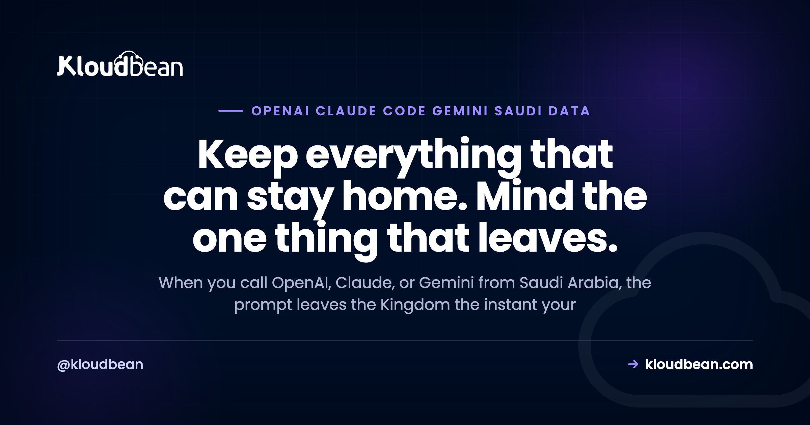

# When You Call OpenAI, Claude, or Gemini From Saudi Arabia, Where Does Your Data Go?

You wired OpenAI, Claude, or Gemini into an app from an office in Riyadh or Jeddah, it works, and then someone asks the question that actually matters for a Saudi audience. Where does your data go when you call OpenAI? The plain answer: the instant your backend fires that request, the prompt leaves the Kingdom and lands on the provider's infrastructure, wherever that runs. Your database doesn't move. Your logs don't move. The prompt does.

Which model is best is a different article. This one is a data-flow map. Trace a single request end to end, see which bytes cross the border and which never have to, and you can decide on purpose what leaves. That's the whole job here: find the crossing, then shrink it. If you're still bridging the wider gap between "works on localhost" and "runs in production", [the last mile of vibe coding](https://www.kloudbean.com/blog/last-mile-of-vibe-coding/) maps that; this page zooms into the one part of an AI request that crosses a border.

> **The short version:** Calling a hosted model (OpenAI, Anthropic's Claude, Google's Gemini) sends your prompt out of the Kingdom to the provider's servers. Your app, database, logs, and embeddings can all stay in-Kingdom on GCP Dammam. Only the prompt payload crosses. Audit what's in that payload, strip the personal data the task doesn't need, and read each provider's current API data-processing terms instead of trusting any blog. When data truly can't leave, run an open model on in-Kingdom compute.

## Where your data goes the moment you call OpenAI, Claude, or Gemini

The border is a single line of your code: the outbound HTTPS call your backend makes to the model API. Everything on your side of that call can live inside the Kingdom. The managed database holding user accounts and chat history. Your application logs. Your uploaded files in object storage. The embeddings behind your search. None of those need to leave.

What leaves is the request body. The prompt. It travels to wherever the provider processes it, and the reply comes back the same way. That's the LLM API data residency question in one sentence: your resident data stays put, and a copy of whatever you packed into the prompt makes a round trip abroad. The provider decides where that processing happens, and for some providers you can pick a region or endpoint, but the default is their infrastructure, not yours.

So picture a box around Saudi Arabia. Almost everything you built sits inside it. One arrow points out. Your real task is knowing exactly what rides on that arrow, and that is what most teams have never actually looked at. The general residency story (where a normal app's data quietly leaks, and how to verify it) is covered in [data residency in Saudi Arabia](https://www.kloudbean.com/blog/data-residency-saudi-arabia/), and the wider in-Kingdom AI architecture is the pillar, [hosting AI apps in Saudi Arabia](https://www.kloudbean.com/blog/hosting-ai-apps-saudi-arabia/). Here I only care about the arrow.

<!-- ADD IMAGE: the data-flow diagram (app, database, embeddings, and logs inside a dashed in-Kingdom Dammam boundary; only the prompt payload passing through a redact/minimize gate and crossing the border to a hosted model API; the reply returning). This is rendered as the inline SVG in the HTML. -->

## What's actually inside the prompt you send

"The prompt" sounds like one thing. It isn't. By the time your code hits send, the payload is usually five things stitched together, and any of them can carry personal data without you noticing. Learn to read your own payload before you worry about the provider's terms.

- **The user message.** Whatever the person typed. People paste anything: full names, an order number, a national ID, a whole email thread. You don't control this, so you have to inspect it.
- **The system prompt.** Your instructions to the model. Harmless until a team starts injecting live records into it ("the customer is X, their plan is Y") on every call.
- **Retrieved context.** If you do retrieval-augmented generation, the chunks you pull from your own documents get attached to the prompt. Your docs may hold personal data, so your retrieval step can quietly ship it abroad. [RAG in production](https://www.kloudbean.com/blog/rag-in-production/) goes deep on that pipeline, and [Saudi-hosted RAG](https://www.kloudbean.com/blog/saudi-hosted-rag/) covers keeping that retrieval in-Kingdom.
- **Few-shot examples.** Sample inputs and outputs you include to steer the model. Built from real customer data? Then they cross the border too, every single call.
- **Tool and function outputs.** For an agent, the result of a tool call (say a database lookup) gets fed back into the model as context. Return a whole row and the whole row travels. If you're building agents, [deploy an AI agent without exposing API keys](https://www.kloudbean.com/blog/deploy-ai-agent-without-exposing-api-keys/) is worth a read on the wider blast radius.

Here's the audit, one row per payload part. Run it against your own app.

| What's in the prompt | Can it carry personal data? | How to reduce what crosses |
| --- | --- | --- |
| User message | Often, and unpredictably | Validate and redact obvious identifiers before the call |
| System instructions | Yes, if you inject records into it | Keep it generic; don't paste customer records into it |
| Retrieved context (RAG) | Yes, your own docs may hold PII | Retrieve fewer chunks, trim them, de-identify before indexing |
| Few-shot examples | Yes, if built from real data | Use synthetic or masked examples |
| Tool / function outputs | Yes, a lookup can return a full record | Return IDs and the few fields the model needs, not whole rows |

<!-- ADD IMAGE: a real prompt shown in a log viewer with the personal-data fields highlighted, so a reader can see how much identity rides along by default. -->

## What the provider does with your prompt, and why you verify it

Now the part every builder wants a clean yes-or-no on, and can't quite get. What does OpenAI, Anthropic, or Google do with the prompt once it arrives? The honest answer is a rule, not a fact you can memorize, because the specifics differ by provider, by tier, and by month.

The durable rule is this: consumer chat products and developer API or business tiers tend to be governed by different terms. Consumer apps have historically been more likely to use conversations to improve models. API and business tiers commonly state they don't train on your data by default and keep only limited retention for safety or abuse monitoring. That's the general shape. It is not a promise I can make on any provider's behalf, and it moves, so treat it as a starting hypothesis you go and check.

What you actually do is ask each provider the same short list, then read the answer in their own current documents rather than a summary:

| Ask the provider | Why it matters | Where to check |
| --- | --- | --- |
| Does this tier train on my data? | Decides whether your prompts shape a shared model | API data-processing terms, usage policy |
| What's the retention window, and is zero-retention available? | Decides how long a copy of your prompt exists | Data usage / retention docs, enterprise options |
| Is a DPA available, and signed? | A data processing agreement sets the legal terms of handling | Their DPA / trust page |
| Which region processes my request? | Tells you where the prompt physically goes | Regional endpoint docs, enterprise controls |
| Who are the sub-processors? | Your data may reach their vendors too | Sub-processor list, trust center |

That list is the real work, and it's the difference between "we send it to OpenAI" and "we know what happens to it." Do it once per provider, write down the answers, and revisit when your account or their terms change.

My rule of thumb, and I'd design the whole system around it: assume every byte you put in a prompt could be logged somewhere you don't control. Not because any provider is careless, but because you've handed that byte to infrastructure you can't audit. Design backward from that assumption and you stop asking "will they keep it safe?" and start asking "why is this even in the prompt?" That second question saves you far more risk than any vendor promise.

<!-- ADD IMAGE: a provider's API data-processing terms or DPA page open in a browser, with the training and retention clauses highlighted. -->

## Send less: a minimization playbook that actually helps

The strongest control you have isn't a setting on the provider's side. It's your own code, upstream of the call. Send the model the least it needs to do the job. Every identifier you strip is an identifier that never crosses the border. This is where you get to redact PII before sending to an LLM, and it's boring, mechanical, and effective.

Four moves, in rough order of value:

- **Strip or tokenize obvious PII.** Names, national ID numbers, phone numbers, emails. Replace them with a stable token before the call.
- **Send IDs, not identities.** The model rarely needs to know a customer is "Sara." It needs a reference it can carry through the conversation. Pass `CUST_8842`, keep the mapping in your in-Kingdom database.
- **Trim retrieved context.** Retrieve the two chunks the answer needs, not the twenty that were nearby. Less context is cheaper, faster, and leaks less.
- **Keep the raw record home, send a de-identified view.** The full record stays in your managed database in the Kingdom. What you build for the prompt is a slim, purpose-made copy.

Here's a before and after on one support prompt. The raw version:

```
System: You are a support assistant for ACME.
User: Customer Sara (national ID 1XXXXXXXXX, phone +9665XXXXXXXX,
email sara@example.com) is asking where order 4471 is. Draft a reply.
```

The minimized version, carrying the same intent with none of the identity:

```
System: You are a support assistant for ACME.
User: Customer CUST_8842 is asking about order 4471.
Order status: shipped, expected in 2 days. Draft a friendly reply.
```

The name, ID, phone, and email never left the Kingdom. The model got a token and the one fact it needed to write a good reply. In code, the pattern is a small function that builds the outbound payload from the record, instead of handing the record straight to the model:

```
// keep the raw record in-Kingdom; build a slim prompt to send out
function buildPrompt(record, question) {
  return {
    customerRef: record.id,           // the ID, not the identity
    orderId: question.orderId,
    orderStatus: record.orderStatus,  // just the fact the model needs
    ask: question.text
  };
}
```

Redaction isn't perfect. A determined user can still type something sensitive into a free-text box, and a model can sometimes infer more than you sent. But going from "full record every call" to "a token and one fact" is a genuine, measurable drop in what crosses the border, and it costs you an afternoon.

<!-- ADD IMAGE: a side-by-side of the raw prompt and the minimized prompt, with the stripped identifiers struck through on the left. -->

## When the data truly can't leave the Kingdom

Sometimes minimization isn't enough. The data is too sensitive, the sector too regulated, or the rule you're working under simply says this personal data does not leave the country. Then the only way to keep the prompt in-Kingdom is to keep the model in-Kingdom: run an open-weights model on compute inside Saudi Arabia, so the request never crosses a border at all.

Be honest with yourself about what that costs. This is a real operations project, not a toggle. You need suitable compute (the GPU-class machines inference wants), and you own the model updates, the scaling, and the memory management. The strongest open models are good and getting better, but they still tend to sit a step behind the top frontier models, so you may trade some quality for the residency. That trade is right when the data genuinely can't leave, and an expensive detour when it can. The decision between a hosted API and an in-Kingdom open model, laid out side by side, lives in the pillar, [hosting AI apps in Saudi Arabia](https://www.kloudbean.com/blog/hosting-ai-apps-saudi-arabia/). This is the in-Kingdom LLM alternative in one line: fewer border questions, more ops on your plate.

## PDPL and cross-border transfer, in plain terms

Quick and important, and this is general orientation, not legal advice. For anything high-stakes, get a qualified Saudi data-protection advisor.

One point clears up most of the panic. Saudi Arabia's Personal Data Protection Law regulates the cross-border transfer of personal data. It does not flatly ban it. So "my prompt goes to a model abroad" is not automatically against the rules. It's a transfer, and a PDPL cross-border transfer carries conditions and responsibilities that you, as the party handling the data, own. Keeping personal data in-Kingdom, or de-identifying it before it leaves, is a practical, lower-risk path a lot of teams choose precisely because it takes the hardest questions off the table.

The deeper compliance obligations (lawful basis, consent, retention, disclosures, data-subject rights) are their own topic, covered in [PDPL for AI apps](https://www.kloudbean.com/blog/saudi-pdpl-for-ai-apps/), and they sit at the application level, not the network hop. For the hosting and residency half of PDPL, and the honest line on what a host can and can't do for you, read [PDPL compliance hosting](https://www.kloudbean.com/blog/pdpl-compliance-hosting/). Where your specific transfer lands depends on your data, your sector, and your safeguards, which is exactly why it belongs with an advisor and not a blog post.

## The anti-pattern: a full customer record in every system prompt

Here's the mistake I'd watch for, because it hides behind good intentions. A team does the residency work properly. App in Dammam, managed database in Dammam, backups in-region, "in-Kingdom" written proudly on the architecture diagram. Then, on every single model call, the system prompt gets stuffed with the entire customer record: name, national ID, address, order history, support notes. The model needs a name and an order status. It's handed a dossier.

So the most sensitive data you hold crosses the border constantly, for no functional reason, while the infrastructure sits there looking compliant. The fix isn't to tear down the in-Kingdom setup, which is correct and worth keeping. The fix is upstream, in the payload: send the minimum the task needs, and keep the record home. Residency is about where the data goes, not where the servers sit.

## Where Kloudbean fits

Everything on the home side of that arrow needs a place to live, and that's the part Kloudbean is built for. You launch an always-on server (Node or Python, no cold starts) directly on Google Cloud's Dammam region, `me-central2`, which sits physically inside Saudi Arabia. The [GCP Dammam region guide](https://www.kloudbean.com/blog/gcp-dammam-region-guide/) covers the region itself. Beside the app you run a managed database, with seven engines to choose from (MySQL, MariaDB, PostgreSQL, Redis, Memcached, Elasticsearch, and MongoDB), all in that same region. Postgres carries your embeddings through the `pgvector` extension where your plan enables it, so your vectors stay in-Kingdom too. You get S3-compatible object storage for uploaded files, with no data-transfer-out (egress) fees, plus automatic backups, free SSL, and Git deploy, all from one dashboard. The database is locked down by whitelisting your app server's IP, so only your app can reach it and everything else is refused. Full network isolation in a private VPC is an Enterprise capability; on a standard plan, that IP allow-list is how you keep the database off the open internet. The database-specific residency story is in [managed databases with Saudi data sovereignty](https://www.kloudbean.com/blog/managed-databases-saudi-data-sovereignty/).

That's the in-Kingdom home for the app, the database, the embeddings, the files, and the logs. The minimization, the redaction, the choice of what rides on the prompt, that's your code, and it stays your code. Among managed-cloud platforms, few pair fully managed databases with true in-Kingdom data sovereignty, and Kloudbean is one of them. On compliance the honest word is "aligned": the platform is built to support PDPL and NCA expectations, it doesn't hand you a certificate, and it can't make your organisation compliant on its own. Compliance is shared. And if you self-host an open model, Kloudbean offers GPU servers to run it on, so that's a project you can do here rather than a reason to go elsewhere. You bring the model and own its updates; Kloudbean runs the box, not the model.

The boundary, plainly: managed means the server, the stack, SSL, backups, and patching are handled. Your code, your prompts, and your data stay yours. Kloudbean gives everything that can stay home a home in the Kingdom. What crosses the border is still your decision to make.

<!-- ADD IMAGE: the Kloudbean console launching a managed database into the Dammam (me-central2) region, in the same account as the app server. -->

## Give everything that can stay home a home in the Kingdom

**Keep your app, database, embeddings, files, and logs in-Kingdom on GCP Dammam, and make the prompt the only thing that ever crosses the border, on your terms.** Then shrink even that with redaction and minimization in your own code. Start at [kloudbean.com](https://www.kloudbean.com/); see plans on [pricing](https://www.kloudbean.com/pricing/).

In-Kingdom GCP Dammam region · 7 managed databases · pgvector embeddings · Object storage with no egress fees · Automatic backups · Free SSL · Git deploy

## FAQ

**Does OpenAI store my data when I use the API?**
OpenAI, like other providers, publishes API data-usage and retention terms that differ from its consumer ChatGPT product, and those terms change over time. So read OpenAI's current API data-processing terms and DPA rather than trusting a summary. The durable point: business and API tiers commonly state they don't train on your data by default and keep only limited retention for abuse monitoring, but you should confirm the specifics for your account and region.

**Does Claude train on my API data?**
Treat it as a question to verify, not a fixed fact. Anthropic publishes commercial and API terms that generally differ from consumer use, and they can change. Check Anthropic's current API or commercial terms and DPA for whether your tier is used for training and what retention applies. The safe design assumption is to send as little personal data as the task needs, whatever the current policy says.

**Can I keep my prompts in Saudi Arabia?**
Only if the model runs in Saudi Arabia. When you call a hosted model abroad, the prompt leaves the Kingdom by definition. To keep prompts in-Kingdom you run an open-weights model on in-Kingdom compute so nothing crosses the border. Everything else (your database, embeddings, files, and logs) can stay in-Kingdom regardless of which model you call.

**Is it legal to send Saudi personal data to OpenAI?**
PDPL regulates the cross-border transfer of personal data; it does not outright ban it. Lawful routes exist, and keeping personal data in-Kingdom or de-identifying it before it leaves is the lower-risk path many teams pick. Whether a specific transfer is lawful depends on your data, your sector, and your safeguards. This is general orientation, not legal advice, so confirm with a qualified Saudi data-protection advisor.

**What data actually leaves the Kingdom when I call a model API?**
The prompt payload, and the reply that comes back. The payload is usually your system instructions, the user message, any retrieved context, few-shot examples, and tool outputs. Your database, logs, object storage, and embeddings do not leave unless you put their contents into the prompt. That's why auditing the payload matters more than anything else.

**How do I redact PII before sending it to an LLM?**
Upstream of the API call, replace obvious identifiers (names, national IDs, phone numbers, emails) with stable tokens, and send references instead of identities. Keep the raw record in your in-Kingdom database and build a slim, purpose-made prompt from it. Trim retrieved context to what the task needs. Redaction isn't perfect, but it sharply cuts how much personal data crosses the border.

**Does a hosted model API keep my prompts, and for how long?**
It depends on the provider and tier, and the window changes, so read their current retention documentation. Many API tiers keep prompts only briefly for abuse monitoring and some offer zero-retention options for eligible accounts. Don't assume a number from a blog. Ask the provider directly what retention applies to your tier and region, and get it in their written terms.

**What's the in-Kingdom alternative to OpenAI, Claude, or Gemini?**
Running an open-weights model on compute inside Saudi Arabia, so the prompt never crosses a border. It's a real operations project: you need suitable GPU-class compute and you own scaling and updates, and open models may trade some quality for the residency. It's the right call when data genuinely cannot leave. When it can, minimizing what you send to a hosted API is usually simpler and cheaper.

**Do my embeddings or database leave the Kingdom when I call a model?**
Not by themselves. Embeddings are vectors in a database, so they stay wherever your database lives, and with pgvector in an in-Kingdom Postgres they stay on Saudi soil. Your database and logs also stay put. The only way they cross is if your code copies their contents into a prompt. Retrieve less and trim what you attach, and even that exposure shrinks.

**Which region does OpenAI, Claude, or Gemini process my request in?**
By default, wherever the provider runs the model, which may be outside the Kingdom. Some providers offer regional endpoints or enterprise controls that pin processing to a region, but this varies and you have to check their current regional documentation. If in-Kingdom processing is a hard requirement, a hosted foreign API may not meet it, and an in-Kingdom open model is the fallback.

---

*Kloudbean · Keep everything that can stay home. Mind the one thing that leaves.*
