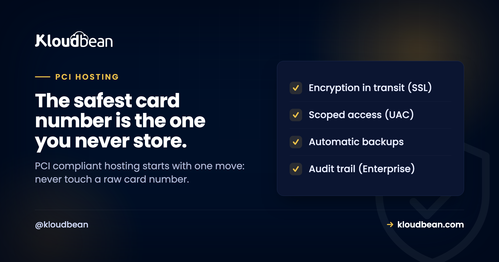

# PCI-Compliant Hosting: Why Scope Reduction Beats Everything Else

You want to take card payments. Then a client, a bank, or your payment provider asks the question that stops you cold: is your hosting PCI compliant? PCI DSS is the card industry's security standard for anyone who touches cardholder data, and it can look like a wall of requirements. So people go shopping for "PCI compliant hosting" expecting the server to solve it. The server helps. But it's not where the biggest win is.

Here's the win, and it's a little counterintuitive: the cheapest, safest path to PCI is to **never see a raw card number in the first place**. Get the card data off your systems and most of PCI simply stops applying to you. Do that before you touch a single firewall rule.

> **The short version:** Reduce your scope first. Use a payment processor (Stripe, Adyen, PayPal) with tokenization or hosted fields so card numbers go straight to them and never land on your server. That can drop you to the shortest self-assessment, SAQ A. Then secure the scope you keep with encryption in transit, a firewall, private networking, access control, logging, and backups. PCI is a process you complete and your bank signs off, not a badge your host wears.

## Start here: shrink the scope, not the server

PCI "scope" is everything that stores, processes, or transmits cardholder data, plus everything connected to it. The bigger that footprint, the more of PCI applies and the more you have to prove. So the smartest engineering move is to make the footprint tiny.

The way you do that is tokenization. Instead of a card number (the PAN, or primary account number) flowing through your app, you drop the payment provider's hosted fields or redirect into your checkout. The customer types their card into an iframe that belongs to the processor, not to you. The processor takes the card, hands you back a token, and you store the token. You can charge that token later, refund it, save it for repeat billing, all without the real number ever touching your server or database.

When card data never lands on your infrastructure, huge sections of PCI stop being your problem. Concretely, fully outsourcing payments this way is what qualifies most small and mid-size merchants for **SAQ A**, the shortest self-assessment, with a fraction of the controls to attest to. Start handling raw card data yourself and you climb to longer, stricter questionnaires like SAQ D, ASV scans, and possibly a full assessment. Same business, wildly different amount of work.

```
RECOMMENDED
  [Card data] --hosted fields--> [Payment processor] --token only--> [Your server]
                                  Stripe · Adyen · PayPal            keeps a token
                                                          PCI scope: small (SAQ A)

AVOID IF YOU CAN
  [Card data] --raw card numbers (PAN)--> [Your server + database]
                                          stores and handles PAN
                          PCI scope: huge (SAQ D, ASV scans, maybe an audit)
```

## Two ways to take a payment, side by side

| | Processor holds the card | You store the card |
| --- | --- | --- |
| What touches your server | A token | Raw card numbers (PAN) |
| Typical self-assessment | SAQ A (shortest) | SAQ D (longest) |
| Requirements to attest | A handful | Dozens, plus scans |
| Breach blast radius | Tokens, not usable cards | Real card data |
| Who builds the card form | The processor (hosted fields) | You do |
| Good fit for | Almost everyone | Rare, high-volume, specific needs |

My blunt opinion: unless you have a very specific reason and a compliance budget to match, put yourself in the left column and stay there. The teams that get into trouble are usually the ones who decided to "just handle the card ourselves" and underestimated what that pulls in.

<!-- ADD IMAGE: your payment provider's hosted checkout or embedded card fields, showing the card is typed into the processor, not your app -->

## The scope you keep still needs a secure foundation

Reducing scope shrinks the problem. It doesn't erase it. You still run a server that processes payment intents, stores tokens, holds customer records, and connects to the processor. That footprint has to be secured, and this is where hosting earns its keep.

**Encrypt everything in transit.** Every page and API call that touches payment or personal data runs over HTTPS/TLS, no mixed content. This is non-negotiable under PCI and it's the easiest box to tick, because a managed host issues and auto-renews a free SSL certificate for you.

**Segment the network.** Your database and any sensitive service belong on a private network with no public address, behind a firewall that closes every port you don't need. An exposed database is found by automated scanners within hours, not weeks. If the term is new to you, here's [what a VPC is](https://www.kloudbean.com/blog/what-is-a-vpc/) and why it matters.

**Control access tightly.** Unique logins for every person, no shared accounts, and least privilege so people can reach only what their job needs. Restrict where admins can even connect from with IP allow-lists. The goal is to be able to say exactly who can reach what.

**Patch and harden.** Unpatched software is how a lot of breaches start. The OS and stack need regular updates, and baseline protections like a firewall plus brute-force blocking should be running by default rather than being a task you remember to do.

**Protect the public-facing app.** PCI wants public web apps defended against common attacks, whether through regular code review or a web application firewall. Worth reading: [what a WAF does](https://www.kloudbean.com/blog/what-a-waf-does/), [DDoS protection](https://www.kloudbean.com/blog/ddos-protection-explained/), and sensible [security headers](https://www.kloudbean.com/blog/security-headers-guide/).

**Log who did what, and keep the logs safe.** PCI requires a record of access to systems and data so an incident can be investigated. On enterprise accounts an immutable audit trail records every significant action across the account, which is exactly the evidence an assessor asks for. Keep logs in access-controlled storage, private by default.


**Back up, then test the restore.** PCI is about resilience as much as secrecy. Automatic [backups](https://www.kloudbean.com/blog/server-backups-guide/) stored off the main server mean an incident doesn't erase your records. Testing that they actually restore is the step people skip until the day it matters.

> **The classic own-goal.** A team turns on verbose logging "just for debugging" and starts writing full HTTP request bodies to disk. Those bodies include the card numbers customers typed. Now the logs contain PAN, the log server is in scope, and a nice small SAQ A footprint just quietly became a big one. Scrub payment fields before anything gets logged, and never log a full card number, ever.

## What "PCI compliant hosting" can and can't do for you

PCI compliance is a process *you* complete. For most merchants that means a Self-Assessment Questionnaire, sometimes quarterly ASV scans, and for larger volumes a formal assessment by a QSA that produces a Report on Compliance. Your acquiring bank and payment provider define which applies and are the ones who ultimately sign off. No host does that for you.

What a host provides is the infrastructure the standard leans on. Kloudbean, for its part, gives you the controls that support the scope you keep: free SSL for encryption in transit, a configured Shorewall firewall with Fail2ban brute-force blocking, IP access control so only your app server can reach the database, subusers and granular access control for least privilege, automatic backups, and, on enterprise accounts, private networking and an immutable audit trail. It runs on tier-1 clouds whose data centers carry the major certifications. What it won't do, because no honest host can, is make you PCI compliant on its own or hand you a finished status. Reduce your scope, secure what's left on solid infrastructure, and complete the validation your bank requires. That's PCI done properly. If you're mapping several obligations at once, the siblings help: [SOC 2 compliant hosting](https://www.kloudbean.com/blog/soc2-compliant-hosting/) and [GDPR compliant hosting](https://www.kloudbean.com/blog/gdpr-compliant-hosting/).

<!-- ADD IMAGE: the SAQ A questionnaire from your acquiring bank, or the compliance tab in your processor dashboard -->

A last note on keys. The API keys and secrets your app uses to talk to the payment processor are themselves sensitive. Don't paste them into code or commit them to Git. Keep them in managed environment variables with controlled access, and rotate them when someone leaves.


---

**A smaller thing to secure, on a stronger foundation.** Run payments on managed infrastructure with the controls that support your PCI work, all on one dashboard. Start free at [kloudbean.com](https://www.kloudbean.com/) and see plans on [pricing](https://www.kloudbean.com/pricing/).

Free SSL · Firewall + brute-force blocking · Access control · Automatic backups · Enterprise audit trail

## PCI hosting FAQ

**Does PCI-compliant hosting make my business PCI compliant?**
No, it's one part. A host secures and documents the infrastructure: network controls, patching, access, logging, backups. You own the application layer, how your code handles card data, and the validation you complete with your bank and processor. A host provides controls that support PCI. It can't hand you finished compliance.

**What's the easiest way to reduce PCI scope?**
Never handle raw card numbers. Use a PCI-compliant processor like Stripe, Adyen, or PayPal so card details go straight to them through hosted fields, and you store only a token. If the card number never touches your server, large parts of PCI stop applying. It's the single biggest simplification available to most businesses.

**What is an SAQ, and which one applies to me?**
An SAQ is a Self-Assessment Questionnaire you complete to validate PCI compliance. The version depends on how you handle card data. Fully outsource payments and you typically use SAQ A, the shortest. Handle card data directly and you move to longer ones like SAQ D. Your acquiring bank or processor tells you which applies.

**Do I need HTTPS everywhere for PCI?**
Yes. Any page or API call involving payment or personal data must run over HTTPS/TLS with no mixed content. It's non-negotiable under PCI and easy to satisfy, because a managed host issues and auto-renews a free SSL certificate, so encryption in transit is on by default.

**Should my database be on the public internet for PCI?**
No. Your database should never have a public address. The self-serve control every user can apply is IP allow-listing: whitelist your app server's IP so only it can connect, behind a firewall that closes unused ports. For the fuller network segmentation PCI expects on critical systems, a private network (VPC) removes the public endpoint entirely, which on Kloudbean is an Enterprise capability. Either way, keeping the database off the public internet takes it off the scanners' radar.

**Can I store card numbers if I encrypt them?**
You can, but you probably shouldn't. Storing card data, even encrypted, pulls your systems into full PCI scope with far more requirements, scans, and cost. Encryption is required if you store it, but the cheaper and safer choice for most businesses is to not store it at all and let a processor hold it.

**What hosting controls actually help with PCI?**
Encryption in transit through free SSL, a configured firewall with brute-force protection, IP access control so only your app server reaches the database, unique logins and least-privilege access, automatic tested backups, and tamper-resistant logging through an audit trail on enterprise setups. These cover the infrastructure side. Reducing scope and securing your app cover the rest.

**Do I need a QSA audit or just an SAQ?**
Most smaller merchants complete an SAQ and, where required, quarterly ASV scans. Higher transaction volumes or storing card data can trigger a formal assessment by a Qualified Security Assessor that produces a Report on Compliance. Your acquiring bank sets the requirement based on your volume and how you handle data.

**Is a web application firewall required for PCI?**
For public-facing web apps, PCI expects you to address common attacks either through regular code review or a web application firewall. A WAF is a common way to meet it. Pair it with encryption, access control, and patching rather than treating it as the only defence.

---

*Kloudbean · The safest card number is the one you never store.*
