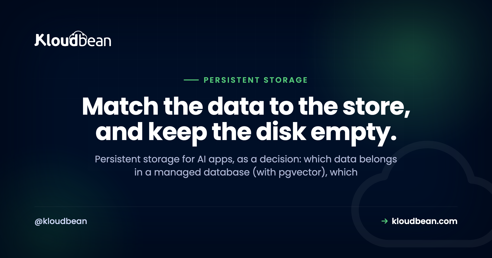
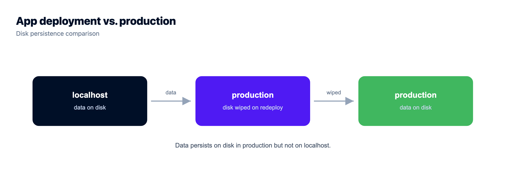
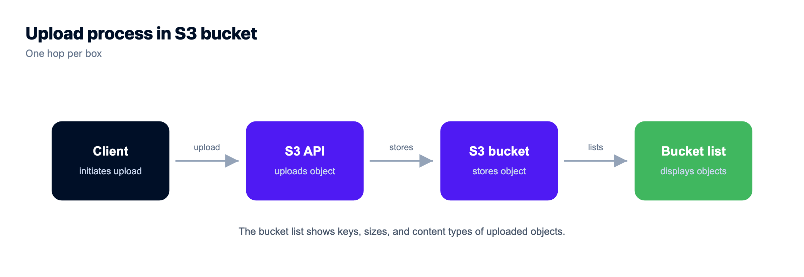

# Persistent Storage for AI Apps: Database, Disk, or Object Storage?

You built an AI app. Maybe in Lovable or Cursor, maybe by hand against the OpenAI or Anthropic SDK, and it runs great on your laptop. Then a real user signs up, uploads a file, has a conversation, and you hit the question nobody warned you about: where does all this actually live? Persistent storage for AI apps is the part the builder quietly skipped, and it's the part that decides whether your data is still there tomorrow.

The confusing bit is that "storage" isn't one thing. An AI app holds a few different kinds of data, and each kind wants a different home. Put them in the wrong place and it looks fine in the demo, then breaks the first time you ship an update. So let's sort it out. Four kinds of state, three durable stores, and one place you should never trust with anything that matters.

> **The short version:** An AI app has four kinds of state. Structured records (users, conversations, app state, and embeddings) go in a managed database, Postgres by default, with pgvector holding the embeddings. Files (uploads, RAG source documents, generated images) go in S3-compatible object storage. Sessions, counters, and cached answers go in Redis with TTLs. The app's local disk gets wiped on redeploy, so nothing important should ever live there.

## What persistent storage for AI apps really means

Persistent storage for AI apps just means storage that outlives the running process. Your app restarts. You push new code. The host moves you onto a fresh container. A truly persistent store doesn't care about any of that: the data is still there when the process comes back. The trap is that the most obvious place to write something, the app's own filesystem, is usually not persistent at all. More on that below, because it's the mistake that hurts most.

So the useful question isn't "which database should I use." It's "what kind of data is this, and where does that kind belong?" Sort your data into four buckets and the right answer falls out almost every time. This whole topic is one piece of a bigger picture, the [last mile of vibe coding](https://www.kloudbean.com/blog/last-mile-of-vibe-coding/), which covers everything an AI builder leaves for you to figure out before launch.

The four kinds of state an AI app has:

- **Structured records.** Users, conversations, orders, app state, and embeddings. Anything you query, join, or filter.
- **Files.** User uploads, the source documents you feed a retrieval pipeline, and images or exports your app generates.
- **Ephemeral and fast.** Sessions, rate-limit counters, cached model answers. Short-lived by nature.
- **Scratch.** A temp file you can regenerate in seconds and would never miss if it vanished.

Three of those four want a durable home that lives outside your app. Here's how they wire together.

<figure>
<svg viewBox="0 0 780 440" role="img" aria-label="Persistent storage for an AI app. In the centre is a dashed boundary marked YOUR APP, wiped on redeploy, containing the running process and a local disk box. Three durable stores sit outside that boundary: a managed database with pgvector for structured records, object storage for files, and Redis for sessions, cache, and limits. Solid arrows run from the app across the boundary to each durable store. A separate arrow from the app to the local disk box is struck through with a red cross, because the local disk is ephemeral and disappears on redeploy." xmlns="http://www.w3.org/2000/svg">
  <defs>
    <marker id="pa" markerWidth="9" markerHeight="9" refX="7" refY="4" orient="auto"><path d="M0,0 L8,4 L0,8 Z" fill="#4F1AF3"/></marker>
  </defs>

  <text x="60" y="34" font-family="Poppins,sans-serif" font-size="12" font-weight="700" letter-spacing="1" fill="#4F1AF3">INSIDE THE APP (WIPED ON REDEPLOY)</text>
  <text x="560" y="34" font-family="Poppins,sans-serif" font-size="12" font-weight="700" letter-spacing="1" fill="#40b75f">DURABLE, OUTSIDE THE APP</text>

  <rect x="60" y="150" width="330" height="250" rx="16" fill="none" stroke="#4F1AF3" stroke-width="1.4" stroke-dasharray="7 6"/>

  <rect x="120" y="196" width="180" height="76" rx="10" fill="#000f27"/>
  <text x="210" y="228" text-anchor="middle" font-family="Poppins,sans-serif" font-size="14" font-weight="600" fill="#fff">Your app</text>
  <text x="210" y="248" text-anchor="middle" font-family="Poppins,sans-serif" font-size="10.5" fill="#9fb0cc">the running process</text>

  <rect x="110" y="304" width="200" height="70" rx="10" fill="#f6f7fb" stroke="#c9d0e3" stroke-width="1.5"/>
  <text x="210" y="332" text-anchor="middle" font-family="Poppins,sans-serif" font-size="12.5" font-weight="600" fill="#000f27">Local disk</text>
  <text x="210" y="350" text-anchor="middle" font-family="Poppins,sans-serif" font-size="10" fill="#8a97ad">ephemeral, gone on redeploy</text>

  <line x1="210" y1="272" x2="210" y2="300" stroke="#8a97ad" stroke-width="2" stroke-dasharray="5 4"/>
  <line x1="196" y1="278" x2="224" y2="296" stroke="#d64545" stroke-width="2.6"/>
  <line x1="224" y1="278" x2="196" y2="296" stroke="#d64545" stroke-width="2.6"/>
  <text x="250" y="291" font-family="Poppins,sans-serif" font-size="10.5" font-weight="600" fill="#d64545">don't</text>

  <rect x="560" y="64" width="184" height="86" rx="10" fill="#fff" stroke="#40b75f" stroke-width="1.5"/>
  <text x="652" y="94" text-anchor="middle" font-family="Poppins,sans-serif" font-size="13" font-weight="600" fill="#000f27">Managed database</text>
  <text x="652" y="113" text-anchor="middle" font-family="Poppins,sans-serif" font-size="10.5" fill="#5b6a86">structured records</text>
  <text x="652" y="130" text-anchor="middle" font-family="Poppins,sans-serif" font-size="10.5" fill="#4F1AF3">+ pgvector embeddings</text>

  <rect x="560" y="182" width="184" height="86" rx="10" fill="#fff" stroke="#40b75f" stroke-width="1.5"/>
  <text x="652" y="212" text-anchor="middle" font-family="Poppins,sans-serif" font-size="13" font-weight="600" fill="#000f27">Object storage</text>
  <text x="652" y="231" text-anchor="middle" font-family="Poppins,sans-serif" font-size="10.5" fill="#5b6a86">files, uploads, docs</text>
  <text x="652" y="248" text-anchor="middle" font-family="Poppins,sans-serif" font-size="10.5" fill="#5b6a86">S3-compatible</text>

  <rect x="560" y="300" width="184" height="86" rx="10" fill="#fff" stroke="#40b75f" stroke-width="1.5"/>
  <text x="652" y="330" text-anchor="middle" font-family="Poppins,sans-serif" font-size="13" font-weight="600" fill="#000f27">Redis</text>
  <text x="652" y="349" text-anchor="middle" font-family="Poppins,sans-serif" font-size="10.5" fill="#5b6a86">sessions, cache, limits</text>
  <text x="652" y="366" text-anchor="middle" font-family="Poppins,sans-serif" font-size="10.5" fill="#5b6a86">with TTLs</text>

  <line x1="300" y1="214" x2="556" y2="107" stroke="#4F1AF3" stroke-width="2" marker-end="url(#pa)"/>
  <line x1="300" y1="234" x2="556" y2="225" stroke="#4F1AF3" stroke-width="2" marker-end="url(#pa)"/>
  <line x1="300" y1="254" x2="556" y2="343" stroke="#4F1AF3" stroke-width="2" marker-end="url(#pa)"/>

  <text x="430" y="150" text-anchor="middle" font-family="Poppins,sans-serif" font-size="10" fill="#4F1AF3">records</text>
  <text x="440" y="221" text-anchor="middle" font-family="Poppins,sans-serif" font-size="10" fill="#4F1AF3">files</text>
  <text x="430" y="316" text-anchor="middle" font-family="Poppins,sans-serif" font-size="10" fill="#4F1AF3">fast state</text>
</svg>
<figcaption>The rule in one picture. Three durable stores live outside your app, so a redeploy can't touch them. The local disk lives inside the app boundary and gets wiped, which is why the arrow to it is crossed out.</figcaption>
</figure>

## Structured records go in a managed database

If you query it, join it, filter it, or count it, it's a structured record and it belongs in a relational database. Users, accounts, conversations, messages, orders, subscription state, usage events. Postgres is the sane default here, and it's the one I reach for first for almost any AI app. It's durable, it does transactions, and it will still be the right call when your app is ten times bigger.

Embeddings are the part people overthink. An embedding is just a vector of numbers you search by similarity, and the instinct is to run out and buy a dedicated vector database. You usually don't need one. The `pgvector` extension stores embeddings right inside Postgres, next to the rows they describe, so you keep the whole thing in one database and query records and vectors together. [pgvector for AI apps](https://www.kloudbean.com/blog/pgvector-for-ai-apps/) walks through how that works. When you're ready to store embeddings and shape the tables around them, [production database design for AI apps](https://www.kloudbean.com/blog/production-database-design-for-ai-apps/) covers the schema, and [managed PostgreSQL hosting](https://www.kloudbean.com/blog/managed-postgresql-hosting/) covers running the database itself.

Worth knowing before you pick: `pgvector` isn't universally available, because it depends on the Postgres version and how the instance was set up. Check it's there rather than assuming, on Kloudbean's managed PostgreSQL or anywhere else. If it isn't, you're not stuck, you just store embeddings differently or move to a version that has it. Kloudbean runs seven managed engines (PostgreSQL, MySQL, MariaDB, Redis, Memcached, Elasticsearch, MongoDB), so the vector question is a Postgres-setup question, not a change of vendor.

The database vs object storage line trips people up, so make it concrete: rows you look up by value go in the database; big blobs you serve whole go in object storage. A user's name, plan, and last login are records. The 40MB PDF they uploaded is a file. Don't stuff the PDF into a Postgres column "to keep it together." That bloats the database, slows backups, and makes every query drag the blob around.

## Files go in object storage, not on the app disk

Files are the second bucket, and this is where AI apps leak data fastest. When you need to store files an AI app produces or receives (user uploads, the source documents behind a retrieval pipeline, generated images, CSV exports), they go in object storage, the S3-compatible kind, not on the server's disk. Object storage is built for exactly this: large binary blobs, addressed by a key, served by URL, durable by default, and reachable from every instance of your app at once.

There's a neat split with the previous section worth calling out. When you build retrieval, the raw source document (the PDF, the markdown file, the transcript) lives in object storage. The embedding you compute from it lives in Postgres via pgvector. Keep the original file around and you can always re-embed later when you change models or chunking. Throw it away and that door closes.

That "keep the original" advice runs into a real cost problem on some providers, which is why people delete things they shouldn't. Re-embedding means reading every source document back out, and if your bucket bills egress, a single re-embed of a large corpus is a line item you'll notice. Kloudbean's built-in S3-compatible storage doesn't meter data transfer out, so reading your own corpus back is free, which makes "keep everything and re-embed when the model changes" an easy decision instead of a budget conversation. Scope that carefully: it applies to the built-in S3-compatible buckets. Managed Google Cloud Storage is a separate, premium option and it does bill both egress and ingress.

I'm deliberately not rebuilding the how-to here. [Store user uploads in object storage](https://www.kloudbean.com/blog/store-user-uploads-in-object-storage/) has the presigned-URL flow, the bucket setup, and the framework config. The point for this page is just the routing decision: to store uploads an AI app receives, reach for a bucket, not `./uploads`.

## Ephemeral and fast state goes in Redis

Some data is meant to be short-lived, and forcing it into Postgres is a waste. Sessions. Rate-limit counters. A cached model answer you'd happily recompute. This is Redis territory: in-memory, fast, and able to expire keys on its own with a TTL so it never grows unbounded.

Two AI-specific jobs make Redis pull its weight. First, rate limiting. Your app calls a paid model API on your key, and a Redis counter is how you cap how often one user (and everyone together) can trigger that spend. Second, answer caching. If the same question comes in twice, a cached reply skips a fresh, billable model call. Set a TTL that matches how stale you can tolerate.

One rule keeps you out of trouble: Redis is a fast layer, not your source of truth. If Redis got wiped this second, you should be able to rebuild everything in it from Postgres and object storage without losing customer data. Sessions log out, caches go cold, and the app keeps working. Treat it that way and you'll never store something in Redis you can't afford to lose. [Managed Redis hosting](https://www.kloudbean.com/blog/managed-redis-hosting/) covers the setup.

## The trap: your app's local disk is ephemeral

Here's the through-line of this whole page. On most modern hosts, the app's filesystem is ephemeral. Redeploy, restart, crash, or a routine move to a new container, and that disk is wiped and replaced with a clean one. Anything you wrote to it is gone. No warning, no error, just an empty folder where your data used to be.

This is the number one way AI apps lose data, and it wears two disguises. One is the SQLite file: the builder scaffolded a local `app.db`, it worked beautifully in dev, and your first production deploy erased every row (that failure has its own deep dive in [why your SQLite data disappears after a redeploy](https://www.kloudbean.com/blog/why-sqlite-data-disappears-on-redeploy/)). The other is the upload folder, which is worth spelling out because it's so common.

The anti-pattern: your code saves user uploads to `./uploads` on the app server. It's the first thing that works, so it ships. Then two things break it. Your next redeploy wipes the folder and every uploaded file with it. And the moment you run a second instance for traffic, an upload that landed on instance A simply isn't on instance B, so half your requests 404. It passed the demo and failed production, which is the worst kind of bug because you didn't see it coming.

So here's my one firm opinion for this page: the only correct amount of important data on your app's local disk is zero. The disk is fine for one thing, a scratch temp file you can regenerate in seconds (a resized image mid-request, a temp file a library needs). If losing it would ruin your afternoon, it doesn't belong on that disk. This is the single trap behind ephemeral disk horror stories, and it's completely avoidable once you've seen it.

## The decision table: what goes where, and what breaks if you get it wrong

Everything above, condensed. When you're staring at some piece of data and wondering where it goes, this is the lookup. The last column is the point of the whole article: what actually breaks if you default to the local disk instead.

| What you're storing | Right store | Why | What breaks on local disk |
| --- | --- | --- | --- |
| Users, conversations, app records | Managed database (Postgres) | Queried, joined, transactional, durable | Every row gone on the next redeploy |
| Embeddings / vectors | Postgres + pgvector | Search sits next to the data, one database | Lost with the file; similarity search can't scale |
| User uploads and files | Object storage (S3-compatible) | Big binaries, served by URL, shared across instances | Wiped on redeploy; invisible to a second instance |
| RAG source documents | Object storage | Durable original you can re-embed later | You lose the ability to re-embed |
| Generated images / exports | Object storage | Same as uploads, durable and addressable | Gone on redeploy |
| Sessions, rate-limit counters | Redis (with TTL) | Fast, in-memory, auto-expiring | Counters reset, limits leak, users get logged out |
| Cached model answers | Redis (with TTL) | Cheap repeat reads, skips a billable call | Cache is fine to lose, but wrong across two instances |
| Regenerable scratch temp file | Local disk (fine) | Short-lived and reproducible | Nothing. This is the one safe use |

## One database or many? Start with fewer than you think

New AI apps tend to over-build storage. People read about vector databases, dedicated search clusters, and message queues, and reach for five services before they have five hundred users. You almost never need that on day one.

Start with two stores: one managed Postgres for your records and your embeddings (pgvector), and one object storage bucket for your files. That combination covers a surprising share of real AI apps completely. Add Redis when you actually need caching or rate limits, which is usually the moment you start calling a paid model API in anger. Add anything beyond that only when a real bottleneck tells you to, not because a blog post said serious apps have it.

Part of what makes people over-build is that each store usually arrives from a different vendor, with its own dashboard, its own bill, and its own credentials to keep straight. Three stores across three providers genuinely feels like more architecture than three stores in one console does. That's the practical reason a single-dashboard platform matters here: on Kloudbean the server, the managed PostgreSQL, the managed Redis, and the buckets all sit behind one login, so adding the third store is a decision about your app rather than a procurement exercise.

The one thing worth setting up before you feel the pain is connection pooling. Every request that opens a fresh database connection costs you, and Postgres has a hard ceiling on connections that arrives sooner than most people expect. [Database connection pooling](https://www.kloudbean.com/blog/database-connection-pooling/) explains why, and it's cheap insurance. Beyond that, resist the urge to add a store per buzzword. Fewer moving parts is a feature.

## The smallest setup that survives a deploy

If you take nothing else from this page, take the minimum viable version. This is what I'd stand up for an AI app with its first real users, and it's deliberately small:

1. **One always-on app server.** Not a function that cold-starts, not a preview URL. A process that stays up, because a retrieval pipeline and a model call both take longer than a serverless request wants to.
2. **One managed PostgreSQL.** Records and embeddings both live here. Turn on automatic backups on day one, not the day after you need one. Check `pgvector` is available on your version before you design around it.
3. **One S3-compatible bucket.** Uploads, source documents, generated files. Private by default, served through presigned URLs.
4. **A connection pool in front of Postgres.** Twenty lines of config that saves you from the connection ceiling you'll otherwise hit at the worst moment.
5. **`.gitignore` your local data paths.** `./uploads`, `*.db`, `*.sqlite`. Not a storage layer, just the habit that stops you re-creating the trap.

That's it. Skip Redis until you're paying a model API and need to cap it. Skip the dedicated vector database, probably forever. Skip Kubernetes entirely at this size.

On Kloudbean those first four are the same console: launch a server, launch the database, create a bucket, deploy from Git. The database is locked down by whitelisting your app server's IP, so only your app can reach it and everything else is refused. That's the standard control and it's the right one for most apps. Full private networking in a VPC is an Enterprise capability, not the default setup, so don't design around it unless you're on that plan.

Now the part no host solves, ours very much included. Nothing about a managed platform stops your code from writing a user's upload to `./uploads`. Automatic backups protect the database you actually use, not the SQLite file you left on the app disk. If your app puts important data inside the app boundary, that data dies on the next deploy on every host on earth, and the only fix is a line of your code pointing somewhere else. Managed means the server, the stack, SSL, backups and patching are handled. Which store each piece of data belongs in stays a design decision, and you've just made it.

<!-- cta:start -->
**You built the app. Give it a real home.**

Move the whole thing onto a managed server you own: always-on processes, a managed database for real data, object storage for uploads, and Git deploys with live build logs.

- Managed databases
- Always-on processes
- Object storage
- Automatic backups
- Free SSL
- Git deploy
- Free migration

[Start free](https://console.kloudbean.com/register) · [See plans](https://www.kloudbean.com/pricing/)
<!-- cta:end -->

## FAQ

**Where should an AI app store its data?**
Sort it by kind. Structured records (users, conversations, app state, embeddings) go in a managed database like Postgres. Files (uploads, documents, generated images) go in object storage. Short-lived, fast data (sessions, counters, cache) goes in Redis. Nothing important goes on the app's local disk, because that gets wiped on redeploy.

**Can I store files on the app server?**
Not for anything you need to keep. The app server's disk is ephemeral on most hosts, so a redeploy or restart wipes it, and a second instance can't see files written to the first. Save user uploads and generated files to S3-compatible object storage instead, and only use the local disk for a scratch temp file you can regenerate.

**Do I need object storage for my AI app?**
If your app handles any files (user uploads, source documents for retrieval, generated images or exports), yes. Object storage is durable, serves files by URL, and is reachable from every instance at once. If your app only stores structured records and never touches a file, you can skip it until you do.

**Where do embeddings go?**
Usually straight into Postgres using the pgvector extension, alongside the rows they relate to. That keeps records and vectors in one database and lets you query them together. You rarely need a separate vector database early on. Add a dedicated vector store later only if real scale demands it.

**Why does my AI app lose data when I redeploy?**
Because you're storing it on the app's local disk, which is ephemeral. When the host ships new code it usually replaces the container with a clean one, so any SQLite file or uploaded file written to that disk is erased. Move records to a managed database and files to object storage, both of which live outside the app and survive deploys.

**Database vs object storage: which do I use for what?**
Use a database for data you query, join, or filter (records you look up by value). Use object storage for large binary files you serve whole (uploads, documents, images). A user's account details are records; the file they uploaded is a blob. Storing big files in a database column bloats it and slows backups.

**Do I need a separate vector database?**
Most AI apps don't, at least not early. The pgvector extension gives Postgres similarity search, so your embeddings live next to your normal data in one database. That's simpler to run and enough for a lot of production apps. Reach for a dedicated vector store only when scale or specialised indexing genuinely requires it.

**Do I need Redis for an AI app?**
Not on day one. Add it when you need rate limiting (to cap spend on a paid model API), session storage, or a cache for repeated answers. Redis is a fast layer, not your source of truth, so keep it to data you can rebuild from Postgres and object storage. Set TTLs so it stays small.

**Is SQLite fine for an AI app in production?**
It's great in development and wrong for most production apps on managed hosts, because the SQLite file sits on the ephemeral local disk and gets wiped on redeploy. It also doesn't share across multiple instances. Use a managed Postgres for production so your data lives outside the app and survives deploys and scaling.

**How many data stores should my AI app have?**
Start with two: one managed Postgres (records plus pgvector embeddings) and one object storage bucket for files. Add Redis when you need caching or rate limits. Most apps need nothing more for a long time. Add extra services only when a real bottleneck proves you need them, not preemptively.

---

*Kloudbean · Match the data to the store, and keep the disk empty.*
