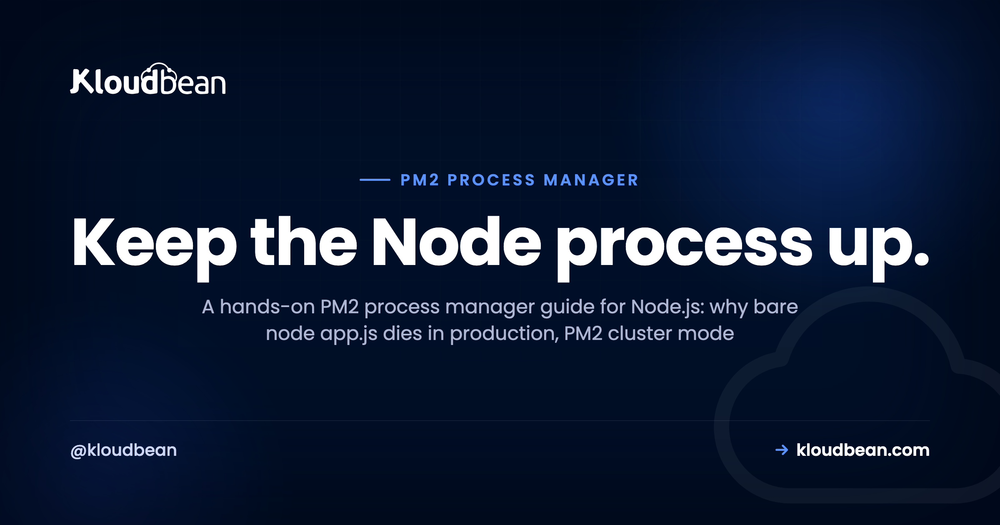
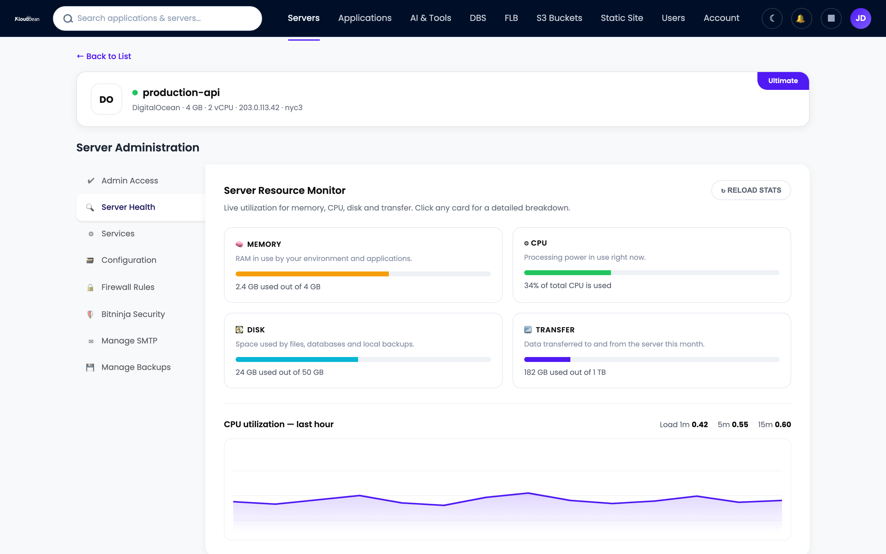

# PM2 Process Manager: Keep Your Node.js App Alive in Production

*By Kloudbean Engineering · Keep the Node process up.*

Your Node.js app runs fine with `node app.js` right up until the moment it doesn't. It throws an unhandled exception and stays dead. The server reboots for a kernel patch and nothing comes back. You paid for four cores and it pins one. The PM2 process manager fixes all of that, and this is the practical guide to using it well: `pm2 start`, cluster mode across every core, the ecosystem config file, zero-downtime reloads, logs, memory limits, and making the whole thing survive a reboot.

> **Short version.** The PM2 process manager keeps your Node.js app running: it restarts the process on crash, runs a copy on every CPU core in cluster mode, reloads new code with zero downtime, and (once you run `pm2 startup` and `pm2 save`) brings everything back after a reboot. Define it once in an `ecosystem.config.js` file, commit that to your repo, and you stop babysitting the process.

## Why bare `node app.js` isn't a production setup

Running `node app.js` in an SSH session is perfect for a demo and wrong for production. Here's what goes wrong, and every one of these is a real outage someone has slept through.

- **One unhandled exception and it's gone.** A rejected promise nobody caught, a bad request that throws deep in a handler. The process exits and stays exited. Nothing restarts it, so your "live" site is a blank connection error until a human notices.
- **It doesn't come back after a reboot.** Your provider patches the kernel and reboots the VM at 4am. sshd comes up, your app does not. You wake to a dead site with no crash to point at, because nothing crashed. Nothing ran.
- **It uses a single core.** Node runs your JavaScript on one thread per process. A four-core server running one `node` process leaves three cores idle while the fourth sits at 100 percent under load. You're paying for hardware you can't reach.
- **Close the terminal, close the app.** Started it over SSH without a supervisor? It's a child of your shell. Log out, it gets a hangup, it dies with you.

A process manager turns that terminal command into a service. It keeps the process up, restarts it on crash, starts it on boot, and runs a copy on every core behind one port. My honest take after plenty of Node deploys gone sideways: never run bare `node app.js` in prod.

*(Diagram: one port in, every core working, from `pm2 start app.js -i max`. Incoming traffic hits a single port :3000, the PM2 master load-balances it across one Node worker per CPU core (workers 1 to 4), and when worker 4 crashes PM2 respawns it automatically while the other three keep serving. Brand navy, purple, green.)*

## First steps with the PM2 process manager: `pm2 start`

PM2 installs from npm and becomes the thing that owns your process. Global install, then hand it your entry file. One warning about that global install: it lands in whatever npm prefix your interactive shell uses, so a deploy script or cron job running under a different environment can install fine and still report `pm2: command not found`, which is nearly always [a PATH problem rather than a missing install](https://www.kloudbean.com/blog/fix-pm2-not-found-after-deploy/).

```
npm install -g pm2

# start your app under PM2 (single process)
pm2 start app.js --name api

# or start it in cluster mode: one worker per CPU core
pm2 start app.js -i max --name api
```

That `-i max` does the heavy lifting. It reads the core count and forks that many workers, all sharing one port, all load-balanced by PM2. No `cluster` module, no code change.

You can point PM2 at whatever your app starts with: a TypeScript build's `dist/server.js`, an `npm start` script, a binary. But you'll want `pm2 start ecosystem.config.js` long term. Typing flags by hand doesn't scale past day one.

<!-- ADD IMAGE: terminal output of pm2 list showing the app online across several workers with uptime and restart counts. -->

## Define it once: the `ecosystem.config.js` file

Flags on the command line get forgotten and drift between machines. The fix is a config file that lives with your code. Create `ecosystem.config.js` in your repo root:

```js
// ecosystem.config.js
module.exports = {
  apps: [{
    name: 'api',
    script: 'app.js',
    instances: 'max',            // one worker per CPU core
    exec_mode: 'cluster',        // enable the built-in load balancer
    max_memory_restart: '300M',  // recycle a worker if it leaks past 300M
    env: {
      NODE_ENV: 'development',
      PORT: 3000
    },
    env_production: {
      NODE_ENV: 'production',
      PORT: 3000
    }
  }]
};
```

Now the whole setup is one command, and every environment runs the same way:

```
pm2 start ecosystem.config.js --env production
```

The `env` blocks are for non-secret config like `NODE_ENV` and `PORT`. Real secrets (your database URL, API keys) don't belong in a committed file; keep those in the environment on the server. The fields that matter most are `instances` and `exec_mode: 'cluster'` for multi-core, and `max_memory_restart`, your seatbelt against a slow leak.

<!-- ADD IMAGE: pm2 monit split view showing per-process CPU and memory bars. -->

## PM2 cluster mode: how many instances should you run?

Cluster mode is the reason most people reach for PM2. `instances: 'max'` (or `-i max`) forks one worker per CPU core and load-balances across them. On a four-core box that's four workers sharing port 3000, so all four cores do work. Usually the right default, and a real throughput win for a CPU-bound API.

Usually. Not always. Two things to weigh before you paste `max` everywhere.

First, headroom. On a small server, `instances: -1` means "all cores but one," leaving a core for the OS and everything else on the box. On a one-core plan, `max` gives you a single worker anyway, so cluster mode adds nothing beyond the crash-recovery you already get.

Second, the one people trip on: each worker is a full, separate Node process with its own memory and its own database connection pool. If your app opens a pool of 10 connections and PM2 runs 4 workers, that's 40 connections to your database, not 10. Multiply workers by pool size and check it against what your database allows. On a small managed Postgres with a connection cap, four hungry workers can hit the ceiling and you'll see "too many connections." Size the per-worker pool with the total in mind. More in [database connection pooling](https://www.kloudbean.com/blog/database-connection-pooling/).

One caveat that causes real bugs: cluster mode assumes your app is stateless between requests. Keep sessions in a plain object and each worker gets its own copy, so a user logs in on worker 1, hits worker 3 next, and they're logged out. Push shared state into Redis or your database. Same for uploads: with multiple workers, only one ends up with the file.

## The commands you'll actually use

PM2 has a big CLI, but the day-to-day is a short list. Here are the ones worth committing to muscle memory, and when each is the right call.

| Command | What it does | When to use |
| --- | --- | --- |
| `pm2 start app.js -i max` | Starts the app in cluster mode, one worker per core | First launch, or start from `ecosystem.config.js` |
| `pm2 list` | Table of every app: status, uptime, restarts, CPU, memory | Quick health check |
| `pm2 logs` | Tails stdout and stderr for all apps, or one by name | Watching output, chasing an error live |
| `pm2 monit` | Live terminal dashboard of CPU and memory per process | Watching a leak or load in real time |
| `pm2 restart api` | Kills every worker and starts fresh (brief downtime) | A hard reset, or picking up a change reload can't |
| `pm2 reload api` | Rolling restart, one worker at a time, no dropped requests (cluster mode) | Shipping new code with zero downtime |
| `pm2 stop api` | Stops the app but keeps it in the list | Taking something offline without deleting it |
| `pm2 delete api` | Stops and removes it from PM2 entirely | Retiring an app |
| `pm2 save` | Snapshots the current process list for resurrect on boot | After changes, paired with `pm2 startup` |
| `pm2 startup` | Generates the init script so PM2 restarts on reboot | Once, at setup |

The one distinction to internalize: **restart is not reload.** `pm2 restart` kills all the workers and starts them again, so there's a short but real window where nothing serves. `pm2 reload` replaces them one at a time, so a live worker is always taking requests. Restart for a clean slate, reload for routine deploys.

## Zero-downtime reloads with `pm2 reload`

This is the feature people miss most when they leave PM2. In cluster mode, `pm2 reload api` does a rolling restart: spin up a fresh worker, wait for it, retire an old one, walk the pool that way. The pool is never empty, so a deploy doesn't drop live requests.

```
pm2 reload api                 # rolling, zero-downtime (cluster mode)
pm2 reload ecosystem.config.js # reload everything defined in the config
```

Here's the caveat the tutorials skip. Reload is only *truly* zero-downtime if your app shuts a worker down cleanly. When PM2 retires a worker it sends `SIGINT`, waits, then force-kills it. If a worker is midway through a slow request when the force-kill lands, that request gets chopped. So handle the signal, stop accepting new connections, and let the in-flight ones finish:

```js
const server = app.listen(process.env.PORT || 3000);

process.on('SIGINT', () => {
  server.close(() => process.exit(0)); // stop new requests, drain the rest
});
```

PM2's default grace window (`kill_timeout`) is 1600ms. If your requests can run longer, bump it so PM2 waits before the hard kill. If your app needs a beat before it's ready for traffic, have PM2 wait for a ready signal:

```js
// in ecosystem.config.js, per app
kill_timeout: 5000,     // give slow requests up to 5s to drain
wait_ready: true,       // hold traffic until the worker signals ready
listen_timeout: 8000    // ...but don't wait forever

// then in your app, once it's actually listening:
process.send && process.send('ready');
```

Two things reload won't solve. Long-lived stateful connections (WebSockets, SSE) still drop when their worker retires; the socket was pinned to that process. And reload runs new code against your existing database, so a breaking schema change can still take the app down. Process-level zero downtime is only one piece, covered in [zero-downtime deployments](https://www.kloudbean.com/blog/zero-downtime-deployments/).

<!-- ADD IMAGE: terminal showing pm2 reload walking through workers one by one with a checkmark per worker. -->

## Logs, monitoring, and memory limits

Once the app is up, you want two things: to see what it's saying, and to know it isn't quietly bloating. PM2 covers both.

**Logs.** PM2 captures stdout and stderr to files and gives you a tail:

```
pm2 logs                # tail everything
pm2 logs api            # just this app, both streams
pm2 logs api --lines 200
pm2 flush               # truncate the log files when they get noisy
```

There's a trap: by default those log files grow forever, and a full disk takes your app down with them. I've seen a healthy app "mysteriously" die that was really a PM2 log filling the root partition, which is one of the first places to look when you're [tracking down what filled a server's disk](https://www.kloudbean.com/blog/fix-out-of-disk-space-server/). Install the rotation module once and forget it:

```
pm2 install pm2-logrotate
```

**Memory.** Long-running Node processes tend to creep upward. `max_memory_restart: '300M'` tells PM2 to recycle a worker once it crosses that line. It's a seatbelt, not a fix: it stops a leak from dragging the box down and buys time, but go find the leak. In cluster mode PM2 recycles one worker at a time, so the app stays up.

**Watching live.** `pm2 monit` gives you a terminal dashboard with per-process CPU and memory, the fastest way to catch a worker misbehaving or confirm every core is pulling weight.

## Make it survive reboots: `pm2 startup` and `pm2 save`

This is the step people skip, and the one that bites hardest: everything works for weeks, then a maintenance reboot wipes it out. PM2 does not come back on its own. You wire it into the init system, and it's two commands.

```
pm2 startup     # prints a sudo command tailored to your init system
# paste and run the sudo line it gives you

pm2 start ecosystem.config.js --env production   # start your apps
pm2 save        # snapshot the current process list
```

`pm2 startup` generates the init script (a systemd unit, on most modern Linux) that launches PM2 at boot. `pm2 save` writes the process list to a dump file PM2 reads on startup and resurrects. Order matters: run `pm2 save` *after* your apps are up, and again whenever the list changes. Miss it and PM2 comes back at boot managing nothing.

Then prove it. Reboot the server on purpose and run `pm2 list` once it's back. App online? Done. Trusting this without testing it is how the 4am story starts.

<!-- ADD IMAGE: terminal showing the sudo command that pm2 startup prints, and pm2 save confirming the process list was written. -->

## Run the PM2 process manager on Kloudbean's managed Node runtime

Everything above is what you do on a raw server where you own the supervisor. On Kloudbean's managed Node runtime the platform runs your app under PM2 for you, and PM2 multi-process is supported, so you get crash-restart and cluster mode across cores without hand-writing an init script. You still think in standard PM2 terms; the plumbing and the deploy are just handled.

**1. Add a Node application.** Pick the Node.js runtime and set your start command. This is where the managed stack takes over supervising the process, and where PM2 multi-process is available when one core stops being enough.


**2. Deploy from Git.** Connect your GitHub repo and let managed CI/CD build and deploy on every push, with the build log streaming live. You're not SSHing in to run `pm2 start` by hand each deploy; the pipeline builds and the platform keeps the process alive. Setup is in [CI/CD auto-deploy from GitHub](https://www.kloudbean.com/blog/ci-cd-auto-deploy-from-github/).


**3. Watch it across workers.** The server health view shows CPU, memory, and disk, so you can see whether cluster mode is spreading load and catch a climbing memory line before it pages you. It's the `pm2 monit` view, minus the SSH session.



One boundary, because people ask: cluster mode uses the cores on the server you already have. It is not autoscaling, and a standard managed app won't grow servers by itself. When one box runs out of cores, the next step is more instances behind the built-in Flexible Load Balancer. For most apps, right-sizing one server and using all its cores is plenty. Setting up from scratch? Start with [deploying a Node app to managed cloud](https://www.kloudbean.com/blog/deploy-node-app-to-managed-cloud/), or the [deploy an Express app](https://www.kloudbean.com/blog/deploy-express-app/) walkthrough.

## PM2 or systemd?

PM2 isn't the only way to supervise Node. systemd, the init system already on your Linux box, does the same core job with no extra dependency (but no cluster mode). If you're weighing the two, we compared them in [PM2 vs systemd](https://www.kloudbean.com/blog/pm2-vs-systemd/).

---

**Keep the Node process up without hand-rolling a supervisor.** Deploy from Git, let the managed Node runtime run your app under PM2 (multi-process supported), watch health in one dashboard, and add a managed database and free SSL when you need them. Start at [kloudbean.com](https://www.kloudbean.com/); sizes and plans (from $8/mo, Enterprise custom) are on [pricing](https://www.kloudbean.com/pricing/).

PM2 multi-process · Cluster mode across cores · Git deploy with live logs · Managed databases · Free auto-renewing SSL · Free migration · Free trial

## FAQ

**What is PM2 used for?**
PM2 is a process manager for Node.js. It keeps your app running: it restarts the process on crash, starts it on boot, collects logs, runs a copy on every CPU core in cluster mode, and reloads new code with zero downtime. It turns a fragile `node app.js` into a supervised service.

**How do I start a Node app with PM2?**
Install it with `npm install -g pm2`, then run `pm2 start app.js --name api` for a single process, or `pm2 start app.js -i max` for one worker per CPU core. For anything real, put the settings in an `ecosystem.config.js` file and run `pm2 start ecosystem.config.js`.

**What is PM2 cluster mode?**
Cluster mode forks your Node app into multiple worker processes and load-balances connections across them, so a multi-core server actually uses all its cores. You enable it with `exec_mode: cluster` and `instances: max`, or `pm2 start app.js -i max`. Your app needs to be stateless between requests for it to behave correctly.

**What is the difference between pm2 restart and pm2 reload?**
`pm2 restart` kills every worker and starts them again, so there's a brief window where nothing is serving. `pm2 reload` replaces workers one at a time in cluster mode, so there's always a live worker taking requests and no downtime. Use restart for a clean slate, reload for routine deploys.

**How do I keep a Node app running after a reboot?**
PM2 does not survive a reboot on its own. Run `pm2 startup` once, which prints a sudo command you paste back to register PM2 with the init system, then start your apps and run `pm2 save` to snapshot the process list. On the next boot PM2 resurrects the saved apps. Test it by rebooting on purpose.

**How many PM2 instances should I run?**
`instances: max` runs one worker per CPU core, a solid default for a CPU-bound app. On a small box, consider `instances: -1` to leave one core free for the system. Remember each worker holds its own database connection pool, so workers times pool size is your real connection count, and it needs to fit inside your database limit.

**How do I view PM2 logs?**
Run `pm2 logs` to tail every app, or `pm2 logs api` for one app's stdout and stderr. Add `--lines 200` to see recent history. Install `pm2-logrotate` with `pm2 install pm2-logrotate` so the log files rotate instead of growing until they fill the disk.

**What does max_memory_restart do?**
`max_memory_restart` tells PM2 to restart a worker automatically when it crosses a memory threshold, for example `300M`. It's a safety net against a slow memory leak dragging the server down, not a cure for the leak itself. In cluster mode PM2 recycles one worker at a time, so the app stays up while it happens.

**Do I need PM2 on managed hosting?**
You don't have to install and wire it up yourself. On Kloudbean's managed Node runtime the platform runs your app under PM2, so it restarts on crash and comes back after a reboot without you configuring an init script. PM2 multi-process is supported for cluster mode, and pushes deploy through managed CI/CD.

*Kloudbean Engineering · Keep the Node process up, use every core, and own the box it runs on.*
