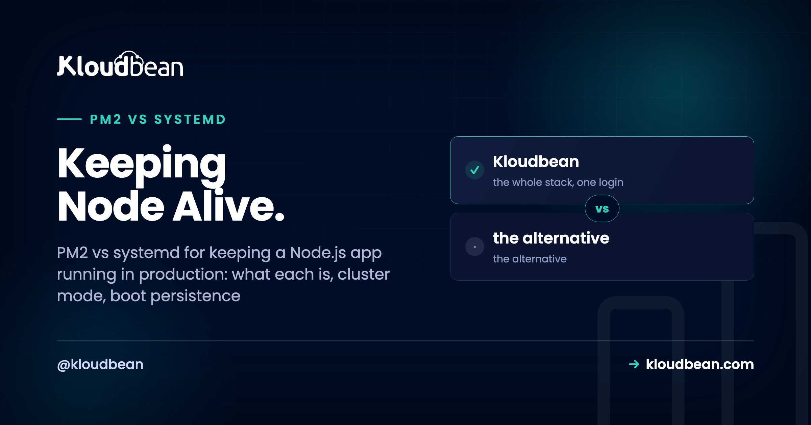

# PM2 vs systemd: Keeping a Node.js App Running in Production

*By Kloudbean Engineering · Keeping Node Alive.*

You wrote a Node app. It runs with `node server.js`, you SSH in, start it, and it works. Then you close the terminal and it's gone. Or the box reboots and nothing comes back. Or it crashes at 3am and stays down until someone notices. To run Node in production you need a supervisor, and the two standard answers are PM2 and systemd. This is an honest PM2 vs systemd guide: what each one is, where each wins, and which to actually pick.

> **PM2 vs systemd, in one line.** PM2 is a Node-native process manager with cluster mode, zero-downtime reloads, and log handling built in. systemd is the Linux service manager already running on your server, language-agnostic and with no extra dependency. Pick PM2 for a pure Node app that wants clustering and easy reloads. Pick systemd when you want one supervisor for every service on the box. On managed hosting, the platform runs this for you and you don't hand-write either.

## Why `node server.js` isn't a production setup

Running `node server.js` in an SSH session is fine for a demo. It's not how you run Node in production. Here's what actually goes wrong, and every item is a real outage someone has lived through.

- **Close the SSH session and the process dies.** The app is a child of your shell. Log out and it gets a hangup. Your "live" site goes with it.
- **It doesn't restart on crash.** An unhandled promise rejection, an out-of-memory kill, a bad request that throws. The process exits and stays exited. Nobody's watching.
- **It doesn't come back after a reboot.** The provider patches the kernel and reboots the VM at 4am. Your app doesn't start itself. You wake up to a dead site and no error, because nothing crashed. Nothing ran.
- **It uses one CPU core.** Node is single-threaded per process. A 4-core box running one `node` process leaves three cores idle while the one pegs at 100 percent.

A supervisor fixes all four. It keeps the process running, restarts it when it dies, starts it on boot, and (for the multi-core problem) can run a copy per core. PM2 and systemd are two roads to the same place. They just start from different worlds.

*(Diagram: one process vs a supervised one. Left, FRAGILE, `node server.js`: one process on one CPU core with three cores idle, so closing SSH kills it, a crash leaves it down, and a reboot never restarts it. Right, SUPERVISED, PM2 or systemd: a supervisor watches the app, restarts on crash, starts on boot, and in PM2 cluster mode runs one worker per core. Same job, two tools.)*

## What is PM2?

PM2 is a process manager built for Node. You install it from npm, hand it your app, and it becomes the thing that keeps your app running. It restarts on crash, it can start on boot, it collects logs, and it has a cluster mode that runs one worker per CPU core without you touching your code.

The friendly way to use it is a config file, `ecosystem.config.js`, checked into your repo so the settings live with the code:

```js
// ecosystem.config.js
module.exports = {
  apps: [{
    name: 'api',
    script: 'server.js',
    instances: 'max',            // one worker per CPU core
    exec_mode: 'cluster',        // turn on the built-in load balancer
    max_memory_restart: '400M',  // recycle a worker if it leaks past 400M
    env: { NODE_ENV: 'production' }
  }]
};
```

Then a handful of commands do the day-to-day work:

```
pm2 start ecosystem.config.js   # start using the config above
pm2 reload api                  # zero-downtime reload (cluster mode)
pm2 startup                     # generate the boot script for your init system
pm2 save                        # snapshot the running apps so boot can restore them
pm2 logs api                    # tail this app's stdout and stderr
pm2 list                        # status, uptime, restarts, memory per worker
```

Two features earn PM2 its reputation. **Cluster mode** forks your app across cores and load-balances connections between the workers, so a 4-core box actually uses four cores. And **zero-downtime reload** (`pm2 reload`, not `restart`) rolls workers one at a time, so a deploy doesn't drop live requests. That zero downtime reload for Node is the feature people miss most when they leave PM2.

The catch, and it's the one that burns people: PM2 does *not* survive a reboot on its own. You have to run `pm2 startup` once (it prints a `sudo` line you paste back) and then `pm2 save` after your apps are running. Skip either and your carefully configured processes vanish the next time the server restarts.

<!-- ADD IMAGE: terminal output of pm2 list showing the app online with uptime and restart count across workers. -->

## What is systemd, and how do you run Node under it?

systemd is the init system on most modern Linux distributions. It's PID 1, the first thing the kernel starts, and it already supervises sshd, cron, your firewall, and the rest of the box. It doesn't know or care that your app is Node. To systemd, your app is just a service, described by a small unit file.

A minimal systemd unit file for Node looks like this, saved as `/etc/systemd/system/node-api.service`:

```
[Unit]
Description=Node API
After=network.target

[Service]
Type=simple
User=appuser
WorkingDirectory=/var/www/api
ExecStart=/usr/bin/node server.js
Restart=always
RestartSec=2
Environment=NODE_ENV=production
EnvironmentFile=/var/www/api/.env

[Install]
WantedBy=multi-user.target
```

Three lines carry most of the weight. `Restart=always` is the whole reason you're here: it restarts Node on crash, every time. `WantedBy=multi-user.target` is what makes it start on boot once the service is enabled. And `User=appuser` runs the app as an unprivileged service user instead of root, which you want.

You control it with `systemctl`, and there's one distinction that trips newcomers. `start` runs it now. `enable` makes it start on every boot. They're separate, so you usually want both:

```
sudo systemctl daemon-reload    # re-read unit files after you edit them
sudo systemctl enable node-api  # start automatically on every boot
sudo systemctl start node-api   # start it right now
sudo systemctl status node-api  # is it running? recent log lines
journalctl -u node-api -f       # follow the live logs
```

Logs go to journald, so `journalctl -u node-api` gives you searchable, rotated history with no extra tooling. There's no cluster mode, though. systemd will happily run one process reliably; if you want four workers you either run four units or reach for socket activation, which is more moving parts than most people want. That gap is exactly where PM2 shines.

<!-- ADD IMAGE: systemctl status output showing active (running) in green plus a few journalctl lines. -->

## PM2 vs systemd for Node: the honest comparison

Both keep your app alive. The differences are about clustering, reloads, dependencies, and how much of the box you want one tool to own. Here's the PM2 vs systemd comparison for Node laid out side by side.

| Capability | PM2 | systemd |
| --- | --- | --- |
| Language fit | Node-native (can run other binaries, but built for Node) | Language-agnostic, runs any process |
| Multi-core / clustering | Built-in cluster mode, one worker per core | No clustering by itself (N units or socket activation) |
| Zero-downtime reload | Yes, rolling `pm2 reload` | A plain restart drops connections; no built-in rolling reload |
| Boot persistence | Manual: `pm2 startup` plus `pm2 save` | Native: `systemctl enable` |
| Logs | Own log files and `pm2 logs` (add pm2-logrotate) | journald and `journalctl`, rotation built in |
| Extra dependency | Yes, an npm package to install and keep updated | None, already on the server |
| Overhead | A small daemon always running | Already running as PID 1 |
| Learning curve | Gentle, a Node-friendly CLI | Steeper, unit-file syntax to learn |
| Best for | Pure Node apps that want clustering and reloads | Mixed fleets, one supervisor for everything |

## So which one should you use?

My take, after watching a lot of Node deploys go sideways: most single-app teams are happiest on PM2, and most teams running a mixed set of services are happiest on systemd. If you run a pure Node shop and you want clustering across cores plus zero-downtime reloads without writing much config, PM2 is the pragmatic pick. If you're already managing other services with `systemctl` and you'd rather not add an npm dependency to your production supervisor, systemd is the clean call. It's already there. It already survives reboots. It doesn't care what language you wrote.

Now the part the internet argues about and mostly gets wrong: it isn't strictly either/or. Plenty of teams run **PM2 under systemd**, and it's a sensible combo. systemd keeps the PM2 daemon itself alive and brings it back on boot. PM2 manages the Node workers, the clustering, and the reloads on top. That's actually what `pm2 startup` does behind the scenes: it writes a systemd unit that resurrects PM2. So if you like PM2's cluster mode but you want systemd's rock-solid boot behavior underneath, you can have both. Just run `pm2 startup`, then `pm2 save`, and let systemd own the bottom layer.

One honest caveat: two supervisors means two places to look when something breaks. So test it. Reboot the box on purpose and confirm the app comes back before you trust it.

<!-- ADD IMAGE: a simple two-layer diagram or terminal showing PM2 running as an enabled systemd service. -->

## The gotchas that actually bite people

Whichever you pick, the same handful of mistakes account for most of the "it was up yesterday" tickets. None of these are exotic. They're just easy to skip.

- **Forgetting boot persistence with PM2.** The single most common one. You set everything up beautifully, it runs for weeks, then the provider reboots the VM for maintenance and it's all gone because `pm2 startup` and `pm2 save` were never run. Do both, then reboot on purpose to prove it works.
- **Running as root.** If your app is compromised, you do not want it running as root. Create a service user and run under it (that `User=appuser` line in systemd, or launching PM2 as a non-root user). Least privilege is cheap insurance.
- **Cluster mode with in-memory state.** PM2 cluster mode assumes your app is stateless between requests. If you keep sessions, a rate-limiter counter, or a cache in a plain object, each worker gets its own copy, so a user hits worker A and their session isn't on worker B. Move that shared state into Redis or your database. Same rule applies to uploads: don't write user files to local disk if you're running multiple workers, because only one worker will have the file.
- **Ignoring memory leaks.** Long-running Node processes creep upward. `max_memory_restart` in PM2 (or a memory limit in systemd) recycles a worker before it drags the box down. It's a safety net, not a fix, but it buys you time to find the leak.
- **No log rotation.** PM2's raw log files grow forever until they fill the disk and take the app with them. Install `pm2-logrotate`. systemd sidesteps this because journald rotates by default, which is a quiet point in its favor.
- **Env vars in the wrong place.** Neither tool should hold your secrets in plain sight. systemd reads an `EnvironmentFile`, PM2 reads the `env` block or a `.env`. Keep secrets out of the repo either way. The full pattern is in [environment variables, done right](https://www.kloudbean.com/blog/environment-variables-done-right/).

## Do you even need this on managed hosting?

Short answer: no, and that's kind of the point. Everything above is what you do on a raw VPS where you own the supervisor. On a managed server the platform has already made this decision and wired it up for you. If you're new to that model, [what a managed server is](https://www.kloudbean.com/blog/what-is-a-managed-server/) covers the boundary of who handles what.

On Kloudbean, your Node app runs under PM2 as part of the managed stack, so a crash doesn't become downtime and the app comes back after a reboot without you writing a unit file or memorizing `systemctl`. PM2 multi-process is supported, so when one core stops being enough you can run a copy per core behind the same port. You set the Node runtime, the start command, and the process settings in the dashboard, not by hand-editing files over SSH.


Then you watch it instead of babysitting it. The server health view shows CPU, memory, and disk, so you can see a worker misbehaving or a memory leak climbing before it becomes a page. That's the supervisor's job made visible.


<!-- ADD IMAGE: the Kloudbean runtime configuration panel for a Node app, showing the start command and process options. -->

To be clear about a boundary people ask about: cluster mode uses the cores on the server you already have. It is not autoscaling. Automatically adding or removing servers under load is an enterprise and custom-architecture thing, not something that happens on a standard app, so don't expect a normal managed app to grow servers by itself. For most apps, right-sizing one box and using all its cores is exactly enough.

The same managed flow deploys the frameworks that sit on top. If you're shipping a specific stack, see [deploy an Express app](https://www.kloudbean.com/blog/deploy-express-app/) or [deploy a NestJS app](https://www.kloudbean.com/blog/deploy-nestjs-app/), and wire pushes to auto-deploy with [CI/CD from GitHub](https://www.kloudbean.com/blog/ci-cd-auto-deploy-from-github/). However you keep the process alive, a [reverse proxy](https://www.kloudbean.com/blog/reverse-proxy-explained/) still sits in front to terminate TLS and forward traffic to it.

---

**Keep your Node app alive without hand-writing a single unit file.** Deploy from Git, let the managed stack supervise the process with PM2 (multi-process supported), watch health in one dashboard, and add a managed database and free SSL when you need them. Start at [kloudbean.com](https://www.kloudbean.com/); sizes and plans (from $8/mo, Enterprise custom) are on [pricing](https://www.kloudbean.com/pricing/).

PM2 process management · Git deploy with live logs · Managed databases · Free auto-renewing SSL · Free migration · Free trial

## FAQ

**What is PM2?**
PM2 is a process manager for Node.js. You install it from npm and it keeps your app running: it restarts the process on crash, can start it on boot, collects logs, and has a cluster mode that runs one worker per CPU core. It's the most common way people keep a Node app alive on a server they manage themselves.

**What is a systemd service for Node?**
It's a small unit file that tells systemd, the Linux init system, how to run and supervise your Node app. With `Restart=always` it restarts Node on crash, and with `WantedBy=multi-user.target` plus `systemctl enable` it starts on boot. systemd is already on the box and language-agnostic, so it treats your app as just another service.

**PM2 vs systemd for Node: which is better?**
Neither is universally better. PM2 wins for a pure Node app because of built-in cluster mode and zero-downtime reloads. systemd wins when you want one supervisor for every service on the box with no extra dependency. Many teams run PM2 under systemd to get both.

**How do I keep a Node app running after I close SSH?**
Don't run it in your shell. Hand it to a supervisor. Under PM2 that's `pm2 start`, and under systemd it's a service unit with `systemctl start`. Both detach the process from your terminal, so logging out no longer kills your app.

**Does PM2 restart my app on server reboot?**
Only if you set it up. PM2 does not survive a reboot by default. Run `pm2 startup` once (it prints a sudo command to paste back), then `pm2 save` after your apps are running. Skipping these is the most common reason a PM2 setup vanishes after maintenance reboots.

**What is PM2 cluster mode?**
Cluster mode forks your Node app into multiple worker processes and load-balances connections across them, so a multi-core server actually uses all its cores. You enable it with `exec_mode: cluster` and `instances: max`, or `pm2 start app.js -i max`. Your app needs to be stateless between requests for it to work correctly.

**Can I run PM2 under systemd?**
Yes, and it's a common setup. systemd keeps the PM2 daemon alive and starts it on boot, while PM2 manages the Node workers, clustering, and reloads on top. Running `pm2 startup` actually generates a systemd unit that resurrects PM2, so the two work together by design.

**How do I see logs with PM2 vs systemd?**
With PM2 you run `pm2 logs` to tail an app's output, and you should add pm2-logrotate so the log files don't grow forever. With systemd, output goes to journald, so `journalctl -u your-service -f` follows the logs and rotation is handled for you.

**Do I need PM2 on managed hosting?**
No. On a managed platform like Kloudbean, your Node app already runs under PM2 as part of the stack, so it restarts on crash and comes back after a reboot without you configuring anything. You set the runtime and start command in the dashboard, and PM2 multi-process is supported when you want to use more cores.

**Is systemd better than PM2 for a single Node app?**
For one process that doesn't need clustering, systemd is a great fit and adds no dependency, since it's already running. PM2 becomes clearly worth it once you want cluster mode across cores or zero-downtime reloads on deploy. For a simple single-instance service, either is fine, so pick the one your team already knows.

*Kloudbean · Keep the process alive, use every core, and own the box it runs on.*
