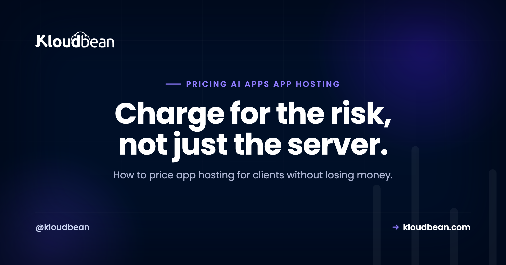

# Pricing App Hosting for Clients: The Agency Playbook for AI and Custom Apps

By Kloudbean Engineering · Charge for the risk, not just the server.

For a decade, pricing client hosting was easy. You bought a reseller plan, split it into slices, added a care-plan fee for updates, and pocketed a tidy margin. WordPress sites are predictable, so that flat number worked. Then clients started shipping apps: a Next.js dashboard, a Python API, an AI tool a founder built in a weekend and now needs someone to keep alive. Price those the old way and you'll find out, usually during your first incident, that the maths quietly stopped working. This is how to price app hosting so the margin survives contact with reality.

> **The short version.** Price client app hosting as two separate things: the infrastructure (pass it through at cost or a small markup) and your management (a monthly fee for the labor and risk of keeping the app running). Bundling both into one flat number is how agencies lose money the first time an app breaks. For AI apps, pass through or cap usage-driven costs like inference and egress, or one client's traffic eats your whole retainer.

## Why app hosting breaks the care-plan model

A WordPress care plan prices one thing: predictable labor. Core and plugin updates, a backup you rarely restore, an uptime check, maybe a monthly report. The underlying hosting is cheap and nearly free to operate, so a flat fee like "hosting and maintenance, one price" leaves room for profit because almost nothing varies month to month.

Apps break all three of those assumptions. The infrastructure is not free to operate: a real server, a managed database, object storage, and bandwidth all cost actual money that scales with the app. The labor is not predictable: a dependency update can break a build, an API key can expire at midnight, memory can creep until the process dies. And the failure modes are novel, so "I've seen this a hundred times" stops being true. You are no longer maintaining a known quantity. You're operating software.

That's the whole reason the pricing has to change. You're not selling a slice of a cheap shared box anymore. You're selling uptime for a system that has real running costs and can fail in ways you can't fully predict. If you don't price the cost and the risk separately, you're absorbing both, and you won't see it until the invoices and the support hours diverge.

## What actually costs you money

Before you pick a number, know what you're paying for. Client app hosting has six cost drivers, and only the first one is obvious.

- **The infrastructure bill.** Servers, managed databases, storage, bandwidth. Real, recurring, and it grows with the app.
- **Incident response.** The unplanned hours. An app down at 9am on a launch day is a different cost than a WordPress plugin needing an update, because someone has to drop everything and diagnose a live system.
- **Dependency and runtime updates.** Node and Python move fast. A security patch or a breaking change in a library means a test, a staging deploy, and a rollback plan. WordPress rarely asks this of you. Apps do, routinely.
- **Runtime and usage cost.** For AI apps especially, every request can cost money: model inference, third-party API calls, egress on data transfer. This scales with how much the client's users do, not with anything you control.
- **Monitoring.** Knowing the app is down before the client calls is a service, and it takes tooling and attention. The guide to [AI app observability](https://www.kloudbean.com/blog/ai-app-observability/) covers what to actually watch.
- **Backups and recovery.** Not just taking them, but the confidence that a restore works. A backup you've never tested is a liability wearing a helpful costume.

Miss any of these in your price and you don't notice at first. You notice the quarter a client's app has a bad month and your "profitable" retainer turns into unpaid on-call.

## The four ways agencies price it

There are really only four models, and each has a situation it fits. The mistake isn't picking the wrong one, it's picking one without knowing what it assumes.

| Model | How it works | Best for | The risk |
| --- | --- | --- | --- |
| Cost-plus markup | Resell infra at a markup (say infra plus 20 to 40%) | Simple, low-variance apps | Markup alone doesn't pay for incidents |
| Flat / tiered retainer | One monthly price, or Bronze/Silver/Gold | Predictable apps, non-technical clients | You eat any month that goes sideways |
| Pass-through + management fee | Infra billed at cost, separate fee for your labor | Custom and AI apps of any size | Two line items to explain to the client |
| Value-based | Price on the app's business value, not cost | Revenue-critical apps, mature clients | Needs trust and a clear value story |

Cost-plus is the reseller reflex: mark up the hosting and call it done. It works when operating the app is genuinely near-zero effort. The trap is that a markup on a small infra bill is a small number, and a small number does not pay for the 2am page.

Flat and tiered retainers are clean to sell and easy for a client to understand, which is why care plans use them. They're fine when variance is low. The danger is that you've promised a fixed price against an unpredictable cost, so a bad month is your loss, not theirs.

Pass-through plus a management fee is the model that fits custom and AI apps, and it's worth understanding why the next section makes it a rule. Value-based pricing is the most profitable when you can pull it off, but it needs a mature client who sees the app as revenue, not an expense line, and a track record that earns the conversation.

## The rule that protects your margin

Here's the single most useful idea in this article: **separate the infrastructure from the management.** Two line items, always, even if you present one total.

Infrastructure is the meter. It's the server, the database, the storage, the bandwidth, the inference. It varies, and it isn't really your cost to absorb. Pass it through at cost, or at a modest markup if you handle procurement and want a small margin there. Either way, it's visible.

Management is the mechanic. It's your labor and your risk: the monitoring, the updates, the incident response, the backups you actually test. This is what you're genuinely selling, and it's where your real margin lives. Price it as a monthly fee that reflects the work and the on-call exposure, not as a percentage of a hosting bill that has nothing to do with how hard the app is to keep alive.

Why does the split matter so much? Because when the two are fused into one flat number, you can't see your own margin. Infra creeps up, an incident eats a weekend, and the single number still looks fine until you're quietly running the account at a loss. Separating them means the client sees costs rise for a reason they understand, and you can see whether your management fee still covers the actual work. It also makes the honest boundary clean: managed hosting handles the server, stack, SSL, backups, and patching, while the client owns their application code and data. Two costs, two responsibilities, no blur.

<!-- ADD IMAGE: a two-panel diagram. Left panel "Bundled" shows one flat box labeled "hosting + maintenance, one price" with a hidden thin margin sliver being squeezed by a rising infra bar and an incident spike. Right panel "Separated" shows two clean bars: "Infrastructure (pass-through, variable)" and "Management fee (your margin, stable)". Brand colors navy #000f27, purple #4F1AF3, green #40b75f. -->

*When infra and management are one number, you can't see the margin being squeezed. Split them and both you and the client can read the bill.*

## The AI wrinkle: usage costs you don't control

AI apps add a cost that behaves unlike anything in a WordPress world: it moves with the client's users, not with your work. Every model call, every third-party API request, every gigabyte of egress can carry a price, and it scales with usage you have no hand in. A client runs a campaign, traffic triples, and the inference bill triples with it.

If your price is a flat retainer that quietly includes those costs, you've written the client a blank cheque against your own margin. There are only two safe options, and you should pick one before signing anything.

Pass it through: usage-driven costs land on the client's invoice at cost, itemized, so a heavy month is their heavy month. Or cap it: you include a defined allowance (a number of requests, a spend ceiling) and anything above it is billed or throttled. Both are honest. What isn't honest, to yourself, is an all-you-can-eat flat fee sitting on top of a variable cost you can't predict. That's how a profitable client quietly turns into a loss. Runaway usage is one of the most common ways these apps blow up, which [why AI apps fail in production](https://www.kloudbean.com/blog/why-ai-apps-fail-in-production/) gets into, and the broader cost picture is in [what it really costs to run an app](https://www.kloudbean.com/blog/cost-of-running-a-side-project/).

## A framework for picking your model

You don't need a spreadsheet. You need three questions, answered honestly.

**How much does operating this app actually vary?** If it's a brochure site or a stable internal tool that barely changes, a flat retainer is fine and simpler for everyone. If it's a live app with real users, dependencies that move, and any AI or third-party usage, you want pass-through plus a management fee.

**Who absorbs the usage cost?** If the app has variable, usage-driven costs, decide now: the client pays them (pass-through) or you cap them. Never leave this undefined. An undefined usage cost is a future argument you will lose.

**How sophisticated is the client?** A non-technical client wants one number and a clear promise, so present a total even if you calculate it as two parts. A technical or revenue-focused client can handle itemized infra plus a management fee, and may be the right fit for value-based pricing once you've earned it.

The default that fits most custom and AI client apps is pass-through infrastructure plus a monthly management fee, with usage costs either passed through or capped. Start there, and only simplify to a flat retainer when the app is genuinely low-variance.

## The mistakes that quietly eat margin

Four anti-patterns show up again and again, and all of them are avoidable once named.

**Invisible bundling.** One flat number with no internal split. You can't tell a healthy account from a bleeding one until it's badly bleeding. Split the line items even if you show a total.

**The uncapped flat fee on a variable cost.** Promising all-inclusive hosting on an app whose inference or bandwidth bill you don't control. This is the classic AI-era margin killer.

**"Hosting is basically free."** Pricing the infra at cost and forgetting to charge for management at all, because reselling shared hosting taught you operating a site is free. Apps are not free to operate. Your time is the product.

**Under-scoping incidents.** Writing a retainer that assumes zero unplanned hours. One real outage a quarter, unbilled, can erase the margin on an account. Price in the on-call, or bill incidents separately and say so up front.

If you want the WordPress-specific version of packaging maintenance, [care-plan and retainer pricing](https://www.kloudbean.com/blog/wordpress-maintenance-retainer-plans/) covers that side. The models here are for when the thing you're hosting is an app, not a site, and the difference in operating an [agency's WordPress fleet](https://www.kloudbean.com/blog/agency-wordpress-hosting/) versus a fleet of custom apps is exactly why the pricing has to differ.

## Where the tooling makes this easier

Most of this is discipline, not software. But the split gets far easier to run when your hosting has flat, predictable pricing and you can see each client's usage in one place. If every client's app sits on its own server with its own visible bill, pass-through pricing is just reading a number, and your management fee stands on its own instead of hiding inside a hosting markup. That's also cleaner for isolation, which the companion piece on [managing a fleet of client apps](https://www.kloudbean.com/blog/manage-client-ai-apps/) gets into, and it's a real reason agencies move off blended reseller plans, covered in [reseller hosting versus managed cloud](https://www.kloudbean.com/blog/reseller-hosting-vs-managed-cloud/).

Kloudbean fits this model on the infrastructure side: standard plans start at a flat, predictable rate (from $8 a month), each client app can run on its own managed server, and one dashboard shows the whole fleet, so pass-through costs are easy to read and attribute. Handy for running the split cleanly. Secondary to the point of this page, which is the pricing method itself.

---

**Price the risk, not just the box.** If you want infrastructure with flat, predictable pricing and one dashboard to see every client's app and its cost, that's what Kloudbean is built for. Details at [kloudbean.com](https://www.kloudbean.com/) and [pricing](https://www.kloudbean.com/pricing/).

## FAQ

**How should an agency price hosting for client apps?**
Price it as two parts: infrastructure passed through at cost or a small markup, and a separate monthly management fee for your labor and risk. This keeps your margin visible and stops an unpredictable infra bill or a single incident from quietly turning a profitable account into a loss. Only fall back to a single flat fee when the app is genuinely low-variance.

**Why can't I price app hosting like a WordPress care plan?**
Care plans price predictable labor on cheap, near-free hosting, so a flat fee has room for profit. Apps have real infrastructure costs that scale, unpredictable maintenance, and novel failure modes. A flat number that worked for a static site leaves you absorbing both the variable cost and the incident risk on an app, which you won't notice until the hours and the invoices diverge.

**Should I mark up hosting or bill it at cost?**
Either works if you also charge a management fee. A modest markup on infrastructure is fair if you handle procurement, but a markup alone rarely covers incident response and updates. The safest structure is infrastructure at or near cost, passed through and visible, plus a management fee that reflects the actual work of keeping the app online.

**How do I handle AI usage costs like inference and API calls?**
Pass them through or cap them, and decide before you sign. Pass-through means usage-driven costs appear on the client's invoice at cost. A cap means you include a defined allowance and bill or throttle above it. What you must avoid is an all-inclusive flat fee sitting on top of a usage cost you don't control, because one busy month can erase your margin.

**What is a fair management fee for an app?**
There's no universal number, because it depends on the app's complexity, how often it changes, and your on-call exposure. Price it on the work, not as a percentage of the hosting bill, which has little to do with how hard the app is to run. Estimate the monthly hours for monitoring, updates, and expected incidents, and price that plus a buffer for the unplanned.

**How do I stop a client's app from eating my profit?**
Separate infrastructure from management so you can see your margin, cap or pass through variable usage costs, and scope incident hours into the price or bill them separately. The accounts that lose money are almost always the ones with one flat number hiding a rising infra bill and unpaid on-call time.

**Is value-based pricing worth it for hosting?**
It's the most profitable model when it fits, but it needs a mature client who treats the app as revenue rather than an expense, and a track record that earns the conversation. For most agencies, pass-through infrastructure plus a management fee is the reliable default, and value-based pricing is something you grow into on your most important accounts.

**Should each client app have its own server?**
Usually yes, for two reasons that both help pricing. Isolation limits the blast radius when one app has a problem, and a dedicated bill per client makes pass-through pricing trivial to calculate and explain. Shared servers can work for very small or low-risk apps, but the moment cost attribution or a security boundary matters, per-client separation pays for itself.

**How is pricing custom app hosting different from reselling shared hosting?**
Reselling works because operating a shared site is nearly free, so a thin markup is pure margin. Custom app hosting has real operating costs and real labor, so the markup model alone loses money. You have to charge for management as its own line, which is the shift from reselling a commodity to selling an operations service.

---

*Kloudbean Engineering · Two line items beat one flat number every time an app breaks.*
