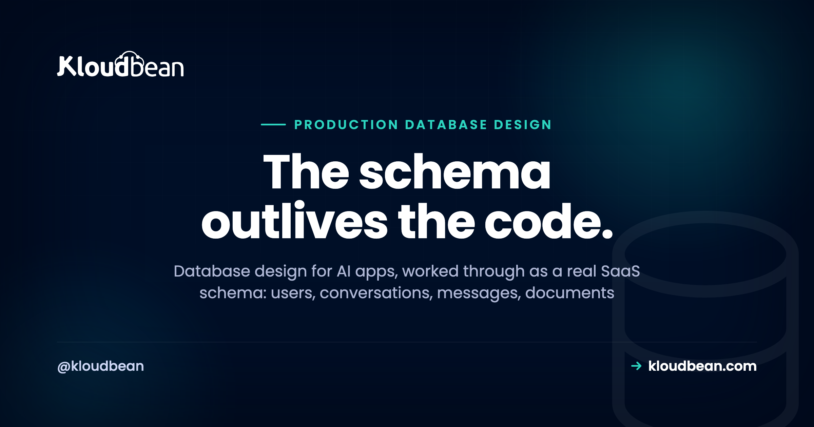
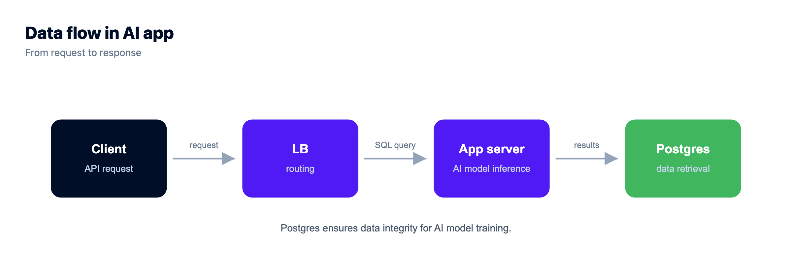

# Production Database Design for AI Apps: The Schema a Real SaaS Needs

Good database design for AI apps is the part nobody prompts their way through. The model gets all the attention, but the thing that outlives your code, survives every redeploy, and decides whether you can bill a customer or honour a deletion request is the schema underneath. Get it roughly right early and the app grows calmly. Get it wrong and you're doing surgery on live data at the worst possible time.

This is a walk through the tables a real AI SaaS actually needs, in copy-paste SQL, with the reason each one exists. Not a normalization lecture. A working starting schema: who the user is, what they said, what documents they gave you, the embeddings for search, what they used (so you can bill and rate-limit), what you charged, who did what, and, the piece most schemas skip, how to erase all of it cleanly when someone asks.

> **Short answer:** A production AI app needs a handful of related tables: users, conversations, and messages for the chat spine; documents and doc_chunks (with a pgvector column) for knowledge and search; usage_events and billing_records for metering and money; and an audit_log for accountability. Design foreign keys with ON DELETE CASCADE and a soft-delete column from the start, so a delete-my-account request is one transaction, not manual surgery. Keep the durable record in Postgres and the fast, throwaway state in Redis.

**This isn't a pgvector tutorial.** The vector column shows up here as one table in a bigger schema, to show why embeddings can live beside your relational data. For the deep end (choosing a vector store, HNSW vs IVFFlat, distance operators, tuning the index) read [pgvector for AI apps](https://www.kloudbean.com/blog/pgvector-for-ai-apps/). This page is about the whole data model around it.

## What database design for AI apps really comes down to

Most of an AI SaaS schema is just a SaaS schema. Users, a subscription, some content. What makes database design for AI apps its own thing is three pressures that show up early and hurt if you ignore them.

First, conversational data grows fast and unevenly. One user sends three messages, another pastes a novel. You're storing every turn, sometimes with token counts, and that table gets big quickly. Second, you have embeddings: vectors you search by similarity, not by exact match, and they want to sit close to the relational data you filter on. Third, the model costs real money per call, so metering isn't a nice-to-have you bolt on before launch. It's a column you should be writing from request one.

The rest is ordinary discipline. Sensible keys, foreign keys that mean something, indexes on the columns you actually query, and a deletion story you designed on purpose. Let's build it.

## The shape of the schema, in one picture

Before the SQL, here's how the tables relate. A user is the hub. Everything hangs off them, and almost every "who owns this row" question is answered by a `user_id` foreign key. Three branches matter: the conversation branch, the knowledge branch, and the money branch. An audit log sits to the side, recording actions across all of them.



## Users, conversations, and messages: the conversational spine

Start with the three tables almost every AI app shares. A user has many conversations, and a conversation has many messages. Notice two deliberate choices in here: a `deleted_at` column on users for soft delete, and `ON DELETE CASCADE` so removing a parent row cleans up its children automatically.

```sql
CREATE TABLE users (
  id          uuid PRIMARY KEY DEFAULT gen_random_uuid(),
  email       text UNIQUE NOT NULL,
  created_at  timestamptz NOT NULL DEFAULT now(),
  deleted_at  timestamptz                     -- NULL = active, set = soft-deleted
);

CREATE TABLE conversations (
  id          uuid PRIMARY KEY DEFAULT gen_random_uuid(),
  user_id     uuid NOT NULL REFERENCES users(id) ON DELETE CASCADE,
  title       text,
  created_at  timestamptz NOT NULL DEFAULT now()
);

CREATE TABLE messages (
  id               bigint GENERATED ALWAYS AS IDENTITY PRIMARY KEY,
  conversation_id  uuid NOT NULL REFERENCES conversations(id) ON DELETE CASCADE,
  role             text NOT NULL,             -- 'user' | 'assistant' | 'system'
  content          text NOT NULL,
  token_count      int,                       -- handy later for cost + context limits
  created_at       timestamptz NOT NULL DEFAULT now()
);
```

A couple of choices worth defending. Messages use a `bigint` identity key, not a uuid, because they're the highest-volume table and a compact, sequential key keeps the index tight and inserts cheap. The `role` column mirrors the shape the model APIs already speak, so you're not translating on every write. And storing `token_count` per message costs you nothing now and saves you later, both for trimming context windows and for the usage math we're about to get to.

Use `timestamptz`, not `timestamp`. Your users are in other time zones, your server might not be where you think, and a naive timestamp is a bug waiting for a support ticket. Store an instant, format it for humans at the edge.

## Documents and embeddings: why vectors can live in Postgres

If your app does retrieval, search, or any "answer from my documents" feature, you need somewhere for the source files and somewhere for their embeddings. The files themselves belong in object storage, not the database; the row just points at them. The embeddings, though, can sit right in Postgres next to everything else.

```sql
CREATE EXTENSION IF NOT EXISTS vector;        -- pgvector, if your Postgres has it

CREATE TABLE documents (
  id          uuid PRIMARY KEY DEFAULT gen_random_uuid(),
  user_id     uuid NOT NULL REFERENCES users(id) ON DELETE CASCADE,
  title       text,
  source_uri  text,                            -- path to the file in object storage
  created_at  timestamptz NOT NULL DEFAULT now()
);

CREATE TABLE doc_chunks (
  id           bigint GENERATED ALWAYS AS IDENTITY PRIMARY KEY,
  document_id  uuid NOT NULL REFERENCES documents(id) ON DELETE CASCADE,
  user_id      uuid NOT NULL REFERENCES users(id) ON DELETE CASCADE,
  chunk_text   text NOT NULL,
  embedding    vector(1536),                   -- one vector per chunk
  created_at   timestamptz NOT NULL DEFAULT now()
);
```

The `vector(1536)` type comes from the pgvector extension (1536 is just a common embedding size; use whatever your model outputs). The reason this matters for design is simple: your embeddings can join and filter against your relational data in a single query. No second database to keep in sync, no copying user IDs into a separate vector store and praying they stay consistent, one backup that captures everything.

See the `user_id` on `doc_chunks`, even though you could reach it through `document_id`? That's a deliberate denormalization. Your retrieval query filters by user on every single call, and you want that filter to be one indexed column on the table you're actually searching, not a join away. It makes the security-critical query both simpler and faster:

```sql
SELECT chunk_text
FROM   doc_chunks
WHERE  user_id = $1              -- the permission filter, always first
ORDER  BY embedding <=> $2       -- then similarity (pgvector distance operator)
LIMIT  5;
```

The `WHERE user_id = $1` is doing the security work: a user can only ever retrieve their own chunks. Everything about tuning that vector index, and whether Postgres is the right home for your vector volume at all, lives in the [pgvector guide](https://www.kloudbean.com/blog/pgvector-for-ai-apps/). For most apps, the answer is yes, keep it in Postgres and keep your stack small.

One check to do before you commit to this shape: confirm `CREATE EXTENSION vector` actually succeeds on the Postgres you're going to run. Availability depends on the version and how the instance was built, on Kloudbean's managed PostgreSQL and on every other provider, so verify it rather than discovering it on migration day. If it isn't there, the `documents` table above is still correct and only the `embedding` column has to move.

## Usage and tokens: build the meter on day one

Here's the one opinion I'll push hardest in this whole piece: **model the usage table before you write a single billing feature.** Not after you have customers. Not when you decide to charge. Now, on day one, when it's a single empty table nobody's using yet.

The reason is brutal and simple. You cannot bill for, rate-limit, or analyse usage you never recorded. If you launch without a usage table and add billing three months later, you've got three months of history that doesn't exist. You can't reconstruct who spent what, you can't honour a "you charged me wrong" dispute, and you can't set a fair free-tier cap because you have no idea what normal looks like. Retrofitting metering is the migration everyone dreads, and it's entirely avoidable.

```sql
CREATE TABLE usage_events (
  id             bigint GENERATED ALWAYS AS IDENTITY PRIMARY KEY,
  user_id        uuid NOT NULL REFERENCES users(id),   -- note: no CASCADE here, on purpose
  kind           text NOT NULL,             -- 'chat' | 'embed' | 'completion'
  model          text,                      -- which model served it
  prompt_tokens  int NOT NULL DEFAULT 0,
  output_tokens  int NOT NULL DEFAULT 0,
  created_at     timestamptz NOT NULL DEFAULT now()
);

CREATE TABLE billing_records (
  id            uuid PRIMARY KEY DEFAULT gen_random_uuid(),
  user_id       uuid REFERENCES users(id),   -- nullable so it survives anonymisation
  period_start  date NOT NULL,
  period_end    date NOT NULL,
  amount_cents  bigint NOT NULL,
  created_at    timestamptz NOT NULL DEFAULT now()
);
```

Write one `usage_events` row per model call, with the token split and the model name. That raw log is the truth. Your billing job reads a period, sums the tokens per user, applies your pricing, and writes a `billing_records` row: a summary you can show on an invoice without re-summing millions of events every time someone opens the billing page.

Notice `usage_events` deliberately does not cascade on user delete, and `billing_records.user_id` is nullable. That's not sloppiness. Financial records usually need to outlive the account for accounting and tax reasons, so when a user leaves you anonymise these rows rather than deleting them. Which brings us to the part most schemas get wrong.

This is also the table that makes SQLite on the app disk indefensible. `usage_events` is the row you'd have to reconstruct from nothing after a redeploy wipes the disk, and you can't. It needs a database that lives outside the app process with backups running from the first write, which on Kloudbean is a managed PostgreSQL launched in the DBS section with automatic backups already on. Not because provisioning is hard, but because "I'll move it to a real database later" and "billing history starts three months late" turn out to be the same sentence.

## Audit records: a durable log of who did what

An audit log is a plain table that answers "who did that, and when." You don't need it on day one the way you need usage, but you'll want it the first time something looks wrong and you're staring at data with no idea how it got that way.

```sql
CREATE TABLE audit_log (
  id          bigint GENERATED ALWAYS AS IDENTITY PRIMARY KEY,
  actor_id    uuid,                     -- who acted (NULL for system actions)
  action      text NOT NULL,            -- 'user.login', 'document.delete', 'plan.upgrade'
  target      text,                     -- what it touched, e.g. 'document:42'
  metadata    jsonb,                    -- extra context, structured
  created_at  timestamptz NOT NULL DEFAULT now()
);
```

Two rules keep an audit log honest. It's append-only: your app inserts, it never updates or deletes a row. And it records the actor even for things users can't see, like a background job or an admin action, so the trail is complete. The `jsonb` metadata column is the pressure valve: you can attach whatever context an event needs without a schema change every time you log something new.

This is your application's audit table, and it's separate from any platform-level activity log your host might offer. Don't confuse the two. The app-level log knows about *your* domain events; keep it in your schema where you can query it alongside everything else.

## Deletion is a feature, not an afterthought

Now the section most tutorials skip, and the one that turns into a fire drill. Picture the anti-pattern: an app with no `deleted_at` columns and no foreign-key cascades. A user emails "please delete my account and all my data." Suddenly you're writing one-off DELETE statements by hand, table by table, in production, trying to remember every place a `user_id` got scattered. Miss one and you've kept data you swore you erased. That's not a workflow. That's surgery, and you're operating without a map.

Design gives you the map. There are two kinds of delete, and a real app uses both deliberately.

| Aspect | Soft delete (deleted_at) | Hard delete (row is gone) |
| --- | --- | --- |
| What happens | Row stays, flagged with a timestamp | Row is physically removed |
| Reversible | Yes, just clear the flag | No, only a restore from backup |
| Query cost | Every read must filter out deleted rows | Nothing to filter, table stays lean |
| Right for | Undo, trash bins, accidental deletes, short grace periods | Genuine erase-my-data requests, legal removal |
| The trap | Forget the filter once and deleted data reappears | Cascade set up wrong and you orphan rows or over-delete |

Soft delete is your everyday default. A user "deletes" a conversation, you set `deleted_at = now()`, your queries carry a `WHERE deleted_at IS NULL`, and you can offer an undo. Good for accidents, good for support ("I didn't mean to delete that").

Hard delete is for when someone genuinely wants to be forgotten, which in a lot of places is a legal right, not a favour. This is where the design work from earlier pays off. Because you set up `ON DELETE CASCADE` on the child tables, erasing a user is close to one statement, and the anonymise-don't-delete rule handles the financial records that must stay:

```sql
-- Erase a user for real. Cascades clear the children; billing is anonymised.
BEGIN;
  -- keep financial history, but detach it from the person
  UPDATE billing_records SET user_id = NULL WHERE user_id = $1;
  UPDATE usage_events    SET user_id = NULL WHERE user_id = $1;
  UPDATE audit_log       SET actor_id = NULL WHERE actor_id = $1;

  -- this one line cascades: conversations, messages, documents, doc_chunks
  DELETE FROM users WHERE id = $1;
COMMIT;
```

One transaction. It either all happens or none of it does. Compare that to hunting through a dozen tables by hand, and you can see why the cascades and the nullable billing key were worth setting up on day one. The erase path is a feature you build once and test, not a panic you improvise later. And do test it: a throwaway user, a real erase, then a check that nothing of theirs is left where it shouldn't be.

## Index the columns you actually query

Indexes are where good intentions go sideways. The reflex is to index everything, which slows every write and bloats the database for lookups you never run. The better rule: index the columns you filter on, join on, and sort by. In this schema, that's a short, predictable list.

```sql
-- Foreign keys you filter and join on constantly
CREATE INDEX ON conversations (user_id);
CREATE INDEX ON messages (conversation_id, created_at);   -- list a chat in order
CREATE INDEX ON doc_chunks (user_id);                      -- the permission filter
CREATE INDEX ON usage_events (user_id, created_at);        -- sum a billing period

-- The vector index for similarity search (pgvector). Tune for your setup.
CREATE INDEX ON doc_chunks USING hnsw (embedding vector_cosine_ops);
```

A few of these are doing specific work. The composite `(conversation_id, created_at)` index means loading a conversation in order is a single efficient range scan, not a sort of the whole table. The `(user_id, created_at)` on usage is what makes a billing job for last month fast instead of a full scan. And the HNSW index is what turns vector search from a slow linear comparison into something usable, though the how and the trade-offs belong in the [pgvector guide](https://www.kloudbean.com/blog/pgvector-for-ai-apps/).

Don't add these blind, either. Index because a real query is slow or clearly will be, watch the ones that matter, and drop any that stop earning their keep. An index nobody's query uses is pure overhead.

## Postgres for the durable record, Redis for the fast layer

One more design decision separates apps that scale calmly from ones that fall over: knowing what belongs in your database and what belongs in a fast, throwaway layer beside it. Postgres is your system of record. Redis is for the hot, ephemeral stuff you'd happily lose.

| Data | Postgres (system of record) | Redis (fast, ephemeral) |
| --- | --- | --- |
| Users, conversations, messages | Yes, the source of truth | No |
| Documents and embeddings | Yes (pgvector) | No |
| Usage events and billing | Yes, must be durable | No |
| Session tokens | Optional | Yes, with a TTL |
| Rate-limit counters | No, too write-heavy | Yes, this is its sweet spot |
| Response or prompt cache | No | Yes, with a TTL |
| If it gets wiped | You've lost customer data | You recompute or re-login, nothing lost |

The rule fits on a sticky note. If losing it is a disaster, it's Postgres. If losing it is a minor inconvenience, it can be Redis. Rate-limit counters are the clearest case: they change on every request, they don't matter tomorrow, and hammering your primary database with those writes is a waste. That's exactly what Redis is good at. Just don't let Redis quietly become your database, because it isn't one, and a restart will teach you that the hard way.

Worth flagging: whichever database you use, an app under load talks to it through a connection pool, not a fresh connection per request. That's its own topic, covered in [database connection pooling](https://www.kloudbean.com/blog/database-connection-pooling/).

Two engines means two things to run, which is the practical reason people put counters in Postgres and regret it later. Both live in the same DBS section on Kloudbean, which has seven managed engines including PostgreSQL and Redis, so the fast layer is a launch away rather than a second vendor to justify. Point your app at each with its own connection string in the runtime config and whitelist your app server's IP on both.

<!-- ADD IMAGE: your schema in a diagramming tool (dbdiagram, DrawSQL, or your ORM's generated ER view), showing the same tables and foreign keys. Optional: helps readers map the SQL above to a picture. -->

## Why the schema is the slowest layer to change, and what follows from that

Worth understanding the ordering of the stack you've just been designing, because it explains why this article spends so long on decisions that look like details.

Your app code is the fastest layer to change. You can rewrite a route this afternoon and deploy it in a minute. Below that sits the schema, and it changes at a completely different speed, because every change has to be applied to data that already exists. A missing `user_id` column on `doc_chunks` isn't a five-minute fix once there are four million chunks; it's a migration, a backfill, and a window where retrieval might return someone else's text. Below the schema sits the engine and the server, and that layer is the one you should be thinking about least, because Postgres has been solving those problems for thirty years and a managed platform absorbs the rest.

That's the whole reason the ordering matters. Effort spent above the schema is cheap and reversible. Effort spent at the schema level is expensive and mostly one-way. Effort spent below it is largely someone else's job now. So the highest-leverage hour you'll spend on an AI app is the one where you decide that `usage_events` exists from day one, that deletion has both a soft and a hard path, and that `user_id` sits on the table you actually search. Get those right and the layers above and below become ordinary work.

Which is where a managed database honestly belongs in the picture: underneath, holding still. On Kloudbean you launch a [managed PostgreSQL](https://www.kloudbean.com/blog/managed-postgresql-hosting/) (or MySQL, or MariaDB) in the DBS section, it runs beside your app rather than in a separate console with a separate bill, automatic backups start immediately, and you take an on-demand backup before each migration so the expensive layer has an undo. Free SSL, Git deploys, and IP allow-listing so only your app server can connect. [Adding a managed database to your app](https://www.kloudbean.com/blog/add-managed-database-to-your-app/) walks that setup. Read replicas are one click for MySQL and MariaDB on standard plans, and available across engines on Enterprise, though the primary stays in one region either way, so plan reads accordingly.

Then the honest part, which is most of this article. No host designs your tables. Kloudbean can't tell you whether `messages` needs a soft-delete column, it can't write your erase path, and it can't retroactively give you the usage history you never recorded. It doesn't make your app compliant with any data law either; it provides infrastructure controls, and the application-level obligations stay with you. Managed covers the server, the engine, SSL, backups and patching. The schema is the part nobody can do for you, which is exactly why it's worth the afternoon. For the wider view of what changes when an AI app meets real users, see [the last mile of vibe coding](https://www.kloudbean.com/blog/last-mile-of-vibe-coding/).

<!-- cta:start -->
**A database you can dump and take with you.**

Launch MySQL, MariaDB, PostgreSQL, Redis, Memcached, MongoDB, or Elasticsearch in a click, reachable from your app server with automatic backups from minute one. Standard connection strings, standard dumps, no proprietary format.

- Seven managed engines
- One-click launch
- Automatic backups
- Controlled access
- Standard connection strings
- Free migration assistance

[Start free](https://console.kloudbean.com/register) · [See plans](https://www.kloudbean.com/pricing/)
<!-- cta:end -->

## FAQ

**What is database design for AI apps?**
It's deciding the tables, relationships, and constraints that store an AI application's data: users, conversations and messages, documents and their embeddings, usage and billing, and audit records. It's mostly ordinary SaaS schema design plus three AI-specific pressures: fast-growing conversational data, vector embeddings you search by similarity, and per-call model costs that make usage metering load-bearing from day one.

**What tables does an AI SaaS need?**
A sensible starting set is users, conversations, messages, documents, doc_chunks (for embeddings), usage_events, billing_records, and audit_log. The user table is the hub and almost everything carries a user_id foreign key. You'll add more as features arrive, but that core covers identity, chat, knowledge, money, and accountability.

**Can I store embeddings in the same Postgres database as my app data?**
Yes, and for most apps you should. With the pgvector extension, a vector column lives in a normal table, so you can filter by user and sort by similarity in one query and back everything up as a single system. A separate vector database only starts to make sense at very high vector volumes. Enabling pgvector depends on your Postgres version and setup, so confirm availability.

**Should I use soft delete or hard delete?**
Use both, on purpose. Soft delete (a deleted_at timestamp you filter out) is the everyday default because it gives you undo and a grace period. Hard delete is for genuine erase-my-data requests and legal removal, where the row must actually be gone. Financial records are the exception: anonymise them by nulling the user reference rather than deleting, so accounting history survives.

**How do I let a user delete all their data?**
Design foreign keys with ON DELETE CASCADE from the start, so deleting the user row automatically clears conversations, messages, documents, and chunks. Wrap it in one transaction, and first null out the user reference on any records you must keep for accounting, like billing and usage. Done right it's a single tested operation, not manual surgery across a dozen tables.

**Why should I build the usage and token table on day one?**
Because you cannot bill for, rate-limit, or analyse usage you never recorded. If you add billing months after launch, the earlier history simply doesn't exist, so you can't settle disputes or set a fair free tier. Writing one usage row per model call from the first request is cheap, and it turns billing later into a query instead of a painful reconstruction.

**Which columns should I index in an AI app database?**
Index the columns you filter on, join on, and sort by, not everything. In this schema that means the user_id and conversation_id foreign keys, the created_at columns you sort or range over, and the vector column for similarity search. Composite indexes like (conversation_id, created_at) make common reads a single efficient scan. Skip indexes no query uses, since they only slow writes.

**What belongs in Redis instead of Postgres?**
Fast, throwaway state: session tokens with a TTL, rate-limit counters, and caches for repeated responses or prompts. The test is simple: if losing the data on a restart is a disaster, it belongs in Postgres; if it's a minor inconvenience you can recompute, Redis is a good home. Just don't treat Redis as your system of record, because it isn't one.

**Do I need a separate vector database for an AI app?**
Usually not. Postgres with pgvector keeps your embeddings beside your relational data, which keeps the stack small and the backups unified, and it's plenty for most applications. A dedicated vector engine earns its cost at very large scale or extreme query volumes. Start in Postgres, and move only when real numbers tell you to.

---

*Kloudbean · The schema outlives the code.*
