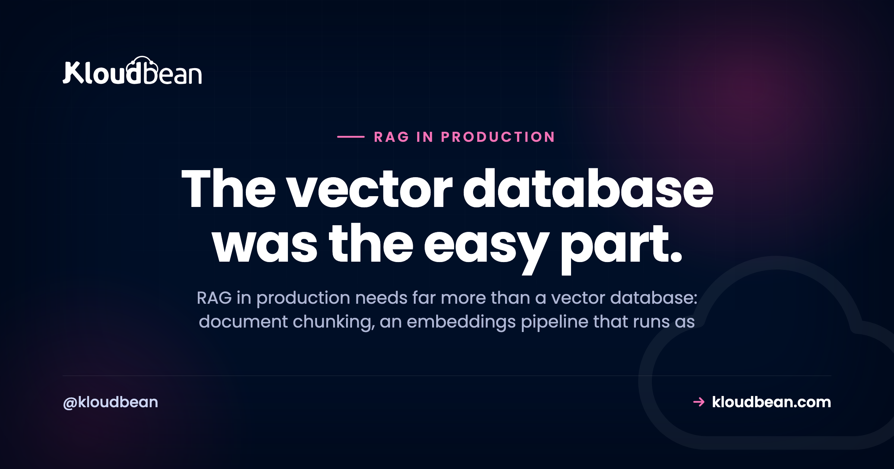
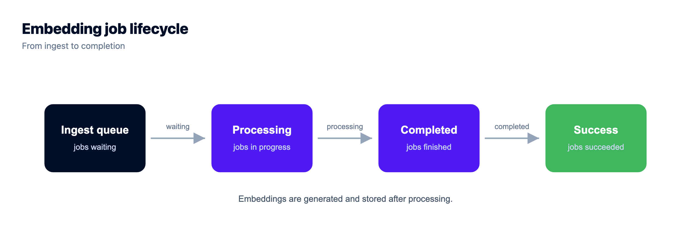

# RAG in Production: What You Need Beyond a Vector Database

Almost every RAG project starts the same way. Someone reads a tutorial, picks a vector database, embeds a folder of PDFs, and by lunchtime the demo answers questions about the docs. It feels done. Then it meets real users, real documents, and real permissions, and the cracks show up fast.

Taking RAG in production seriously means accepting that the vector database was the easy part. Retrieval augmented generation is a small idea with a long tail of plumbing: how documents get in, how they're chunked, how embeddings are built without blocking a web request, how the index stays honest when a document changes, and how you stop one user's data from surfacing in another user's answer. This page is that tail, worked through piece by piece.

> **Short answer:** A vector database is one piece of production RAG, not the whole thing. You also need document ingestion and chunking, an embeddings pipeline that runs as a background job, a way to keep the index fresh when documents change, per-user permission filters on retrieval, retries on flaky provider calls, plus observability and cost control on embeddings and queries.

**This isn't a "what is pgvector" post.** The vector store itself, the SQL, the indexes, the distance operators, all of that lives in [pgvector for AI apps](https://www.kloudbean.com/blog/pgvector-for-ai-apps/). This page is about everything wrapped around it. If you're still choosing where to keep your vectors, read that first, then come back for the production wiring.

## What RAG in production actually needs

The whiteboard version of RAG is three boxes: documents go into a vector database, a question comes in, the closest chunks get stuffed into a prompt, the model answers. That drawing is correct and almost useless, because it hides every part that gets hard at scale.

Here's the fuller list, the stuff that separates a weekend demo from something you'd let paying customers touch:

- **Ingestion and chunking.** Turning messy PDFs, HTML, and docs into clean, right-sized chunks with useful metadata attached.
- **An embeddings pipeline.** Generating vectors as a background job, not inside the request that uploaded the file.
- **Index sync.** Re-embedding and deleting vectors when the source document changes, so the index never lies.
- **Permissions.** Filtering retrieval so a user only ever gets chunks they're allowed to see.
- **Reliability.** Retries, timeouts, and idempotency on embedding and model calls that fail more often than you'd like.
- **Observability.** Logging what got retrieved for each answer, so you can debug a bad reply instead of guessing.
- **Cost control.** Not re-embedding unchanged text, caching repeat queries, and keeping an eye on token spend per tenant.

Notice the vector database is one bullet. Choosing it is a genuine decision, and for most apps Postgres with pgvector is enough, but it's maybe ten percent of the work. The other ninety percent is what this guide is about.

## The RAG pipeline, from document to answer

The single most useful mental model for production RAG is that it's two pipelines, not one. There's an **offline path** that turns documents into searchable vectors, and an **online path** that answers a question in real time. They meet at the vector store, and they have completely different performance rules.

The offline path can be slow. It runs in the background, it can retry, and nobody's staring at a spinner while it works. The online path has to be fast, because a person is waiting. Confuse the two, put the slow work on the fast path, and you get the classic RAG timeout.



## Prototype RAG vs production RAG

If you want the difference in one glance, it's this. The prototype takes shortcuts that are invisible with ten documents and one user, and expensive with ten thousand documents and real tenants.

| Concern | Prototype RAG | Production RAG |
| --- | --- | --- |
| Ingestion | A script you run by hand | An upload path plus a queue that ingests on its own |
| Chunking | Fixed character count, no overlap | Structure-aware chunks with overlap and metadata |
| Embedding | Done in the upload request | A background worker, retried and idempotent |
| Index freshness | Rebuild everything, sometimes | Re-embed and delete per document on change |
| Permissions | Everyone searches everything | Retrieval filtered by tenant and user |
| Failures | The request just errors | Backoff, timeouts, partial-progress checkpoints |
| Cost | Whatever it costs, unmeasured | Cached, batched, and tracked per tenant |
| Debugging | Read the answer and shrug | Logged chunk IDs and scores per answer |

## Chunking quietly decides your answer quality

Chunking gets the least attention and causes the most pain. It's the step where you cut a document into the pieces you'll embed and retrieve, and the size of those pieces sets a ceiling on how good your answers can ever be.

Two failure modes, opposite directions:

- **Chunks too big.** You embed a whole page, so its vector is a blurry average of five different topics. Retrieval returns something vaguely on-topic, you burn context tokens on filler, and the model has to hunt for the one relevant sentence buried in the chunk.
- **Chunks too small.** You split every sentence, so each vector loses the context around it. A chunk that reads "It was discontinued in that release" is useless when you don't know what "it" is. Retrieval gets fragments that don't stand on their own.

The fix isn't a magic number, it's a few habits. Split on structure first (headings, paragraphs, list items) rather than blind character counts, so a chunk is a coherent thought. Add a little overlap between neighbours so a sentence on a boundary isn't orphaned. A sane starting point for prose is roughly 200 to 500 tokens per chunk with 10 to 15 percent overlap, then you measure and adjust for your content. Code, tables, and transcripts all want different treatment.

And attach metadata to every chunk while you're here: the source document, the section, the tenant, a version or content hash. You'll need all of it later for filtering, freshness, and debugging. Metadata you skip at ingest is metadata you can't filter on at query time.

**One opinion, since fence-sitting helps nobody:** most bad RAG answers are a retrieval problem, not a model problem. When the output is wrong, the reflex is to reach for a bigger, pricier model. Look at what got retrieved first. Nine times out of ten the chunks were wrong, stale, or too coarse, and no model can answer well from bad context.

## Embeddings belong in a background job, not a web request

Here's the anti-pattern I see most, and it's worth calling out plainly: **generating embeddings inside the HTTP request that uploaded the document.** It looks fine in the demo. Upload one small file, embed it right there, return. Ship it.

Then a user uploads a 200-page PDF. That's hundreds of chunks, hundreds of embedding API calls, each with network latency, some getting rate-limited. The request hangs for a minute, the load balancer or browser times out, and you're left with a half-indexed document and a user staring at a dead spinner. Worse, they hit retry and now you're double-indexing.

The fix is the shape from the diagram. The upload does almost nothing: write the raw file to object storage, insert a job row, return a 202 immediately. A separate **worker process** picks the job off a queue and does the slow work: fetch the file, chunk it, embed the chunks (in batches), write the vectors, mark the job done. Because it's a queue, you get retries, controlled concurrency so you don't slam the embedding provider's rate limit, and backpressure when a big batch lands.

In Node this is usually a queue like [BullMQ backed by Redis](https://www.kloudbean.com/blog/nodejs-background-jobs-bullmq/); the same pattern exists in every language. The documents themselves go in [object storage](https://www.kloudbean.com/blog/store-user-uploads-in-object-storage/), never on the app's local disk, which vanishes on the next deploy. And the worker runs as its own long-lived process next to your app, not as a function that has to finish inside a request window. Redis, if you use it, is worth running as [managed Redis](https://www.kloudbean.com/blog/managed-redis-hosting/) so the queue survives a restart.

## Keeping the index in sync when documents change

This is the failure mode almost nobody plans for, and it's a quiet one because nothing errors. Your index doesn't crash when it goes stale. It just starts lying.

Picture it: someone edits a policy doc, or deletes an old contract, or a product page changes its pricing. The source is updated. But the vectors you embedded last month still hold the old text, so retrieval happily hands the model deleted or outdated content, and the model quotes it back to a user with total confidence. That's how a RAG system ends up citing a price you don't charge anymore.

Keeping the index honest takes a few deliberate moves:

- **Re-embed on change.** When a document is updated, re-run it through ingest and replace its chunks. Use a content hash per chunk so you only re-embed the parts that actually changed, which saves real money on large docs.
- **Delete when the source is deleted.** Removing a document has to remove its vectors too. Orphaned vectors are the most dangerous kind, because they represent content that no longer exists anywhere you can audit.
- **Version and reconcile.** Tag chunks with a document version, and run a periodic reconcile job that compares the index against the source of truth and cleans up drift. A scheduled task (a cron job beside the app) is the usual home for that sweep.

That reconcile job is the one piece of RAG infrastructure people skip because it needs somewhere to run on a schedule, and wiring cron on a box you also have to maintain feels like a project. It shouldn't be. On Kloudbean cron jobs are a form in the console rather than an SSH session and a crontab you'll forget you edited, which matters mostly because a drift sweep you can see and change is a drift sweep that still runs in six months.

Tie ingest to your document lifecycle, so create, update, and delete each trigger the right index action. If your app can change a document without touching the index, the index will drift, and drift always shows up at the worst moment.

## Permissions: never hand back another user's data

If there's one bug in this whole article that should scare you, it's this one. Vector similarity has no idea who owns what. It matches on meaning, full stop. So if you store every tenant's chunks in one index and search across all of them, a question from user A can retrieve a chunk from user B's private document, and your model will cheerfully summarize it into the answer. That's a data breach with a friendly tone.

The rule is simple to say and easy to get wrong: **filter by permission at retrieval time, in the query, not after.** Store the owning tenant and any access scope as metadata on every chunk, then constrain the search to what the current user is allowed to see. With Postgres and pgvector that's a plain WHERE clause riding alongside the similarity sort:

```sql
SELECT chunk_text, source_id
FROM   doc_chunks
WHERE  tenant_id = $1            -- filter FIRST, always
ORDER  BY embedding <=> $2       -- then similarity
LIMIT  5;
```

The `WHERE tenant_id = $1` is doing the security work. Never fetch the nearest chunks and then try to filter them in application code afterwards, and never rely on the prompt to "only use the user's own data." By the time text reaches the model, the leak has already happened. Filter before the model ever sees a byte.

A related trap: don't even index documents a user shouldn't be able to search. If a file is restricted, its chunks either stay out of the shared index or carry an access scope you enforce on every single query. Keeping tenants apart is retrieval logic you own, and it's worth a test that actually asserts user A can't retrieve user B's chunk.

## Provider calls will fail, so plan for it

Embedding APIs and model APIs are network calls to someone else's busy service. They rate-limit you (hello, 429), they time out, and they have the occasional outage. In a demo you never notice. In production, at volume, you hit these constantly, and code that assumes the call always succeeds will lose data and half-index documents.

The defensive kit is standard, it just has to actually be there:

- **Retry with exponential backoff and jitter.** On a 429 or a timeout, wait and try again, spacing attempts out so you don't stampede the provider the moment it recovers.
- **Set explicit timeouts.** A hung provider call shouldn't hang your worker forever. Bound it, then retry.
- **Make ingest idempotent.** A retried job must not create duplicate vectors. Key chunks by document ID and chunk index so a re-run overwrites cleanly instead of piling up.
- **Checkpoint partial progress.** If a 500-chunk document fails at chunk 300, resume from 300. Don't re-embed the first 300 and pay for them twice.
- **Have a fallback on the query path.** If the model is down mid-answer, fail gracefully: a cached response, a smaller backup model, or an honest "try again in a moment" beats a stack trace.

None of this is exotic. It's the difference between a pipeline that shrugs off a rough afternoon at your provider and one that silently corrupts your index during it.

All of it also assumes the worker is still alive, which quietly rules out a lot of hosting. Backoff and checkpointing need a process that keeps running between requests, so a platform that spins your code up per HTTP request and tears it down again can't hold the retry loop for you. Kloudbean runs always-on Node and Python processes, with PM2 for multiple Node processes, so the ingest worker sits beside the app as a long-lived thing rather than something you fake with a queue of HTTP calls to yourself.

## Watch retrieval quality and the bill

Two things you can't manage if you can't see them: whether retrieval is any good, and what it's costing you.

For quality, log what got retrieved for every answer. The chunk IDs, their similarity scores, the query. When a user reports a wrong answer, you want to open the trace and see exactly which chunks the model was handed, so you can tell a retrieval miss from a generation miss in seconds instead of guessing. Without that log you're debugging blind, and RAG gives you plenty to debug.

For cost, embeddings and model calls are metered, and a naive pipeline wastes money in obvious ways. Cache embeddings for repeated or near-identical queries. Batch embedding calls during ingest instead of one HTTP round trip per chunk. Skip re-embedding chunks whose content hash hasn't changed. Cap your top-k so you're not shoving twenty chunks into a prompt when five would answer better and cheaper. And track spend per tenant, because the one customer who uploads their entire document management system will show up in the bill before they show up in a meeting.

Two of those savings need somewhere to live. The query and embedding cache wants Redis with a TTL, which is one of the seven managed engines on Kloudbean and is a launch rather than a new vendor. The content-hash trick needs the original document still sitting in object storage so you can re-embed just the changed chunks, and Kloudbean's built-in S3-compatible storage doesn't meter data transfer out, so reading your own corpus back for a re-embed doesn't add a cost on top of the embedding calls you're already paying for. That last point is specific to the built-in buckets; managed Google Cloud Storage bills egress and ingress like any hyperscaler bucket.

## A user says the answer was wrong. Retrieval miss or generation miss?

This is the question you'll be asked most, and the one people answer worst. The instinct is to blame the model and start rewriting the prompt, which fixes maybe a third of these. Here's the cue I'd use, and it takes about a minute if you kept the retrieval log from the section above.

**Open the trace and read the chunks the model was handed.** Everything follows from that one look.

- **The right chunk isn't in the list.** That's a retrieval miss, and the prompt is irrelevant. Work backwards: was the document ever ingested? Did the chunk survive the last update, or is it a stale version? Is your top-k cutting it off at five when it ranked seventh? Is your chunking splitting the answer across a boundary so neither half matches? Most retrieval misses are an ingest or chunking problem wearing a model costume.
- **The right chunk is there, and the answer still isn't in it.** Now it's a generation miss, and prompt work is the right move. Tell the model to answer only from the provided context and to say it doesn't know otherwise. Check you're not burying the useful chunk under fifteen mediocre ones, because a smaller, better context usually beats a bigger one.
- **The chunk is there, correct, and the model contradicted it.** Rare, and usually a sign the context is too long or the instruction is too vague. Cut top-k and tighten the instruction before you reach for a bigger model.
- **The chunk belongs to someone else.** Stop. That's not a quality bug, it's the permission failure from earlier in this article, and it's the only item on this list that's an incident.

Notice that three of those four branches lead back to your ingest pipeline, not your prompt. That's the useful bias to carry into RAG debugging.

None of this is something a host can do for you, and I'd be suspicious of anyone selling it as such. No platform makes your chunking smart, writes your `tenant_id` filter, or decides your top-k, and Kloudbean doesn't either. What it does remove is the logistics that make the pieces above annoying to assemble: the vectors, the cache, the documents and the worker usually arrive from four vendors with four consoles and four bills. Here they're one dashboard. [Managed PostgreSQL](https://www.kloudbean.com/blog/managed-postgresql-hosting/) holds your vectors beside your application data with pgvector where your Postgres version supports it, [managed Redis](https://www.kloudbean.com/blog/managed-redis-hosting/) backs the queue and the cache, S3-compatible [object storage](https://www.kloudbean.com/blog/store-user-uploads-in-object-storage/) keeps the source documents, and the embedding worker runs as a long-lived process next to the app. Git deploys, automatic backups, free SSL, and the database locked to your app server's IP. The retrieval logic stays yours, which is as it should be, because it's the part that's actually your product. For the wider map of what changes when an AI app meets real users, see [the last mile of vibe coding](https://www.kloudbean.com/blog/last-mile-of-vibe-coding/).

<!-- cta:start -->
**Prototype to production, without the babysitting.**

Run the app as an always-on process with managed databases, Redis, object storage, and automatic backups beside it. Deploy from Git with live build logs, and keep the infrastructure someone else's problem.

- Managed databases
- Always-on processes
- Object storage
- Automatic backups
- Free SSL
- Git deploy
- Free migration

[Start free](https://console.kloudbean.com/register) · [See plans](https://www.kloudbean.com/pricing/)
<!-- cta:end -->

## FAQ

**What is RAG in production?**
RAG in production is retrieval augmented generation running as a real service with real users, which needs far more than a vector database. It adds document ingestion and chunking, a background embeddings pipeline, index synchronisation when documents change, per-user permission filtering on retrieval, retries on provider calls, and observability plus cost control. The vector store is one component among several.

**Do I need a vector database for RAG?**
You need somewhere to store and search embeddings, but that rarely means a separate product. For most apps, Postgres with the pgvector extension keeps vectors next to your application data and is plenty. See [pgvector for AI apps](https://www.kloudbean.com/blog/pgvector-for-ai-apps/) for the how-to. The bigger effort is everything around the store: chunking, sync, permissions, and reliability.

**Why should embeddings run as a background job?**
Because embedding a large document is hundreds of slow API calls, and doing that inside the upload request makes the request time out and leaves the document half-indexed. Move it to a queue and a worker: the upload returns immediately, the worker chunks and embeds in the background with retries and controlled concurrency. It also lets you respect the provider's rate limits instead of hammering them.

**What is the best chunk size for RAG?**
There's no universal number, but a reasonable starting point for prose is roughly 200 to 500 tokens per chunk with 10 to 15 percent overlap, then measure and adjust. Split on structure like headings and paragraphs rather than blind character counts. Chunks that are too big blur meaning and waste tokens; chunks that are too small lose the context that makes them answerable.

**How do I keep my RAG index in sync when documents change?**
Tie indexing to your document lifecycle. When a document is updated, re-embed it and replace its chunks, using a content hash so you only redo what changed. When a document is deleted, delete its vectors too, or you leave dangerous orphans. Version your chunks and run a periodic reconcile job to catch drift between the index and the source of truth.

**How do I stop RAG from leaking one user's data to another?**
Filter by permission at retrieval time, inside the query, not afterward. Store the owning tenant and access scope as metadata on every chunk, then constrain the search with a WHERE clause so it only considers chunks the current user may see. Never filter after retrieval or rely on the prompt to behave, because once restricted text reaches the model the leak has already happened.

**Why are my RAG answers wrong even with a good model?**
Usually because retrieval handed the model the wrong context, not because the model is weak. Stale vectors, chunks that are too coarse, or a missing filter all produce bad answers no model can fix. Log the chunks retrieved for each answer and inspect them first. Reach for better chunking, fresher indexing, and tighter filters before you reach for a bigger model.

**How do I control RAG costs in production?**
Stop paying for work you already did. Cache embeddings for repeated queries, batch embedding calls during ingest, and skip re-embedding chunks whose content hash is unchanged. Cap your top-k so prompts stay lean, and track token spend per tenant so a single heavy user is visible in the numbers before they surprise you in the bill.

**Can I run production RAG on Postgres with pgvector?**
Yes, and for most applications it's a solid default. You keep vectors beside your relational data, filter by similarity and by column in one query, and back everything up as a single system. See [managed PostgreSQL hosting](https://www.kloudbean.com/blog/managed-postgresql-hosting/). Very high query volumes or huge vector counts may eventually justify a dedicated engine, but that's a later problem, not a starting one.

**What is the difference between RAG and fine-tuning?**
RAG fetches relevant text at query time and gives it to the model as context, so answers can cite current, private documents and update the moment the source does. Fine-tuning bakes patterns into the model's weights and is better for style or format than for fresh facts. Most teams that want a model to answer from their own changing documents want RAG, not fine-tuning.

---

*Kloudbean · The vector database was the easy part.*
