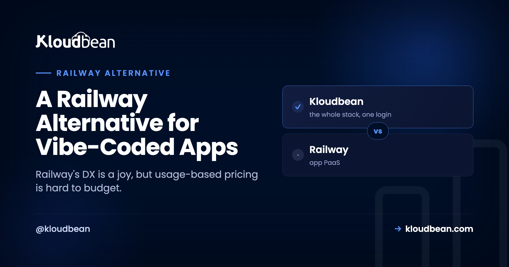

# A Railway Alternative for Vibe-Coded Apps

Almost nobody looks for a Railway alternative because Railway is bad. It's the opposite. Railway made deploying a backend feel easy: connect a repo, click to add a Postgres, watch it wire together in a clean graph. So if you're here, it's usually one of two quieter reasons. You want a bill you can actually predict, and you want to own the thing your app runs on. This is a decision framework for exactly that, plus an honest look at how a flat-rate server you own compares.

> **Short answer:** Railway's developer experience is good, and the metered model genuinely suits short-lived and bursty work. People look for a Railway alternative for two reasons that have nothing to do with the developer experience: the bill tracks resource usage and is hard to forecast, and it's still a platform you rent. A flat-rate server you own fixes both, keeps push-to-deploy, and lets several apps share one predictable bill. It trades the occasional near-zero month for a number you can budget.

## Railway's best feature and its scariest feature are the same feature

Give Railway its due first, because it earned the loyalty. Deploying from a repo is quick, adding a database is a couple of clicks, and the visual canvas of services and connections is a pleasure to work in. For getting a vibe-coded app off your laptop and onto the internet fast, few things beat it.

Here's the tension, though, and it's worth being blunt about. Railway meters the resources your services actually consume: compute, memory, and time. When your app is tiny, that's a gift. You pay almost nothing. But the same mechanism that makes it nearly free at the start is the one that makes the bill hard to predict later. Your cost tracks how hard your app works, and how hard your app works is exactly the number you can't forecast at the start of the month. Best feature, scariest feature, same feature.

The two pricing shapes look like this once an app starts growing.

| Usage level | Usage-metered (Railway-style) | Flat-rate (a server you own) |
| --- | --- | --- |
| Low / tiny | Cheapest, near zero | Same flat number |
| Growing | Climbs with the app | Same flat number |
| Busy / spiky | Climbs further, hard to forecast | Same flat number |

*At low usage the metered bill wins. As the app works harder, the metered cost climbs past the flat line and keeps going, while the flat line stays put. Where you sit on that curve, and how much the climb worries you, is the whole decision.*

## Why usage-based pricing is hard to budget

It's worth separating two things people blur together: expensive and unpredictable. Usage-metered pricing isn't necessarily expensive. The problem is that it's unpredictable, and unpredictable is its own kind of cost. When your bill is a function of compute-seconds, memory, and how long things run, the number depends on runtime behavior rather than a plan you chose. A background process that runs hotter than expected, a burst of traffic, a service you spun up to test something and forgot about: each nudges the total in a way you couldn't have written into a budget in advance.

Compare that to renting a room versus paying by the minute for everything you touch. Both can be fair. Only one lets you know the number before the month starts. For a hobby project that variability is fine, honestly. For a side project you don't want surprising you, a small business app, or a client's app you have to quote, a bill that moves with the weather is a low-grade, month-round stress. The [cost of running a side project](https://www.kloudbean.com/blog/cost-of-running-a-side-project/) gets into the specifics.

<!-- ADD IMAGE: A Railway usage or metrics view showing resource consumption and the running monthly estimate. -->

## A decision framework: should you look for a Railway alternative?

Don't switch on vibes. Run your situation through four questions. If most of your answers lean the same way, you have your answer.

### Is your usage small and genuinely stable?

If your app sips resources and the number barely moves month to month, the metered bill is effectively predictable already, and it's probably tiny. Leaning stay. The predictability problem only bites when usage is either large or jumpy.

### Do you need to commit a number to a budget?

If someone (you, a client, a finance spreadsheet) needs to know the hosting cost before the month happens, usage metering fights you by design. A flat server gives you one line you can commit to. Leaning move.

### Are you running, or about to run, more than one app?

This is the one people underestimate, so I'll flag it hard. On a metered platform every new service is another thing being billed. Vibe-coding tools make it genuinely easy to ship more than one app: a thing this week, another next month. One metered app can be cheap. Five metered apps is five meters. Five apps on a server you own is still one flat bill. If you ship often, leaning move, and it's not close.

### Do you want to own it and be able to leave?

If you want a server that's actually yours, that you could pick up and move elsewhere, a rented abstraction won't give you that no matter how pleasant it is. Leaning move. If you don't care and love the graph UI, that's a completely valid reason to stay.

> **Prototype or product?** The honest dividing line is roughly there. For a prototype, Railway's metered model is often the cheaper choice, and cost is the only axis on which that's true. For something you intend to keep, grow, and budget, predictability and ownership start to matter more than the occasional near-zero month.

## What owning the server actually gets you

"Ownership" sounds abstract until you list what it buys. On a server you own, you can SSH in and see exactly what's running. You read the real logs, run a one-off script, install a tool, add a cron job, or open the database directly, none of which needs the platform to expose a button for it. Your app runs on standard Linux, so leaving is always an option: same code, another host, it runs.

And there's a quieter benefit that only shows up over time. When you rent an abstraction, someone else's product decisions land on you. Platforms change pricing, retire features, and adjust free tiers on their own schedule, and you absorb it. Own the server and the ground under your app stops shifting because a company changed its plans. For a weekend build that fragility is invisible. For something you mean to keep, it's a real kind of stability.

A pattern we run into a lot: someone spins up a second service to try something, forgets it's there, and it quietly meters in the background until the invoice reminds them. On a flat-price box you own, a forgotten process is just a process. It isn't a line on a bill that grows while you sleep.

<!-- ADD IMAGE: A terminal SSH'd into the server, showing the running app process and its real logs. -->

## How a flat-rate managed server compares

This is the space [Kloudbean](https://www.kloudbean.com/) sits in. Instead of metering resource-time, it gives you a real server, provisioned and managed for you on the cloud you choose (seven providers: AWS, Google Cloud, DigitalOcean, Linode, Vultr, UpCloud, Lightsail), for a flat monthly price. You still connect a Git repo and deploy from a console, so the part of Railway you actually liked carries over.

Because the price is flat, a second (or fifth) vibe-coded project doesn't start a second meter. Add it as another application on the same server, with its own domain and its own managed database.

|  | Railway | A server you own |
| --- | --- | --- |
| Pricing model | Usage-metered (compute, memory, time) | Flat monthly for the server |
| Predictability | Moves with how hard the app works | The same number every month |
| Ownership | A platform abstraction you rent | A real server you own and can leave |
| Database | A managed service you add | Launched on the same box, backed up |
| Several apps | More services, more metered usage | Share one flat-price box |
| Deploy experience | Connect a repo, push | Connect a repo, push |

The managed layer runs the OS, stack, SSL, patching, and backups, so you get ownership without becoming a server administrator. Launch a managed database (Postgres, MySQL, MariaDB, Redis, MongoDB, or Elasticsearch) next to the app and connect over the local network. The mechanics are in [hosting multiple apps on one server](https://www.kloudbean.com/blog/host-multiple-apps-one-server/) and [adding a managed database](https://www.kloudbean.com/blog/add-managed-database-to-your-app/), and the end-to-end move is in the [deploy walkthrough](https://www.kloudbean.com/blog/deploy-ai-built-app-to-production/).

## When none of this is urgent yet

A comparison that pretends every reader should switch today isn't worth much, so here's the honest read. None of the pressures above have arrived if you're prototyping or early and the metered bill is genuinely small, if you lean on the graph-based workflow and the convenience outweighs cost predictability for you, or if your usage is stable and modest enough that the number is effectively predictable anyway. In any of those cases there's nothing to fix, and switching would buy you a server you don't yet need. Comparing the whole field? The [Render](https://www.kloudbean.com/blog/render-alternative-for-vibe-coded-apps/) and [Heroku](https://www.kloudbean.com/blog/heroku-alternative-for-modern-apps/) pieces weigh the same trade from their angles.

## The honest limits

Kloudbean runs Linux web stacks: Node, PHP, Python, Ruby, Java, and frameworks like React, Next.js, Vue, Laravel, and Django, which covers what vibe-coded apps are built on. It isn't for Windows, .NET, or IIS. "Managed" means Kloudbean runs the server, stack, SSL, patching, and backups; you own and maintain the app and its data. And to be straight: at genuinely tiny usage, Railway's metered bill can come in under a flat server, because a server costs the same whether it's busy or idle. The flat model wins on predictability and as usage grows, not necessarily on the smallest possible number at the smallest scale. Predictable beats cheapest for most people past the prototype, but you should pick based on where you actually sit on that curve.

## Keep the ease. Lose the meter.

Run your vibe-coded apps on one flat-rate server you own at [kloudbean.com](https://www.kloudbean.com/). One-click databases, automatic backups, IP allow-listing, free migration, free trial, and git deploy. Plans on [pricing](https://www.kloudbean.com/pricing/).

## FAQ

**What's a good Railway alternative with predictable pricing?**
A flat-rate managed server. Instead of metering compute, memory, and time, you pay one monthly price for a server you own, with a database beside the app, while keeping the connect-a-repo, push-to-deploy flow you liked on Railway. Kloudbean provides that model across seven cloud providers.

**Why do people look for a Railway alternative?**
Usually two reasons. Usage-based pricing is hard to predict and can climb as the app works harder, and it's still a platform you rent rather than own. Railway's developer experience isn't the complaint. The pricing shape and ownership are the motivators.

**Will I lose Railway's easy deploys?**
No. On a managed server you connect your repo, deploy from the console, and enable auto-deploy on push, with build logs streaming live. You keep the ease and gain a flat price and a server you own.

**Is a flat server actually cheaper than Railway?**
Not always at small scale. Railway's metered bill can be tiny when usage is tiny. A flat server wins on predictability and as usage grows, because it doesn't climb with how hard your app works, and several apps can share it. Predictable is the real selling point, not lowest-possible.

**Can I run several apps and a database on one server?**
Yes, and it's where the flat model pulls ahead. Add each app as its own application on the same server with its own domain, and launch a managed Postgres or MySQL next to them. Several apps and their databases, one predictable bill, instead of a separate meter per service.
