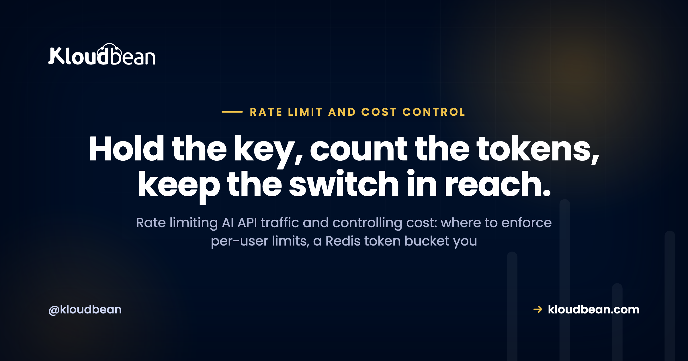

# Rate Limiting and Cost Control for AI APIs: Stop a Stranger Running Up Your Model Bill

You built an AI feature. It calls a model from your backend, it works on localhost, and you ship it. Then one morning the usage graph looks like a ski jump, because someone found the endpoint and pointed a script at it. Rate limiting AI API calls, and capping what any single caller can spend, is the thing standing between a normal invoice and that ski jump.

This is a field guide to throttling your own callers and controlling your own spend. It is not about the provider throttling you. Those inbound 429s from OpenAI or Anthropic are a separate problem, covered in [why AI apps fail in production](https://www.kloudbean.com/blog/why-ai-apps-fail-in-production/). This is the other direction: the limits and budgets you put in front of your own model calls so one stranger, or one runaway retry loop, can't empty your account while you sleep.

> **The short version:** An open, unauthenticated model endpoint is how AI apps get expensive overnight. Require auth, then enforce a per-user limit with a Redis token bucket, cap how many model calls run at once, and track spend per user with a global kill switch behind it. When a caller goes over, return HTTP 429 with a Retry-After header. And set the provider's own hard spend cap on day one, before you write any code.

## First, whose limit is this? You throttling them, not the provider throttling you

Two different problems share the word "limit", and mixing them up wastes a lot of debugging time.

The first is the provider throttling you. You send requests too fast, the model API returns a 429, and your job is to back off and retry politely. That is a client-side reliability concern, and it lives in [why AI apps fail in production](https://www.kloudbean.com/blog/why-ai-apps-fail-in-production/). Don't rebuild it here.

The second is you throttling your callers. Your endpoint calls a paid API on your key, so every request someone sends you costs you money. If anyone can hit it as often as they like, anyone can spend your budget. That is this article.

One prerequisite sits underneath everything below. If the model key is in your frontend, or the route has no login, none of these limits matter, because the attacker skips your app entirely or hides in the crowd. Keep the key server-side and require auth on every model route. That groundwork is covered fully in [deploy an AI agent without exposing API keys](https://www.kloudbean.com/blog/deploy-ai-agent-without-exposing-api-keys/), so assume it's done. Once auth is in place, every request carries an identity, a user id or an API key, and that identity is what you limit and bill against.

<!-- ADD IMAGE: the request funnel diagram (request to auth to per-user token bucket in Redis to concurrency gate to spend budget to model, with 429 and kill-switch reject branches). -->

## Rate limiting AI API calls: edge, app layer, or both?

There are two places to enforce a limit, and they do different jobs.

The **edge or network layer** is coarse. A CDN or firewall can drop obvious floods by IP before they ever reach your app. It's cheap and it's blunt. The problem is that IP addresses are shared (offices, mobile carriers, CGNAT all put many people behind one address) and they rotate, so an IP limit can't tell your paying customer from an attacker sitting on the same network, and it can't attribute cost to anyone.

The **application layer** is precise. It runs inside your app, after auth, keyed by user id or API key. This is the one that actually protects the model bill, because it knows exactly who the caller is, how often they've called, and how much they've spent. Per-user rate limiting is the control that matters. Everything else is a supporting act.

| Layer | Keyed by | Precision | Best at | Blind spot |
| --- | --- | --- | --- | --- |
| Edge / network | IP address | Coarse | Dropping blunt floods before they cost you compute | Shared and rotating IPs, no idea who the user is, no cost attribution |
| Application | User id or API key | Precise | Fair per-user limits, spend budgets, attribution | Needs auth first, and you have to write it |

So the honest answer is usually both, for different reasons. A light edge limit soaks up dumb bot traffic. The real work happens per user in your app. On Kloudbean, Cloudflare is available as a paid add-on (free for Enterprise) if you want that coarse edge layer, but it isn't the per-user control and it isn't unique to any host. The rest of this guide is the app-layer part, because that's the part that saves your bill.

## Three algorithms, and why token bucket wins for AI

You have three common ways to count.

**Fixed window** counts requests per clock minute and resets at the top of the next one. It's the simplest, and it has a nasty edge: a caller can fire your whole minute's allowance at 10:00:59 and the whole next minute's at 10:01:00, so they push nearly double your limit through the seam in about a second. For an endpoint where each request costs real money, that boundary burst is exactly what you don't want.

**Sliding window** fixes the seam by weighting the previous window as the current one moves, so the count is smooth across the boundary. It's fairer. It costs a little more to compute and store.

**Token bucket** is the one I reach for. Picture a bucket that holds N tokens and refills at a steady rate. Every call takes a token; if the bucket's empty, the call is refused. It allows a short, controlled burst up to the bucket size (real people are bursty, they send three messages then think for a minute) and then settles to the refill rate as a hard ceiling. That shape fits human AI usage better than a rigid clock reset.

| Algorithm | How it works | Burst behaviour | Cost to run |
| --- | --- | --- | --- |
| Fixed window | Count per clock minute, reset at the top | Allows nearly 2x across the window boundary | Cheapest, one counter |
| Sliding window | Weight the previous window as time moves | Smooth, no boundary spike | A bit more state and math |
| Token bucket | Bucket of tokens, steady refill, one per call | Controlled burst up to bucket size, then steady | Small, two values per caller |

Here's the anti-pattern that quietly defeats all three: **keeping the counter in memory.** A common mistake we see is a limiter that stores counts in a process variable. It works perfectly on your laptop and in a demo. Then you run two app instances behind a load balancer, and each process keeps its own count, so your "30 requests a minute" silently becomes "30 per minute per instance". Scale to four instances and it's 4x. The limit is a decoration. The counter has to live in one shared place every instance reads and writes, and that place is Redis.

And an opinion, because it saves time: most teams over-engineer the algorithm and under-engineer the kill switch. A plain token bucket in Redis is enough for almost everyone. Spend your energy on the spend cap, not on picking between sliding-window variants.

Here's a correct, atomic token bucket. The check-and-take runs as one Redis Lua script so two simultaneous requests can't both think they got the last token.

<!-- ADD IMAGE: screenshot of the managed Redis connection details / env var in a dashboard. src -> images/managed-redis.png -->

```js
// token-bucket.js  (Node, using ioredis)
import Redis from "ioredis";
const redis = new Redis(process.env.REDIS_URL);

// Atomic token bucket as a Lua script, so check-and-take is one step.
const BUCKET = `
local capacity = tonumber(ARGV[1])
local rate     = tonumber(ARGV[2])   -- tokens added per second
local now      = tonumber(ARGV[3])
local take     = tonumber(ARGV[4])

local b = redis.call('HMGET', KEYS[1], 'tokens', 'ts')
local tokens = tonumber(b[1])
local ts     = tonumber(b[2])
if tokens == nil then tokens = capacity; ts = now end

tokens = math.min(capacity, tokens + (now - ts) * rate)
local ok = tokens >= take
if ok then tokens = tokens - take end

redis.call('HMSET', KEYS[1], 'tokens', tokens, 'ts', now)
redis.call('EXPIRE', KEYS[1], math.ceil(capacity / rate) + 1)
return { ok and 1 or 0, tokens }
`;

// capacity 20 = a burst of 20, then ~30/minute steady (0.5 token/sec)
export async function takeToken(id, capacity = 20, rate = 0.5) {
  const now = Date.now() / 1000;
  const r = await redis.eval(BUCKET, 1, "rl:" + id, capacity, rate, now, 1);
  return { ok: r[0] === 1, remaining: r[1] };
}
```

Then the limiter is just a gate at the top of the route:

```js
app.post("/api/generate", requireAuth, async function (req, res) {
  const { ok } = await takeToken(req.user.id);   // limit per user, not per IP
  if (!ok) {
    res.set("Retry-After", "2");
    return res.status(429).json({ error: "rate_limited" });
  }
  // within limit: safe to spend money on a model call here
});
```

This is where an always-on process earns its keep. Because the bucket lives in a shared Redis and the app runs as one steady process (not a fresh function instance per request), every call reads the same count and the limit is real. On a setup that spins up isolated instances or scales to zero, an in-memory bucket resets constantly and, worse, does it silently. [Managed Redis hosting](https://www.kloudbean.com/blog/managed-redis-hosting/) covers the store itself.

## Cap concurrency, the limit requests-per-minute misses

Requests-per-minute limits how *often* calls happen. It says nothing about how many are running *at the same time*, and for AI that gap bites. A single model call can run for many seconds, and a handful of long, expensive calls (a giant prompt, a high max_tokens, a slow model) can tie up more money and more of your server than a flood of tiny ones. Frequency and concurrency are different levers, and you want both.

So cap simultaneous in-flight model calls, per user and globally. The pattern is a counter you bump on start and always release at the end.

```js
const MAX_INFLIGHT = 3;   // simultaneous model calls per user

async function withConcurrencyLimit(userId, run) {
  const key = "inflight:" + userId;
  const n = await redis.incr(key);
  await redis.expire(key, 60);          // safety net: never leak a slot on a crash
  if (n > MAX_INFLIGHT) {
    await redis.decr(key);
    const e = new Error("too_busy"); e.status = 429; throw e;
  }
  try { return await run(); }
  finally { await redis.decr(key); }    // always release the slot
}
```

The `finally` matters. If a model call throws and you forget to release the slot, that user slowly locks themselves out as phantom in-flight calls pile up. The short EXPIRE is the backstop for a process that dies mid-call.

## Cost control: budgets, attribution, and a kill switch

Rate limits cap frequency. They don't directly cap dollars, and that distinction trips people up. A user well within their rate limit can still be expensive if every call is huge. So control cost directly, not only indirectly.

**Count the tokens.** Model responses return usage numbers (input/prompt tokens and output/completion tokens). Record them per user and per model, multiply by the provider's published per-token price, and you have real spend, not a guess. That's your cost attribution: you can see who and what is costing money. To watch that spend climb in real time and get paged before a budget trips, put it on a dashboard; [AI app observability](https://www.kloudbean.com/blog/ai-app-observability/) covers the signals and alerts that pair with these limits.

**Set budgets.** A per-user daily or monthly budget, and a global one for the whole app. When a user passes theirs, stop serving them with a friendly message. When the app passes the global one, trip the kill switch.

**Build a kill switch.** One flag in Redis, checked before every model call. Flip it and all model calls stop instantly, everywhere, no redeploy. It's the thing you reach for at 2am when something is very wrong and you want the bleeding to stop now.

```js
// checked before every model call
if (await redis.get("killswitch")) {
  return res.status(503).json({ error: "paused" });
}

// recorded after every model call
const u = completion.usage;                   // prompt_tokens, completion_tokens
const cost = priceFor(model, u.prompt_tokens, u.completion_tokens);
const spent = await redis.incrbyfloat("spend:" + userId + ":" + today, cost);
if (spent > userDailyBudget) blockUserForToday(userId);
```

Three more levers cut the bill without cutting users off. Cap **max_tokens** so no single request is unbounded, an open-ended output is an open-ended cost. Use **model tiering**: route cheap, simple tasks to a cheaper model and reserve the expensive one for work that needs it. And **cache identical requests**, so the same input on the same model returns the stored answer instead of paying twice.

Now the opinion this whole page is built around: set the provider's hard spend cap on day one, before you write a single limiter. Every line of code above can have a bug. The provider's cap can't, because it's enforced on their side, not yours. It's the seatbelt you hope never to touch. Write the limiters to avoid ever hitting it, but set it first. Know what it looks like when it trips, too: a provider that has stopped billing you usually answers with [a 402 Payment Required response](https://www.kloudbean.com/blog/402-payment-required/), and retrying that one never helps.

And the second anti-pattern, the one that catches careful teams: a provider spend cap with **no per-user cap** is a trap. The global cap stops the entire service the moment it trips, so a single abusive user can burn the whole budget and take every legitimate user down with them. You need both. The global cap is the backstop; per-user budgets stop any one caller from spending it all.

## The AI-specific abuse patterns, and what stops each

Generic rate limiting stops generic abuse. AI endpoints attract a few specific games, and each has a specific counter.

| Pattern | How it costs you | The control that stops it |
| --- | --- | --- |
| Scripted hammering of an open endpoint | Thousands of calls on your key while you sleep | Auth on the route plus a per-user token bucket |
| Prompt-stuffing (giant inputs) | Huge input token counts inflate cost per call | Reject oversized inputs, count input tokens against the budget |
| Forcing the most expensive model | Caller picks your priciest model for cheap tasks | Choose the model server-side, or allow-list per plan |
| Retry storms | A buggy client retries every hiccup, multiplying calls | Your own 429 with Retry-After, plus the concurrency cap |

The through-line: don't trust the client to be well-behaved or honest. Decide the model, the input size, and the pace on the server, where you're the one holding the bill.

## When a limit is hit, fail politely

A limit that slams the door feels broken. A limit that says "one sec" feels like a product. You have three good moves when a caller goes over.

Return **429 with a Retry-After header** telling the client how many seconds to wait. Well-behaved clients read Retry-After and back off instead of hammering harder, which is the whole point of sending it. Or **queue and defer**: for work that isn't interactive, accept the job, return quickly, and process it when capacity frees up. Or **fall back to a cheaper model** so the user still gets an answer, just not the premium one, when they're over their budget for the expensive path.

Whatever you pick, don't show a raw error. Tell the user they're going a little fast and to try again in a few seconds, or degrade quietly in the background. Handled well, a 429 is a speed bump. Handled badly, it looks like a crash.

## Where Kloudbean fits

Two things make this whole setup work: a shared store for the counters and a process that's always running to enforce them. Kloudbean gives you both in one dashboard. You get a managed Redis (one of its managed databases) for your token buckets, concurrency counters, spend totals, and the kill-switch flag, and an always-on server (Node or Python) to run the limiter middleware. No cold starts resetting a counter, one process with a shared connection pool. Set `REDIS_URL` and your model key as environment variables in the dashboard, get free SSL, and deploy from Git on every push.

If you want a coarse edge layer, Cloudflare is available as a paid add-on (free for Enterprise) and can do IP rate limiting in front of the app. That's an optional blunt filter, not the per-user control, and it isn't specific to Kloudbean. Baseline server hardening is Shorewall plus Fail2ban. The per-user and per-key limiting is your application code, Redis-backed. Kloudbean provides the Redis and the always-on process; it does not rate-limit your AI endpoint for you, and there's no magic WAF that does it either. You lock the database down by whitelisting your app server's IP, so only your app can reach Redis and everything else is refused. Full network isolation in a private VPC is an Enterprise capability, not the standard default.

The honest boundary: managed means Kloudbean runs the server, the stack, SSL, backups, and patching. Your code, your prompts, your limits, and your data stay yours. It gives your limiter a solid home with a real shared counter. It can't decide your budgets for you. For the wider picture of what AI builders leave for you to finish, see [the last mile of vibe coding](https://www.kloudbean.com/blog/last-mile-of-vibe-coding/), and run the [AI-built app security checklist](https://www.kloudbean.com/blog/ai-built-app-security-checklist/) before you open the doors. If you're still choosing where to run it, [best hosting for AI SaaS](https://www.kloudbean.com/blog/best-hosting-for-ai-saas/) weighs the options, and [hosting an AI chatbot in production](https://www.kloudbean.com/blog/host-ai-chatbot-in-production/) shows the same limits in a full app.

## Put your rate limiter on a foundation that actually holds a shared counter

**Run your limiter middleware on an always-on Node or Python server with a managed Redis for the counters, buckets, budgets, and kill switch, all in one dashboard and deployed from Git.** No cold starts resetting your limits, so the count you enforce is the real count. Start free at [kloudbean.com](https://www.kloudbean.com/); see plans on [pricing](https://www.kloudbean.com/pricing/).

Managed Redis for your rate-limit counters · Always-on Node and Python · Environment variables in the dashboard · Free SSL · Git deploy · IP allow-listing

## FAQ

**What is the difference between rate limiting my AI API and the provider rate limiting me?**
They point in opposite directions. The provider returns a 429 when you send it requests too fast, and you handle that with retries and backoff. This article is you limiting your own callers so nobody floods the endpoint you pay for. Both involve the number 429, but the cause and the fix are different for each.

**Where should I enforce rate limits, at the edge or in my app?**
Both, for different jobs. An edge or network layer can drop blunt IP floods before they reach you, but IPs are shared and rotate, so it stays coarse. The limit that protects your model bill lives in your app, keyed by user id or API key, because only your app knows who the caller is and what they've already spent.

**Why use Redis for rate limiting instead of in-memory counters?**
An in-memory counter lives inside one process, so the moment you run two app instances each keeps its own count and your limit doubles silently. Redis is a single shared store every instance reads and writes, so the limit stays real no matter how many instances you run. It's also where your budgets and kill switch live.

**What is a token bucket and why use it for an AI API?**
A token bucket holds a set number of tokens and refills at a steady rate. Each call takes one token, and if the bucket is empty the call is refused. It allows a short, controlled burst, which suits bursty human usage, and then settles to a steady ceiling. That fits AI traffic better than a fixed window that resets on a hard clock.

**How do I add a spend cap to my AI app?**
Count the input and output tokens the provider returns on each response, multiply by the published per-token price, and add it to a per-user and a global running total in Redis. When a user passes their budget, stop serving them. When the global total passes yours, trip a kill switch that blocks all model calls. Also set the provider's own hard spend cap as a backstop.

**Should I limit concurrency or requests per minute?**
Both, because they measure different things. Requests per minute caps how often calls happen; concurrency caps how many run at the same time. AI calls can run for seconds and cost a lot each, so a few long, expensive calls can hurt more than many small ones. Cap simultaneous in-flight calls per user and globally alongside your rate limit.

**How do I rate limit by API key or per user?**
Once auth is in place, every request carries an identity, a user id or an API key. Use that identity as the Redis key for the caller's token bucket and spend counters. That way each caller gets their own fair limit and their own budget total, instead of one shared limit that everyone fights over.

**What should I return when someone hits a rate limit?**
Return HTTP 429 with a Retry-After header saying how long to wait. Well-behaved clients read Retry-After and back off instead of retrying harder. In the interface, show a soft message like a short cooldown rather than a raw error, or fall back to a cheaper model so the user still gets an answer.

**How do I throttle OpenAI API usage to control cost?**
Put your own per-user rate limit and a concurrency cap in front of every call, cap max_tokens so no single request is unbounded, route simple tasks to a cheaper model, and cache identical requests. Track tokens per user against a budget, and set OpenAI's hard monthly spend cap in their dashboard as a backstop you hope never to hit.

**What is the fastest way to stop AI API abuse right now?**
Set the provider's hard spend cap first, so the worst case is bounded no matter what. Then require auth on the model route, add a per-user Redis token bucket, and a global kill switch you can flip by hand. Those four cover most of the risk, and the finer tuning can come after you've stopped the bleeding.

---

*Kloudbean · Hold the key, count the tokens, keep the switch in reach.*
