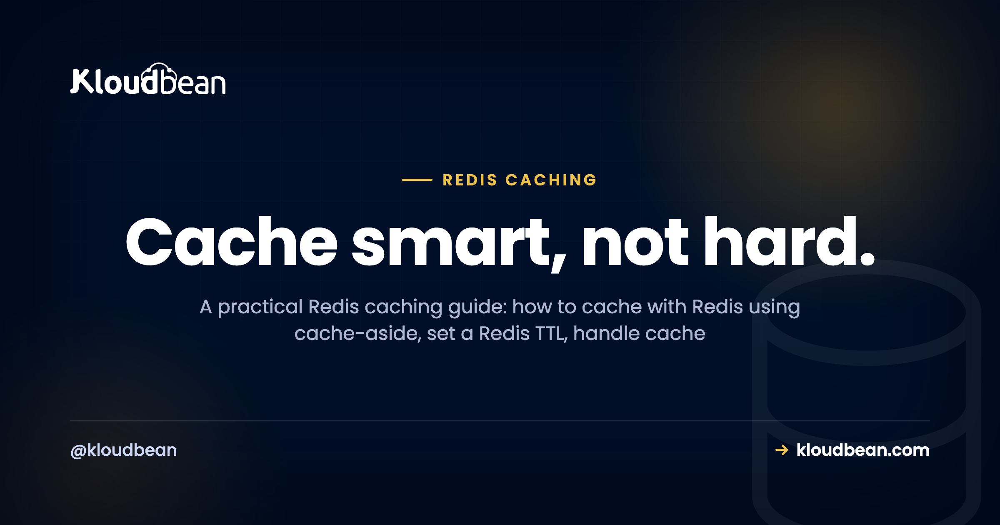

# Redis Caching: A Practical Guide to What to Cache and How

_By Kloudbean Engineering · Cache smart, not hard._

Your database keeps answering the same question. Same query, same rows, every few seconds, all day. Redis caching fixes that by holding hot answers in memory, so repeated reads come back in under a millisecond instead of hammering Postgres or MySQL. This Redis caching guide is the practical version: what to actually cache, how to cache with Redis using the cache-aside pattern, how to set a sane Redis TTL, and how to survive the two things that bite, cache invalidation and cache stampede. Real Node and Python code included.

> **The short version.** Redis caching keeps frequently read data in memory so requests skip the database. The default pattern is cache-aside: check Redis, on a miss read the database, then store the result with a TTL using `SETEX`. Put a TTL on every key, delete the key when the record changes, and add a little TTL jitter so one popular key expiring can't stampede your database. On Kloudbean, Redis is a one-click managed engine on the same private network as your app and database.

## Why Redis caching works, and what you should actually cache

A cache earns its keep when your app reads the same data far more often than it changes. Redis lives in memory and answers in a fraction of a millisecond, so it sits in front of your database and soaks up the repetitive reads. A thousand identical queries an hour become a handful.

Caching everything is a rookie move, though. It wastes memory and hides bugs where users see stale data. Before you cache something, ask three things:

- **Is it read a lot?** Payoff scales with read frequency. A page hit ten thousand times an hour is ideal; a row read once a day isn't worth a key.
- **Is it expensive to produce?** A slow join, an aggregate over millions of rows, a sluggish third-party API call. If regenerating it costs real time, caching saves that on every hit.
- **Can it tolerate being slightly stale?** The one people skip. If a five-second-old copy is fine, cache it.

Three yeses, cache it. The classic wins are expensive queries, repeated reads of the same rows, rendered fragments, and slow external API responses.

### What not to cache

Some data has no business in a cache. Don't cache anything that must be correct the instant it's read: an account balance at checkout, live inventory when someone clicks buy, a one-time token, a payment status. Getting those wrong isn't a slightly old page, it's a bug that costs money. My rule is blunt: don't cache money. Also skip data that's already fast to fetch, and data read so rarely it'll expire before anyone reads it twice.

## The cache-aside pattern: the one you'll actually use

Cache-aside (sometimes called lazy loading) is the workhorse of Redis caching. Your app owns the logic. Check Redis first. If the value's there, return it, a hit. If not, a miss: read the database, write the answer into Redis with a TTL, and return it. Nothing gets cached until someone asks for it, so the cache fills with exactly what your traffic wants.

<!-- Bespoke inline SVG in the HTML: the cache-aside read path over the private network.
     (1) App sends GET key to Redis. HIT returns in under 1 ms.
     (2) MISS falls through to the managed DB (Postgres / MySQL).
     (3) DB result is written back with SETEX + TTL. Brand navy / purple / green. -->

```
        1: GET key                 2: MISS (dashed)
[ Your App ] ----------> [ Redis ] ----------> [ Managed DB ]
     ^                       ^                   Postgres / MySQL
     |__ HIT: under 1 ms ____|                        |
                             |__ 3: SETEX + TTL <------|
        ( all on the private network / VPC )
```

Here it is in Node with `ioredis`. Read the connection URL from the environment, never hard-code it (more on why in [environment variables done right](https://www.kloudbean.com/blog/environment-variables-done-right/)).

```js
import Redis from "ioredis";
const redis = new Redis(process.env.REDIS_URL);

// Cache-aside: check Redis, fall back to the DB, then store with a TTL.
async function getProduct(id) {
  const key = `product:${id}`;

  const hit = await redis.get(key);
  if (hit) return JSON.parse(hit);            // cache HIT

  // cache MISS: read the source of truth
  const product = await db.query(
    "SELECT * FROM products WHERE id = $1", [id]
  );

  // SETEX = SET with an expiry. 300 seconds here.
  await redis.setex(key, 300, JSON.stringify(product));
  return product;
}
```

The Python shape is identical, which is the point. Same three steps with `redis-py`:

```python
import os, json
import redis

r = redis.from_url(os.environ["REDIS_URL"])

def get_product(product_id):
    key = f"product:{product_id}"

    hit = r.get(key)
    if hit:
        return json.loads(hit)              # cache HIT

    product = db.fetch_product(product_id)  # cache MISS
    r.setex(key, 300, json.dumps(product))  # store for 300s
    return product
```

Two habits are baked in. Values are JSON-serialized in and parsed out, because Redis stores strings and bytes, not your language's objects. And every write uses `setex`, so there's a TTL from second one. Why cache-aside by default? It fails safe: if Redis is down, every request becomes a miss that falls through to the database, so the app slows down instead of falling over.

<!-- ADD IMAGE: redis-cli MONITOR streaming live GET and SETEX calls as the app serves traffic -->

## Setting a Redis TTL that isn't a guess

A TTL (time to live) is how long a key survives before Redis deletes it. `SETEX key 300 value` means it's gone in 300 seconds unless something rewrites it. The TTL is your safety net: even if your invalidation logic has a bug, a five-minute TTL means a key is stale for at most five minutes. No TTL means stale until the server reboots. Match it to how fresh the data must be, not a number that feels tidy:

| Data changes... | Example | Sensible TTL |
| --- | --- | --- |
| **Rarely** | Config, product catalog, country list | Minutes to hours |
| **Sometimes** | User profile, dashboard count, article body | 30 to 300 seconds, plus delete-on-write |
| **Constantly** | Live price, stock level, leaderboard | A few seconds, or don't cache it |

Unsure? Go shorter. A short TTL fails safe, at worst a few seconds of staleness and a slightly higher miss rate. A long TTL with no invalidation is how users end up staring at data that changed ten minutes ago.

<!-- ADD IMAGE: redis-cli running TTL product:42 and showing the seconds left on the key -->

## Cache invalidation and cache stampede: the hard part

There's an old joke that the two hard problems in computing are naming things, cache invalidation, and off-by-one errors. It lands because invalidation is the part that bites. Cache invalidation is genuinely the hard part, and anyone who says otherwise hasn't shipped a cache that mattered. The read path is easy; the bug shows up on writes. A user edits their profile, you update the Postgres row, but the old value still sits in Redis with minutes left on its TTL. Until it expires, every read is stale and the user swears the save button is broken.

### Invalidate on write, and mind the order

The fix is one line. When you change the record, drop the key. Write the database first, then delete:

```js
async function updateProduct(id, patch) {
  const product = await db.update("products", id, patch);  // 1. write DB first
  await redis.del(`product:${id}`);                        // 2. drop stale key
  return product;
}
```

Order matters: update the database before deleting the key, or a failed write throws away a good cache entry for nothing. Delete-on-write beats overwriting the cached value, because it sidesteps races where two writes land out of order. Let the next read repopulate it.

### Cache stampede: when a hot key expires

A cache stampede (the thundering herd) hits when a popular key expires and hundreds of requests miss at the same instant. They all fall through and run the same expensive query at once. The database, cruising a second ago because Redis was shielding it, takes the full load and buckles. Three fixes, by effort:

**Staggered TTLs.** Keys cached with the same TTL expire together and stampede together. Scatter them:

```python
import random
ttl = 300 + random.randint(0, 60)   # 300s base + up to 60s jitter
r.setex(key, ttl, json.dumps(value))
```

Cheap, and it kills the synchronized-expiry version. Do it by default.

**A lock, so only one request rebuilds.** For a single very hot key, let one caller rebuild it while others briefly wait or serve stale. Redis `SET` with `NX` is a cheap lock:

```js
// Only the first caller wins the lock and rebuilds the key.
const locked = await redis.set(`lock:${key}`, "1", "NX", "EX", 10);
if (locked) {
  const fresh = await rebuildFromDb();
  await redis.setex(key, 300, JSON.stringify(fresh));
  await redis.del(`lock:${key}`);
}
// Otherwise: someone else is rebuilding. Wait a beat, then re-read the cache.
```

**Stale-while-revalidate.** Serve the just-expired value while a background task refreshes it: the user gets a fast, slightly old response and the database sees one refresh, not a thousand misses. My advice: staggered TTLs everywhere, a lock only on keys you can prove are hot. Measure first.

## Redis vs Memcached for caching

Want just a plain string cache? You might reach for Memcached. Fair question. Both are managed engines on Kloudbean, so it's about fit, not availability:

| | Redis | Memcached |
| --- | --- | --- |
| **Data types** | Strings, hashes, lists, sets, sorted sets, counters | Strings and blobs only |
| **Persistence** | Optional (RDB / AOF); can survive a restart | None; purely in-memory, gone on restart |
| **Beyond caching** | Sessions, rate limiting, queues, pub/sub, leaderboards | Caching only |
| **Eviction policies** | Several (allkeys-lru, LFU, TTL-aware) | LRU |
| **Threading** | Single-threaded core (very fast anyway) | Multi-threaded |
| **Pick it when** | Default choice; you'll want the extras eventually | A dead-simple, high-throughput string cache and nothing more |

Fair credit: Memcached is simpler, and its multi-threaded design can edge ahead for a pure, enormous string cache. For almost everyone else, Redis wins, because its data types and extra jobs (sessions, rate limiting, counters) let one tool cover cases that would otherwise need three. Start with Redis; drop to Memcached only if you've measured a reason. The operational side lives in [managed Redis hosting](https://www.kloudbean.com/blog/managed-redis-hosting/).

## Redis does more than caching: rate limiting and sessions

Caching is the headline, but the same in-memory speed makes Redis good at a couple of jobs you'll want soon.

### Redis rate limiting with INCR and EXPIRE

Redis rate limiting is a two-command trick. `INCR` atomically bumps a counter, and `EXPIRE` gives it a window. Because `INCR` is atomic, concurrent requests can't race past the limit:

```js
// Fixed-window rate limit: 100 requests per minute, per user.
async function allow(userId) {
  const key = `rate:${userId}`;
  const count = await redis.incr(key);   // atomic, returns the new value
  if (count === 1) {
    await redis.expire(key, 60);         // first hit starts the 60s window
  }
  return count <= 100;                    // false once they blow past the cap
}
```

The first request in a window creates the key and sets a 60-second expiry; every request increments. Past 100, return a 429 until the window rolls over and the key expires. Sliding-window and token-bucket variants exist, but a fixed window covers most needs in four lines.

<!-- ADD IMAGE: an HTTP 429 Too Many Requests response once the INCR count passes the limit -->

### Redis as a session store

A Redis session store is the same idea applied to login state. Many frameworks keep sessions in a local file or memory on one server. Fine until you run a second server, then a session lives on a box the user doesn't hit next and they get logged out at random. Point the store at Redis and every server shares one. Usually a one-line change:

```
# Express (connect-redis + express-session)
# store: new RedisStore({ client: redis })

# Laravel .env
SESSION_DRIVER=redis

# Django settings.py
SESSION_ENGINE = "django.contrib.sessions.backends.cache"
```

Sessions fit Redis well: short-lived (a timeout is just a TTL) and not your source of truth. Lose one and the user logs in again. This gets close to mandatory once you scale past a single app server, which is when you'll be reading up on [deploying an Express app](https://www.kloudbean.com/blog/deploy-express-app/) across more than one instance.

## Deploy managed Redis and wire it up

The patterns are the same wherever Redis runs; what changes is how much babysitting is yours. On Kloudbean, Redis is one of seven managed database engines (MySQL, MariaDB, PostgreSQL, Redis, Memcached, Elasticsearch, MongoDB), launched from the same place as your database, on the same private network, patched and backed up while you use it. The wiring, start to finish:

1. **Launch a managed Redis.** Open the DBS section, hit Launch Database, and pick Redis. Name it, create it. A minute or two later it's provisioned, secured, and being backed up. No config files, no `apt install`.


2. **Build your REDIS_URL.** Take the host, port, and password from the connection details and assemble a single connection string:

```
# Runtime Configuration -> Environment Variables
REDIS_URL=redis://:your-strong-password@10.0.0.6:6379/0

# use rediss:// (double s) when you front the connection with TLS
# 10.0.0.6 is a private-network address, not a public one
```

The empty slot before the colon is the (usually blank) username, then the password, host, port, and the database number (`0` by default). Redis gives you 16 numbered logical databases per instance.

3. **Store it as an environment variable.** Open Runtime Configuration then Environment Variables and add `REDIS_URL`. It lives here, never in source, so it stays out of Git and you can rotate the password without touching code.


4. **Install a client and connect.** `ioredis` or `node-redis` for Node, `redis-py` for Python. Each reads `REDIS_URL` and connects. The client is just a library; your app runs on Kloudbean's managed runtime and talks to managed Redis over the private network.
5. **Deploy and watch a hit.** Push through [Git-based deploys](https://www.kloudbean.com/blog/deploy-node-app-to-managed-cloud/), redeploy so the app picks up `REDIS_URL`, then load a cached endpoint twice. First a miss, second a hit.

## Keep Redis private: security that isn't optional

Redis is fast partly because it trusts its network. Fine on a private network, dangerous on a public one. An open Redis on the internet gets found and abused within minutes, and known attacks turn an exposed instance into remote code execution. So, non-negotiable:

- **Never expose port 6379 to the internet.** On Kloudbean, Redis sits on a private network (VPC) and your app reaches it internally. Keep it that way.
- **Require a password.** Set `requirepass` and keep the credentials in `REDIS_URL`, loaded from an environment variable, not baked into code. Use `rediss://` for anything that leaves the private network.
- **Lean on the baseline, keep backups on.** The managed layer runs Shorewall and Fail2ban and keeps the engine patched, and backups are automatic if you use Redis for anything you'd miss.

## Gotchas that bite in production

The bugs are rarely exotic. It's the same handful, over and over:

- **Stale data from a missing TTL.** The most common caching bug isn't clever. It's a key with no TTL and no invalidation, quietly serving last week's answer. Every key gets a TTL.
- **Unbounded memory.** Redis holds everything in RAM, and RAM is finite. Without a cap it fills up and starts erroring or getting killed. Set a limit and an eviction policy:

```
# Cap memory and evict least-recently-used keys when full
maxmemory 512mb
maxmemory-policy allkeys-lru
```

- **Serializing objects wrong.** Redis stores strings and bytes. Forget to `JSON.stringify` and you'll cache `[object Object]`, then wonder why every read is garbage. Serialize in, parse out.
- **Treating a cache as a database.** If Redis vanished this second, your app should get slow, not lose data. Anything you can't afford to lose belongs in [managed PostgreSQL](https://www.kloudbean.com/blog/managed-postgresql-hosting/) or MySQL, with Redis in front.

> **One tool, general concepts.** Redis clustering and replication are real Redis features for very large or highly available setups, but treat them as general Redis concepts, not a one-click button. Most apps get a long way on a single well-sized instance with a sane eviction policy.

## How Redis caching fits the rest of your stack

Caching is one layer. Your app reads and writes a real database, caches hot reads in Redis, keeps sessions there, and rate-limits its endpoints with the same instance. Because app and Redis share a private network, connection reuse stays cheap, the same reason [connection pooling](https://www.kloudbean.com/blog/database-connection-pooling/) is gentler on an always-on server than on serverless. One dashboard, one server, one bill, and the fast layer right where it belongs.

---

**Put the fast layer next to your app.** Launch a managed Redis in a click, connect it with one `REDIS_URL`, and let cache-aside lift the repeat load off your database. Sessions, rate limiting, and caching from a single managed instance on a private network. Start free at [kloudbean.com](https://www.kloudbean.com/); see plans on [pricing](https://www.kloudbean.com/pricing/).

One-click Redis · On a private network · Automatic backups · Free migration assistance · Free trial · Simple Git deploy

## FAQ

**What is the cache-aside pattern?**
The app checks Redis first, and on a miss it reads the database, stores the result with a TTL, and returns it. Nothing is cached until it's requested, and if Redis is down requests fall through to the database, which is why it's the safest default.

**How long should a cache TTL be?**
Match it to how fresh the data must be: minutes to hours for config or catalogs, 30 to 300 seconds plus delete-on-write for data that changes sometimes, a few seconds (or nothing) for live prices. When unsure, go shorter, because a short TTL fails safe.

**How do I invalidate a Redis cache?**
Use two things together: a TTL on every key so it expires on its own, and a DEL when the underlying record changes. Write the database first, then delete the key so the next read repopulates it, which avoids races where two writes land out of order.

**What is a cache stampede, and how do I prevent it?**
It's when a hot key expires and many requests miss at once, all hitting the database with the same expensive query. Prevent it with staggered TTLs, a lock so only one request rebuilds a key, or stale-while-revalidate; start with staggered TTLs because they cost almost nothing.

**Redis vs Memcached for caching, which should I use?**
Start with Redis: it caches as well as Memcached and adds data types, optional persistence, and jobs like sessions and rate limiting, so one tool covers more. Memcached is simpler and can edge ahead for a pure, very large string cache. Both are managed engines on Kloudbean, so choose on fit.

**Can Redis be a session store?**
Yes, one of the most common uses. Pointing your framework's session store at Redis lets every app server share one store, so users stay logged in when you run more than one server, usually with a one-line config change.

**Can I use Redis for rate limiting?**
Yes. The simple version is an atomic INCR on a per-user key with an EXPIRE that sets the window. Because INCR is atomic, concurrent requests can't slip past the limit, and once the counter passes your cap you return a 429 until the key expires.

**Is Redis a database or a cache?**
Treat it as a cache and in-memory helper, not your source of truth. It can persist to disk, but its data lives in memory, so keep durable records in PostgreSQL or MySQL. The test: if Redis disappeared, your app should get slow, not lose data.

---

*By Kloudbean Engineering · Cache smart, not hard.*
