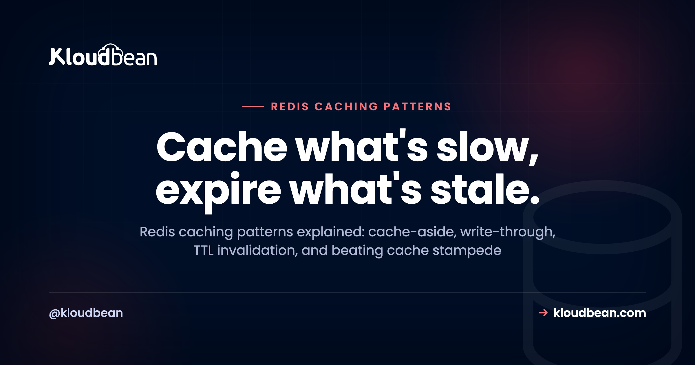

# Redis Caching Patterns: Cache-Aside, TTLs, and Beating Stampede

_By Kloudbean Engineering · Cache what's slow, expire what's stale._

Your database is answering the same question a thousand times an hour. Same query, same row, same answer all day. That's the exact moment a cache earns its keep. This guide is about the **Redis caching patterns** that actually get used in production: cache-aside, write-through, write-behind, and the plain TTL that quietly does most of the work. We'll cover real code, when each pattern fits, and the two things that trip people up every time: **Redis cache invalidation** and **cache stampede**.

The hosting side (launching an instance, the connection URL, the memory tradeoff) lives in [managed Redis hosting](https://www.kloudbean.com/blog/managed-redis-hosting/). This piece is about how you actually cache: the strategy, the code, and the sharp edges.

> **What are the main Redis caching patterns, and when do you use each?** Four patterns cover almost everything: **cache-aside** (lazy loading), read-through, write-through, and write-behind. Cache-aside is the default for most apps: check Redis, and on a miss read the database, then store the result with a **Redis TTL**. Use write-through when you need read-after-write consistency, and write-behind for write-heavy work that can tolerate a small loss window. TTLs are your simplest form of **Redis cache invalidation**. The two hard parts are invalidation and **cache stampede**, both solvable with a few lines of code.

## What a caching pattern actually is

A caching pattern is a repeatable rule for three decisions: when your app reads from the cache, when it falls back to the database, and when it writes to each. That's it. The pattern you pick decides where stale data can appear, how fast writes are, and what happens the instant a popular key expires.

Redis is the usual home for these patterns because it lives in memory and answers in well under a millisecond. It sits in front of your real database and absorbs the repetitive reads. Pick the wrong pattern and you'll either serve stale data or hammer the database anyway. Pick the right one and a slow endpoint gets fast without you touching the query.

## The Redis caching patterns, compared

Here's the whole landscape on one screen. Read it top to bottom, then we'll go deep on the one you'll reach for 90% of the time.

| Pattern | How it works | Best for | The catch |
| --- | --- | --- | --- |
| **Cache-aside** (lazy loading) | App checks Redis. On a miss it reads the DB and stores the result. | Read-heavy apps. The default. | First read is always a miss; stale keys if you skip TTLs. |
| **Read-through** | Your cache library loads from the DB on a miss for you. | Stacks whose cache layer supports it. | Less control, tighter coupling to the library. |
| **Write-through** | Every write goes to Redis and the DB together. | Read-after-write consistency. | Slower writes; you cache data nobody may read. |
| **Write-behind** (write-back) | Write to Redis now, flush to the DB asynchronously. | Write-heavy, loss-tolerant work. | Data loss if Redis dies before the flush. |
| **TTL / expiry** | Every key self-destructs after N seconds. | Always. It's your safety net. | Too long is stale; too short is churn. |

TTL isn't really a competing pattern. It's a setting you layer on top of the others, and it's the single most important habit in this article.

<!-- Bespoke inline SVG in the HTML: the cache-aside read path. (1) App sends GET user:42 to Redis. Hit returns in under 1 ms. (2) Miss falls through to the Database. (3) Read the row. (4) SETEX the value back into Redis with a TTL clock. Brand navy/purple/green. -->

```
[ App ] --1: GET user:42--> [ Redis ] --2: miss--> [ Database ]
   ^                            ^                        |
   |__ hit: under 1 ms _________|                        |
                                |__ 4: SETEX key 300 <-- 3: read row
```

## Cache-aside: the pattern you'll actually use

Cache-aside, sometimes called lazy loading, is the workhorse. The app owns the logic: check Redis first, and if the value isn't there, read the database, write the answer into Redis with a TTL, and return it. Nothing gets cached until someone asks for it, so the cache fills with exactly the data your traffic cares about.

Here it is in Node with ioredis. Read the connection URL from the environment, never hard-code it (see [environment variables done right](https://www.kloudbean.com/blog/environment-variables-done-right/) for why that matters).

```js
import Redis from "ioredis";
const redis = new Redis(process.env.REDIS_URL);

async function getUser(id) {
  const key = `user:${id}`;

  // 1. Try the cache
  const cached = await redis.get(key);
  if (cached) return JSON.parse(cached);          // hit

  // 2. Miss: read the source of truth
  const user = await db.query("SELECT * FROM users WHERE id = $1", [id]);

  // 3. Store with a TTL so it can never go stale forever
  await redis.set(key, JSON.stringify(user), "EX", 300);   // 5 minutes
  return user;
}
```

The Python shape is identical, which is the point. redis-py, one `setex`, done:

```python
import os, json, redis
r = redis.from_url(os.environ["REDIS_URL"])

def get_user(user_id):
    key = f"user:{user_id}"
    cached = r.get(key)
    if cached:
        return json.loads(cached)               # hit
    user = db.fetch_user(user_id)               # miss: hit the DB
    r.setex(key, 300, json.dumps(user))         # cache for 5 minutes
    return user
```

Why is this the default? It's resilient. If Redis is down, every request just becomes a miss that falls through to the database, so the app slows down instead of breaking. That's exactly the failure mode you want from a cache. One wrinkle: the first read of any key is always a miss, so a cold cache after a restart eats a burst of misses at once. Usually fine. When it isn't, that's the stampede problem below.

## Redis cache invalidation: the write path nobody writes down

There's an old joke that the two hardest problems in computing are naming things, cache invalidation, and off-by-one errors. It's funny because invalidation really is the part that bites. The read path above is easy. The bug shows up on the write path.

Picture it. A user edits their profile. Your code updates the `users` row in Postgres and returns. But the old value is still sitting in Redis under `user:42` with four minutes left on its TTL. For those four minutes, every read serves the stale copy, and the user swears the save button is broken.

The fix is one line. When you write to the database, drop the cache key. Write the truth first, then delete the stale cache entry:

```js
async function updateUser(id, patch) {
  const user = await db.update("users", id, patch);   // 1. write the DB first
  await redis.del(`user:${id}`);                       // 2. drop the stale key
  return user;
}
```

Order matters. Update the database before you delete the key. If you delete first and the database write fails, you've thrown away a good cache entry for no reason. Delete-on-write is simpler and safer than trying to overwrite the cache with the new value, because you sidestep a whole class of race conditions where two writes land out of order. Let the next read repopulate it. That's the pattern I'd reach for first, every time.

## Redis TTL: the laziest invalidation that works

Even with delete-on-write, always set a TTL. It's your backstop for every invalidation you forgot to wire up. A key with a five-minute TTL can be stale for at most five minutes, even if your delete logic has a bug. A key with no TTL can be stale until the heat death of the server.

So how long? Match the TTL to how fresh the data has to be, not to a number that feels round:

- **Rarely changes** (config, a product catalog): minutes to hours. Long TTLs, big savings.
- **Changes sometimes** (a user profile, a dashboard count): 30 to 300 seconds, plus delete-on-write.
- **Changes constantly** (a live price, stock level): a few seconds, or don't cache it at all.

The anti-pattern here is caching everything with a giant TTL and no invalidation, then wondering why users see old data. Don't do that. A short TTL with no invalidation logic is often better than a long TTL with careful invalidation, because it fails safe. Stale for ten seconds beats stale for an afternoon.

<!-- ADD IMAGE: redis-cli TTL user:42 output showing seconds remaining -->

## Write-through and write-behind, briefly

Cache-aside populates on reads. The write patterns populate on writes, and they exist for narrower reasons.

**Write-through** writes to Redis and the database in the same operation. Every write is a little slower because it touches two systems, but a read right after a write always finds the value in cache. Reach for it when read-after-write consistency actually matters and you can accept the extra write latency. The downside is you end up caching data that may never be read again, which wastes memory.

**Write-behind** (write-back) writes to Redis immediately and flushes to the database asynchronously in the background. Writes feel instant because the slow part happens later. The risk is real: if Redis goes down before a flush, those writes are gone. That's a fine tradeoff for something like view counters or analytics events where losing a few seconds of data is survivable. It's a terrible tradeoff for an order or a payment. Know which kind of data you're holding before you pick this one.

> **Honest read:** most apps never need write-through or write-behind. They're the right tool for specific, measurable problems. If you can't name the problem they solve for you, you want cache-aside.

## Cache stampede: when a popular key expires

This is the failure mode that catches teams off guard, and it deserves its own section. A **cache stampede** (also called the thundering herd) happens when a hot key expires and, in the same instant, dozens or hundreds of requests all miss at once. They all fall through to the database. They all run the same expensive query at the same time. The database, which was cruising because Redis was shielding it, suddenly takes the full load and buckles.

It's sneaky because everything looks fine until the exact second of expiry. Three mitigations, roughly in order of effort:

### 1. Jittered TTLs

If you cache a batch of keys with the same TTL, they expire together and stampede together. Add a little randomness so they scatter instead:

```python
import random
# base 300s plus 0-60s of jitter, so keys don't all expire on the same tick
ttl = 300 + random.randint(0, 60)
r.setex(key, ttl, json.dumps(value))
```

This one costs almost nothing and prevents the synchronized-expiry version of the problem. Do it by default.

### 2. A lock, so only one request rebuilds

For a single very hot key, let exactly one request rebuild it while the others wait or serve stale. Redis `SET` with `NX` gives you a cheap lock:

```js
// Only the first caller wins the lock and rebuilds the key
const gotLock = await redis.set(`lock:${key}`, "1", "NX", "EX", 10);
if (gotLock) {
  const fresh = await rebuildFromDb();
  await redis.set(key, JSON.stringify(fresh), "EX", 300);
  await redis.del(`lock:${key}`);
  return fresh;
}
// Someone else is already rebuilding: wait briefly, then re-check the cache
```

### 3. Stale-while-revalidate

Serve the slightly-expired value immediately while a background task refreshes it. The user gets a fast (if marginally old) response, and the database sees one refresh instead of a thousand misses. Many CDN and framework cache layers offer this directly. It's the nicest experience when the data can tolerate being a few seconds old, which is most cached data.

My honest advice: start with jittered TTLs everywhere, add a lock only on the handful of keys you can prove are hot. Don't build elaborate stampede defenses for keys that get read twice a minute. Measure first.

<!-- ADD IMAGE: a latency graph with a spike at the moment a hot key expires, then flat after adding jitter -->

## The Redis session store pattern

Caching isn't the only thing Redis does well here. A **Redis session store** is the same idea applied to login state. By default many frameworks keep sessions in a local file or in memory on one server. That's fine until you run a second app server. Then a user's session lives on a machine they don't hit next, and they get logged out at random.

Point the session store at Redis and every app server shares one fast store. It's usually a one-line config change:

```
# Laravel: .env
SESSION_DRIVER=redis

# Django: settings.py
SESSION_ENGINE = "django.contrib.sessions.backends.cache"

# Express: connect-redis wired into express-session
```

Sessions are a good fit for Redis because they're naturally short-lived (a TTL is exactly what a session timeout is) and they're not your source of truth. If a session is lost, the user logs in again. Annoying, not catastrophic. It becomes close to mandatory the moment you scale past a single app server, which pairs neatly with [scaling reads with replicas](https://www.kloudbean.com/blog/database-read-replicas-scaling/) when the database side grows too.

> **Founder's take.** After watching a lot of apps grow up, the pattern is boring and consistent: cache-aside plus sane TTLs solves about 90% of real caching needs. Reach for write-through, write-behind, or a hand-rolled stampede lock only when you've measured a specific problem that demands it. Premature caching machinery is just bugs you haven't met yet. Start simple, measure, then add the fancy pattern to the one place that needs it.

## Redis is a cache, not your source of truth

This is the boundary that keeps you out of trouble, so I'll say it plainly. Redis holds data in memory. Memory is fast, finite, and volatile. Treat Redis as an accelerator sitting in front of your database, never as the only copy of anything you'd cry about losing.

The mental test: if Redis vanished this second, your app should get slow, not lose data. Your durable, authoritative records belong in a real database like [managed PostgreSQL](https://www.kloudbean.com/blog/managed-postgresql-hosting/) or [managed MySQL](https://www.kloudbean.com/blog/managed-mysql-hosting/). Redis caches reads, holds sessions, and backs queues. Any pattern that quietly makes Redis the system of record is a pattern waiting to lose data. Yes, it can persist to disk, and for a job queue you'll want that. But persistence is a safety net, not permission to treat a cache as a database.

## Running these patterns on managed Redis

The patterns are the same wherever Redis runs. What changes is how much of the babysitting is yours. On Kloudbean, Redis is one of the managed database engines, so you launch it from the same place as your Postgres or MySQL, running right next to it, and it stays patched and backed up while you use it.


Then you wire it in exactly like the database: one connection value, read from the environment. The client reads `REDIS_URL` and connects. Because it's an env var, rotating the password is a config change, not a code change.


Keeping Redis and the database in the same account also erases the most common connection headache. When the app and Redis sit right next to each other, you're not debugging cross-provider routing or firewall rules, and connection reuse stays cheap (the same reason an always-on server makes [database connection pooling](https://www.kloudbean.com/blog/database-connection-pooling/) simpler than it is on serverless). If you're already following [adding a managed database to your app](https://www.kloudbean.com/blog/add-managed-database-to-your-app/), adding Redis is the identical flow with one more env var.

<!-- ADD IMAGE: terminal with redis-cli MONITOR streaming GET and SETEX calls as the app serves traffic -->

---

**Put the fast layer where it belongs.** Launch a [managed Redis](https://www.kloudbean.com/blog/managed-redis-hosting/) next to your app, connect it with one URL, and let cache-aside lift the repeat load off your database. Start free at [kloudbean.com](https://www.kloudbean.com/); see plans on [pricing](https://www.kloudbean.com/pricing/).

One-click Redis · IP allow-listing · Automatic backups · Free migration · Free trial

## FAQ

**What are the main Redis caching patterns?**
Cache-aside (lazy loading), read-through, write-through, and write-behind, with TTL expiry layered on top of all of them. Cache-aside is the default for read-heavy apps. Read-through pushes the miss handling into your cache library. Write-through keeps cache and database in sync on every write. Write-behind writes to Redis first and flushes to the database later.

**What is cache-aside (lazy loading)?**
Cache-aside means the app checks Redis first, and on a miss it reads the database, stores the result in Redis with a TTL, and returns it. Nothing is cached until it's requested, so the cache fills with exactly the data your traffic uses. If Redis is down, every request simply falls through to the database, which is why it's the safest default.

**How do I invalidate a Redis cache?**
Two ways, and use both. Set a TTL on every key so it expires on its own, and delete the key when the underlying record changes. Write the database first, then run DEL on the cache key so the next read repopulates it. Delete-on-write is safer than trying to overwrite the cached value, because it avoids races where two writes land out of order.

**What TTL should I set for a Redis cache?**
Match it to how fresh the data must be. Rarely-changing data like config or catalogs can sit for minutes to hours. Data that changes sometimes, like a profile or a count, suits 30 to 300 seconds plus delete-on-write. Fast-moving data like live prices needs a few seconds or shouldn't be cached. When unsure, pick a shorter TTL, because it fails safe.

**What is a cache stampede and how do I prevent it?**
A cache stampede, or thundering herd, happens when a hot key expires and many requests miss at once, all hitting the database with the same expensive query simultaneously. Prevent it with jittered TTLs so keys don't expire together, a lock so only one request rebuilds a key, or stale-while-revalidate so users get the old value while a background task refreshes it. Start with jittered TTLs.

**What's the difference between write-through and write-behind caching?**
Write-through writes to Redis and the database together on every write, giving read-after-write consistency at the cost of slower writes. Write-behind writes to Redis immediately and flushes to the database asynchronously, giving fast writes at the risk of losing data if Redis dies before the flush. Use write-through when consistency matters, write-behind only for loss-tolerant data like counters.

**Can I use Redis as a session store?**
Yes, and it's one of the most common uses. Pointing your framework's session store at Redis lets every app server share one fast store, so users stay logged in when you run more than one server. It's usually a one-line config change. Sessions fit Redis well because they're short-lived and losing one just means logging in again.

**Can Redis be my main database?**
No, treat it as a cache and in-memory helper, not your source of truth. Redis holds data in memory, which is fast but finite and volatile. Your durable, authoritative data belongs in PostgreSQL or MySQL. The safe rule is that if Redis disappeared, your app should get slow, not lose data.

**Which Redis caching pattern should I use?**
Start with cache-aside plus a sensible TTL and delete-on-write. That combination handles the large majority of real caching needs. Add write-through only when read-after-write consistency is essential, write-behind only for loss-tolerant write-heavy work, and stampede locks only on keys you've measured to be hot. Don't add machinery for a problem you don't have yet.

---

*Kloudbean · Fast reads, honest boundaries.*
