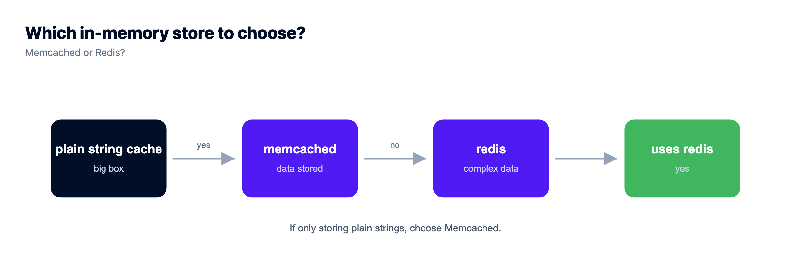
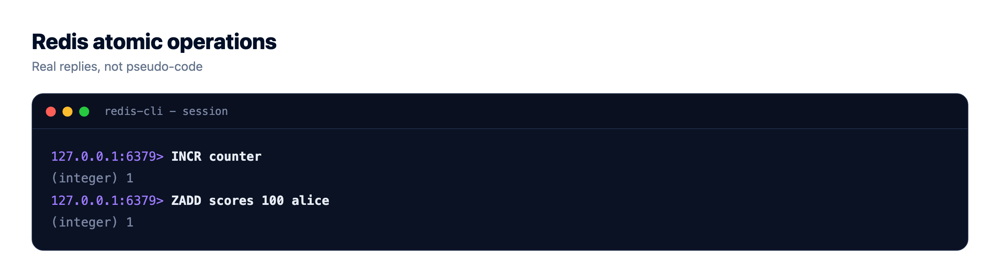
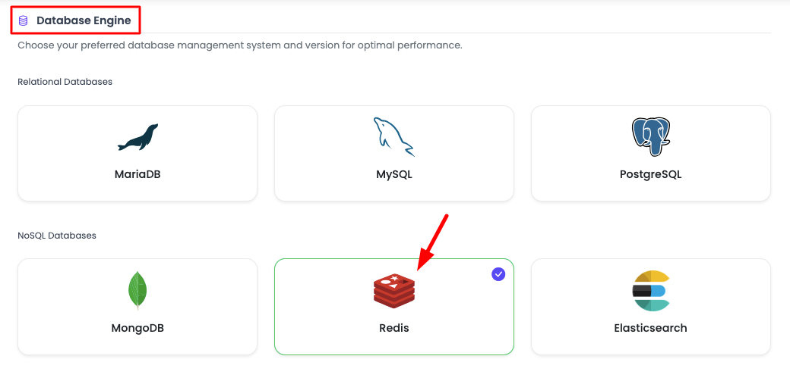
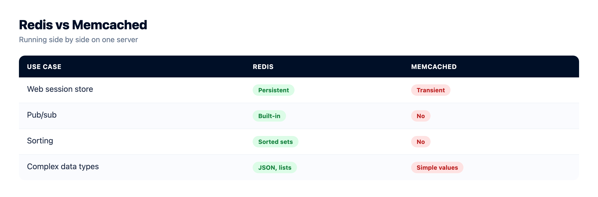

# Redis vs Memcached: Which In-Memory Store Should You Use?

Redis vs Memcached is one of those choices that feels bigger than it actually is. Both are blazing-fast in-memory stores that sit in front of your database and shave milliseconds off nearly every request. So which one do you pick? This guide compares them the honest way, by data types, persistence, threading, memory model, and the jobs you'll really throw at them. You'll leave knowing when Redis is the right default and when Memcached is the smarter, simpler call.

> **The short version:** Use Redis by default. It does everything Memcached does, then adds real data types, optional persistence, atomic counters, queues, and pub/sub, so one engine covers caching plus sessions, rate limiting, and leaderboards. Pick Memcached only for a dead-simple, very large, multi-threaded cache of plain string values. Both are sub-millisecond fast, so speed rarely decides it. On Kloudbean both launch the same one-click way, so choose on fit.

## The honest 30-second answer

The verdict before the details, because most people just want to be told: **reach for Redis first.** It covers the same caching job Memcached does, then keeps going into sessions, rate limiting, job queues, real-time messaging, and leaderboards. One engine, most of your in-memory needs, done.

Memcached still earns its keep. If all you need is a very large, shared cache of opaque strings, and you want maximum throughput from a big multi-core box with almost nothing to configure, it's genuinely excellent at that one job. It's a scalpel. Redis is a Swiss Army knife.

And the speed question everyone asks? Both are fast enough that the network round trip, not the store, is your bottleneck. Don't choose on a benchmark. Choose on what the tool can actually *do* for your app.

## Redis vs Memcached at a glance

The clearest way to see the gap is to draw it. Memcached maps a key to one flat string. Redis maps a key to whatever shape the problem needs, and can persist it so a restart doesn't wipe it.

```
   MEMCACHED                          REDIS
   one thing, done simply            a cache plus a toolbox

   key  ->  [ string blob ]          key  ->  [ strings, hashes, lists ]
              opaque bytes                     [ sets, sorted sets, streams ]

   - Multi-threaded (all cores)      - Single-threaded command core
   - RAM only, volatile              - Optional persistence to disk
   - LRU, 1 MB item cap              - Pub/sub, Lua, transactions
```

*Memcached: key to one volatile string, multi-threaded. Redis: key to rich data types, single-threaded core, optional persistence.*

## The full comparison table

Every row here is a real, checkable difference. Read it top to bottom and the recommendation writes itself.

| | Redis | Memcached |
| --- | --- | --- |
| **Data types** | Strings, hashes, lists, sets, sorted sets, bitmaps, streams, HyperLogLog | Strings and opaque blobs only |
| **Persistence** | Optional: point-in-time snapshots (RDB) and an append-only log (AOF). Survives a restart. | None. Purely in memory, gone on restart. |
| **Memory model & eviction** | Several policies: LRU, LFU, TTL-based, random, or noeviction | Slab allocator with LRU eviction |
| **Threading** | Single-threaded command core (extra I/O threads handle the network) | Multi-threaded, scales across CPU cores on one box |
| **Max value size** | Up to 512 MB per value | 1 MB per item by default (configurable) |
| **Extra capabilities** | Pub/sub, sorted sets, atomic counters, transactions (MULTI/EXEC), Lua scripting, streams | Get, set, atomic incr/decr, and little else |
| **Sub-millisecond speed** | Yes, very fast | Yes, very fast |
| **Best-fit use case** | Cache plus sessions, rate limiting, queues, leaderboards, pub/sub | A simple, huge, shared cache of string values |

Memcached and Redis tie on the two rows people obsess over, speed and basic caching. Redis quietly wins nearly every other row by doing more.



## The real difference between Redis and Memcached

Strip away the feature lists and it's one design choice. Memcached stores values as flat bytes. You hand it a key and a string, it hands the string back later. It never looks inside the value, which is exactly why it's so fast and so simple to reason about.

Redis stores *structures*. A value can be a counter you increment atomically, a list you push jobs onto, a hash holding a whole session, or a sorted set that keeps a leaderboard in rank order. Because Redis understands the value, it runs operations server-side that would take several round trips with Memcached. Incrementing a rate-limit counter is one command in Redis. In Memcached you'd read, parse, add, and write back, and hope nobody raced you.

That one difference, flat bytes versus real structures, cascades into everything else: persistence, richer eviction, pub/sub, atomic ops. Memcached vs Redis isn't a fight over speed. It's how much you want the store itself to do.

## When Memcached is the right call

Let's be fair. There's a real scenario where Memcached is the better pick, and pretending otherwise would be dishonest.

Memcached shines when your job is a **pure cache**: memoize expensive results by key, serve them fast, don't ask the store to do anything clever. A few things make it genuinely good:

- **Multi-threaded throughput.** Memcached uses every core on a box. On a large multi-core server handling a firehose of simple get/set traffic, that raw parallelism can push more ops per second on one node than a single-threaded core.
- **Lean memory for uniform items.** The slab allocator and low per-key overhead make it efficient for a huge number of small, similarly sized values. Less metadata per entry means more RAM holds actual cache.
- **Dead-simple operations.** Almost nothing to misconfigure. No persistence settings, no eviction-policy debates, no data-type decisions. It caches strings and evicts the least recently used. That simplicity is a feature when a cache is all you want.
- **Easy horizontal sharding.** Clients spread keys across a pool of nodes with consistent hashing. Scaling a giant flat cache across many machines is a well-worn, boring path, and boring is good in production.

So if you're running big boxes, caching opaque blobs like rendered page fragments or serialized objects, and you'll never need structure or durability, Memcached is a clean, honest choice. Spin up [managed Memcached](https://www.kloudbean.com/blog/managed-memcached-hosting/) and move on. You don't need Redis to feel clever.

## When Redis wins (which is most apps)

Now the other side, the bigger one. The moment your cache needs to *do* anything beyond store-and-fetch, Redis pulls ahead, and most apps cross that line fast. Its data types become features you'd otherwise build yourself:

- **Sessions.** Store a session as a hash with a TTL. It expires on its own, and with persistence on it survives a restart, so a deploy doesn't log everyone out.
- **Rate limiting.** `INCR` a per-user or per-IP key and set an expiry. One atomic command, correct under concurrency. Painful with a plain string cache.
- **Job queues.** Push tasks onto a list with `RPUSH`, pop them with `BLPOP`, or use streams for a durable log with consumer groups. Background jobs without a separate broker.
- **Leaderboards.** A sorted set keeps members ordered by score automatically. Reading the top 10 or a player's rank is one fast command. No Memcached equivalent.
- **Pub/sub and real-time.** Redis broadcasts messages to subscribers, handy for chat, live notifications, and service fan-out.
- **Persistence and warm caches.** Optional snapshots and the append-only log let Redis reload its data after a restart, so you don't cold-start an empty cache and hammer your database.
- **Smarter eviction.** LFU keeps the genuinely popular keys, not just the recently touched ones, which often gives a better hit rate.

Add it up and Redis often replaces two or three separate services, which is why [managed Redis](https://www.kloudbean.com/blog/managed-redis-hosting/) is the sensible default. The [Redis caching guide](https://www.kloudbean.com/blog/redis-caching-guide/) digs into the patterns. One caveat, plainly: Redis is a cache and an in-memory store, not your primary database. If you're weighing it against Postgres for source-of-truth data, read [when to use Redis vs Postgres](https://www.kloudbean.com/blog/when-to-use-redis-vs-postgres/), and keep durable business data in a real database.

## Is Redis faster than Memcached?

The question in every thread, and the honest answer is: not in a way you'll feel. For simple get and set of small values they're neck and neck, both answering in well under a millisecond on a local network. Memcached's multi-threading can edge ahead on raw single-node throughput under a flood of trivial ops, because it uses every core. Redis runs commands on one core, which sounds like a handicap until you remember it's routinely fast enough to saturate the network link first.

So stop optimizing the wrong thing. The latency that hurts your users is the network hop and your database, not the microseconds between these two. Pick the store whose capabilities fit the job.

## The API difference, in code

Nothing shows the gap like a few lines. Both examples are Node, and both read a connection string from an env var (never hard-coded). First the Memcached way, a get and set with a TTL:

```js
import Memcached from "memcached";
const mc = new Memcached(process.env.MEMCACHED_URL); // e.g. "10.0.0.6:11211"

// cache a serialized value for 300 seconds
mc.set("user:42", JSON.stringify(user), 300, (err) => {});

// read it back and parse it yourself
mc.get("user:42", (err, data) => {
  const cached = data ? JSON.parse(data) : null;
});
```

Now Redis. Same basic cache, one call sets the value and its expiry with `SETEX`. Then look at the three lines Memcached can't match:

```js
import Redis from "ioredis";
const redis = new Redis(process.env.REDIS_URL); // "redis://:pass@10.0.0.5:6379"

// value + TTL in a single atomic call
await redis.setex("user:42", 300, JSON.stringify(user));
const raw = await redis.get("user:42");
const cached = raw ? JSON.parse(raw) : null;

// things a plain string cache can't do:
await redis.incr("ratelimit:1.2.3.4");            // atomic rate-limit counter
await redis.zadd("leaderboard", 999, "player:7"); // sorted-set ranking
await redis.rpush("jobs", "send-welcome-email");  // a lightweight queue
```

The caching lines are near-identical. The extra Redis lines are the whole argument. The connection strings differ too: Redis uses a single URL with the password baked in, Memcached takes a bare host and port. Set whichever your app needs as an env var:

```bash
# Redis: one URL, auth and db index included
REDIS_URL=redis://:s3cret@10.0.0.5:6379/0

# Memcached: a host:port endpoint (or several), no URL scheme
MEMCACHED_URL=10.0.0.6:11211
```



## Run either one on Kloudbean

Here's what makes the choice low-stakes. On Kloudbean, Redis and Memcached are both managed engines, launched the same way. No "Redis is easier to get" or "Memcached needs extra setup." You pick on fit, not availability.

1. **Launch the engine.** Open the DBS section and hit Launch Database. Kloudbean runs seven managed engines: MySQL, MariaDB, PostgreSQL, Redis, Memcached, Elasticsearch, and MongoDB. Pick Redis or Memcached, name it, create it. It's provisioned and secured in a minute or two.
2. **Grab the connection details.** You'll get an internal host and port. Redis also gives you a password. Both live on your server, reachable internally rather than over the public internet.
3. **Set it as an environment variable.** Add `REDIS_URL` or `MEMCACHED_URL` in Runtime Configuration, so your app reads the connection from the environment instead of your source code.
4. **Install the client and deploy.** Add the client library (`ioredis`, `redis`, or `memcached` for Node, `redis` or `pymemcache` for Python), deploy, then confirm with a quick set and get.



Then store the connection string where it belongs, in environment variables, not in code:


One honest note on backups. Redis can persist to disk, so a managed Redis has something durable to snapshot. Memcached is memory-only by design, so there's nothing to back up. That's not a Kloudbean limit, just what Memcached is. Wiring up a Node app around either one? The [guide to deploying a Node app to a managed cloud](https://www.kloudbean.com/blog/deploy-node-app-to-managed-cloud/) walks the full path.



> **You can even use both.** They're not mutually exclusive. A common setup: Memcached for a big page-fragment cache, Redis for sessions, rate limiting, and queues. Both are managed engines that run right next to your app here, so running the two together is just two launches and two env vars.

## So what should you actually pick?

The call: Redis by default; Memcached only when you've got a specific reason, like a narrow, high-volume string cache on big hardware. Both are one-click here, so it's low-stakes. And either way, if your app opens a lot of connections, mind your client pool, since the [connection pooling guide](https://www.kloudbean.com/blog/database-connection-pooling/) applies to Redis clients too.

<!-- cta:start -->
**A rehoming, not a rewrite.**

Standard code moves onto a standard Linux server, so this is a migration rather than a rewrite. Pick from seven clouds, keep push-to-deploy, and get help moving the first workload across.

- Free migration assistance
- Free trial
- Seven cloud providers
- Flat monthly price
- Managed databases
- Git deploy

[Start free](https://console.kloudbean.com/register) · [See plans](https://www.kloudbean.com/pricing/)
<!-- cta:end -->

## FAQ

**Is Redis faster than Memcached?**
Not in a way that matters for most apps. For simple get and set of small values they're roughly equal, both answering in well under a millisecond. Memcached's multi-threaded design can push higher raw throughput on a single large box, while Redis runs commands on one core but is usually fast enough to saturate the network first. Choose on capabilities, not on a benchmark.

**What is the main difference between Redis and Memcached?**
Data types. Memcached stores a key mapped to a flat string and never looks inside it. Redis stores rich structures like hashes, lists, sets, and sorted sets, and can run operations on them server-side. That single design choice is why Redis also offers persistence, atomic counters, pub/sub, and richer eviction.

**Should I use Redis or Memcached for caching?**
For most apps, Redis. It handles caching just as well and also covers sessions, rate limiting, and queues, so you avoid running extra services. Pick Memcached if your only need is a very large, simple cache of string values and you want maximum throughput on a multi-core box with minimal configuration.

**Does Memcached persist data?**
No. Memcached is purely in memory, so a restart clears everything it held. That is fine for a cache, since a cache miss just reads from your database and repopulates. If you need data to survive a restart, use Redis with persistence turned on.

**Can Redis replace Memcached?**
Yes, in almost every case. Redis does everything Memcached does for caching and more, so many teams standardize on Redis alone. The exception is a niche, very high-volume pure string cache where Memcached's multi-threaded throughput and lean per-key memory give it a genuine edge.

**Which uses less memory, Redis or Memcached?**
For a huge number of small, uniform string values, Memcached often edges it thanks to its slab allocator and low per-key overhead. Redis carries a bit more metadata per key because it stores structured types, though it has its own memory optimizations. For typical workloads the difference rarely decides the choice.

**What data types does Redis support?**
Strings, hashes, lists, sets, sorted sets, bitmaps, HyperLogLog, and streams. These are what let Redis act as a session store, a rate limiter, a job queue, and a leaderboard, not just a cache. Memcached, by contrast, only stores plain strings or blobs.

**When should I actually pick Memcached?**
When you need a simple, very large, shared cache of opaque string values and nothing else. Memcached is multi-threaded, so it uses every core on a big server, and it is trivial to operate because there are almost no settings to tune. Think cached page fragments or serialized objects across a sharded pool.

**Is Memcached still worth using today?**
Yes, for the right job. It remains a fast, rock-solid, dead-simple cache, and plenty of large systems still run it happily. It just does less than Redis on purpose, so it fits when a pure cache is all you want and you value simplicity over features.

**Can I run both Redis and Memcached on Kloudbean?**
Yes. Both are one-click managed engines, so you can launch a Redis instance and a Memcached instance on the same server, right next to your app. A common pattern is Memcached for a big page-fragment cache and Redis for sessions, rate limiting, and queues.

---

*By Kloudbean Data · Pick the right in-memory store.*
