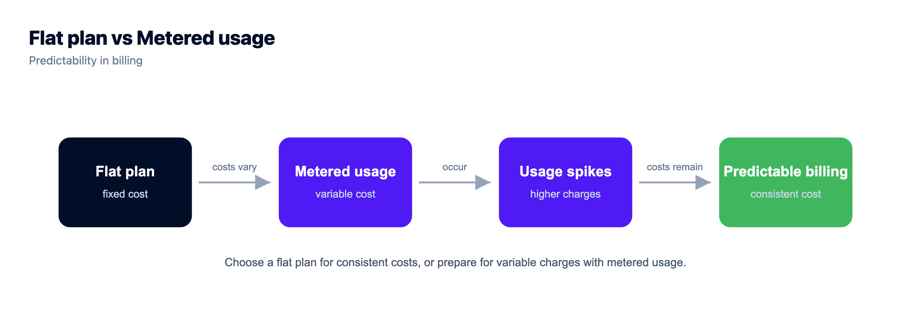

# Render vs Railway vs Kloudbean for Node.js (2026)

*By Kloudbean Engineering · All three deploy from Git. The difference shows up on the invoice.*

Render vs Railway is the comparison every Node developer runs eventually, usually right after Heroku priced them out or a bill surprised them. All three, Render, Railway, and Kloudbean, deploy a Node app from a GitHub push. So the interesting question isn't "which one runs Node," it's what happens at month three: the bill, the cold starts, and where your database lives. This one is framed on scope and pricing shape, because that's what still differs once the app is real.

> **Render vs Railway vs Kloudbean: how do I choose?** Railway and Render rent you a platform and meter what you use, so the bill tracks traffic, and Render's free web services sleep after about 15 minutes idle. Kloudbean is a flat-rate managed server from $8/mo with seven one-click managed databases in the same dashboard, no egress meter, no cold start, and free migration. Decide on scope and pricing shape, not on which one can run Node.

## What you're actually choosing between

All three take a repo and give you a running Node process. What differs is how much of your stack the platform covers, and whether the price sits still.

- **Railway** rents you a platform and meters what you consume. Its real strength is the shortest path from repo to live URL.
- **Render** also rents you a platform, split across a workspace plan, compute, and bandwidth. Its real strength is a tidy git-push workflow with managed Postgres attached.
- **Kloudbean** gives you a managed server on a flat plan, with the app, its managed database, S3-compatible object storage, and a load balancer available in one dashboard. The number is set before you deploy.

Two questions do most of the work here. How much of your stack does the platform cover before you have to go buy something else? And does the bill track your traffic or stay still? Answer those and the rest is detail.

One pattern worth flagging. The first deploy is the easiest thing to optimise for and the least important. Month three is the one that matters: steady traffic, a real database, and an invoice that has stopped being cute.

## Pricing: the difference that actually surprises people

This is where the three genuinely diverge, and it's the number one thing developers complain about online.

**Railway** combines a plan fee with metered usage: CPU, RAM, databases, storage, and network egress are all billed by consumption, and a container is billed for the resources it holds even while idle. That's cheap for a sleepy prototype and hard to forecast once it's real. Developers regularly report small test services quietly billing far more than the headline plan price, and confusion between the plan fee, included usage, and prepaid credits. It isn't that metering is wrong; it's that the total is hard to predict.

**Render** separates a workspace plan from compute and storage, and bills bandwidth and build minutes on top. Free services can still generate charges once a card is on file, and the pricing model changed with a new workspace structure in 2026, so old articles and the current dashboard may not match. Verify the live numbers before you commit.

**Kloudbean** is a flat server plan from $8/mo. You know the number before you deploy, it doesn't move with traffic, and there's no separate egress meter to reverse-engineer at the end of the month. For a production app that needs to sit in a budget, predictable beats cheap-when-idle.

## Cold starts and sleep

This one bites low-traffic apps hardest. **Render's** free web services spin down after about 15 minutes without traffic and take roughly a minute to wake on the next request, so the first visitor after a quiet stretch waits, or sees a loading screen. Paid instances don't spin down, which in practice means paying to remove the sleep. **Railway** keeps services running rather than sleeping, but you pay for that always-on time through metered usage. **Kloudbean** is always-on by default on a real server, so there's no scale-to-zero and no cold-start penalty; the trade, in fairness, is that a genuinely idle hobby project doesn't get to drop to zero cost.

## The database, where it quietly gets expensive

A Node app almost always needs Postgres, MySQL, MongoDB, or Redis, and this is where the platforms differ in a way that matters. **Render's** free Postgres is a development resource, not a durable one: per their docs it expires 30 days after creation, with a 14-day grace period, after which the database and its data are deleted. Plenty of people have lost a forgotten side-project database that way. **Railway** makes databases easy to add, but each is another metered service on the bill. **Kloudbean** runs seven managed engines one-click (PostgreSQL, MySQL, MariaDB, MongoDB, Redis, Memcached, Elasticsearch) in the same account as the app, backed up automatically, so the app and its data sit together instead of across a metered boundary. Access is locked down by allow-listing your app server's IP on the database, so only that server can connect, and the database is never a line item you forgot to check.

## Render vs Railway vs Kloudbean, side by side

| Dimension | Railway | Render | Kloudbean |
| --- | --- | --- | --- |
| What you're renting | Metered platform | Metered platform | Flat-rate managed server |
| Pricing shape | Plan fee + metered usage | Workspace + compute + bandwidth | Flat server plan, from $8/mo |
| Predictability | Hard to forecast at scale | Several meters to combine | Fixed monthly number |
| Cold starts | None (metered always-on) | Free tier sleeps (~15 min) | None (always-on) |
| Managed database | One-click, metered separately | Managed Postgres; free tier expires | 7 engines, one-click, beside the app |
| Egress | Metered | Metered above the included amount | Not metered |
| Migration help | Self-serve | Self-serve | Free migration assistance |
| Scale-to-zero | No | Yes (free tier) | No (always-on by design) |

Read it as a fit check, not a scoreboard. Verify each platform's current pricing on its own page; plans and tiers move, and this table is about shape, not exact dollars.

*The three line up on a convenience-to-predictability axis. Most apps start left for the demo and want the right side once they're real.*

## What developers actually say

The most useful signal isn't a feature list, it's the recurring complaint. Paraphrasing common threads from Reddit and support forums (2024 to 2026), treat these as patterns, not universal truths:

- **Railway bills are hard to predict.** A frequent theme is a tiny test service with no real users quietly climbing to a few dozen dollars a month, plus confusion over how the plan fee, included usage, and credits combine. Some developers also report services pausing when prepaid credit runs out.
- **Render free services sleep, and free databases expire.** The cold-start delay on the free tier is the most repeated gripe, along with surprise that a free Postgres database is time-limited by design.
- **People migrate for confidence, not just price.** One widely shared sentiment after moving off a metered platform: the new bill was higher, but they could finally sleep at night. Predictability and support mattered more than the raw number.

Fair credit where it's due: the same threads praise Railway's deployment speed and dashboard, and Render's clean git-push workflow and managed Postgres. Neither is a bad product. They're prototype-shaped, and some apps outgrow that shape.

## Three questions that settle this, and a fourth that no platform answers

Skip the feature grids. Work through these in order and you'll land somewhere you can defend at a standup.

1. **Does it need to be awake at 4am?** If yes, scale-to-zero stops being a feature and becomes a tax on the first visitor. Always-on is then a requirement, and you either pay for it as metered uptime or as a flat server that never sleeps.
2. **Where does the data live, and who backs it up?** A time-limited free database is fine for a demo and wrong for anything with users. Keeping the managed engine in the same account as the app, with automatic backups and IP allow-listing, is mostly about having one fewer vendor to reason about at 2am.
3. **Can you forecast next month's number today?** A metered platform answers "depends on your traffic." A flat plan from $8/mo answers with a number, and there's no egress meter to reverse-engineer afterwards. Neither model is dishonest; only one fits a budget line.

The fourth question is the one this comparison can't answer for you. What breaks anyway?

No host fixes a missing database index. Ours included. Flat pricing doesn't make a slow endpoint fast, always-on doesn't make an unbounded query safe, and no migration removes an N+1, a leaking worker, or a secret committed to the repo. Moving to a predictable bill deletes one category of surprise and leaves your application code exactly as good as it was.

Our own scope boundary, stated plainly: a project that genuinely idles for weeks still pays for the server, because a real always-on machine has no drop-to-zero. That's the trade for having no cold start. And free migration assistance covers servers above 4GB, with a 3-day free trial on one service if you want to prove the app runs before moving traffic.

*Deploy the Node app from GitHub, with its managed database one click away in the same dashboard, on a flat monthly plan.*

## Moving off Railway or Render

Migrating a Node app is a repo, a set of environment variables, and a database. Point a new Kloudbean server at the same GitHub repo, copy the environment variables into the dashboard, move the database with a standard dump and restore, then swap the connection string and redeploy.

> **Coming from Railway or Render?** The real work is the workers, the database, the env vars, and the DNS cutover, not the git push. Kloudbean's free migration assistance handles that first cutover with you, database included, and a free trial lets you prove the app runs before you move traffic.

## The rest of the picture

Weighing the wider field first? [Where to deploy a Node.js app](https://www.kloudbean.com/blog/where-to-deploy-nodejs-app/) covers every option. The one-on-ones go deeper: [Render alternative](https://www.kloudbean.com/blog/render-alternative-for-vibe-coded-apps/) and [Railway alternative](https://www.kloudbean.com/blog/railway-alternative-for-vibe-coded-apps/). For the hands-on side, [deploy a Node app to a managed cloud](https://www.kloudbean.com/blog/deploy-node-app-to-managed-cloud/) and [managed PostgreSQL hosting](https://www.kloudbean.com/blog/managed-postgresql-hosting/).

<!-- cta:start -->
**Move it once. Own it after.**

Migration assistance is free and there is a free trial to prove the setup first. You keep Git-based deploys, get managed databases beside the app, and pay a flat monthly price on the cloud you choose.

- Free migration assistance
- Free trial
- Seven cloud providers
- Flat monthly price
- Managed databases
- Git deploy

[Start free](https://console.kloudbean.com/register) · [See plans](https://www.kloudbean.com/pricing/)
<!-- cta:end -->

## FAQ

**Render vs Railway: which is better for a Node.js app?**
They're closer than the threads suggest. Both rent you a platform, both deploy from Git, and both meter usage. Railway's edge is speed to the first live URL; Render's is a tidy git-push flow with managed Postgres. The differences that last are scope and pricing shape: how much of the stack sits in one place, whether the free tier sleeps, and whether the bill moves with traffic. For steady always-on production, a flat-rate managed server with the database beside it is the more forecastable shape.

**Is Railway expensive?**
It's cheap for a small, idle prototype and hard to predict as it grows. Railway bills a plan fee plus metered CPU, RAM, databases, storage, and egress, and a container is charged for the resources it holds even when idle. Developers often report small services costing far more than the headline plan. If a predictable monthly number matters, a flat server plan is easier to budget.

**Do Render's free services really sleep?**
Yes. Per Render's docs, free web services spin down after about 15 minutes without traffic and take roughly a minute to start on the next request, so the first visitor waits. Paid instances don't spin down. For a production site that means paying to remove the sleep, or choosing an always-on host instead.

**Does Render delete free databases?**
Per Render's documentation, a free Postgres database expires 30 days after creation, followed by a 14-day grace period to upgrade, after which the database and its data are deleted. It's meant as a development resource, not durable storage, so back up or upgrade before the window closes.

**Railway vs Render for production, which is safer?**
Both run production apps, but developers frequently move to a more predictable setup once revenue depends on it, citing billing surprises and support gaps rather than raw price. A common sentiment after switching is paying a bit more for the confidence to stop worrying. Weigh predictability and support, not just the sticker.

**What's the cheapest always-on Node.js host?**
Free tiers are cheapest but sleep, so for always-on the real options are a plain VPS if you'll run the ops yourself, or a flat managed plan (Kloudbean starts at $8/mo) if you want the server and database handled without a metered bill. Compare total cost including the database, egress, and your own time.

**How do I move a Node app from Railway or Render to Kloudbean?**
Point a new server at the same GitHub repo, copy your environment variables, and restore the database with a standard dump and load. Bring it up, verify it, then switch traffic. Kloudbean's free migration assistance can run that first cutover with you so downtime stays minimal, database included.

---

*Kloudbean Engineering · Pick for month three, not the first deploy.*
