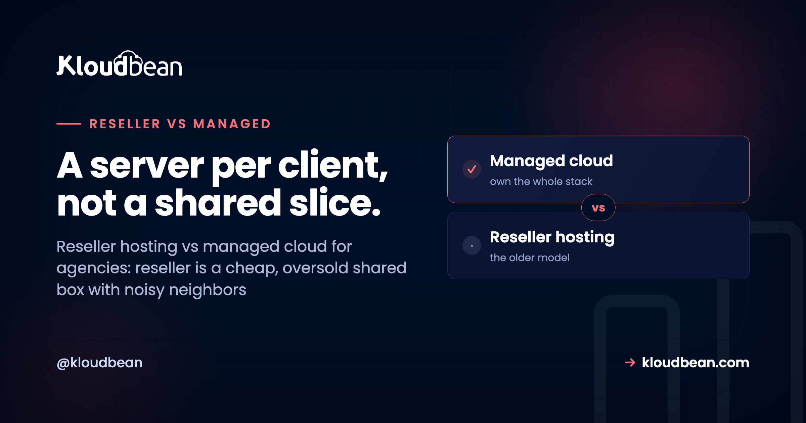
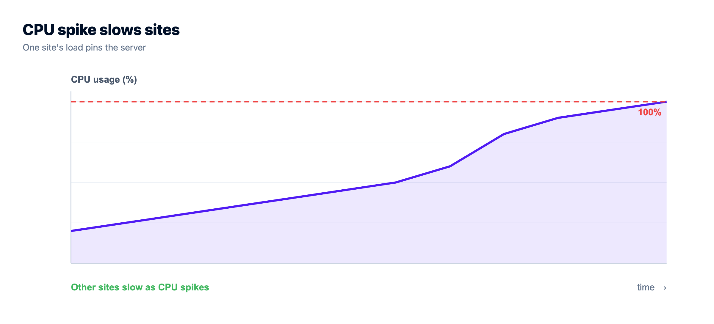
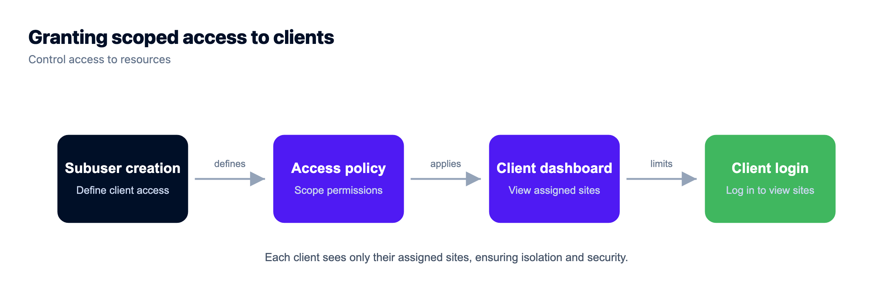
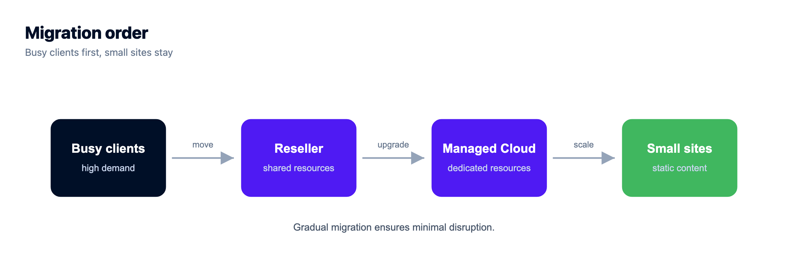

# Reseller Hosting vs Managed Cloud: The Agency's Real Choice

If you host client sites for a living, you've probably felt the reseller hosting vs managed cloud decision without ever naming it. You start on reseller hosting because it's cheap and familiar: buy a big block, carve it into cPanel accounts, resell the slices. It works, right up until one client's traffic spike drags everyone else down, or a client needs something the shared box can't give them.

That's the wall this guide is about. Reseller hosting vs managed cloud isn't really a spec sheet fight. It's about what happens to your agency when it grows past a handful of clients.

> **Short answer:** Reseller hosting is a cheap, familiar way to resell slices of one shared box, and it's genuinely fine for a small stack of simple sites. It's also usually oversold, so one client's spike can slow the rest, isolation is thin, and the scaling ceiling is real. Managed cloud gives each client real isolation on servers you control, cloud choice across 7 providers, managed databases, staging, and scoped logins for clients and teammates. Start on reseller if you're small. Move to managed cloud once isolation, scaling, or client access starts to hurt.

## What reseller hosting actually is

Reseller hosting is the long-standing model, and it's earned its place. You buy a reseller account, which is a bulk allocation of hosting with a set quota, plus a control panel (usually cPanel/WHM) to divide it among client accounts. You create an account per client, hand them some disk and bandwidth, and they get a familiar cPanel to run their site. Cheap to start. Decades-mature tooling. For a stack of brochure sites and small WordPress blogs, it just works.

So here's the honest nod, and I mean it: if your book is a dozen low-traffic sites and clients who expect cPanel, reseller hosting does that job well and has for twenty years. Don't let anyone shame you out of a model that fits. The trouble only starts when the shape of the work changes.

## The noisy neighbor problem

Here's the failure mode that defines reseller hosting, and the one support tickets are made of. It's shared, and it's usually *oversold*. The provider packs many reseller accounts onto one physical server, betting that not everyone spikes at once. Usually that bet pays off. Then one Tuesday it doesn't.

A single client runs a bad plugin, gets hit by a bot wave, or launches a campaign that actually works, and their resource use balloons. On a shared box, that spike doesn't stay contained. CPU and memory are shared, so the noisy neighbor starves everyone else on the machine. Your other clients' sites slow to a crawl or throw errors, and none of them did anything wrong. You get the angry emails. You have no real lever to pull, because the contention is happening a layer below you, on infrastructure you don't control.

That's the thing reseller hosting can't fix by design. You rent a slice of a shared machine, so you inherit whatever the neighbors do. And the busier your clients get, the more often that Tuesday comes around.

```
OVERSOLD SHARED BOX (reseller)   |   MANAGED CLOUD (Kloudbean)
 [client][client][client]        |   one dashboard, scoped access (UAC)
 [client][SPIKE ][client]        |   [Client A][Client B][Client C]
 [client][client][client]        |    own srv   own srv   own srv
 One box, many tenants.          |   A server per client. No noisy neighbors.
 One spike, everyone feels it.   |   Scoped logins + pick any of 7 clouds.
```
*Reseller crams your clients onto one shared box, so a spike bleeds across all of them. Managed cloud gives each client its own isolated server under one dashboard, with scoped access per client and per teammate.*



## What managed cloud changes

Managed cloud flips the foundation. Instead of a fixed quota you slice up, you run actual cloud servers, managed for you, and place client apps on them. You're not dividing a pre-bought block. You're provisioning real infrastructure and scaling it as needed. Each client app can be isolated, resized, or moved on its own. And you spin one up in a few clicks.


Three things change the day you make that switch. First, real isolation. A busy client sits on its own server, so their spike is their problem, not everyone's. Second, cloud choice: Kloudbean runs across AWS, AWS Lightsail, Google Cloud, Linode, Vultr, DigitalOcean, and UpCloud, so you place each client where latency, price, or a data-residency requirement points. Third, room to run more than WordPress. You get six managed databases (MySQL, MariaDB, PostgreSQL, Redis, Elasticsearch, MongoDB), S3-compatible storage, staging for WordPress and Laravel, and a client experience you can put your own brand on. If you're comparing the operating models more broadly, [managed vs unmanaged hosting](https://www.kloudbean.com/blog/managed-vs-unmanaged-hosting/) and [single-tenant vs multi-tenant](https://www.kloudbean.com/blog/single-tenant-vs-multi-tenant/) both dig deeper.

## The agency-specific win: scoped access for clients and teammates

This is the part reseller hosting never really solved, and it's the reason growing agencies move. When you're juggling ten clients and a couple of teammates, "who can touch what" becomes a genuine risk. On a shared cPanel setup, access tends to be all-or-nothing, so handing a client or a contractor a login often means handing over far more than they should see.

Managed cloud on Kloudbean handles this with subusers and User Access Control (UAC): granular, per-resource, per-action permissions. You give a client access to just their own site and nothing else. You let a freelance developer deploy to one app without seeing billing or the other twenty clients. A junior on your team gets exactly the buttons they need. That's not a nice-to-have at agency scale. It's how you avoid the 2am mistake where someone edits the wrong client's site. The mechanics of setting that up, the permission grid and a few role recipes, are in the [subusers and UAC guide](https://www.kloudbean.com/blog/subuser-and-uac-guide/). For the wider agency setup, there's a [hosting for agencies playbook](https://www.kloudbean.com/blog/hosting-for-agencies-playbook/) and a walkthrough of [how agencies host 20 client apps](https://www.kloudbean.com/blog/how-agencies-host-20-client-apps/) without losing their minds.



## Reseller hosting vs managed cloud, feature by feature

| | Reseller hosting | Managed cloud (Kloudbean) |
|---|---|---|
| **Resource model** | Fixed bulk quota, sliced | Real servers, provisioned as needed |
| **Isolation** | Accounts share one box | A server per client, isolated |
| **Noisy-neighbor risk** | High (often oversold) | Contained to one client's server |
| **Scaling** | Buy a bigger reseller plan | Resize, or add a node behind a load balancer |
| **Cloud choice** | Whatever the reseller runs on | 7 clouds, you pick per client |
| **Tech stack** | Mostly PHP/WordPress via cPanel | PHP, Node, Python, Ruby, Java, plus 6 databases |
| **Team & client access** | Largely all-or-nothing | Subusers + granular UAC |
| **Client experience** | Generic cPanel | White-label friendly |
| **Ceiling** | The reseller plan's limits | Scales with the cloud |
| **Who owns the apps** | You / your clients | You / your clients |

## The growth path: start on reseller, graduate to managed cloud

You don't have to flip everything at once, and you shouldn't. A calm transition looks like this. Leave the small, simple, low-traffic sites where they are for now. Move the clients who are *straining* first: the busy one, the one that needs a plugin or a runtime the shared box can't run, the one who keeps asking for more. Stand up a managed cloud server, migrate those sites one at a time (each is just files plus a database plus a DNS change), and prove the workflow on a few before you commit the roster.

Over time the center of gravity shifts to cloud, and the reseller account shrinks to whatever genuinely belongs there, or retires. Gradual beats big-bang. It lets you learn the new model on low-stakes sites, and it means the first client you move to managed cloud is one who'll actually feel the upgrade. When one of those clients gets big enough to need more than one server, you put a [load balancer](https://www.kloudbean.com/blog/cloud-load-balancer-explained/) in front and add nodes, rather than dragging the whole roster onto a bigger shared plan.



## So which should you pick?

Here's my honest call after watching a lot of agencies make it. Stay on reseller hosting if your book is small, simple, WordPress-and-cPanel shaped, and not really growing. It's cheap, it works, and switching would be solving a problem you don't have. But move to (or start on) managed cloud the moment any of these is true: a client's traffic is hurting the others, clients need more than basic sites, you want to scale one client without penalizing the rest, or you need to hand out scoped access without oversharing.

Most agencies begin on reseller and hit the ceiling. If you can already feel it, or you're building for scale on purpose, managed cloud is the model that won't need replacing in a year. And if agency-branded WordPress specifically is your bread and butter, the [agency WordPress hosting](https://www.kloudbean.com/blog/agency-wordpress-hosting/) and [white-label hosting](https://www.kloudbean.com/blog/white-label-hosting-for-agencies/) guides pick up from here.

Under either model it's Linux hosting, and your clients' sites and data stay theirs. On the managed-cloud side, the platform runs the servers, stack, SSL, backups, and patching, while you own the apps. The difference isn't ownership. It's whether you're slicing a fixed block or commanding real infrastructure that grows with your roster.

<!-- cta:start -->
**A rehoming, not a rewrite.**

Standard code moves onto a standard Linux server, so this is a migration rather than a rewrite. Pick from seven clouds, keep push-to-deploy, and get help moving the first workload across.

- Free migration assistance
- Free trial
- Seven cloud providers
- Flat monthly price
- Managed databases
- Git deploy

[Start free](https://console.kloudbean.com/register) · [See plans](https://www.kloudbean.com/pricing/)
<!-- cta:end -->

## FAQ

**What's the difference between reseller hosting and managed cloud?**
Reseller hosting means buying a fixed bulk allocation of shared hosting and slicing it among client accounts, usually via cPanel/WHM. Managed cloud means running real, managed cloud servers and placing client apps on them, scaling as needed. Reseller is cheap and capped. Managed cloud costs a bit more but isolates clients and grows with you.

**Is reseller hosting still worth it for agencies?**
Yes, for the right case: small, simple sites, clients who want cPanel, and the lowest entry cost. If your roster is stable and not straining the plan, reseller hosting does that job well. It becomes limiting when clients need more resources, real isolation, or non-WordPress apps.

**What is the noisy neighbor problem in reseller hosting?**
Because reseller accounts share one physical server and providers often oversell it, one client's traffic spike or runaway process can consume shared CPU and memory and slow every other site on the box. You have little control, because the contention is happening on infrastructure below your account. Per-client isolation on managed cloud contains it.

**When should an agency move from reseller to managed cloud?**
When a client's traffic outgrows shared limits, when one client keeps affecting others, when you need to scale a single client without upsizing everyone, or when you want scoped client access and your own branding. Those are the points where the reseller model's ceiling starts to cost you real money and goodwill.

**Can managed cloud host WordPress like reseller hosting does?**
Yes, and more. Managed cloud runs WordPress comfortably with staging and backups, plus apps in other languages, standalone databases, and object storage. The difference is that each site sits on real infrastructure you can isolate and scale on its own, rather than sharing a fixed pre-bought block.

**How does client and team access work on managed cloud?**
Through subusers and User Access Control (UAC): granular, per-resource, per-action permissions. You can give a client access to only their own site, or let a contractor deploy to one app without seeing billing or the rest of your clients. That scoped access is hard to do cleanly on all-or-nothing cPanel logins.

**Which is cheaper, reseller hosting or managed cloud?**
Reseller hosting usually has a lower entry price, which suits small, simple site collections. Managed cloud costs more per server but scales granularly and avoids paying for a bigger bulk plan just because one client grew. For a growing agency, per-client scaling often works out more economical than repeatedly upsizing a reseller plan.

**Do I have to migrate all my clients at once?**
No, and you shouldn't. Move the straining clients first, leave the small simple sites on reseller for now, and prove the workflow on a few before committing the roster. Each site is files plus a database plus a DNS change. Free migration assistance can handle the heavier moves.

**Can I put my own brand on managed cloud hosting?**
Managed cloud is white-label friendly, so you can present hosting under your agency's brand rather than a generic control panel. Combined with scoped client access, that lets you give clients a clean, branded experience limited to their own site.

**Does managed cloud scale automatically for a traffic spike?**
For a standard account you scale deliberately: resize the server for more CPU and RAM, or add nodes behind the built-in load balancer for more traffic. Automatic autoscaling and Kubernetes are available for enterprise and custom setups, not enabled by default for every account. Deliberate scaling is usually what an agency wants anyway.

---

*By Kloudbean · A server per client, not a shared slice.*
