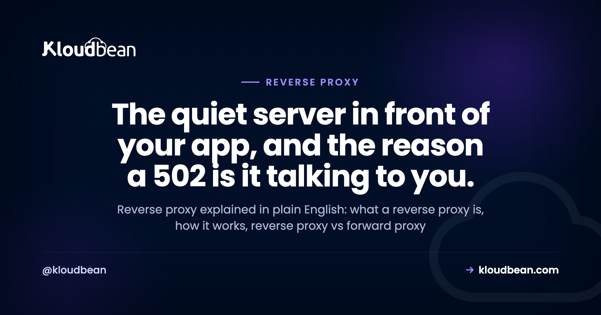
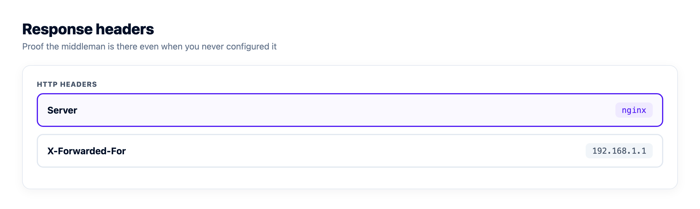
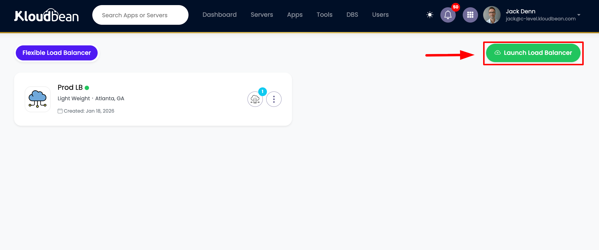
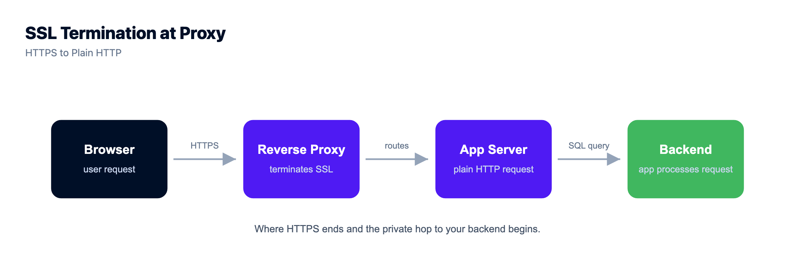
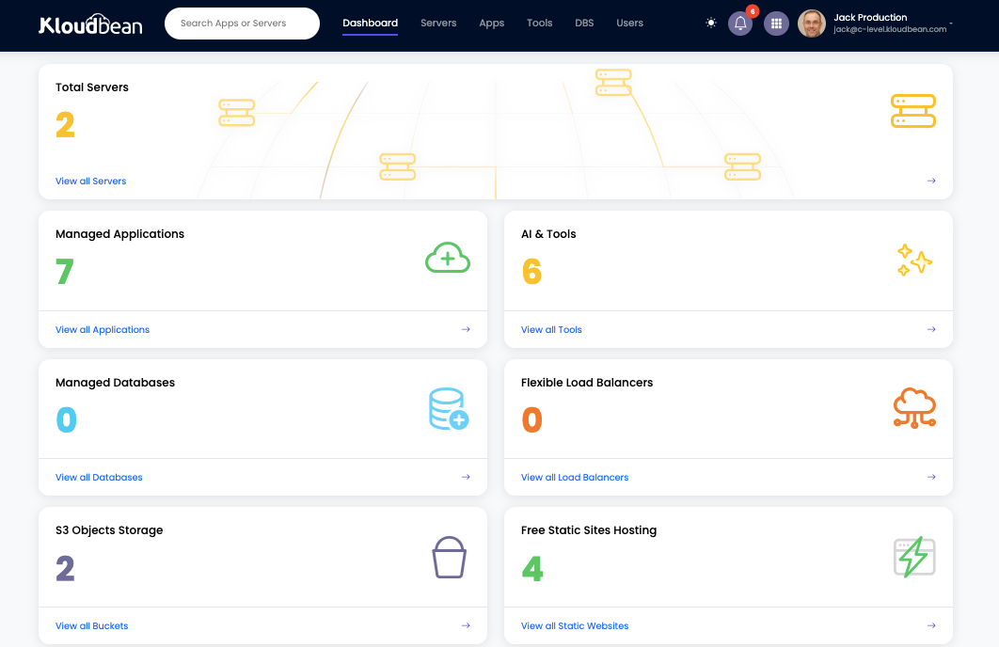
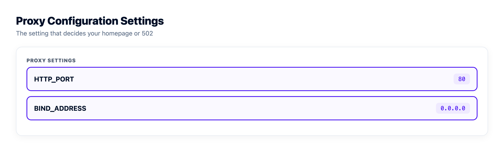

# Reverse Proxy Explained: The Server That Sits in Front of Your App

Load any site over HTTPS and there's a good chance you hit a reverse proxy before your request ever reaches the real application. Usually it's [Nginx or Apache](https://www.kloudbean.com/blog/nginx-vs-apache/), sitting quietly out front, taking the request and handing back the reply. You never see it. Until it breaks, and a `502 Bad Gateway` shows up where your homepage should be.

This is reverse proxy explained the way it actually matters to someone shipping code. What a reverse proxy is, how it works, how it differs from a forward proxy and from a load balancer, and why that 502 is trying to tell you something specific. We'll read a real Nginx config too. No hand-waving.

> **The short answer:** A reverse proxy is a server that sits in front of your application, takes every incoming client request, and forwards it to the app behind it, then passes the response back. It handles TLS, routing, and static files, and hides your backend so clients only ever talk to one public address.

## What is a reverse proxy?

A reverse proxy is a server that sits between your users and your application. Every request from a client hits the proxy first. The proxy forwards it to a **backend**, the process actually running your code, waits for the answer, and relays it back to the client. To the outside world, the proxy *is* the site. The app behind it never faces the internet directly.

That last part is the whole point of the word "reverse." A normal proxy works for the client. A reverse proxy works for the server. Same middleman idea, flipped around. We'll get to that contrast in a minute, because mixing the two up is the most common confusion here.

Why put anything in front of your app at all? Because your application shouldn't have to fuss over TLS certificates, or which URL path goes where, or a slow phone tying up a worker for thirty seconds. Hand those jobs to a proxy that's good at them. Your app gets to just do the thing it was written to do.

```
   REVERSE PROXY (in front of your servers)
   [ Clients ] -> [ Reverse proxy: TLS · routing ] -> [ App node A :3000 ]
                                                   \-> [ App node B :3001 ]  (hidden)

   FORWARD PROXY (in front of the client)
   [ One client ] -> [ Forward proxy: filters · hides you ] -> [ the open internet ]
```
*A reverse proxy stands in front of your servers and hides them. A forward proxy stands in front of a client and hides it. Same idea, opposite directions.*

## How does a reverse proxy work, one request at a time?

Walk a single HTTPS request through it. Nothing here is magic once you see the order.

First, the client opens a connection to the proxy on port `443`. The proxy holds the TLS certificate, so the encrypted handshake ends right there. That's **TLS termination**: the proxy decrypts the request and now has plain HTTP to work with.

Next it looks at the request and decides where it goes. A path like `/static/logo.png` might be served straight off disk. A path like `/api/orders` gets forwarded to your app. This is **routing**, and it's why one domain can fan out to several different backends without the visitor knowing.

Then it forwards. The proxy opens its own connection to the backend, often something local like `127.0.0.1:3000`, and passes the request along with a few headers so the app still knows who the real visitor was. The app does its work, returns a response, and the proxy relays it back to the client over that original encrypted connection.

One quiet but important step in the middle: **buffering**. The proxy can read the whole response from your app quickly, then feed it out to a slow client at whatever pace that client can handle. Your app worker is freed the moment the proxy has the bytes, instead of being held hostage by someone on hotel wifi. Small thing. Saves real capacity under load. The proxy is just one hop in a longer journey, so if you want the full path from DNS to database, see [how cloud hosting works](https://www.kloudbean.com/blog/how-cloud-hosting-works/).

## What a reverse proxy actually does for you

Strip away the jargon and a reverse proxy earns its keep in a handful of concrete ways.

- **TLS termination.** One place holds the certificate and speaks HTTPS to the world. Your app can speak plain HTTP internally and never touch a cert file.
- **Routing.** Send `/api` to one service, `/` to another, a subdomain somewhere else. The proxy is the switchboard.
- **Serving static files.** Images, CSS, a built React bundle. The proxy hands these back directly, far faster than waking your application to do it.
- **Hiding the backend.** Clients see one public address. Your app's real port and internal address stay private, which shrinks what an attacker can even reach.
- **Buffering slow clients** so one sluggish connection can't pin an app worker in place.
- **Basic rate limiting and access rules.** Cap requests per IP, block a path, add a header. Cheap protection before traffic ever touches your code.

Notice something: none of these need more than one backend. A reverse proxy in front of a *single* app is already useful. That matters for the next comparison, because people assume a proxy only earns its place once you run a fleet of servers. Not true.



## Reverse proxy vs forward proxy: which direction is it facing?

Here's the distinction that trips everyone up. Both are middlemen. The difference is *who they work for* and which side they hide.

A **forward proxy** sits in front of the **client**. A company routes everyone's outbound traffic through one so it can filter, cache, or log what staff reach on the internet. The servers on the far end see the proxy, not the individual person. It hides the client.

A **reverse proxy** sits in front of the **server**. Clients send requests to it thinking it's the site, and it relays them to the real backends. The client sees the proxy, not your actual app servers. It hides the server.

Often the same software does both jobs. Nginx is a reverse proxy in one config and a forward proxy in another. The word just tells you which way it's pointing.

| | Forward proxy | Reverse proxy |
| --- | --- | --- |
| **Sits in front of** | The client | The server |
| **Acts on behalf of** | The user making requests | The app receiving requests |
| **Hides** | Who the client is | Where the backend is |
| **Typical use** | Egress filtering, caching, privacy | TLS, routing, static files, one public door |
| **Client knows it's there** | Usually yes, it's configured on the client | No, it looks like the site itself |

## Reverse proxy vs load balancer: is a load balancer just a reverse proxy?

Short answer: pretty much, yes. A load balancer is a reverse proxy with one job turned all the way up, spreading requests across many backends and watching their health.

Think of it as a family. Every load balancer is doing reverse-proxy work: taking a client request, forwarding it to a backend, relaying the answer. What makes it a *load balancer* is that it forwards to a **pool** of backends instead of one, picks which node gets each request (round-robin and friends), and runs health checks so a dead node drops out of rotation on its own.

But a reverse proxy doesn't need any of that to be worth having. In front of a single app it still terminates TLS, serves static files, and hides your backend. So the honest framing is this. A load balancer is a specialized reverse proxy for distributing traffic. A plain reverse proxy in front of one app is the everyday case, and by far the more common one. Want the distribution and failover side in depth? We wrote a whole piece on [how a cloud load balancer works](https://www.kloudbean.com/blog/cloud-load-balancer-explained/).

| | Reverse proxy (one app) | Load balancer |
| --- | --- | --- |
| **Main job** | TLS, routing, static files, hiding the app | Spread traffic across many backends |
| **Backends behind it** | Often just one | Always several, a pool |
| **Health checks** | Not really the point | Core feature, drops dead nodes |
| **Survives a server dying** | No, there's one backend | Yes, reroutes to healthy nodes |
| **Useful with a single server** | Yes, very | Not the point of one |
| **In one line** | The general tool | A reverse proxy tuned for distribution |



## Nginx reverse proxy: reading a real config

Nginx is the most common reverse proxy on the web, so let's read an actual config instead of describing one. This fronts a Node app listening on port 3000.

```
# /etc/nginx/sites-available/myapp : reverse proxy for a Node app on port 3000
server {
    listen 443 ssl;
    server_name example.com;

    ssl_certificate     /etc/letsencrypt/live/example.com/fullchain.pem;
    ssl_certificate_key /etc/letsencrypt/live/example.com/privkey.pem;

    # serve static files straight off disk, fast
    location /static/ {
        root /var/www/myapp;
    }

    # everything else goes to the app behind the proxy
    location / {
        proxy_pass         http://127.0.0.1:3000;
        proxy_set_header   Host $host;
        proxy_set_header   X-Real-IP $remote_addr;
        proxy_set_header   X-Forwarded-For $proxy_add_x_forwarded_for;
        proxy_set_header   X-Forwarded-Proto $scheme;
    }
}
```

Read it top to bottom and it's just the steps from earlier, written down. Listen on 443 with a certificate (TLS termination). Serve `/static/` off disk (static files). Send everything else to `127.0.0.1:3000` (routing plus forwarding), attaching `X-Forwarded-For` so your app still sees the visitor's real IP instead of the proxy's.

Two operational habits worth stealing. Always test before you reload, and reload rather than restart so live connections aren't dropped:

```
# test the config first, then reload without dropping connections
sudo nginx -t
sudo systemctl reload nginx

# ask the proxy what it thinks of your app right now
curl -I https://example.com
# HTTP/1.1 502 Bad Gateway   (proxy is up, your app is not answering)
```

That last line is the tell. If `curl` comes back with `502 Bad Gateway`, the proxy is alive and well. It's your app behind it that isn't answering.



## Why a 502 is the reverse proxy talking to you

This is the part that actually helps at 2am, so here's where a reverse proxy stops being trivia and starts being useful.

When you see `502 Bad Gateway` or `503 Service Unavailable`, that message is coming *from the reverse proxy*, not from your app. The proxy is up. It took the request. Then it tried to reach your backend and couldn't. A 502 means the app refused or dropped the connection. A 503 usually means nothing healthy was available to send the request to. A 504 means the app took too long to answer.

And the cause is almost always the same boring thing. Your app is listening on the wrong address or the wrong port. Bind to `localhost` (or `127.0.0.1` inside an isolated environment the proxy can't enter) and the proxy gets connection refused. Hard-code a port the platform doesn't route to, same result. The fix is to listen on `0.0.0.0` and read the port from the environment:

```
# good: listens on all interfaces, on the port the platform expects
app.listen(process.env.PORT || 3000, '0.0.0.0')

# bad: only reachable from inside its own box, proxy gets connection refused
app.listen(3000, '127.0.0.1')   # results in 502 / 503
```

The code is fine. The wiring is wrong. I'd bet most 502s are config, not bugs. If you're staring at one right now, we have a focused walkthrough for [fixing a 503 after a deploy](https://www.kloudbean.com/blog/fix-503-after-deploying-your-app/), and one for [deploying a Node app so the proxy can actually reach it](https://www.kloudbean.com/blog/deploy-node-app-to-managed-cloud/).

> **Founder note.** On a managed host you almost never hand-edit the proxy config, and honestly you shouldn't have to. The platform runs Nginx or Apache in front of your app and terminates SSL there for you. Knowing the proxy exists isn't about configuring it. It's so the first time you meet a 502, you know exactly who's talking and where to look: your app's bind address and port, not the proxy.


## How the reverse proxy fits on Kloudbean

On Kloudbean the reverse proxy is just there, part of the managed stack. You deploy an app and the platform puts a web server (Nginx or Apache) in front of it, wires it to your app's port, and terminates free auto-renewing SSL at that layer. No `nginx.conf` to hand-roll for a normal app.

Need more than one backend? That's when the built-in **Flexible Load Balancer** comes in, the specialized reverse proxy from earlier, sitting in front of a pool with health checks and SSL management. It's on every account, off until you switch it on. And because servers, apps, databases, and the load balancer all live under one dashboard, you're not stitching the proxy layer together from separate products and separate bills.

The division of labour stays honest. The platform runs the proxy and the SSL. You own the app that listens behind it, on Linux stacks like Node, PHP, Python, Ruby, and Java. Your backend listens on an internal port, so the only public door is the proxy out front, which is exactly where you want it. On Enterprise you can put that backend on a [private network (VPC)](https://www.kloudbean.com/blog/what-is-a-vpc/) as well.





## Reverse proxy explained: what to actually remember

Strip it to the studs. A reverse proxy is the server in front of your server. It takes the client's request, handles the tedious edge work (TLS, routing, static files, buffering), hides your app, and forwards the real work to the backend.

A forward proxy points the other way, standing in front of clients. A load balancer is a reverse proxy that specializes in spreading traffic across many backends. And the practical payoff, the bit worth carrying around: when you see a 502, the proxy is fine and your app isn't answering, so check the bind address and the port first. You'll be right most of the time. If you're choosing where that whole managed stack should live, our take on the [best managed cloud hosting](https://www.kloudbean.com/blog/best-managed-cloud-hosting/) lays out what to look for.

<!-- cta:start -->
**Own the server. Skip the server admin.**

Servers, managed databases, object storage, and a built-in load balancer live behind one login, on the cloud and region you pick. The stack, SSL, patching, and backups are handled for you.

- Seven cloud providers
- Managed databases
- Object storage
- Automatic backups
- Free SSL
- Git deploy
- Free migration assistance

[Start free](https://console.kloudbean.com/register) · [See plans](https://www.kloudbean.com/pricing/)
<!-- cta:end -->

## FAQ

**What is a reverse proxy in simple terms?**
A reverse proxy is a server that sits in front of your application and handles requests on its behalf. Clients connect to the proxy, and the proxy forwards each request to the real backend, then returns the response. To visitors the proxy looks like the site itself, while your app stays hidden behind it.

**How does a reverse proxy work?**
A client connects to the proxy over HTTPS. The proxy terminates TLS, decides where the request should go based on its path or host, forwards it to the matching backend over an internal connection, and relays the backend's response back to the client. It can also serve static files itself and buffer responses for slow clients.

**What is the difference between a reverse proxy and a forward proxy?**
Direction. A forward proxy sits in front of clients and acts on their behalf, hiding who the client is from the servers they reach. A reverse proxy sits in front of servers and acts on their behalf, hiding the backend from clients. Same middleman idea, pointing opposite ways.

**Is a load balancer the same as a reverse proxy?**
A load balancer is a specialized reverse proxy. It does the same core job of forwarding client requests to backends, but it forwards to a pool of servers, chooses which one gets each request, and runs health checks to drop failed nodes. A plain reverse proxy in front of a single app is still useful for TLS, routing, and hiding the backend.

**Why do people use Nginx as a reverse proxy?**
Nginx is fast, lightweight, and built to handle many connections at once, which makes it a natural fit for terminating TLS, serving static files, and forwarding dynamic requests to an app. A short server block with a proxy_pass line is often all it takes. Apache can do the same job and is also common.

**Do I need to configure a reverse proxy myself?**
On a managed host, usually not. The platform runs a web server such as Nginx or Apache in front of your app and terminates SSL there for you. You mainly need to make sure your app listens on the address and port the platform expects. On an unmanaged server you configure the proxy yourself.

**Why does a reverse proxy return a 502 error?**
A 502 Bad Gateway means the proxy is running but could not reach your application behind it. The most common cause is the app listening on localhost instead of 0.0.0.0, or on a port the proxy is not forwarding to. Fix the bind address and the port and the 502 usually clears.

**Does a reverse proxy handle SSL?**
Yes, that is one of its main jobs. The proxy holds the certificate and terminates TLS, so the HTTPS connection ends at the proxy and your app can speak plain HTTP internally. That gives you one place to manage and renew certificates. Managed platforms issue and auto-renew that certificate for you.

**Does a reverse proxy make my site faster?**
It can. Serving static files directly from the proxy is faster than waking your app to do it, buffering frees app workers from slow clients sooner, and the proxy can compress responses and add caching rules. It will not speed up slow application code, but it removes a lot of avoidable overhead.

---

*By Kloudbean Infrastructure · The quiet server in front of your app, and the reason a 502 is it talking to you.*
