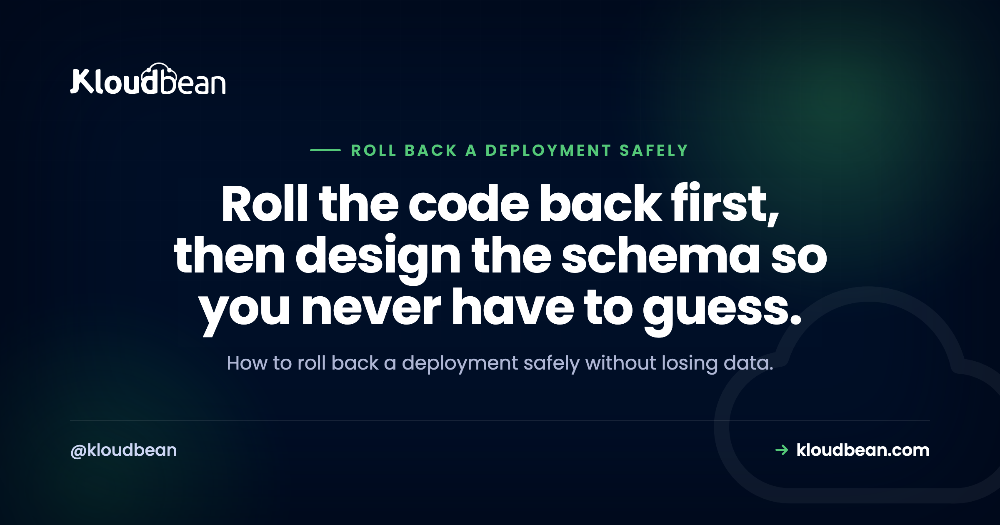
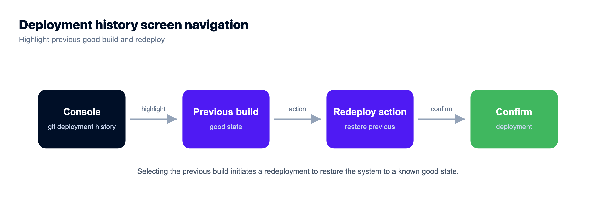
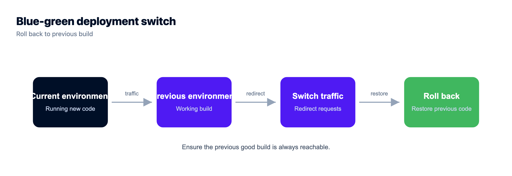
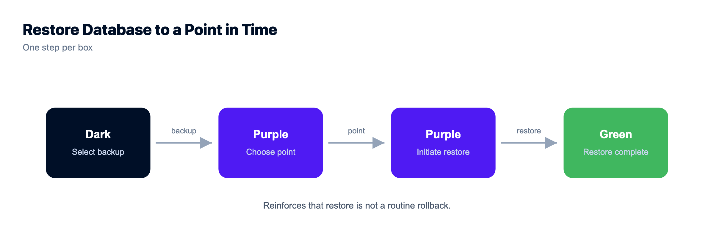

# How to Roll Back a Deployment Safely (Without Losing Data)

A deploy just went bad. The error rate is climbing, users are hitting a broken page, and your instinct is to open the logs and start fixing forward. Don't, not yet. The fastest way out of a bad release is almost always to roll back a deployment to the last version that worked, then diagnose once the site is healthy. Rolling the code back is the easy part. The part that bites is the database, because a schema change doesn't undo as cleanly as a git revert.

So a safe rollback isn't really something you do in the moment. It's something you set up before you ship. This guide walks the fast path in an incident, why code reverts cleanly but a migration often won't, and the way to ship (forward-compatible migrations) that keeps almost every deploy reversible. Plus the one move that quietly loses a day of user data, so you can avoid making it at 2am.

> **The short version:** To roll back a deployment safely, revert the code first. Redeploy the last known-good build to stop the bleeding, then diagnose. The catch is the database. Rolling code back to a version that expects the old schema breaks if the bad deploy already changed that schema. Ship forward-compatible (expand/contract) migrations so the old code still runs against the new database, and treat restoring a backup as a last resort, because it wipes everything written since the snapshot.

## The fast path: how to roll back a deployment mid-incident

When a deploy is actively breaking things, your job is not to understand why. Not yet. Your job is to get back to a working state, and the quickest route there is to redeploy the last build that worked. Roll back first. Diagnose second. A calm investigation on a healthy site beats a frantic one while users stare at errors.

This is the part everyone gets right in theory and fumbles under pressure. The temptation is to spot the bug, push a quick fix, and roll forward. Sometimes that works. Often the "quick fix" is wrong because you're rushing, and now you've shipped a third version that's also broken. Rolling back to a known-good build has one real advantage: you already know it works. There's no guessing.

If your deploys come from Git, and they should, rolling back is just redeploying an earlier commit. The flow in [auto-deploy from GitHub](https://www.kloudbean.com/blog/ci-cd-auto-deploy-from-github/) works in reverse here: point the app at the last good commit and redeploy. A bad release often surfaces as a 503 while the process crashes or restarts, so [fixing a 503 after deploy](https://www.kloudbean.com/blog/fix-503-after-deploying-your-app/) covers reading that exact signal. And for the wider catalogue of ways a release goes sideways, [why AI apps fail in production](https://www.kloudbean.com/blog/why-ai-apps-fail-in-production/) is the map.

What makes this fast is having the deploy history in front of you. On Kloudbean's managed CI/CD, every push is recorded with its build log, so mid-incident you're reading which commit shipped and when instead of guessing from memory. That's the difference between a 90-second rollback and twenty minutes of archaeology in a Git log while the error rate climbs.



## Why code rolls back cleanly but a database migration doesn't

Code is stateless. That's why rolling it back is easy. You swap the running version for the previous one and nothing is lost, because the code was never holding your data in the first place. Your database is the opposite. It holds state, and state remembers.

And here's the trap. Say your bad deploy included a migration that dropped a column, or renamed one, or changed a type. You roll the code back to the previous version. But that previous version expects the old schema, the one with the column that no longer exists. So the old code now runs against the new database and throws on every query that touches that column. You rolled back the code and the app is still broken, because the schema moved and didn't move back.

That's why "just roll it back" is honest advice for code and dangerous advice for a schema. A dropped column doesn't come back when you redeploy. The values that were in it are already gone. A down-migration might recreate the column's structure, but it can't recreate the data. So the direction of a schema change matters enormously. Adding things is reversible. Removing or rewriting things usually is not.

<figure>
  <svg viewBox="0 0 800 400" role="img" aria-label="A deploy timeline comparing two ways to ship a change. Top track, a destructive migration: the last good build has the name column, the bad deploy drops it, and rolling the code back breaks because the old code meets a schema that no longer has the column. Bottom track, an expand and contract migration: the new deploy adds a full_name column and keeps the old name column, so rolling the code back is clean because the old column is still there." xmlns="http://www.w3.org/2000/svg">
    <defs>
      <marker id="ap" markerWidth="9" markerHeight="9" refX="7" refY="4" orient="auto"><path d="M0,0 L8,4 L0,8 Z" fill="#4F1AF3"/></marker>
      <marker id="ag" markerWidth="9" markerHeight="9" refX="7" refY="4" orient="auto"><path d="M0,0 L8,4 L0,8 Z" fill="#40b75f"/></marker>
      <marker id="ard" markerWidth="9" markerHeight="9" refX="7" refY="4" orient="auto"><path d="M0,0 L8,4 L0,8 Z" fill="#d64545"/></marker>
    </defs>

    <text x="400" y="30" text-anchor="middle" font-family="Poppins,sans-serif" font-size="15" font-weight="700" fill="#000f27">One bad deploy, two outcomes</text>

    <text x="48" y="84" font-family="Poppins,sans-serif" font-size="12" font-weight="700" fill="#000f27">Destructive migration (drops a column)</text>
    <path d="M470,100 C470,58 224,58 224,100" fill="none" stroke="#d64545" stroke-width="2" marker-end="url(#ard)"/>
    <text x="347" y="52" text-anchor="middle" font-family="Poppins,sans-serif" font-size="10.5" font-weight="600" fill="#d64545">roll the code back</text>

    <rect x="150" y="100" width="150" height="58" rx="10" fill="#fff" stroke="#40b75f" stroke-width="1.6"/>
    <text x="225" y="126" text-anchor="middle" font-family="Poppins,sans-serif" font-size="12.5" font-weight="600" fill="#000f27">Last good build</text>
    <text x="225" y="144" text-anchor="middle" font-family="JetBrains Mono,monospace" font-size="10" fill="#5b6a86">schema has name</text>

    <line x1="300" y1="129" x2="374" y2="129" stroke="#4F1AF3" stroke-width="2" marker-end="url(#ap)"/>
    <text x="337" y="122" text-anchor="middle" font-family="Poppins,sans-serif" font-size="10" fill="#4F1AF3">deploy</text>

    <rect x="378" y="100" width="170" height="58" rx="10" fill="#000f27"/>
    <text x="463" y="126" text-anchor="middle" font-family="Poppins,sans-serif" font-size="12.5" font-weight="600" fill="#fff">Bad deploy</text>
    <text x="463" y="144" text-anchor="middle" font-family="JetBrains Mono,monospace" font-size="10" fill="#9fb0cc">drops the name column</text>

    <text x="368" y="184" text-anchor="middle" font-family="Poppins,sans-serif" font-size="11" font-weight="600" fill="#d64545">Rollback breaks: old code hits a schema with no name column.</text>

    <text x="48" y="238" font-family="Poppins,sans-serif" font-size="12" font-weight="700" fill="#000f27">Expand / contract migration (keeps the old column)</text>
    <path d="M470,254 C470,212 224,212 224,254" fill="none" stroke="#40b75f" stroke-width="2" marker-end="url(#ag)"/>
    <text x="347" y="206" text-anchor="middle" font-family="Poppins,sans-serif" font-size="10.5" font-weight="600" fill="#40b75f">roll the code back</text>

    <rect x="150" y="254" width="150" height="58" rx="10" fill="#fff" stroke="#40b75f" stroke-width="1.6"/>
    <text x="225" y="280" text-anchor="middle" font-family="Poppins,sans-serif" font-size="12.5" font-weight="600" fill="#000f27">Last good build</text>
    <text x="225" y="298" text-anchor="middle" font-family="JetBrains Mono,monospace" font-size="10" fill="#5b6a86">reads name</text>

    <line x1="300" y1="283" x2="374" y2="283" stroke="#4F1AF3" stroke-width="2" marker-end="url(#ap)"/>
    <text x="337" y="276" text-anchor="middle" font-family="Poppins,sans-serif" font-size="10" fill="#4F1AF3">deploy</text>

    <rect x="378" y="254" width="170" height="58" rx="10" fill="#fff" stroke="#40b75f" stroke-width="1.6"/>
    <text x="463" y="280" text-anchor="middle" font-family="Poppins,sans-serif" font-size="12.5" font-weight="600" fill="#000f27">New deploy</text>
    <text x="463" y="298" text-anchor="middle" font-family="JetBrains Mono,monospace" font-size="10" fill="#5b6a86">adds full_name, keeps name</text>

    <text x="368" y="338" text-anchor="middle" font-family="Poppins,sans-serif" font-size="11" font-weight="600" fill="#40b75f">Rollback is clean: the old column is still there for the old code.</text>
  </svg>
  <figcaption>Same timeline, two ways to ship. A destructive migration (top) breaks the moment you roll the code back, because the old code meets a schema that lost its column. An expand and contract migration (bottom) stays reversible, because the old column never left.</figcaption>
</figure>

## Ship so rollback is always possible: expand and contract

The fix isn't a better rollback tool. It's a better way to ship the change in the first place. The pattern goes by a few names (expand/contract, forward-compatible migrations, parallel change) and it comes down to one rule: never make a destructive schema change in the same deploy as the code that depends on it.

Split every risky change into steps that are each safe on their own:

1. **Expand.** Add the new column. Don't touch or remove anything old. This deploy is purely additive, so it can't break the running code, and it rolls back trivially.
2. **Write both.** Deploy code that writes the old shape and the new shape at once, while still reading the old one. Now both versions of your app can run happily against this database.
3. **Backfill.** Copy existing rows into the new column so old data matches the new shape too.
4. **Read new.** Deploy code that reads the new column. Keep writing both for now, so a rollback to the step-2 code still works.
5. **Contract.** Only once nothing reads the old column, in a later and separate deploy, drop it.

At every step, the previous deploy's code still runs against the current schema. That's the whole point. You're never one rollback away from a broken app.

```sql
-- 1. EXPAND: additive only. Safe to deploy, trivial to roll back.
alter table users add column full_name text;

-- 2. Ship code that writes BOTH columns and still reads the old one:
--    insert into users (name, full_name) values ($1, $1)
--    reads still use "name"

-- 3. BACKFILL existing rows into the new shape:
update users set full_name = name where full_name is null;

-- 4. Ship code that READS full_name (keep writing both for now).

-- 5. CONTRACT: a LATER, separate deploy, once nothing reads "name":
alter table users drop column name;
```

For the mechanics of designing and running migrations, [production database design for AI apps](https://www.kloudbean.com/blog/production-database-design-for-ai-apps/) covers the schema side, and [migrating an app from SQLite to Postgres](https://www.kloudbean.com/blog/migrate-ai-app-sqlite-to-postgres/) walks a real migration end to end.

## Keep the last good build reachable

None of this helps if you can't get the previous version back. A rollback plan assumes the last known-good build still lives somewhere you can redeploy in one action. So don't overwrite it. Don't delete it. Keep it reachable.

This is what blue-green deployment buys you. You run two environments, call them blue and green. One serves live traffic while the other holds a release, ready. You deploy to the idle one, shift traffic across, and if it misbehaves you shift traffic straight back. A blue-green rollback is just flipping the switch to the environment that still has the old, working version. No rebuild, no scramble.

You don't strictly need full blue-green to get the benefit. The minimum is simpler: your previous build stays deployable. If your platform builds each deploy from a Git commit, the previous commit is your previous build, and rolling back means redeploying it. Keep enough deploy history that "redeploy the last good one" is always one click or one command away.

If you do want the real traffic switch, that's what a load balancer in front of two application pools gives you. Kloudbean's Flexible Load Balancer is built into every account (off until you enable it), so blue-green becomes moving a pool rather than buying another product. Worth knowing before you decide you can't afford the pattern.



## Roll back the code, roll back the schema, or restore a backup?

These three get lumped together as "undo," and they cost wildly different things. Restoring a database backup is the one that surprises people. A backup is a snapshot from a point in time. Restore it and you don't just undo the bad deploy. You undo every row written since that snapshot. The orders, sign-ups, and messages your users created in the last few hours, gone, and quietly. That's why restoring a backup is a last resort for data loss or corruption, not a routine rollback.

| Action | What it undoes | What it costs | When to reach for it |
| --- | --- | --- | --- |
| Roll back the code | Swaps the app back to the previous build | Nothing, if the schema still fits the old code. Fast and safe | Your first move in almost any bad deploy |
| Roll back the schema | Reverses the migration (a down-migration) | Safe if the change was additive; a destructive change already lost its data | Rarely needed if you ship expand/contract, and only for reversible changes |
| Restore a DB backup | Resets the whole database to a past snapshot | Loses every row written since the snapshot | Last resort, for corruption or data loss, never as routine undo |

Backups are still essential. They're just the wrong tool for a normal rollback. [Server backups that actually restore](https://www.kloudbean.com/blog/server-backups-guide/) covers keeping snapshots you can trust when you genuinely need one, which is a separate discipline from a deploy rollback.

One habit that pays for itself: take an on-demand backup right before you run a risky migration. Kloudbean gives you automatic backups plus on-demand ones for apps, so the pre-migration snapshot is a click, and the window of data you'd sacrifice in a worst case shrinks from hours to minutes. It's the cheapest insurance in this whole article.



## A rollback runbook for 2am

When it's actually on fire, you don't want to reason from first principles. Follow the order:

1. **Roll the code back first.** Redeploy the last known-good build. Stop the bleeding before you do anything else.
2. **Check what the bad deploy changed.** Code only? You're probably already healthy. Did it include a migration?
3. **If the migration was additive** (expand/contract), the old code runs fine against the new schema. Breathe. Diagnose calmly.
4. **If the migration was destructive,** rolling the code back won't be enough. Prefer rolling forward with a small, targeted fix over restoring a backup, because a restore costs you every row since the snapshot.
5. **Restore a backup only as a last resort,** and tell people which window of data they're about to lose before you do it.
6. **Once it's stable, write the postmortem.** The real fix is almost always "ship the next schema change as expand/contract so this can't happen again."

Notice that four of those six steps are about the database. The code part is the easy 10%.

## Can you roll back right now? Audit it before the next deploy

Not a checklist for the incident. A checklist for a quiet Tuesday, because every answer below is expensive to discover at 2am. Five questions, and be honest about the ones you can't answer yet.

1. **Can you name the currently deployed commit without asking anyone?** If your deploy history doesn't show which build is live, your rollback starts with a guess. Deployment history with build logs answers this in seconds; a manual `git pull` on the box usually can't.
2. **Is the previous build still deployable in one action?** Try it on a staging copy this week. A rollback you've never rehearsed is a theory. Staging exists for WordPress and Laravel, so use it for the migration dry run if your stack is one of those.
3. **Was the last schema change additive?** Open the last three migration files. Any `drop column`, rename, or type change means a code rollback alone would not have saved you. That's a code problem, and only you can fix it.
4. **When was the last backup, and how much data sits between it and now?** That gap is exactly what a restore costs. Automatic backups shrink it; an on-demand snapshot before a risky migration shrinks it further.
5. **Who is allowed to press the button?** If one person holds the credentials, your recovery time includes waiting for them to wake up. Subusers with per-resource permissions solve the access half; the rota is on you.

Now the part no platform covers. No host fixes a destructive migration, ours included. Kloudbean can redeploy the previous commit, keep the build history, and hand you a backup, and none of that reverses an `alter table users drop column name` once the values are gone. The platform makes the reversible half instant. Whether the change was reversible in the first place is decided in your migration file, by you, days earlier.

So the scope split is clean. Server, stack, SSL, backups, patching, and the deploy pipeline sit with the managed platform. Schema design, expand/contract discipline, and knowing which release actually needs a rehearsal stay with your team. This class of gap, the stuff quick tutorials and AI builders skip, is mapped in [the last mile of vibe coding](https://www.kloudbean.com/blog/last-mile-of-vibe-coding/).

<!-- cta:start -->
**Take it off localhost for good.**

Run the app as an always-on process with managed databases, Redis, object storage, and automatic backups beside it. Deploy from Git with live build logs, and keep the infrastructure someone else's problem.

- Managed databases
- Always-on processes
- Object storage
- Automatic backups
- Free SSL
- Git deploy
- Free migration

[Start free](https://console.kloudbean.com/register) · [See plans](https://www.kloudbean.com/pricing/)
<!-- cta:end -->

## FAQ

**How do I roll back a deployment?**
Redeploy the last known-good build. If you deploy from Git, that means pointing the app at the previous commit and deploying it again. Do this first, before you diagnose, so users are back on a working version quickly. Only check the database afterwards, because a schema change in the bad deploy can stop a plain code rollback from being enough.

**How do I roll back a database migration?**
Run the migration's down step if it has one, but understand the limits. Reversing an additive change (like dropping a column you just added) is fine. Reversing a destructive change is not, because a down-migration can recreate a column's structure but not the data that was in it. The safer answer is to ship migrations as expand/contract so you rarely need to reverse one at all.

**Does rolling back a deployment lose data?**
Rolling back the code does not lose data on its own, because code doesn't hold your data. Restoring a database backup does, because it resets the database to a past snapshot and discards every row written since. So separate the two in your head: a code rollback is safe, a backup restore is a last resort that costs you the data written since the snapshot.

**What is a forward-compatible migration?**
It's a schema change the previous version of your code can still run against. You add the new column without removing the old one, deploy code that writes both, backfill, and only drop the old column in a much later deploy once nothing reads it. Because the old schema never disappears, rolling the code back always works. This is the expand/contract pattern.

**What is the difference between rolling back and restoring a backup?**
Rolling back swaps your application code to a previous build and touches no data. Restoring a backup resets the entire database to a point in time and loses everything created after it. Rolling back is your normal, safe response to a bad deploy. Restoring is for data corruption or loss, and you use it knowing it discards recent rows.

**Should I roll back or roll forward?**
Roll back to stop an active incident, because the previous build is known to work and rolling forward under pressure often ships another broken version. Roll forward when a plain code rollback can't fix it, usually because the bad deploy made a destructive schema change. In that case a small, targeted fix on top is safer than restoring a backup and losing recent data.

**What is blue-green deployment, and how does it help rollback?**
Blue-green runs two environments, one live and one idle holding a release. You deploy to the idle one and shift traffic to it. If the new version misbehaves, you shift traffic straight back to the environment that still has the old, working build. That makes a rollback a traffic switch rather than a rebuild, so recovery is close to instant.

**Why did my rollback break the app when the code was fine?**
Almost always a schema mismatch. The bad deploy changed the database (dropped or renamed a column, changed a type), you rolled the code back, and now the old code is running against the new schema and failing on those columns. The code was fine for the old schema, but the schema moved and didn't move back. Expand/contract migrations prevent exactly this.

**Can I roll back a deployment on Kloudbean?**
Yes. Because deploys come from Git, rolling back means redeploying a previous commit, so your last good build is always reachable. The managed database has automatic backups for genuine data-loss situations, and staging for WordPress and Laravel lets you test a risky migration on a copy first. Kloudbean manages the server, stack, SSL, and backups; you own how you design the migration.

---

*Kloudbean · Roll the code back first, then design the schema so you never have to guess.*
