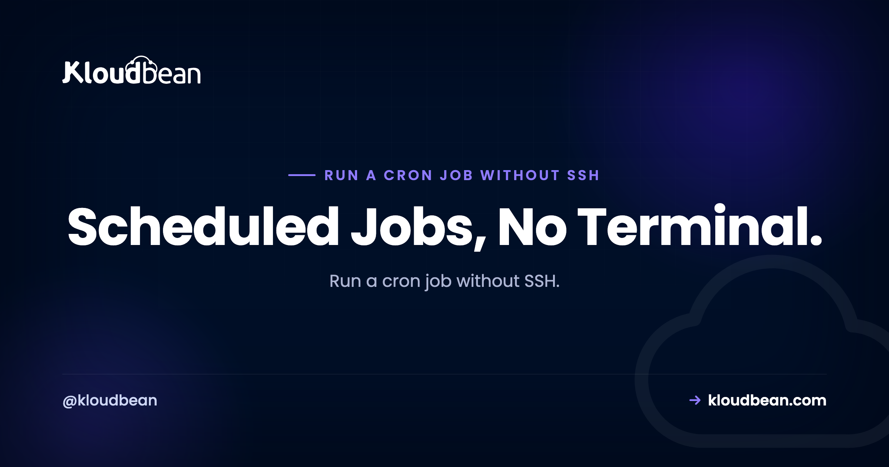
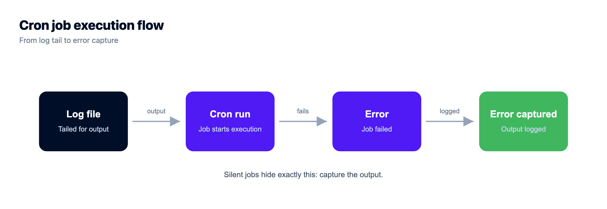
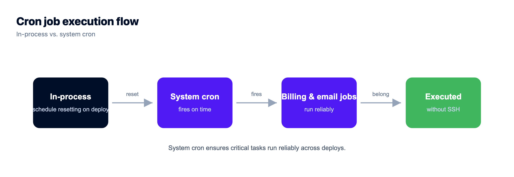
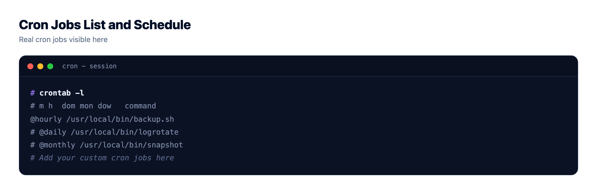

# How to Run a Cron Job Without SSH (and Actually Understand Cron)

*By Kloudbean Platform · Scheduled Jobs, No Terminal.*



You need something to run on a schedule. Send the digest email at 8am. Prune expired rows overnight. Rebuild a report every hour, or ping a health endpoint every few minutes. The old way is to SSH into the box and hand-edit a crontab, which works but is easy to fat-finger and hard to see into, and one stray asterisk runs your job every minute forever.

So this guide does two things. First it teaches cron for real: the five fields, and the gotchas that actually break jobs. Then it shows how to run a cron job without SSH by scheduling it from a dashboard, no terminal and no `crontab -e`.

> **Short answer**
> A cron job is a command your server runs on a fixed schedule, written as five time fields followed by the command. You can run a cron job without SSH by scheduling it from a dashboard instead: pick the cadence, paste the command or a URL, and the platform writes the crontab for you. On Kloudbean that lives under an app's Cron Jobs tab, so there's no terminal and no hand-edited crontab.

## What a cron job actually is

Cron is a small daemon that has run quietly on Unix machines for decades. It wakes every minute, checks a table of scheduled commands called the crontab, and runs anything whose time has come. That's the whole idea. A cron job is one line in that table: a schedule, then a command.

The traditional way to add one is to log in over SSH and open the crontab in an editor:

```bash
# the manual way: SSH in, then edit the crontab by hand
crontab -e

# one job = five schedule fields, then the command to run
*/5 * * * *  /usr/bin/php /var/www/app/cron.php
```

It works. But hand-editing a crontab over SSH has real downsides. You need shell access, there's no undo and no history, and the syntax is unforgiving: one field out of place turns a nightly job into an every-minute job. Worst of all, unless you capture output, a failing job leaves no trace. Plenty of teams find out weeks later, when the emails a job was meant to send never went.

## Reading the five fields: what does `*/5 * * * *` mean?

Cron's schedule is five fields separated by spaces, always in the same order: minute, hour, day of month, month, day of week. A star means "every value" for that field. So `*/5 * * * *` reads as "every 5th minute, every hour, every day, every month, every weekday," which is just *every 5 minutes*. The `*/5` is a step: run when the minute divides evenly by 5.

<!-- DIAGRAM: Anatomy of */5 * * * *. Five field boxes left to right (minute 0-59, hour 0-23, day of month 1-31, month 1-12, day of week 0-6), with the first field */5 highlighted in green and a banner explaining it runs every 5 minutes at :00, :05, :10. Brand colors navy/purple/green. -->

Once the fields click, most schedules read quickly. A handful cover the vast majority of real jobs:

| Expression | When it runs |
| --- | --- |
| `*/5 * * * *` | Every 5 minutes |
| `0 * * * *` | Every hour, on the hour |
| `0 2 * * *` | Every day at 02:00 (server time) |
| `0 9 * * 1` | Every Monday at 09:00 |
| `0 0 1 * *` | Midnight on the first of every month |
| `*/30 9-17 * * 1-5` | Every 30 minutes, 9am to 5pm, weekdays only |

Ranges use a dash (`9-17`), lists use commas (`0,30`), and steps use a slash (`*/30`). That's basically the whole language.

## Why your cron job works by hand but not on a schedule

This is the part that costs people an afternoon. You run the command in your SSH session and it works. Cron runs the same line and nothing happens. The job isn't broken. The environment is, and cron's is deliberately bare.

**PATH and environment.** Your login shell loads a full `PATH`, your version manager, your exported variables. Cron loads almost none of that. So `node` or `php` that resolves fine in your terminal throws `command not found` under cron. Fix it by not relying on the shell: absolute paths, or set `PATH` at the top of the crontab.

```bash
# cron has a tiny PATH. Use absolute binaries, or declare PATH once at the top.
PATH=/usr/local/bin:/usr/bin:/bin

# then commands resolve the same way they do in your shell
*/10 * * * *  /usr/bin/node /var/www/app/scripts/cleanup.js
```

The same trap catches your app's own variables. If your code reads `DATABASE_URL` or an API key from the environment, those aren't present under cron unless you load them. Keep secrets in the environment, not hard-coded, and load them explicitly in the job. That discipline is worth getting right once: [environment variables done right](https://www.kloudbean.com/blog/environment-variables-done-right/).

**Working directory.** Cron starts in the user's home directory, not your project. Relative paths like `./artisan` or `storage/logs` point somewhere unexpected. Always `cd` into the project first, or use absolute paths.

**Timezone.** Cron uses the server's clock, not yours. `0 2 * * *` fires at 2am *server time*, which might be your afternoon. If a job runs at a puzzling hour, check the box with `date` or `timedatectl` before touching the schedule. This one bites teams whose laptop and server sit in different regions.

**Overlapping runs.** Schedule a job every 5 minutes, and one day it takes 7. Now two copies run at once, then three, and the server piles up work it can never catch up on. Guard against it with a lockfile so a run skips if the previous one is still going:

```bash
# flock skips this run if the last one is still holding the lock
*/5 * * * *  /usr/bin/flock -n /tmp/report.lock /usr/bin/php /var/www/app/report.php
```

**No output, no clue.** By default cron mails a job's output to a local mailbox nobody reads, so a failing job is silent. Capture it. Redirect standard output and errors to a log file you can tail:

```bash
# send both stdout and stderr to a log you can read later
*/15 * * * *  /var/www/app/venv/bin/python /var/www/app/manage.py send_reminders >> /var/www/app/cron.log 2>&1
```

Stuck on the classic "works by hand, not on schedule"? Reproduce cron's empty environment directly instead of guessing:

```bash
# run the command with an empty environment, the way cron sees it
env -i /bin/sh -c 'cd /var/www/app && php artisan schedule:run'
```

Nine times out of ten the culprit is one of those four: PATH, working directory, a missing variable, or the timezone. It's almost never the schedule itself.



## Cron for Laravel, Django, Node, and a plain URL

Each framework has a preferred shape for scheduled work. The ones you'll actually hit:

**Laravel** is the one people overthink. You don't add a crontab line per task. You add *one* system cron that runs every minute, and it hands control to Laravel's own scheduler, which decides what's actually due:

```bash
# the ONLY system cron Laravel needs. This is the whole crontab.
* * * * * cd /var/www/app && /usr/bin/php artisan schedule:run >> storage/logs/cron.log 2>&1
```

Then you define the real cadence in code, where it's versioned and testable:

```php
// app/Console/Kernel.php: the real schedule lives here, in Git
$schedule->command('emails:send')->everyFiveMinutes();
$schedule->command('reports:build')->dailyAt('02:00');
$schedule->command('rows:prune')->weekly()->withoutOverlapping();
```

That single-entry pattern is the whole point of the Laravel scheduler: the crontab never changes again, every job lives in your repo, and `php artisan schedule:run` is exactly what the screenshot below runs.

**Django** has no built-in scheduler, so you run a management command from cron, using the project's own Python so it picks up the right virtualenv:

```bash
# a Django management command, on the server's clock
0 3 * * *  cd /var/www/app && /var/www/app/venv/bin/python manage.py clearsessions >> /var/www/app/cron.log 2>&1
```

Rather not shell out at all? Wrap the task behind a small protected route and hit it with a scheduled request. More on that in [deploy a Django app](https://www.kloudbean.com/blog/deploy-django-app/).

**Node** gives you a choice, which the next section digs into. The system-cron version just runs a script:

```bash
# system cron running a one-off Node script
*/10 * * * *  cd /var/www/app && /usr/bin/node scripts/cleanup.js >> cron.log 2>&1
```

**Any app at all** can skip the command and call a URL. This is how a lot of platform schedulers work, and it's the cleanest option for a task you can expose as an endpoint:

```bash
# no framework command: hit a protected endpoint on a schedule
*/15 * * * *  /usr/bin/curl -fsS -H "X-Cron-Key: $CRON_KEY" https://api.example.com/tasks/prune
```

Protect that route with a secret header or token so the wider internet can't trigger your job. Here's the set as a quick lookup, including a WordPress note that trips people up:

| Stack | What to schedule | Command or pattern |
| --- | --- | --- |
| **Laravel** | The scheduler, every minute | `php artisan schedule:run` (real jobs in Kernel.php) |
| **Django** | A management command | `python manage.py <command>`, or curl a route |
| **Rails** | A runner or rake task | `bin/rails runner "Model.cleanup"` |
| **Node / Express** | A script or an endpoint | `node scripts/job.js`, or curl a route |
| **WordPress** | Replace the pseudo-cron | wget `wp-cron.php` and set `DISABLE_WP_CRON` |
| **Anything** | An HTTP task | `curl -fsS https://.../cron/hourly` |

The WordPress row surprises people. WordPress ships a fake cron that only fires when someone visits the site, so a low-traffic site runs its scheduled posts and backups late or not at all. The fix is to disable that pseudo-cron and drive `wp-cron.php` from a real scheduled request every few minutes.

## In-process scheduler or system cron?

There's a second way to schedule work: libraries that run *inside* your app process. `node-cron` in Node, APScheduler in Python, a background worker loop. They're convenient because the schedule lives in your code with no server config. But they carry two sharp edges most people learn the hard way.

```js
// in-process node-cron: dies when the app restarts, doubles if you run two copies
import cron from 'node-cron';
cron.schedule('*/5 * * * *', () => runCleanup());
```

First, the schedule only exists while the app runs. Deploy, crash, or an out-of-memory restart, and any job due during the downtime is simply missed. Second, if you run more than one instance, say a PM2 cluster or two app servers behind a load balancer, every instance fires the job. A nightly "email all customers" task that runs three times is a bad morning.

System cron, or a platform scheduler, runs independently of your app. It fires once, on time, whether the app is up or not. My honest take: if a duplicate or missed run would cost real money, charge a card twice, double-send an email, corrupt a report, don't put it in-process. In-process schedulers are fine for lightweight, idempotent work on a single instance, and nice when you can't touch the server. For anything that must run exactly once, use real cron. If you're weighing how app processes stay alive at all, [deploying an Express app](https://www.kloudbean.com/blog/deploy-express-app/) covers the process-management side.



## How to schedule a cron job without SSH on Kloudbean

Everything above is real cron knowledge you can use anywhere. The friction is the SSH step: shell access, editing a file by hand, no window into whether it ran. A managed dashboard removes that. On Kloudbean, cron jobs have lived in the UI since 2024, scheduled per application with no terminal.

Open your app, go to the Cron Jobs tab, and you get two modes. Basic mode gives you a schedule dropdown (things like "Every 5 minutes") and a field for the command or URL. Expert mode lets you type the five-field expression yourself, exactly the syntax from earlier in this guide. You pick a type too: a PHP script, or a wget or curl request to a URL.


*Cron Jobs in the Kloudbean console. Pick a schedule, paste a command like `php artisan schedule:run` or a URL, choose PHP, wget, or curl, and add it. Existing jobs show the five fields broken out, so you can read the schedule at a glance. No SSH, no crontab file.*

The win isn't only "no SSH." It's visibility. Every scheduled job sits in one list with its schedule and command spelled out, no mystery crontab on a box somewhere. You add and remove jobs without an editor, which kills the fat-finger risk, and the log viewer sits right beside it, so output isn't lost to a mailbox no one reads. The jobs run on the managed server itself, independent of your app process.

The only prerequisite is an app to attach them to: launch a server, deploy, then schedule jobs against it.


*Cron jobs attach to an application, so you add the app first. Deploy it, then schedule tasks against it from the same dashboard.*

If your code ships from Git, connect the repo so deploys are automatic and let the scheduled command run against whatever's live. That half is covered in [CI/CD auto-deploy from GitHub](https://www.kloudbean.com/blog/ci-cd-auto-deploy-from-github/). And because the box underneath is a real, patched, backed-up machine rather than an opaque function, the cron behaves like cron always has, just without the terminal. New to the phrase "managed server"? Here's [what a managed server actually includes](https://www.kloudbean.com/blog/what-is-a-managed-server/).



> **Rule of thumb:** schedule the smallest, most idempotent command you can, capture its output, and pick a cadence that comfortably outlasts the job's own runtime. A task that runs in 20 seconds is safe every 5 minutes. A task that takes 6 minutes is not.

## What is yours and what is not

Cron is wonderfully dumb, and that's a feature. It runs a command at a set time. It doesn't know whether the command succeeded, won't retry a failed run, and can't recover one missed while the server was down. If you need retries, dead-letter handling, or fan-out across a fleet, that's a job queue's job (Celery, Sidekiq, BullMQ), not cron's. Reach for cron when the task is "run this on this cadence," which is most scheduled work. Reach for a queue when you need delivery guarantees.

<!-- cta:start -->
**You built the app. Give it a real home.**

Run the app as an always-on process with managed databases, Redis, object storage, and automatic backups beside it. Deploy from Git with live build logs, and keep the infrastructure someone else's problem.

- Managed databases
- Always-on processes
- Object storage
- Automatic backups
- Free SSL
- Git deploy
- Free migration

[Start free](https://console.kloudbean.com/register) · [See plans](https://www.kloudbean.com/pricing/)
<!-- cta:end -->

## FAQ

**How do I run a cron job without SSH?**
Use a hosting dashboard that exposes cron jobs in its UI: pick a schedule, enter the command or a URL, and the platform writes the crontab entry for you. On Kloudbean it's under an application's Cron Jobs tab, so you never open a terminal or run crontab yourself.

**What does */5 * * * * mean?**
It means run every 5 minutes. The five fields are minute, hour, day of month, month, and day of week, and */5 in the minute field fires the job whenever the minute divides evenly by 5.

**What timezone does a cron job use?**
The server's local timezone, not your laptop's, so a job set for 2am runs at 2am on the server. If it fires at an odd hour, check the server clock with date or timedatectl before you change the schedule.

**Why does my cron job work manually but not on a schedule?**
Almost always because cron runs with a minimal environment, not your login shell's full PATH and exported variables. Use absolute paths, cd into the project first, load the variables your app needs, and check the timezone. It's rarely the schedule that's wrong, it's the environment.

**How do I run the Laravel scheduler with cron?**
Add one system cron that runs every minute and calls php artisan schedule:run. You then define each task's real cadence in the scheduler inside your code, so the crontab never changes and every job stays versioned in Git.

**Should I use an in-process scheduler like node-cron or system cron?**
Use system cron for anything that must run exactly once and reliably, like billing or emails. In-process schedulers such as node-cron or APScheduler stop when the app restarts and fire multiple times if you run multiple instances, so keep them for lightweight, idempotent tasks on a single instance.

**How do I see cron job logs and output?**
By default cron sends output to a local mailbox nobody reads, so redirect the job's output to a log file you can tail. On a dashboard like Kloudbean's, your scheduled jobs are listed in the UI with a log viewer alongside them.

**Can I run a Django management command on a schedule?**
Yes. Point cron at your project's Python interpreter and the manage.py command, and cd into the project first so paths resolve. If you'd rather not shell out, expose the task as a protected endpoint and schedule a wget or curl request to it instead.

---

*By Kloudbean Platform · Scheduled jobs belong in a list you can read, not a crontab you have to SSH into.*
