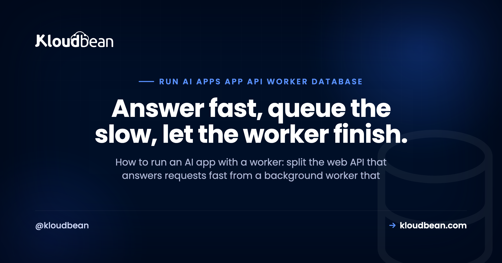

# How to Run an AI App with an API, a Worker, and a Database

You shipped an AI app and it worked fine, right up until it had to do something slow. A long model generation. Indexing a pile of documents for retrieval. A nightly batch export. Send that work through the web request and the request just hangs, then times out. So you split the app: a web API that answers requests fast, and a background worker that does the heavy lifting behind it. Get the API, worker, and database talking through a queue and the whole thing stays responsive under load.

That's the shape almost every AI app grows into. It isn't microservices and it isn't complicated. It's four pieces (an API, a worker, a queue, and a database) plus a few rules about who does what. This page walks how to run an AI app with a worker alongside the API, how they share state without ever calling each other, and how you run two processes out of one codebase.

> **The short version:** An AI app that does slow work splits into two processes. A web API takes the request, validates it, drops a job on a queue, and returns right away. A separate always-on worker pulls jobs off the queue, does the slow part, and writes the result to a shared database. The API and the worker never call each other. They meet at the queue and the database. Same codebase, two start commands.

## Why an AI app grows a worker

A web server has one job during a request: answer it, quickly. The user is waiting, a load balancer is timing the response, and browsers and proxies give up after some number of seconds. That contract is fine for normal work. Read a row, render a page, save a form. It breaks the moment your app has to do something that takes real time.

AI apps are full of that something. A single model generation can run for many seconds. Indexing documents into embeddings can take minutes. A batch job over thousands of rows, a big PDF to parse, an email to push through a flaky provider: none of it fits inside the few seconds a request is allowed to live.

So you stop doing it inline. The API takes the request, writes down what needs to happen, and hands it off. Something else does the slow part. That something else is the worker, and the day you add one, you have a multi-service app whether you call it that or not. AI builders scaffold the happy path and quietly skip this bit, which is a big chunk of [the last mile of vibe coding](https://www.kloudbean.com/blog/last-mile-of-vibe-coding/).

## How the API, worker, and database fit together

Four pieces, and each has exactly one job.

| Piece | What it does | Who it talks to |
| --- | --- | --- |
| The API (web process) | Accepts requests, validates them, creates jobs, returns fast, reads results back for the client | The queue and the database |
| The worker | Runs always-on, pulls jobs off the queue, does the slow work, writes the result | The queue and the database |
| The queue | Holds the jobs the API created until a worker is free to run them (usually Redis-backed) | Written by the API, read by the worker |
| The database | The shared system of record: job status, results, and your app's real data | Read and written by both |

The thing to notice: the API and the worker don't talk to each other. No HTTP call from one to the other, no shared memory. They meet at the queue and the database. The API writes a job, the worker reads it. The worker writes a result, the API reads it back. That indirection is the whole point. It means either side can restart, redeploy, or scale without the other even noticing.

This is one slice of a larger picture. If you want the full map (edge, auth, storage, observability, and where this middle sits), the [AI app reference architecture](https://www.kloudbean.com/blog/ai-app-reference-architecture/) draws the whole thing. This page zooms into the API, worker, and database at the centre of it.

<!-- ADD IMAGE: the dashboard showing a web app and a separate background worker process running side by side. -->

## What one request actually does

Follow a single request through the shape. Say a user asks your app to summarise a long document.

1. The request hits the API. It checks who's asking and that the input is valid.
2. The API creates a job. It writes a job row (status: queued) and pushes the job onto the queue.
3. The API returns immediately, with a job id. The user isn't left hanging. Total time: milliseconds.
4. The worker picks up the job. It's always running, watching the queue. It pulls the next job and marks it running.
5. The worker does the slow thing. The long model call, the indexing, whatever it is. This can take as long as it needs.
6. The worker writes the result to the database and marks the job done.
7. The client gets the result. It either polls the API (any update on job 42?) or receives a pushed notification. The API reads the finished result out of the database and hands it back.

<figure>
<svg viewBox="0 0 800 440" role="img" aria-label="The request path of an AI app split into an API and a worker. A client sends a request to the web API, which writes a job row to the database, pushes a job onto a Redis-backed queue, and returns a job id to the client in milliseconds. A separate always-on worker process pulls the job off the queue, does the slow work, and writes the result to the shared database. Later the client polls the API, which reads the finished result from the database and returns it." xmlns="http://www.w3.org/2000/svg">
  <defs>
    <marker id="ap" markerWidth="9" markerHeight="9" refX="7" refY="4" orient="auto"><path d="M0,0 L8,4 L0,8 Z" fill="#4F1AF3"/></marker>
    <marker id="ag" markerWidth="9" markerHeight="9" refX="7" refY="4" orient="auto"><path d="M0,0 L8,4 L0,8 Z" fill="#40b75f"/></marker>
    <marker id="an" markerWidth="9" markerHeight="9" refX="7" refY="4" orient="auto"><path d="M0,0 L8,4 L0,8 Z" fill="#000f27"/></marker>
  </defs>

  <rect x="24" y="70" width="120" height="92" rx="10" fill="#fff" stroke="#000f27" stroke-width="1.5"/>
  <text x="84" y="112" text-anchor="middle" font-family="Poppins,sans-serif" font-size="13" font-weight="600" fill="#000f27">Client</text>
  <text x="84" y="130" text-anchor="middle" font-family="Poppins,sans-serif" font-size="10.5" fill="#5b6a86">browser or app</text>

  <rect x="246" y="66" width="190" height="100" rx="10" fill="#000f27"/>
  <text x="341" y="100" text-anchor="middle" font-family="Poppins,sans-serif" font-size="13.5" font-weight="600" fill="#fff">Web / API</text>
  <text x="341" y="120" text-anchor="middle" font-family="Poppins,sans-serif" font-size="10.5" fill="#9fb0cc">answers in ms</text>
  <text x="341" y="140" text-anchor="middle" font-family="Poppins,sans-serif" font-size="10.5" fill="#40b75f">validates, enqueues</text>

  <rect x="580" y="66" width="196" height="100" rx="10" fill="#f6f7fb" stroke="#40b75f" stroke-width="1.5"/>
  <text x="678" y="100" text-anchor="middle" font-family="Poppins,sans-serif" font-size="13" font-weight="600" fill="#000f27">Database</text>
  <text x="678" y="120" text-anchor="middle" font-family="Poppins,sans-serif" font-size="10.5" fill="#5b6a86">shared state</text>
  <text x="678" y="140" text-anchor="middle" font-family="Poppins,sans-serif" font-size="10" fill="#5b6a86">job status + results</text>

  <rect x="246" y="306" width="190" height="84" rx="10" fill="#f6f7fb" stroke="#4F1AF3" stroke-width="1.5"/>
  <text x="341" y="340" text-anchor="middle" font-family="Poppins,sans-serif" font-size="12.5" font-weight="600" fill="#000f27">Job queue</text>
  <text x="341" y="360" text-anchor="middle" font-family="Poppins,sans-serif" font-size="10" fill="#5b6a86">Redis (BullMQ)</text>

  <rect x="580" y="304" width="196" height="88" rx="10" fill="#fff" stroke="#000f27" stroke-width="1.5"/>
  <text x="678" y="336" text-anchor="middle" font-family="Poppins,sans-serif" font-size="12.5" font-weight="600" fill="#000f27">Worker process</text>
  <text x="678" y="354" text-anchor="middle" font-family="Poppins,sans-serif" font-size="10" fill="#5b6a86">always on</text>
  <text x="678" y="371" text-anchor="middle" font-family="Poppins,sans-serif" font-size="10" fill="#40b75f">drains the queue</text>

  <line x1="144" y1="104" x2="242" y2="104" stroke="#4F1AF3" stroke-width="2" marker-end="url(#ap)"/>
  <text x="193" y="96" text-anchor="middle" font-family="Poppins,sans-serif" font-size="10" fill="#4F1AF3">1 request</text>
  <line x1="246" y1="136" x2="148" y2="136" stroke="#40b75f" stroke-width="2" marker-end="url(#ag)"/>
  <text x="197" y="151" text-anchor="middle" font-family="Poppins,sans-serif" font-size="10" fill="#40b75f">3 job id, now</text>

  <path d="M112 164 Q 175 205 240 168" fill="none" stroke="#000f27" stroke-width="1.5" stroke-dasharray="5 5" marker-end="url(#an)"/>
  <text x="176" y="212" text-anchor="middle" font-family="Poppins,sans-serif" font-size="10" fill="#5b6a86">6 poll for the result</text>

  <line x1="436" y1="102" x2="576" y2="102" stroke="#4F1AF3" stroke-width="1.8" marker-end="url(#ap)"/>
  <text x="506" y="94" text-anchor="middle" font-family="Poppins,sans-serif" font-size="10" fill="#4F1AF3">writes job row</text>
  <line x1="576" y1="130" x2="436" y2="130" stroke="#40b75f" stroke-width="1.8" marker-end="url(#ag)"/>
  <text x="506" y="145" text-anchor="middle" font-family="Poppins,sans-serif" font-size="10" fill="#40b75f">reads result</text>

  <line x1="300" y1="166" x2="300" y2="302" stroke="#4F1AF3" stroke-width="2" marker-end="url(#ap)"/>
  <text x="312" y="240" text-anchor="start" font-family="Poppins,sans-serif" font-size="10" fill="#4F1AF3">2 enqueue job</text>

  <line x1="436" y1="348" x2="576" y2="348" stroke="#4F1AF3" stroke-width="2" marker-end="url(#ap)"/>
  <text x="506" y="339" text-anchor="middle" font-family="Poppins,sans-serif" font-size="10" fill="#4F1AF3">4 worker pulls job</text>

  <line x1="678" y1="304" x2="678" y2="170" stroke="#40b75f" stroke-width="2" marker-end="url(#ag)"/>
  <text x="690" y="240" text-anchor="start" font-family="Poppins,sans-serif" font-size="10" fill="#40b75f">5 writes result</text>
</svg>
<figcaption>The request never blocks. The API validates, writes a job row, enqueues, and returns a job id in milliseconds. A separate worker drains the queue, does the slow work, and writes the result to the shared database. When the client polls, the API reads that finished result and returns it.</figcaption>
</figure>

The user waited milliseconds for step 3 and got their answer whenever the work actually finished. The request path never blocked. That's the entire win.

## What stays in the request, what moves to the worker

How do you decide what runs inline and what goes to the worker? Rough rule: if it's fast and the user needs the answer to keep going, do it in the request. If it's slow, or the user doesn't need to sit and watch it happen, hand it to the worker.

| Do it in the request | Move it to the worker |
| --- | --- |
| Validate and authorise the input | Run a long model generation |
| Read or write a row the response needs | Index documents into embeddings for retrieval |
| Create the job and return its id | Send email, call third-party APIs |
| Fast, simple CRUD | Batch jobs, exports, report generation |
| Serve a cached result | Anything that can safely retry later |

Here's the anti-pattern that lands people in this article in the first place: doing the slow work inside the HTTP request. It looks fine locally, where you're the only user and the model answers in two seconds. Under real traffic it falls over. The request holds a connection open for 30 or 40 seconds, a proxy or load balancer kills it with a 504, and while it waits it ties up a worker thread that can't serve anyone else. One slow route can drag the whole app down with it. The dedicated fix for that long-task case is in [how to run a long AI task without hitting a timeout](https://www.kloudbean.com/blog/deploy-long-running-ai-task-without-timeout/). That failure mode, and the others in its family, are exactly [why AI apps fail in production](https://www.kloudbean.com/blog/why-ai-apps-fail-in-production/).

## How the API and the worker share state

Since the two processes never call each other, all their coordination runs through two shared things: the queue and the database.

The queue is the to-do list. The API adds items, the worker takes them off. Because it's durable (Redis, with BullMQ doing the work in the Node world), a job doesn't vanish if the worker is briefly down. It waits. When a worker comes back, it keeps draining. Retries, backoff, concurrency, and scheduled jobs all live at this layer. Redis is what makes the queue both durable and fast, which is why you want a real [managed Redis hosting](https://www.kloudbean.com/blog/managed-redis-hosting/) instance backing it rather than an in-memory stand-in that forgets everything on restart.

The database is the source of truth. Job status, the finished result, and your app's normal data all live there, and both processes read and write it. Use one shared database for both so they genuinely see the same state. Two copies drift, and then you're debugging ghosts. Postgres is the usual default, and [managed PostgreSQL hosting](https://www.kloudbean.com/blog/managed-postgresql-hosting/) covers running it as that shared record.

Because they share models and config, keep the API and the worker in one codebase. Same repo, same types, same database client. You just start them as two different processes.

## Two processes, one codebase

This is the part people overthink. You don't need two repos, two services, or a service mesh. You need one codebase and two entry points: one that starts the web server, one that starts the worker.

The API validates the request and enqueues a job:

```js
// api.js  (the web process)
import express from "express";
import { Queue } from "bullmq";

const app = express();
const jobs = new Queue("generate", {
  connection: { host: process.env.REDIS_HOST, port: 6379 },
});

app.post("/summarize", async (req, res) => {
  // fast validation here, then hand off the slow work
  const job = await jobs.add("summarize", { docId: req.body.docId });
  res.status(202).json({ jobId: job.id }); // return right away
});

app.listen(3000);
```

The worker is a separate process that drains the queue:

```js
// worker.js  (a separate always-on process)
import { Worker } from "bullmq";
import { runModel } from "./model.js";
import { db } from "./db.js";

new Worker(
  "generate",
  async (job) => {
    const result = await runModel(job.data.docId); // the slow part
    await db.saveResult(job.data.docId, result);   // write to the shared DB
  },
  { connection: { host: process.env.REDIS_HOST, port: 6379 }, concurrency: 5 }
);
```

And you run both from the same build, as two commands:

```json
{
  "scripts": {
    "start": "node api.js",
    "worker": "node worker.js"
  }
}
```

> **Keep the code minimal here on purpose.** The deep mechanics (defining jobs, retries and backoff, concurrency, rate limiting, scheduled and repeatable jobs) belong in [Node.js background jobs with BullMQ](https://www.kloudbean.com/blog/nodejs-background-jobs-bullmq/). This page is about the shape; that one is about the queue.

My honest opinion: don't reach for microservices here. One repo with a web process and a worker process covers almost every AI app you'll build, and it's far easier to run than a fleet of tiny services with their own deploys, their own configs, and network hops between them. Split into more services when a real boundary forces you to, not because a diagram looked tidy. Two processes will carry you a very long way.

You add scheduled work the same way: a cron entry (or a small third process) that enqueues jobs on a timer, like a nightly cleanup or a daily digest email. Same codebase, same queue, same database.

## Scaling the API and the worker, honestly

Splitting the app buys you something concrete. You scale the two halves on their own. If requests pile up, run more web instances. If the queue backs up because jobs arrive faster than one worker can finish them, run more workers. They're different processes, so you size them separately instead of over-provisioning one big box to cover both.

Be clear-eyed about what "scale" means, though. On a normal plan you do this by provisioning more processes yourself. You start another worker. You add another web instance. That's a deliberate step, not magic. Automatic autoscaling and Kubernetes are enterprise or custom territory, not something a standard app does on its own, so don't design as if the platform will conjure workers for you when the queue grows. Design so adding one is a quick job when you decide to.

The other anti-pattern, the sneaky one: running the "worker" as a `setInterval` or a fire-and-forget promise inside the web process. It feels simpler. It isn't. That timer dies the instant you deploy, because a fresh process replaces the old one mid-job, and if you run two web instances then both timers fire and you do the work twice. A real worker is its own process precisely so it survives deploys and so you control exactly how many are running. A worker also has to stay awake between jobs, which is why serverless doesn't fit it well. [Moving an AI app off serverless](https://www.kloudbean.com/blog/move-ai-app-off-serverless/) walks through why an always-on process is the requirement for this shape.

## Where Kloudbean fits

All of this needs somewhere that a second always-on process is normal, not a fight. That's the awkward part on a lot of hosts. The web app is easy. The always-on worker is the thing they don't really do, or charge oddly for.

Kloudbean runs the whole shape in one dashboard. You launch an always-on server for Node or Python, so the worker has a real home that stays awake between jobs. You add a managed Redis to back the queue and a managed PostgreSQL as the shared system of record, both from the same place. You deploy from Git on every push, get free SSL, and schedule recurring work with cron jobs straight from the dashboard, no SSH needed. The database is locked down by whitelisting your app server's IP, so only your own services reach it and everything else is refused. Plans start at $8/mo.

The honest boundary, because it builds trust: managed means Kloudbean handles the server, the stack, SSL, backups, and patching. Your app code, your jobs, and your data stay yours. Running more workers or web instances means provisioning more processes, which is a step you take; the platform doesn't autoscale a standard app for you (that, and a private VPC, are Enterprise capabilities). What you get is one place to run the API, the worker, the queue, and the database without stitching four vendors together.

<!-- ADD IMAGE: the managed database list showing PostgreSQL and Redis, with the IP allow-list field in view. -->

## Run the slow work where it belongs

**Give your API a worker to hand the heavy lifting to, on an always-on server with managed Redis and PostgreSQL, cron jobs, Git deploy, and free SSL, all in one dashboard.** No cold starts, so the worker is always there to drain the queue. Start free at [kloudbean.com](https://www.kloudbean.com/); see plans on [pricing](https://www.kloudbean.com/pricing/).

Always-on server + worker · Managed Redis (the queue) · Managed PostgreSQL (shared state) · Cron jobs · Git deploy · Free SSL · IP allow-listing

<!-- ADD IMAGE: cron jobs configured from the dashboard, scheduling recurring work with no SSH. -->

## FAQ

**Do I need a separate worker process?**
If your app does anything slow (a long model call, indexing, batch jobs, sending email), yes. Doing that work inside the web request blocks it and risks a timeout under load. If everything your app does is genuinely fast and finishes in well under a second, you can skip the worker until you actually need one.

**How do the API and the worker communicate?**
They don't call each other directly. The API writes a job to a queue and writes rows to a shared database. The worker reads jobs off the queue and writes results back to the same database. That indirection is what lets either side deploy, restart, or scale without breaking the other.

**Can I run a worker and web server in the same app?**
You keep them in one codebase, but run them as two separate processes with two start commands. Running the worker as a timer inside the web process is a common mistake: it dies on the next deploy and duplicates work when you run more than one web instance. Same code, separate processes.

**What backs the job queue?**
Usually Redis. In Node, BullMQ is the common library and it stores its queues in Redis, which keeps jobs durable and fast. You want a real managed Redis for this, not an in-memory stand-in, so jobs survive a worker restart. Python has equivalents like Celery or RQ that also lean on Redis or a message broker.

**What is the difference between a web process and a worker process?**
The web process handles HTTP requests and has to answer quickly. The worker process has no HTTP endpoint at all. It just watches the queue and runs jobs, taking as long as each one needs. Same codebase, different entry point, and you scale them independently.

**How does the client get the result of a background job?**
Two common ways. The client polls the API (asking whether job 42 is done yet) until the status flips to done, then reads the result. Or the server pushes a notification over WebSockets or Server-Sent Events when the job finishes. Either way, the finished result lives in the database and the API hands it back.

**Can I run more than one worker?**
Yes, and that's the point of the split. If the queue backs up, run additional worker processes to drain it faster. If requests pile up, run more web instances. You scale the two independently. On a standard plan you provision those extra processes yourself rather than relying on automatic autoscaling.

**Do the API and worker need to share one codebase?**
It's the easiest way, because they share models, types, and config. One repo, one build, two start commands. You can split them into separate services later if a real boundary demands it, but most AI apps never need to, and the extra moving parts rarely pay for themselves early.

**Do I need Kubernetes to run a background worker?**
No. A worker is just a second long-running process next to your web app. You can run it on a normal always-on server with a couple of start commands. Kubernetes and autoscaling are for larger or enterprise setups. Almost every AI app runs fine with one web process and one worker.

---

*Kloudbean · Answer fast, queue the slow, let the worker finish.*
