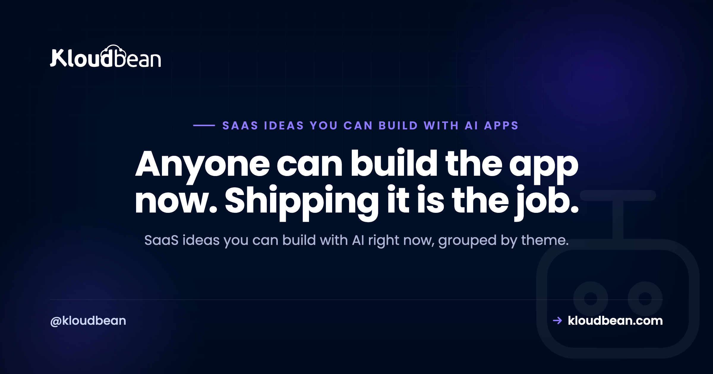

# SaaS Ideas You Can Build With AI (and What They Need to Run)

By Kloudbean Engineering · Anyone can build the app now. Shipping it is the job.

So you've got Cursor, Lovable, Bolt, v0, Replit, or plain ChatGPT open, and you can suddenly build almost anything. The blank part is deciding what. This is a working list of SaaS ideas you can build with AI, grouped by theme, and it's deliberately not another thin listicle. For each one you'll get what it is, who it's for, why it's genuinely buildable today, and the bit most idea posts quietly skip: what it actually takes to run in production once real people start using it.

> **The short version.** The SaaS ideas most worth building with AI are boring, specific, and aimed at a niche that already pays for software. Tools like Cursor and Lovable make the app itself easy. The hard part is production: almost every idea here still needs a database, an always-on backend, and reliable background jobs to become a real product.

## The idea stopped being the hard part

For years the excuse was "I can't code." That excuse is mostly gone. Cursor, Lovable, Bolt, and v0 will scaffold a working app from a paragraph of description, and ChatGPT will happily fill in the gaps. So the constraint moved. It's no longer "can you build it." It's "what should you build," and "can you keep it running when it matters."

That second half is where this guide spends most of its time. Anyone can generate a login page now. Far fewer people stop to ask where the user accounts actually live, what happens to them on the next deploy, or how a reminder email goes out at 8am when nobody has the app open. Those questions are what separate a demo from a product. If you want the wider version of that jump, the [prototype-to-production checklist](https://www.kloudbean.com/blog/from-prototype-to-production-checklist/) walks through it.

One opinion up front: aim narrow. The AI SaaS ideas worth your weekends are usually dull, specific, and pointed at people who already spend money on tools. More on why below. Keep it in mind as you read the list.

## SaaS ideas you can build with AI, by category

Here's the list, grouped by the kind of problem each idea solves. Watch for the pattern as you go: the app is the easy part, and every idea carries a quiet production requirement the prototype will never show you.

Internal tools and niche B2B

Unglamorous and sticky. A business that runs its day on your tool doesn't churn on a whim, and these are some of the most realistic micro-SaaS ideas to start with.

**Scheduling and reminders for a specific trade.** For mobile service businesses: dog groomers, driving instructors, mobile mechanics. Booking flows, calendars, and reminder emails are patterns AI can scaffold in an afternoon. The production wrinkle is that those reminders are background jobs. They have to fire at 8am whether or not anyone is looking at the app, which a static frontend simply can't do on its own.

**A quote and invoice generator for one industry.** For contractors, landscapers, and freelancers in a trade. Form to calculation to PDF is a well-worn shape, and AI writes it quickly. The wrinkle: generated PDFs and uploaded logos need somewhere durable to live, which means object storage, not the server's local disk that gets wiped on the next deploy.

**A lightweight client portal.** For accountants, agencies, and small law practices. Login, document upload, status tracking. The wrinkle: accounts and files need a real database and persistent storage. A prototype that keeps everything in memory loses the lot on the first restart.

Compliance, logs, and operations trackers

Almost every regulated small business keeps records, usually in a spreadsheet somebody hates. Replacing that spreadsheet is a real product.

**A compliance log or checklist tracker.** For restaurants doing fridge-temperature logs, clinics, small manufacturers. Recurring forms, timestamps, and an export button. The wrinkle: the record has to be durable and hard to tamper with. If a log can silently vanish, the tool is worse than the spreadsheet it replaced.

**An inventory or asset tracker.** For equipment-rental shops, repair shops, and small warehouses. Create, read, update, search, plus low-stock alerts. The wrinkle: those alerts are scheduled checks running in the background, again not something a page-only app can do.

Content and ops automation

A lot of valuable software just moves data from A to B on a schedule. AI is very good at the glue in the middle.

**A scheduled report generator.** For marketing teams and agencies who want a weekly ad-spend or SEO digest in their inbox. Pull from an API, format it, email it. The wrinkle: the whole product is a reliable cron job. If it doesn't run on time, there's nothing to sell.

**A document transformer.** For bookkeepers turning receipts into entries, or recruiters turning resumes into structured profiles. Messy input to clean structured output is exactly what LLMs are good at. The wrinkle: a big batch can take minutes, so it needs background processing that won't time out halfway through.

**A knowledge assistant grounded in a company's own docs.** For support and internal ops teams. Retrieval plus an LLM answer is a documented pattern, usually called RAG. The wrinkle: the embeddings need a persistent store, typically Postgres with a vector extension, not a throwaway in-memory index that resets on every deploy.

Developer and operator tools

Developers pay for tools that save them a headache, and they're forgiving early users if you solve a real one.

**A niche uptime or status tool.** For small SaaS operators watching their own services. Ping, record, alert. The wrinkle: it's only useful if it runs 24/7 as an always-on process, which is the exact thing serverless platforms make awkward and expensive.

**A webhook receiver and inspector.** For developers wiring up Stripe, GitHub, or Shopify. Receive, log, replay. The wrinkle: it has to be always-on to catch events the moment they arrive, and it has to persist them so you can replay later.

**A small internal automation hub.** For ops teams stitching a few SaaS tools together. Connectors and schedules are the kind of boilerplate AI handles well. The wrinkle: the scheduler is stateful and has to keep running. If the process falls asleep, the automations quietly stop and nobody notices until something breaks.

<!-- ADD IMAGE: a simple 3x2 grid of tiny app mockups, one per example idea (scheduler, invoice generator, client portal, compliance log, report generator, uptime tool). src -> images/idea-grid.png -->

## The part most idea lists skip: what it takes to run these

Did you catch the repeated word? Every idea above had a "wrinkle," and they rhyme. That's not a coincidence. Strip the branding off any of these and the same short list of production needs shows up underneath.

- **A persistent backend.** Your prototype keeps state in memory and resets when it restarts. A real product needs a process that holds state and talks to a database behind it.
- **A managed database.** Usually Postgres or MySQL. SQLite in a single file is lovely in development and loses your data on the next redeploy in production. If you're weighing your options there, [whether you actually need Supabase](https://www.kloudbean.com/blog/do-i-need-supabase/) is a good companion read, and here's [how to add a managed database to your app](https://www.kloudbean.com/blog/add-managed-database-to-your-app/).
- **Background jobs.** Reminders, reports, alerts, batch processing. These run whether or not a user is on the page. Serverless functions tend to time out; you want cron jobs and long-running workers.
- **Always-on hosting.** Half the ideas here only work if a process is up around the clock. Cold starts and hard timeouts fight that constantly.
- **Object storage.** PDFs, uploads, and exports need durable file storage, not the app server's local disk, which is temporary.

Map the categories back to those needs and the shape is clear.

| Idea category | Example | The part that must run in production |
| --- | --- | --- |
| Niche B2B tools | Trade scheduling, client portal | A database for accounts and records, plus an always-on server |
| Compliance and ops logs | Fridge-temp logs, asset tracker | Durable storage and scheduled reminder jobs |
| Scheduled automation | Weekly report generator | A reliable background job, not a page nobody visits |
| Document and RAG tools | Receipts to entries, docs Q and A | Long-running jobs and a persistent (often vector) database |
| Monitoring and dev tools | Uptime checker, webhook inspector | A process that stays up around the clock to catch events |

<!-- ADD IMAGE: the frontend-vs-backend split as a diagram if you want a polished version. src -> images/production-spine.png -->

*AI ships the demo in an afternoon. The right-hand column is what keeps it alive once people rely on it.*

## Boring and specific beats another AI chat app

Time for the opinion I flagged earlier. If your instinct is to build a general AI chatbot, an AI image tool, or an "AI for everything" assistant, pause. That lane is crowded, users expect it to be free, and you're competing with companies that have raised more money than you'll see in a lifetime. A dull tool for a niche that already buys software has thinner competition and a buyer who's used to paying.

Pick a niche you actually understand, or one you can talk to a dozen real people in. Domain knowledge is the one input AI can't generate for you, and it's usually the difference between a tool people switch to and a tool that gets a polite "neat" and no signup.

|  | A crowded consumer app | A boring, specific niche tool |
| --- | --- | --- |
| Example | Another AI chatbot or image app | Inspection logs for HVAC contractors |
| Competition | Heavy, well funded | Often just a spreadsheet |
| Willingness to pay | Low, people expect free | Higher, it's a business expense |
| Your edge | Hard to stand out | You know the workflow |
| The moat | Thin without something unique | Domain knowledge and workflow fit |

<!-- ADD IMAGE: a two-column contrast graphic, crowded consumer lane vs quiet niche lane. src -> images/niche-vs-crowded.png -->

## The thin wrapper trap to avoid

Here's the one anti-pattern to watch for. If your entire product is a text box that forwards a prompt to an AI API anyone can call, you don't have a moat. You have a feature. The model vendor can ship the same thing as a checkbox next week, and your users can paste the same prompt into ChatGPT themselves for free. That's the thin wrapper, and the internet is full of them.

Wrappers aren't automatically doomed. But a wrapper only becomes a product when there's something real around the prompt: a proprietary dataset, a genuine workflow, a niche integration, saved history and state, or a UI that removes a specific chore. Own the workflow, not the prompt. If the only thing you're selling is access to a model, you're reselling someone else's product on a thin margin.

## How to choose one and actually build it

You don't need a grand strategy. You need a short, honest loop.

- **Pick a niche you can reach.** Somewhere you have contacts, experience, or an easy way to talk to real users.
- **Find the process they hate.** Usually a spreadsheet, a group chat, or a manual copy-paste ritual. That's your wedge.
- **Build the smallest thing that kills that one pain.** Not a platform. One workflow, done well.
- **Charge early.** A price tag tells you fast whether it's a business expense worth paying for. It also filters for serious users.
- **Plan for production from the start.** Decide where the database and the always-on backend will live before you have users, not during your first outage.

An honest word on expectations: none of these ideas is a business just because you built it. Building the app and selling the product are different sports, and shipping code doesn't promise a single customer. Treat each one as a buildable starting point you'll test, not a payday. If you want the money side grounded, [what a side project actually costs to run](https://www.kloudbean.com/blog/cost-of-running-a-side-project/) is a sober look at the numbers, and when you're ready to ship, here's [how to deploy an AI-built app to production](https://www.kloudbean.com/blog/deploy-ai-built-app-to-production/).

<!-- ADD IMAGE: a simple 5-step flow of the loop above (niche, pain, MVP, price, production). src -> images/build-loop.png -->

## The common thread: all of these need a real backend

Read back through the list and you'll notice every idea leans on the same spine once it stops being a demo: a database, a backend process that stays up, background jobs for the scheduled work, and somewhere durable to keep files. That's the unglamorous infrastructure the idea posts skip, and it's the exact thing that turns a prototype into something people can rely on.

It's also the part a managed platform is meant to take off your plate. That's where Kloudbean fits: managed databases like Postgres and MySQL, apps that run as persistent, always-on processes so there are no cold starts, cron jobs and long-running workers for the scheduled stuff, and built-in object storage for files, all from one dashboard with predictable flat pricing that starts at $8 a month. If you're still comparing options, here's a look at [where to host an AI SaaS](https://www.kloudbean.com/blog/best-hosting-for-ai-saas/). Whatever you pick, plan the backend before the launch, not after it.

---

**Build the idea. Then give it somewhere real to run.**

When your weekend project needs a database, an always-on backend, background jobs, and file storage, that's what Kloudbean handles from one dashboard. See [kloudbean.com](https://www.kloudbean.com/) and [pricing](https://www.kloudbean.com/pricing/). Managed databases · Always-on app processes · Background jobs · Object storage · Automatic backups · Simple Git deploy.

## FAQ

**What SaaS can I build with AI as a beginner?**

Start with a small internal tool for a niche you understand: a scheduler for a trade, a quote generator, a simple client portal, or a checklist tracker for a regulated business. These have clear workflows AI can scaffold quickly, real buyers, and thin competition. Avoid broad consumer apps as a first project, since they're crowded and hard to stand out in.

**What are good micro-SaaS ideas to build with AI?**

Boring, specific tools work best: inventory trackers, compliance logs, weekly report generators, webhook inspectors, and uptime monitors for a particular niche. Micro-SaaS wins by solving one painful workflow for one type of user, not by being everything to everyone. Pick something where you can reach the first ten customers yourself.

**Can I really build a SaaS with Cursor, Lovable, or Bolt?**

Yes, for the app itself. These tools scaffold pages, forms, auth, and basic logic fast, which gets you a working prototype in hours. The gap is production: user accounts, a real database, background jobs, and always-on hosting are things you still have to set up deliberately. The build is quick; making it reliable is the actual work.

**Do AI-built SaaS apps need a backend and database?**

Almost always. Anything that stores user accounts, saves data between sessions, or sends scheduled emails needs a persistent backend and a database. A frontend-only prototype loses its state on restart and can't run background work. That's why nearly every idea in this guide points back to the same short list of production needs.

**Is a ChatGPT wrapper a good SaaS idea?**

Only if there's something real around the prompt. A bare text box that forwards to an AI API has no moat, because the model vendor can copy it and users can do it themselves for free. A wrapper becomes a product when it adds a proprietary dataset, a genuine workflow, a niche integration, or saved state. Own the workflow, not the prompt.

**What niche should I pick for an AI SaaS?**

One you understand or can easily talk to real people in. Domain knowledge is the input AI can't generate, and it's usually what makes a tool actually fit a workflow. Look for a niche that already pays for software and runs some painful process on a spreadsheet. That combination gives you a clear buyer and a thin competitor.

**How much does it cost to run a SaaS built with AI?**

Less than most people fear at the start. A small app, a managed database, and file storage on a predictable plan cost far less than an enterprise setup, and flat pricing keeps surprises down. The bigger early cost is usually your time. There's a fuller breakdown in the linked guide on what a side project costs to run.

**What do I need to take an AI-built app from prototype to production?**

A persistent always-on backend, a managed database, background jobs for scheduled work, object storage for files, and automatic backups. Move secrets out of the code, point a custom domain with SSL at it, and deploy from Git. That short list is what turns a demo into something people can depend on, whatever the idea behind it.

---

*Kloudbean Engineering · Pick a niche you understand, build the smallest useful version, and plan for production from day one.*
