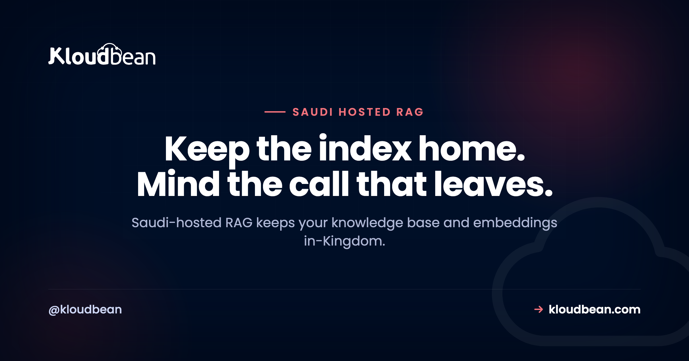

# Saudi-Hosted RAG: Keep Your Documents and Embeddings Inside the Kingdom

You built a RAG system. A chatbot over your own policies, a search box across a pile of internal PDFs, an assistant that answers from your company's own documents. Now it has to serve people in Saudi Arabia, or a regulated Saudi organisation, and the question shifts from "does it work" to "where does the data actually go." A Saudi-hosted RAG keeps your knowledge base and your embeddings inside the Kingdom, and most of a RAG pipeline already wants to live there anyway.

Retrieval augmented generation looks like it leaks everywhere, because it touches your documents, a database, an embeddings model, and a language model. It doesn't. Walk the pipeline one stop at a time and you find a workload that's almost entirely in-Kingdom, with a single optional crossing at the very end. The catch is a second crossing, hiding at the start, that almost nobody looks at. This page maps both.

> **The short version:** A Saudi-hosted RAG keeps the source documents, the chunks, the embeddings, and the retrieval step inside the Kingdom, on Google Cloud's Dammam region (me-central2). The only stop that has to cross the border is the final generation call to a hosted model, and you can shrink what rides on it. Watch the embedding step too. A hosted embeddings API ships your documents out at indexing time, so keep that in-Kingdom or the leak happens before a user ever asks a question.

## The Saudi-hosted RAG map: where each stop can live

Think of a RAG system as a short assembly line with two shifts. An offline shift turns your documents into searchable vectors: it loads a file, splits it into chunks, embeds each chunk, and stores the result. An online shift answers a question in real time: it embeds the question, finds the closest chunks, and hands them to a model to write the reply. The general mechanics of both shifts, chunking, retrieval quality, index freshness, all of it, live in [RAG in production](https://www.kloudbean.com/blog/rag-in-production/), so I won't rebuild them here. The residency question is narrower. For a Saudi-hosted RAG, which of those stops can sit inside the Kingdom?

Almost all of them. Your documents are just files, so they live in in-Kingdom object storage. The chunks and their embeddings are just rows, so they live in an in-Kingdom database. The similarity search that finds the right chunks is a database query, so it runs in-Kingdom too. Retrieval never has to leave. The one stop that reaches outside is the final generation call, when you send the user's question plus the chunks you retrieved to a hosted model that runs wherever the provider runs. Everything before that arrow is yours to keep home. This is the RAG-shaped slice of a bigger picture, by the way. The overall in-Kingdom data-flow boundary for any AI app lives in [hosting AI apps in Saudi Arabia](https://www.kloudbean.com/blog/hosting-ai-apps-saudi-arabia/); this page zooms in on the retrieval case.

<!-- ADD IMAGE: the RAG pipeline drawn inside a dashed Dammam box, documents to chunker to embeddings to pgvector store to retriever, with one arrow crossing out to the model through a minimize gate. -->

Laid out as a checklist, the map looks like this.

| RAG pipeline stage | Can it run in-Kingdom? | What leaves if you get it wrong |
| --- | --- | --- |
| Source documents (your knowledge base) | Yes, in in-Kingdom object storage | The raw files, if you park them with a service abroad |
| Chunking | Yes, in your app in Dammam | Nothing. It's local text processing |
| Embedding the chunks (indexing) | Yes, with an in-Kingdom embeddings model | Every document's text, if you call a hosted embeddings API |
| Chunks and vectors (the store) | Yes, pgvector in in-Kingdom Postgres | The stored text and vectors, if the database sits abroad |
| Retrieval (the similarity search) | Yes, a query inside your in-Kingdom database | Nothing. It never leaves the database |
| Embedding the question | Yes, same in-Kingdom model | The user's question, if the embed call is hosted abroad |
| Generation (writing the answer) | Only if you self-host the model | The question plus the retrieved context, on every hosted call |

Read down the "what leaves" column and a pattern jumps out. The embedding row shows up twice, once for documents and once for the question, and both point at the same culprit: a hosted embeddings API. That's the crossing people miss.

## The two border crossings most people miss

Everyone guards the generation call. It's the obvious one. You send a prompt to OpenAI or Anthropic or Google, the prompt travels to their servers, done. But a RAG system has two places where data can leave, and the first one runs long before any user shows up.

**Crossing one: the embedding step, at indexing time.** To store a document as vectors, you first run its text through an embeddings model. If that model is a hosted API, then indexing your knowledge base means sending every document, in full, to that provider to be embedded. So a RAG system with a database locked inside Dammam, but wired to a hosted embeddings API, has already shipped the entire knowledge base across the border to build the index. No user asked a question. The leak happened during setup, quietly, and it happens again every time you re-index a changed document. This is the non-obvious one, and it's the whole reason this article exists.

**Crossing two: the generation step, at query time.** This is the familiar one. Your app retrieves the relevant chunks and sends them, along with the user's question, to a hosted model to compose the answer. Whatever's in those chunks crosses the border on that call. For what the provider does with that payload and how to audit it, see [where your data goes when you call OpenAI, Claude, or Gemini](https://www.kloudbean.com/blog/openai-claude-gemini-saudi-data/).

There's a subtle third edge that folds into crossing one. At query time you also embed the user's question, using the same embeddings model, so it can be compared against your vectors. If that model is hosted abroad, the question itself leaves before generation even starts. Guard only the generation call and you've still leaked the documents at indexing and the question at retrieval. To actually keep a Saudi-hosted RAG in-Kingdom, the embeddings model has to be in-Kingdom too, either an open model you run on suitable compute, or you accept and document that indexing sends text out. Check the current terms of any hosted embeddings provider before you assume where that text goes or how long it's kept.

<!-- ADD IMAGE: a before and after of indexing, one path sending documents to a hosted embeddings API abroad, the other keeping the embeddings model in-Kingdom. -->

## Put the vector store in-Kingdom, and you probably don't need a new database

Here's the good news about the biggest stop on the map. You almost certainly don't need to go buy a dedicated vector database to keep your vectors in the Kingdom. If your app already uses Postgres, the `pgvector` extension stores embeddings in a column right next to your normal rows, so your chunks and their vectors live in one in-Kingdom database instead of two. One system to keep resident, one to back up, one to lock down.

The shape is small. An embeddings table and a similarity query:

```sql
-- chunks and their vectors, in the same in-Kingdom Postgres
create table doc_chunks (
  id           bigserial primary key,
  document_id  bigint not null,
  content      text   not null,
  embedding    vector(1536)      -- match your embedding model's dimensions
);

-- retrieval: the 5 nearest chunks to the question's embedding
select id, content
from   doc_chunks
order  by embedding <=> $1        -- $1 is the query vector
limit  5;
```

That `ORDER BY embedding <=> $1` is the whole retrieval step, and it runs entirely inside your database in Dammam. Nothing about it crosses a border. The deep mechanics, indexes like HNSW and IVFFlat, distance operators, tuning for scale, all live in [pgvector for AI apps](https://www.kloudbean.com/blog/pgvector-for-ai-apps/), so I'll point you there rather than repeat them. What matters for residency is simpler: the store is a database, and a database can sit in the Kingdom. Postgres is one of the [seven managed engines you can run in-Kingdom](https://www.kloudbean.com/blog/managed-databases-saudi-data-sovereignty/), and the setup is ordinary [managed PostgreSQL hosting](https://www.kloudbean.com/blog/managed-postgresql-hosting/) with the region set to Dammam. One honest caveat: whether the `pgvector` extension can be enabled depends on your Postgres version and setup, so check availability for your instance rather than assuming it's on.

<!-- ADD IMAGE: the Kloudbean console launching a managed PostgreSQL into the Dammam region, the database that will hold the pgvector embeddings. Swap for a real screenshot: src -> images/launch-db-dammam.png -->

## Retrieved context is a bigger, more sensitive payload than a plain chat

RAG changes the shape of what crosses the border, and not in your favour. A plain chatbot sends a short message. A RAG system stuffs the prompt with documents, so the payload heading to a hosted model is larger and often carries more sensitive material. And the part that surprises people: what crosses isn't only the user's typed question. It's chunks pulled straight from your own documents, which may contain other people's names, account numbers, or case details that the user never typed and may not even be allowed to see in full.

So if generation runs on a hosted model, treat the retrieved context as the thing to control, not just the question. A few habits help, and they cost almost nothing:

- **Send fewer chunks.** Cap your top-k. If five chunks answer the question, don't send twenty. Less context out, lower bill, often a sharper answer.
- **Trim each chunk.** Retrieve enough to be useful, then pass the model only the passages it needs, not whole pages of surrounding text.
- **Redact before you send.** Strip identifiers the task doesn't need, names, national IDs, phone numbers, out of the retrieved context before it goes to the model. Pass a reference where you can, not the raw record.

None of this is exotic. It's the difference between shipping a whole filing cabinet abroad on every question and shipping the one sentence that answers it.

## Two honest ways to build a Saudi-hosted RAG

There are two clean designs, and neither is wrong. They cost different things.

**Option A: keep storage, embeddings, and retrieval in-Kingdom, and call a hosted model for generation with minimized context.** The documents, the vector store, the embeddings model, and the similarity search all run in Dammam. Only the final answer step reaches out, carrying the trimmed, redacted context you chose to send. This is the practical middle ground for most teams.

**Option B: go fully in-Kingdom by self-hosting both models.** Run an open embeddings model and an open generation model on compute inside the Kingdom, so nothing ever leaves. Be honest with yourself about this one. It's a real operations project, not a toggle: you need suitable GPU-class compute, and you own the model updates, the scaling, and the memory. The strongest open models tend to sit a step behind the top frontier ones, so you may trade some answer quality for full residency. It's the right call when the documents genuinely cannot leave the Kingdom, and an expensive detour when they can.

| Factor | Option A: hosted generation, in-Kingdom index | Option B: self-host both models |
| --- | --- | --- |
| Documents and embeddings | In-Kingdom | In-Kingdom |
| Retrieval | In-Kingdom | In-Kingdom |
| What crosses the border | The question plus trimmed context, per query | Nothing |
| Ops effort | Low. It's an API call | High. Compute, drivers, scaling, updates |
| Model quality | Access to the strongest frontier models | Strong open models, usually a step behind |
| Best when | Context can be minimized and a transfer is acceptable | The documents truly cannot leave |

My firm opinion, since fence-sitting helps nobody: for most Saudi RAG projects, put the index and retrieval in-Kingdom and minimize what you send to generation. That's the cheap, high-value move, a region choice and a managed database. Self-hosting both models is the expensive move, and it's worth it only when the documents genuinely can't cross. Reach for it because the data demands it, not because it sounds more sovereign.

## The anti-pattern: an in-Kingdom index built by a foreign embedding call

Watch for this one, because it looks like diligence. A team provisions Postgres in Dammam, puts the source documents in in-Kingdom object storage, writes "in-Kingdom" on the architecture diagram, and then wires indexing to a hosted embeddings API because it was the fastest way to get vectors. The store is resident. The vectors are resident. But every document was sent abroad to be embedded in the first place, and it happens again on every re-index.

It's residency you can point at, wrapped around a data flow nobody checked. The vector store being in the Kingdom is doing no residency work at all if the text had to leave to fill it. The fix isn't to tear down the in-Kingdom database, which is correct and worth keeping. The fix is to move the embeddings model in-Kingdom, or to decide, on purpose and in writing, that indexing sends text out and that's acceptable for your data. What you can't do is set the region, wire a foreign embed call, and call the whole thing sovereign.

<!-- ADD IMAGE: a short checklist contrasting region-set-but-foreign-embed against a genuinely in-Kingdom index. -->

## RAG, PDPL, and what actually crosses

Quick and important: this is orientation, not legal advice. Get a qualified advisor for anything high-stakes, and see [data residency in Saudi Arabia](https://www.kloudbean.com/blog/data-residency-saudi-arabia/) for the general version.

With that said, one point clears up a lot of confusion. Saudi Arabia's Personal Data Protection Law regulates the cross-border transfer of personal data. It doesn't flatly ban it. So a RAG system that sends context to a model abroad isn't automatically against the rules. It's a transfer, and transfers carry conditions and responsibilities that you, as the party handling the data, own. The RAG-specific wrinkle is worth saying plainly: the thing crossing the border is retrieved context from your own documents, which is frequently more personal than the question the user typed. A transfer assessment for RAG has to look at what retrieval pulls, not just what the user asks. Keeping the personal data in-Kingdom, documents, embeddings, and retrieval, is a practical, lower-risk path a lot of teams choose, precisely because it shrinks that assessment down to one small, minimized payload.

## Where Kloudbean fits

Everything above is engineering you own. The reason it usually hurts is logistics: the documents live on one service, the vectors on another, each with its own console and its own way to lock down access, and getting all of them into the same country is a chore. Kloudbean's angle is putting the resident half of a RAG stack in one dashboard, in the Kingdom.

The pieces map cleanly. You launch an always-on server (Node or Python, no cold starts) on Google Cloud's Dammam region, me-central2, which sits physically inside Saudi Arabia. Beside it runs a managed Postgres that holds your chunks and their embeddings through the `pgvector` extension where your plan and version enable it. Your source documents go in S3-compatible object storage, with no egress fees on the data you pull back out for indexing. Automatic backups, free SSL, and Git deploy come with it, and you lock the database down by whitelisting your app server's IP so only your app can reach it. The region specifics are in [the GCP Dammam region guide](https://www.kloudbean.com/blog/gcp-dammam-region-guide/). That's the in-Kingdom home for the documents, the embeddings, and the retrieval, which is most of a RAG system.

The generation model is your choice, and here's the honest boundary. If you go with Option B and self-host an open model, you run it on a Kloudbean GPU server. DeepSeek installs one-click, and support sets up any other or custom model on request. On Enterprise it can sit inside a private VPC in Dammam, beside the data. You choose the model and own your prompts; Kloudbean installs and runs the box. What Kloudbean gives you is the resident foundation: the store, the files, the retrieval, all in Dammam. Among managed-cloud platforms, very few pair fully managed databases with true in-Kingdom data sovereignty, and Kloudbean is one of them. On compliance the honest word is "aligned": the platform is built to support PDPL and NCA expectations, it doesn't hand you a certificate, and it can't make your organisation compliant on its own. Compliance is shared. Managed means the server, the stack, SSL, backups, and patching are handled; your code, your documents, and your retrieval logic stay yours. Full network isolation in a private VPC is an Enterprise capability; on a standard plan, the IP allow-list is how you keep the database off the open internet. For the wider map of what changes when an AI app meets real users, see [the last mile of vibe coding](https://www.kloudbean.com/blog/last-mile-of-vibe-coding/).

<!-- ADD IMAGE: the Kloudbean console showing object storage for source documents and a managed Postgres, both set to the Dammam region, in one account. Swap for a real screenshot: src -> images/dammam-stack.png -->

## Keep your knowledge base and embeddings in the Kingdom

**Run the resident half of your RAG stack in Dammam: source documents in object storage, chunks and embeddings in a managed Postgres with pgvector, and retrieval that never leaves the country, all from one dashboard.** The one call to a model is yours to shrink or close. Start at [kloudbean.com](https://www.kloudbean.com/); see plans on [pricing](https://www.kloudbean.com/pricing/).

In-Kingdom GCP Dammam region · Managed Postgres with pgvector · Object storage with no egress fees · Automatic backups · Free SSL · Git deploy · IP allow-listing

## FAQ

**What is a Saudi-hosted RAG?**
It's a retrieval augmented generation system whose resident parts, the source documents, the chunks, the embeddings, and the retrieval step, all run inside Saudi Arabia, typically on Google Cloud's Dammam region. The only part that may cross the border is the final call to a hosted model for generation. The goal is to keep your knowledge base and its vectors on Saudi soil while still using a capable model to write answers.

**Can I keep my RAG embeddings in Saudi Arabia?**
Yes. Embeddings are just vectors in a database, so they live wherever your database lives. Put them in a managed Postgres in the Dammam region through the pgvector extension, and they stay in-Kingdom alongside your normal data. The one thing to watch is how the vectors get created: the embeddings model that produces them also needs to be in-Kingdom, or the text leaves during indexing even though the stored vectors stay home.

**Does the embedding step send my documents out of the country?**
It does if you use a hosted embeddings API. To turn a document into vectors, its text is run through an embeddings model, and if that model is a hosted service abroad, indexing sends the full document across the border. This happens at setup and again on every re-index, before any user asks a question. To avoid it, run an open embeddings model in-Kingdom, or accept and document that indexing sends text out.

**Do I need a separate vector database for a Saudi-hosted RAG?**
Usually not. If you already run Postgres, the pgvector extension stores embeddings in the same database as your normal rows, so you keep one in-Kingdom system instead of two. A dedicated vector database is a second store to run, secure, and keep resident, and most apps under a few million vectors don't need one. Start with pgvector in an in-Kingdom Postgres and move only if you genuinely outgrow it.

**Where does a RAG pipeline actually cross the border?**
At the model calls, not the storage. Documents, chunks, embeddings, and the similarity search can all stay in-Kingdom. The crossings are the embedding step, if the embeddings model is a hosted API, and the generation step, when you send the question plus retrieved context to a hosted model. Storage and retrieval never leave on their own. If you guard only generation, you can still leak documents at indexing time.

**Can I self-host the embeddings model in-Kingdom?**
Yes, and it's the way to close the indexing crossing. You run an open embeddings model on compute inside the Kingdom, so document text is turned into vectors without leaving. It's more work than calling an API, since you own the compute and the updates, but the embeddings model is lighter to run than a full generation model. It's a common middle step: self-host embeddings for indexing, and decide separately what to do about generation.

**Is a Saudi-hosted RAG required by PDPL?**
Not as a blanket rule. Saudi Arabia's PDPL regulates cross-border transfer of personal data; it does not outright ban it. Keeping your documents, embeddings, and retrieval in-Kingdom is a practical, lower-risk option many teams choose, not a legal mandate for every case. This is general orientation and not legal advice, so confirm your specifics with a qualified advisor who can look at your data and sector.

**Does hosting my RAG in Dammam make it PDPL compliant?**
No. Running the store and retrieval in-Kingdom solves the residency and infrastructure part, which is genuinely hard to retrofit, but compliance is broader and shared. You still own consent, lawful basis, retention, data-subject rights, and how your app handles the retrieved context. A host can support and align with PDPL and NCA expectations; it cannot certify you or make your organisation compliant on its own.

**Can I run the vector store with pgvector in Saudi Arabia?**
Yes. pgvector is a standard PostgreSQL extension, so the real question is where your Postgres runs. On a managed PostgreSQL in the Dammam region, your embeddings sit beside your application data on Saudi soil, backed up in-Kingdom and locked down with IP allow-listing. Whether the extension can be enabled depends on your Postgres version and setup, so check availability for your instance rather than assuming it's on.

**Does Kloudbean provide the language model for a Saudi-hosted RAG?**
No. Kloudbean gives you the in-Kingdom home for the documents, the embeddings, and the retrieval: object storage, a managed Postgres with pgvector, and always-on compute in the Dammam region. The generation model is your choice: a hosted API with minimized context, or an open model you self-host on a Kloudbean GPU server, DeepSeek one-click or any other model installed by support on request. Kloudbean runs the compute and installs the model; you choose which one. The resident half of the stack is what Kloudbean runs for you.

---

*Kloudbean · Keep the index home. Mind the call that leaves.*
