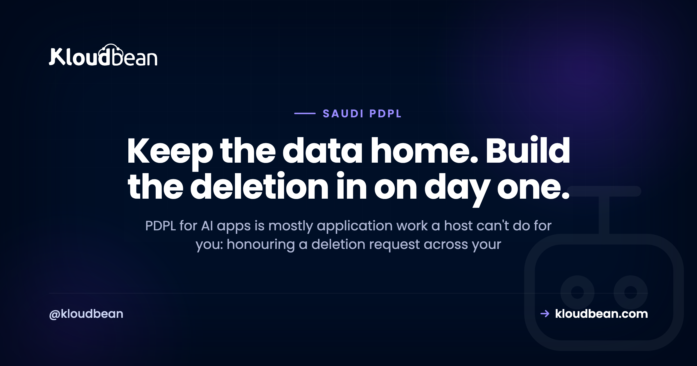

# PDPL for AI Apps: The App-Level Obligations a Host Can't Handle for You

You built an AI app. It answers questions, remembers conversations, maybe searches your own documents. It also handles personal data about people in Saudi Arabia, which means PDPL applies to it. Most guides to PDPL for AI apps stop at "host it in the Kingdom" and wave at the rest. But the rest is where the real work lives, and almost all of it sits in your code. This page is about that half: the app-level obligations a host genuinely can't handle for you, written as engineering rather than law. It's general orientation, not legal advice.

If you're still bridging "works on localhost" to "runs in production", [the last mile of vibe coding](https://www.kloudbean.com/blog/last-mile-of-vibe-coding/) maps the whole gap. This page zooms into the PDPL-shaped part of it, and specifically the parts that get harder because your app is an AI app.

> **The short version:** Most of PDPL for AI apps is application work, not hosting. A host can keep your data in-Kingdom and lock it down. It can't honour a deletion request that has to reach your primary database, your chat logs, your vector store, your cache, and your backups. So design for that on day one: tag every record and every embedding with a user id, set retention windows, and record consent and lawful basis as data you can produce later. This is orientation, not legal advice. For anything high-stakes, talk to a qualified Saudi data-protection advisor.

## PDPL for AI apps, in one paragraph (then we build)

PDPL is Saudi Arabia's Personal Data Protection Law, overseen by SDAIA. If it helps, treat it as the Kingdom's cousin to GDPR: you need a lawful reason to process personal data, you collect the minimum, you keep it only as long as you need it, and the people that data describes have rights over it. The full primer, plus the honest line on what a host can and can't do, lives in [PDPL compliance hosting](https://www.kloudbean.com/blog/pdpl-compliance-hosting/), and the residency question has its own guide in [data residency in Saudi Arabia](https://www.kloudbean.com/blog/data-residency-saudi-arabia/). I won't re-explain all of that here.

One structural fact is what matters for us. Most of what PDPL asks for is about behaviour, not servers, and behaviour is code. A host can settle where the data sits and lock it down. Whether you had a basis to collect something, how long you keep it, and whether you can actually delete a person when they ask: that's your application. So say it plainly, because vendors blur it. Hosting in Dammam does not make an AI app PDPL compliant. It settles residency and hands you infrastructure controls. Everything else is on your desk.

And once more, up front: this is orientation from an engineering angle, not legal advice. For a real compliance program or a government tender, get a qualified Saudi data-protection advisor and check SDAIA's current guidance. I'll flag the legal calls as we hit them.

## Where an AI app hides personal data a normal CRUD app doesn't

A plain CRUD app keeps personal data in tidy places: a users table, maybe an orders table. You know where everyone is. An AI app scatters it. The same personal detail can end up in five systems, and four of them didn't exist in your last project. Before you can honour a single PDPL obligation, you have to know where personal data actually lands.

- **Prompts and model outputs.** What a user types can be anything: a full name, a national ID, a pasted email thread. And the model's reply can contain personal data too, especially if you fed it a record. Both are personal data the moment they describe a real person.
- **Conversation and chat logs.** Every message, stored so the bot has a memory. That's a growing archive of personal data, and often the largest one you hold.
- **Embeddings in a vector store.** This is the sneaky one. When you index a document for retrieval, you chunk it and store vectors. If the document mentioned a person, that person is now encoded across a pile of embeddings. It looks like a list of floats, not personal data, but it was derived from personal data and can surface it again.
- **Training or fine-tuning datasets.** Fine-tune on real user data and their personal data is now baked into a dataset, arguably into the weights. That's very hard to unpick later, which is a good reason to think twice before you do it.
- **Observability and logs.** Traces, error logs, request bodies captured "for debugging". These quietly accumulate prompts and replies, so your logging stack becomes yet another copy of everything. The discipline for keeping that clean is in [AI app observability](https://www.kloudbean.com/blog/ai-app-observability/).

<!-- ADD IMAGE: the five places personal data lands in an AI app (primary DB, chat logs, vector store, fine-tune set, logs), each labelled as in scope for a deletion request. -->

Notice the pattern. Personal data in an AI app is derived, copied, and scattered by default. Every one of those copies is in scope when someone asks to be deleted. Which is exactly the problem the next section is about.

## The hard part: honouring data-subject rights over AI-held data

PDPL, like every modern privacy law, gives people rights over their own data. They can ask what you hold about them, ask you to correct it, and ask you to delete it. PDPL sets conditions and timelines for responding to those requests. I'm not going to quote a number of days, because that's exactly the kind of specific you confirm with an advisor and against current guidance, not a blog. What I can help with is the engineering, because this is where AI apps fall down hard.

Picture a real erasure request. User 8842 emails and asks you to delete their data. In a CRUD app that's a `DELETE FROM users WHERE id = 8842` and a couple of foreign-keyed rows. Done before lunch. In an AI app, that same person is scattered across five stores, and the request has to reach every one.

<figure>
  <!-- inline SVG: the erasure fan-out. Rendered in the HTML; described here for the .md mirror. -->
</figure>

The primary database is the easy hop. The hard hops are the ones an AI app added. Their messages are sitting in months of chat logs. Their embedded chunks are in the vector store, still being retrieved. There may be cached answers keyed to their data. And there are backups. Here's how the request reaches each, and how to design so it's a query instead of an excavation.

| Where the data lives | How the deletion request reaches it | Design so it's a query, not archaeology |
| --- | --- | --- |
| Primary database (users, orders) | Delete or anonymise the rows keyed to the user id | The easy one. Foreign keys already point home |
| Conversation / chat logs | Delete or redact every message tagged with that user id | Store `user_id` on every message row from day one |
| Vector store (embedded chunks) | Delete every embedding whose metadata carries that user id | Tag each vector's metadata with the owning `user_id` at index time |
| Cache (Redis and similar) | Evict the keys derived from that user's data | Namespace cache keys by user id so eviction is a pattern delete |
| Backups (within retention) | Let the affected backups age out on your retention cycle | Document that backups fall off within a stated window |

A word on that last row, because it trips people up. Most privacy regimes accept that you can't surgically excise one person from every historical backup, and instead expect the affected backups to age out on a documented retention cycle. Confirm the exact expectation with your advisor. Don't invent a rule, and don't restore an old backup and quietly bring deleted people back to life.

Here's my one firm opinion for this whole page. Design deletion on day one, and tag every row and every embedding with a user id. It sounds obvious. Almost nobody does it, because the AI builder that scaffolded the app never thought about erasure, and the vector store went in during a hackathon. Retrofitting right-to-erasure into a RAG system that never recorded who owned which chunk is one of the worst jobs in the building. You end up trying to reverse-engineer identity out of a pile of floats. Tag first and deletion stays a `WHERE user_id = ?`. Skip it and deletion becomes an archaeology project you run under a legal deadline.

The anti-pattern to watch for hides behind a green checkmark. A user asks to be deleted. Your code runs `DELETE FROM users WHERE id = 8842`, the row vanishes, the ticket gets closed, everyone feels compliant. But their name is still in six months of conversation logs. Their embedded chunks are still in the vector store, still getting retrieved and fed into other people's answers. So "deleted" is a comfortable illusion. The person is gone from the one table you looked at and present in the four you didn't. That gap is the whole reason to tag by user id up front.

<!-- ADD IMAGE: a deletion runbook or checklist showing the same user id being removed from each store in turn, with the vector store and chat logs called out as the ones people forget. -->

## Retention: AI apps hoard, and PDPL says stop

Left alone, an AI app is a hoarding machine. Every conversation saved. Every trace logged. Every embedding kept. Storage is cheap, so nothing gets deleted, and a year later you're holding a mountain of personal data you have no active reason to keep. PDPL expects the opposite. Keep personal data only as long as you actually need it for the purpose you collected it.

So set retention windows, and enforce them with a job, not good intentions.

- **Conversation logs.** Decide how long a chat is genuinely useful, for support context or product work, then delete or anonymise past that point.
- **Derived data.** Embeddings and summaries inherit the sensitivity of what they came from. If the source ages out, the derivative should too.
- **Observability.** This is where teams accidentally keep everything forever. Log metadata, not raw prompts, and put a short retention on traces. Why you log the shape of a request instead of its contents is covered in [AI app observability](https://www.kloudbean.com/blog/ai-app-observability/).

A retention window you don't automate is a wish. Write the job that actually deletes, and let it run.

## Consent and lawful basis, as an engineering problem

Lawful basis and consent sound like lawyer words, and the legal side genuinely belongs with a lawyer. But there's an engineering half, and it's the half that fails audits. You need to be able to show, later, what a given user agreed to and when. That's a data-modelling problem, and it's yours.

- **Record consent as data, not a checkbox that vanishes.** When someone agrees to something, store what they agreed to, the version of the notice they saw, and the timestamp. A boolean `consented = true` tells you nothing useful a year later.
- **Don't quietly repurpose data.** This is the big one for AI. You collected chat logs to run the product. Deciding to fine-tune a model on those same chats is a new purpose, and it may need its own basis. Reusing user conversations as training data without checking is one of the easiest ways an AI team drifts offside. If you wouldn't be comfortable telling the user you're doing it, treat that as a signal.
- **Make the basis legible.** Different data, different reasons. Some processing rests on your contract with the user, some on consent, some on another lawful basis. Your advisor decides which. Your job is to build so you can honour whichever it is. If it's consent, you need a real off switch, not a decorative one.

## Cross-border and automated decisions, briefly

Two more obligations belong on your radar. I'll keep them short, because each has a better home.

The moment your app calls a hosted model like OpenAI, Claude, or Gemini, the prompt leaves the Kingdom. PDPL regulates the cross-border transfer of personal data. It does not ban it. So this isn't forbidden, it's an obligation to manage: know what's in the payload, send less, and understand the provider's terms. The full data-flow map, and how to shrink what crosses, is the sibling piece on [what happens when you call OpenAI, Claude, or Gemini from Saudi Arabia](https://www.kloudbean.com/blog/openai-claude-gemini-saudi-data/). The hosting and residency half is in [PDPL compliance hosting](https://www.kloudbean.com/blog/pdpl-compliance-hosting/). I won't rebuild either here.

Then automated decisions. If your AI makes or heavily shapes decisions about people, say approving an application, scoring a candidate, or flagging an account, privacy regimes tend to pay special attention. The legal test is for an advisor. The engineering hooks are simple, and worth building whether or not they're strictly required for your case: keep a human-review path so a person can check and override the model, and keep an audit record of what the model decided and on what input. If you can't reconstruct why user 8842 was rejected, you can't defend it and you can't fix it.

## Where Kloudbean fits

Everything above is your code. What a platform can genuinely do is the infrastructure half, and that half is real. Kloudbean runs your app and its data on Google Cloud's Dammam region, `me-central2`, physically inside the Kingdom, so the data that should stay home has a home. You get seven managed database engines (MySQL, MariaDB, PostgreSQL, Redis, Memcached, Elasticsearch, and MongoDB), and Postgres carries your embeddings through the `pgvector` extension where your plan enables it, so the vector store you'll be deleting from lives in-Kingdom too. Add S3-compatible object storage, automatic backups kept in-region, free SSL, and Git deploy, all from one dashboard. The database is locked down by whitelisting your app server's IP, so only your app can reach it and everything else is refused. Full network isolation in a private VPC is an Enterprise capability, not a default. On Enterprise there's also an immutable, searchable, account-wide audit trail with CSV export, which is useful evidence when you need to show who did what. Among managed-cloud platforms, few pair fully managed databases with true in-Kingdom data sovereignty, and Kloudbean is one of them. The wider in-Kingdom architecture is the pillar, [hosting AI apps in Saudi Arabia](https://www.kloudbean.com/blog/hosting-ai-apps-saudi-arabia/), and the database-residency story is in [managed databases with Saudi data sovereignty](https://www.kloudbean.com/blog/managed-databases-saudi-data-sovereignty/).

Now the honest boundary, because it's the whole point of this page. Managed means the platform handles the server, the stack, SSL, backups, and patching. It keeps your data in the Kingdom and off the open internet. It does not write your deletion logic, record your consent, set your retention windows, or decide your lawful basis. That code is yours, and Kloudbean can't do it for you. On compliance the honest word is "aligned": the platform is built to support PDPL and NCA expectations, it isn't a certificate, and it can't make your organisation compliant on its own. Compliance is shared. And if you want the model in the Kingdom too, not just the data, you can self-host one on a Kloudbean GPU server. DeepSeek installs one-click, and support sets up any other or custom model on request. On Enterprise it can run inside a private VPC, in the same in-Kingdom region as your data. You choose the model and own your prompts; Kloudbean installs and runs the box.

<!-- ADD IMAGE: the Kloudbean console launching a managed Postgres (with pgvector) into the Dammam (me-central2) region, in the same account as the app server. -->

## Keep the data home, then build the app-level half on top

**Give the personal data that should stay in the Kingdom a home in the Kingdom, and keep the deletion logic, consent, and retention in your own code where PDPL actually lives.** Kloudbean handles the infrastructure half so you can spend your effort on the half only you can own. Start at [kloudbean.com](https://www.kloudbean.com/); see plans on [pricing](https://www.kloudbean.com/pricing/), and always verify current details there.

In-Kingdom GCP Dammam hosting · 7 managed databases · pgvector embeddings · Automatic backups · Free SSL · Git deploy · One dashboard for the infrastructure half of PDPL

## FAQ

**Is my AI app PDPL compliant?**
Hosting alone doesn't answer that. If your app handles personal data about people in Saudi Arabia, PDPL applies, and most of it is app-level work: a lawful basis, honest consent where you rely on it, sensible retention, and the ability to fulfil access and deletion requests across every store that holds the data. Hosting in the Kingdom settles residency and infrastructure controls. The rest is your code and your policies. This is general orientation, not legal advice, so confirm your specific position with a qualified Saudi data-protection advisor.

**How do I delete a user's data from a vector database?**
You delete every embedding that belongs to that user, which only works cleanly if each vector carries the owning user id in its metadata. Tag embeddings with a `user_id` at index time, and erasure becomes a metadata filter delete. If you didn't tag them, you're stuck trying to work out which anonymous vectors came from that person's documents, which is slow and error-prone. That's why the advice is to design deletion in on day one rather than retrofit it later.

**Does PDPL ban sending data to OpenAI?**
No. PDPL regulates the cross-border transfer of personal data, it does not outright ban it. Calling a hosted model abroad is a transfer, so it carries conditions and responsibilities you own, but it isn't automatically off-limits. Many teams reduce the risk by de-identifying the prompt or keeping personal data in-Kingdom and sending only what the task needs. Whether a specific transfer is lawful depends on your data and safeguards, which is a question for an advisor, not a blog.

**Does hosting in Saudi Arabia make my AI app PDPL compliant?**
No, not on its own. Hosting in-Kingdom on a region like GCP Dammam settles data residency and gives you infrastructure controls like encryption in transit, access limits, and in-region backups. But PDPL also covers lawful basis, consent, minimization, retention, and data-subject rights, and those live in your application and your processes. Treat in-Kingdom hosting as a strong foundation, not a finished compliance program.

**Where does personal data hide in an AI app?**
In more places than a normal app. Beyond the primary database, it lands in prompts and model replies, conversation logs, embeddings in your vector store, any fine-tuning datasets built from real data, and observability logs that capture request bodies. Each of those is a copy of personal data and each is in scope for a deletion request. Knowing every location is the first step, because you can't erase or retain what you haven't mapped.

**Can I use customer chat logs to fine-tune my model under PDPL?**
Be careful here. You collected those logs to operate the product, and using them to train a model is a new purpose that may need its own lawful basis. Don't quietly repurpose the data. Check whether your basis covers it, be transparent with users, and remember that once personal data is baked into a fine-tuned model it's very hard to remove. Whether it's permitted in your case is a legal question for a qualified advisor.

**How long can I keep AI conversation logs?**
Only as long as you have a genuine reason tied to why you collected them. PDPL expects you not to keep personal data longer than needed, so set an explicit retention window for chat logs and derived data, then enforce it with an automated job. AI apps accrete data fast, so this matters more than for a typical app. The exact period depends on your purpose and any sector rules, which an advisor can help you pin down.

**Does PDPL apply to automated decisions my AI makes?**
If your AI makes or strongly influences decisions about people, such as approvals, scoring, or flagging, privacy regimes tend to give that extra scrutiny. The legal specifics are for an advisor. On the engineering side, build a human-review path so a person can check and override the model, and keep an audit record of what was decided and on what input, so a decision can be explained and corrected later.

**Is this article legal advice?**
No. It's an engineering-focused map of how the app-level parts of PDPL land in the way you build an AI app, meant to help you plan and design. It isn't a substitute for advice from someone qualified in Saudi data protection law, and it deliberately avoids quoting specific article numbers, deadlines, or penalties. For a real compliance program or a high-stakes tender, confirm the specifics with a professional and check SDAIA's current guidance before you rely on anything here.

---

*Kloudbean · Keep the data home. Build the deletion in on day one.*
