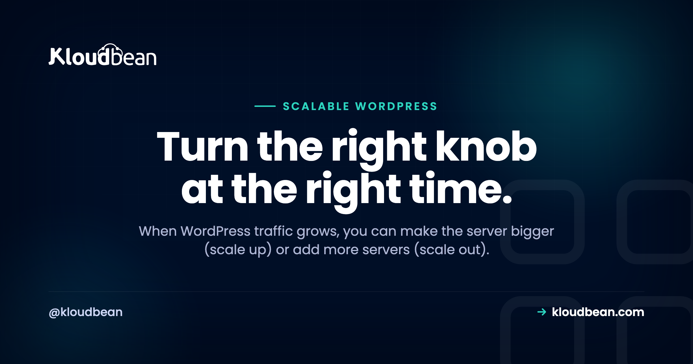

# Scalable WordPress Hosting: Scale Up or Scale Out?

At some point a growing WordPress site strains its server — a campaign lands, a post goes viral, traffic climbs — and the question becomes: how do you make it handle more? There are two fundamentally different answers. **Scale up** (make the server bigger) or **scale out** (add more servers and share the load). People treat these as interchangeable, but they solve different problems and suit different moments. Let's put them head to head — and then cover the two things that, honestly, matter more than either.

## Scaling up: make the server bigger

Scaling up (vertical scaling) means giving your existing server more power — more CPU, more RAM. Same setup, bigger box. It's the simplest kind of scaling because *nothing about your architecture changes*; you just resize. For most WordPress sites, this is the first and often only move you need. A well-tuned WordPress site on a healthy, appropriately-sized server handles a lot.

**Strengths:** dead simple (resize and go), no architectural change, no new moving parts. **Limits:** there's a ceiling — you can only make one server so big — and it's a single point of failure, so if that one server has a problem, the whole site is down. Vertical scaling is the right first answer, right up until you hit its ceiling or need redundancy.

## Scaling out: add more servers

Scaling out (horizontal scaling) means running **multiple app servers** with a **load balancer** in front, splitting traffic across them:

Now no single server carries everything, and — importantly — if one node fails, the load balancer routes around it and the site stays up. This is how you handle very high traffic and get redundancy at the same time.

**Strengths:** far higher ceiling (add more nodes as needed), and resilience (one node down doesn't mean site down). **Limits:** more complexity, and WordPress needs a little preparation to run across multiple servers — chiefly, shared storage for uploads and a shared session/cache so a visitor's experience is consistent no matter which node serves them. It's more powerful and more involved.

## Head to head

| | Scale up (vertical) | Scale out (horizontal) |
|---|---|---|
| **What you do** | Resize to a bigger server | Add servers + load balancer |
| **Complexity** | Very low | Moderate |
| **Ceiling** | Limited by biggest server | Very high (add nodes) |
| **Redundancy** | No (single server) | Yes (survives a node failure) |
| **Best for** | Most sites, first move | High traffic + uptime needs |
| **Prep needed** | None | Shared uploads + shared cache |

The honest read: **scale up first** because it's simple and enough for the majority of sites; **scale out** when you hit the vertical ceiling *or* you need the site to survive a server failure. They're stages, not rivals — many sites scale up for a long time before ever needing to scale out.

## But first: cache (this beats both)

Here's the truth that undercuts the whole up-vs-out debate — **most WordPress scaling problems are solved by caching, not by more hardware.** A page cache serves ready-made HTML instead of rebuilding each page from the database, and it can multiply how much traffic a *single* server handles by a huge factor. A site that's falling over often isn't short on server power; it's rebuilding every page from scratch because caching isn't set up. Before you pay for a bigger server or a fleet of them, make sure page caching and object caching are on and working. It's the cheapest, biggest scaling win there is, and skipping it means you'll overspend on hardware to paper over a config gap.

## And watch the database

The second thing people miss: scaling the *web* layer doesn't scale the *database*. You can add ten app servers behind a load balancer, but if they all hammer one overloaded database, the database becomes the bottleneck and you're back to square one (often surfacing as the dreaded "error establishing a database connection" under load). So scaling WordPress seriously means scaling the database too — giving it its own well-sized managed instance, adding **read replicas** to spread read-heavy load, and using an object cache to keep repeated queries off it entirely. A managed database that's sized and tuned for the traffic is frequently the real fix when a "server" seems overwhelmed.

## How do you know it's time?

Don't scale on a hunch — scale on a signal. The tells that you're outgrowing your current setup: response times creeping up as traffic rises, CPU or memory sitting near the ceiling during busy periods, the occasional database connection error under load, or a slow crawl right when a campaign peaks. Watch those in your monitoring, and let them — not anxiety — decide when to cache harder, resize, or add a node. Scaling ahead of a *known* event (a launch, a sale) is smart; scaling because you're nervous usually just spends money early.

## The verdict

Do it in this order. **First, cache** — page and object caching, correctly configured; this alone handles most growth. **Then scale up** — resize to a bigger server when caching isn't enough; simple and sufficient for the large majority of sites. **Then scale out** — add app nodes behind a load balancer when you need to go beyond one server or you require redundancy. **And throughout, mind the database** — scale and cache it too, because the web layer can't outrun a struggling database. Follow that order and "scalable WordPress hosting" stops being scary; it's just the right move at the right stage.

It's a Linux stack under all of it: the platform provides the resize, the load balancer, the managed database, and the caching layers, and keeps them patched and healthy — while your site and content stay yours. Scaling is about turning the right knob at the right time, and having those knobs available without building them yourself.

Scale WordPress the right way — cache, resize, and load-balance as needed — at [kloudbean.com](https://www.kloudbean.com/), with the database scaled to match.

## FAQ

**What does scalable WordPress hosting mean?**
It means hosting that can handle traffic growth without the site slowing to a crawl or going down. In practice that's a combination of caching, the ability to resize the server (scale up), the option to add servers behind a load balancer (scale out), and a database that can be scaled to match — so the site keeps up as demand rises.

**Should I scale WordPress up or out?**
Scale up first — resizing to a bigger server is simple and enough for most sites. Scale out (multiple servers behind a load balancer) when you hit the ceiling of a single server or you need redundancy so a server failure doesn't take the site down. They're stages: most sites scale up for a long time before needing to scale out.

**What's the cheapest way to make WordPress handle more traffic?**
Caching. A page cache serves ready-made HTML instead of rebuilding pages from the database on every visit, which can multiply the traffic a single server handles. Set up page and object caching before buying more hardware — most WordPress scaling problems are really missing caching, not missing servers.

**Does adding servers fix a slow WordPress database?**
No. Scaling the web layer with more app servers doesn't scale the database — if they all hit one overloaded database, it becomes the bottleneck. Scaling WordPress seriously means giving the database its own sized managed instance, adding read replicas for read-heavy load, and using an object cache to reduce repeated queries.

**What do I need to run WordPress across multiple servers?**
Shared storage for uploads (so media is consistent across nodes, typically object storage), a shared object cache and session store (so a visitor's experience is the same regardless of which node serves them), and a load balancer to distribute traffic and route around any unhealthy node. A managed platform provides these so you're not wiring them by hand.
