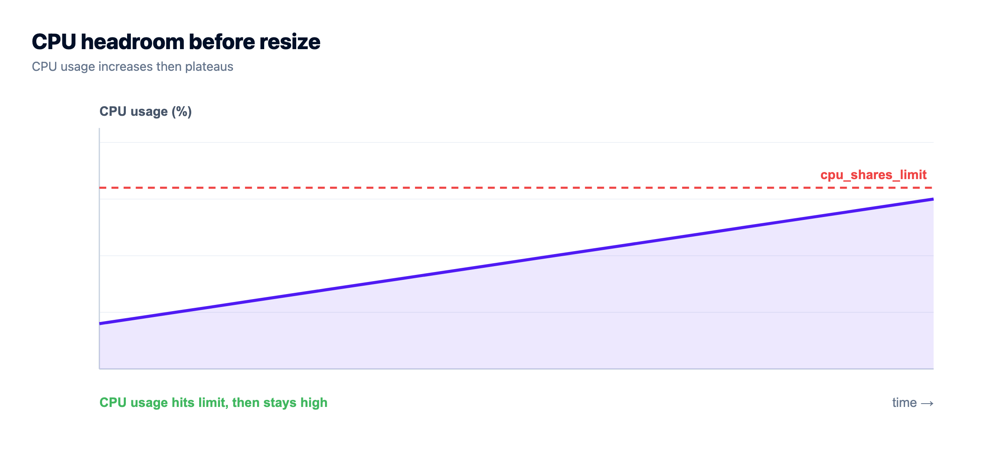
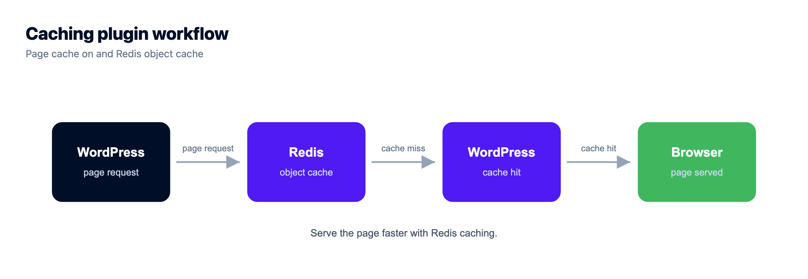

# Scalable WordPress Hosting: The Rungs to Climb, In Order

A campaign goes live and the WordPress site starts to crawl. The first instinct is usually to buy a larger server. That can be the right move, but it is rarely the first thing to check. Scalable WordPress hosting is a sequence of decisions: remove needless work, identify the actual bottleneck, then add capacity only where the evidence says you need it.

> **Short answer:** Scale WordPress in order. Start with a sensibly sized server, then page and object caching, PHP and database tuning, an edge cache, and media in object storage. Add application nodes behind a load balancer only when a single node is genuinely the limit or you need redundancy. Database replicas and automatic scaling are later architecture decisions, not defaults.

## Most "slow" WordPress isn't short on servers

Most WordPress sites that struggle under traffic are doing too much identical work. A page that could be served as cached HTML is instead rebuilding through PHP, plugins, and database queries for each visitor. More CPU gives that inefficient path some headroom. It does not remove the work.

Treat capacity as a ladder. Each rung costs more, introduces more moving parts, and solves a different failure mode. The lower rungs are useful precisely because they are boring. A cached, well-tuned site on one appropriate server is enough for many businesses.

## Rung 1: Right-size the server first

Vertical scaling means giving the current application server more CPU, memory, or storage. The architecture stays the same. That makes it the cleanest response when monitoring shows a sustained resource limit rather than a short traffic spike.

One server still has a ceiling and a single-machine failure can affect the site. Do not build a multi-node system simply because it sounds more mature. First establish that the application needs it. Most small sites do not need Kubernetes, replicas, or a complicated routing layer.

Before changing a plan or server size, look for a repeatable signal: CPU or memory saturation during known busy periods, a queue of PHP requests, or disk pressure. A one-off slow page is a debugging problem, not proof that the server needs more resources.

## Rung 2: Turn on caching (this is the big one)

Caching is usually the highest-leverage scaling step. A page cache serves prebuilt HTML for public pages rather than making WordPress and the database produce the same response repeatedly. An object cache holds recurring query results in memory, which reduces database work for dynamic paths.

WooCommerce carts, account pages, and other personalised pages need careful cache rules. That is not a reason to skip caching everywhere. It is a reason to cache the anonymous pages aggressively and bypass the cache where a response is user-specific.

Start by confirming the cache is actually working. Load a public page twice, inspect the response headers from your caching layer, and test the logged-in and checkout paths separately. A caching plugin marked “enabled” is not evidence that the origin stopped doing the work.

See [how to clear a WordPress cache](https://www.kloudbean.com/blog/how-to-clear-wordpress-cache/) for the operational side, and [managed Redis hosting](https://www.kloudbean.com/blog/managed-redis-hosting/) for object-cache use cases.

## Rung 3: Tune PHP and the database

Once public pages are cached, the expensive requests are the ones that cannot be cached: logged-in sessions, search, checkout, API calls, and admin workflows. At this point PHP worker capacity, plugin behaviour, and database queries matter more than headline traffic.

A common production mistake is diagnosing every “error establishing a database connection” message as a web-server problem. Under load, it often points to database capacity, connection limits, or a query that is holding resources too long. Check the database tier before multiplying application nodes.

Use query evidence. For MySQL or MariaDB, inspect slow queries and use `EXPLAIN` before adding indexes. Indexing a column just because it appears in a query can make writes slower without helping the plan you actually have. WordPress plugins are also part of the system: disable or replace a proven expensive plugin before paying for a larger architecture around it.

A managed database can be launched separately from the application, with controlled access and backups. Kloudbean supports MySQL and MariaDB among its seven managed database engines. The [WordPress database-connection error guide](https://www.kloudbean.com/blog/fix-error-establishing-database-connection-wordpress/) is the more targeted troubleshooting path.

## Rung 4: Put a CDN or edge cache in front

An edge cache and CDN reduce the work reaching the origin. Static files such as images, stylesheets, and JavaScript can be served closer to visitors. With careful full-page caching, many anonymous HTML requests can avoid the application server as well.

This rung is especially useful for a global audience or a known campaign spike. It is not a replacement for fixing an uncached cart flow or a slow database query. The origin still has to handle cache misses and personalised work.

Cloudflare is available as a paid add-on for Kloudbean sites, and is included for Enterprise users. Configure it according to the site’s content and cookie behaviour; do not blindly cache every URL and discover that logged-in users receive the wrong response.

## Rung 5: Offload media to object storage

Media stored only on an application server's local disk becomes a scaling problem long before it looks like one. It increases backup size, competes with application files, and creates an immediate inconsistency when two application nodes exist. An image uploaded through one node may not exist on another.

S3-compatible object storage gives uploads a durable, shared home. Kloudbean provides built-in S3-compatible storage with AWS SDK and CLI compatibility, plus managed Google Cloud Storage buckets. Use public or private access deliberately, and keep application credentials out of the repository.

This rung is what makes the next one possible. Once all nodes can reference the same media store, traffic can move between them without missing uploads.

## Rung 6: Scale out with a load balancer

Horizontal scaling means several application nodes serve the same site behind a load balancer. Reach for it when a single server is demonstrably the constraint, or when the site needs to remain available if one application node fails. It is a real architecture change, not a performance checkbox.

Prepare shared state before adding the second node. Uploads must be in shared object storage. Sessions and object-cache data must be handled consistently. Deployments must update the nodes predictably. Without those foundations, a load balancer can turn one intermittent bug into a bug that depends on which server answered the request.

Kloudbean's Flexible Load Balancer is built in and available for any account to enable when needed. It provides virtual load balancers, application pools, SSL management, and access logs. The [cloud load balancer guide](https://www.kloudbean.com/blog/cloud-load-balancer-explained/) explains where it fits.

## Rung 7: Scale the database with read replicas

Adding web nodes does not scale the database. Every node can still send reads and writes to the same primary database, which may simply move the bottleneck.

Read replicas are a standard database architecture pattern for a genuinely read-heavy workload. They copy data from a primary and can take selected read traffic, leaving writes on the primary. They also introduce lag, routing rules, monitoring, and failure handling. A replica is not a general WordPress switch and this guide does not assume one-click replicas are available.

For many sites, a correctly sized managed database plus page and object caching solves the actual database pressure. Prove that the database is limiting the system before designing a replica topology. See [how database read replicas scale](https://www.kloudbean.com/blog/database-read-replicas-scaling/) for the trade-offs.

## What about autoscaling?

Autoscaling is not a default switch for a normal WordPress plan on Kloudbean. It belongs to Enterprise engagements, alongside Kubernetes and custom architectures. That boundary is useful: an automatically changing fleet is operationally valuable when the workload genuinely requires it, but it is overkill for many sites.

For ordinary workloads, work through the earlier rungs first. Cache. right-size deliberately. Put static work at the edge. Move media out of local storage. Add application nodes only with an explicit reason. If the workload truly needs custom autoscaling, discuss the architecture as an Enterprise requirement rather than assuming it is self-serve.

## The ladder as a cheat sheet

| Rung | What it addresses | Move up when |
| --- | --- | --- |
| Right-size | Baseline CPU, memory, and storage capacity | Sustained metrics show the server is undersized |
| Cache | Repeated page and query work | Public pages rebuild needlessly on each request |
| Tune PHP and database | Dynamic requests and query pressure | Cached pages are fast but logged-in paths are slow |
| CDN or edge cache | Origin load and distance to visitors | A global audience or a known spike justifies it |
| Object storage | Local-disk media and multi-node consistency | Media grows or a second app node is planned |
| Load balancer | A single-node ceiling or a redundancy need | A prepared multi-node application is necessary |
| Database replica pattern | A proven read-heavy database limit | Evidence shows reads, not cache misses or queries, are the constraint |

## How to know which rung you're on

Do not scale on nerves. Collect signals during the conditions that hurt: response time by URL, CPU and memory, PHP worker queues, database connections, slow-query output, cache hit rate, and disk growth. Then connect the signal to the rung.

A campaign is a good reason to prepare early, but preparation should be specific. If the risk is a burst of anonymous visitors, test the cache and edge layer. If the risk is checkout volume, test database connections and the uncached path. If the risk is a single node failing, prepare a redundant application tier. Different risks need different answers.

Agencies running multiple WordPress sites have a related problem: choosing when one heavy site should leave a shared server. The [agency WordPress hosting guide](https://www.kloudbean.com/blog/agency-wordpress-hosting/) covers that operational decision.

## The honest boundary

Kloudbean manages the infrastructure layer: Linux server and stack maintenance, SSL, backups, managed databases, object storage, and the optional load balancer. Your WordPress code, plugins, theme, content, cache rules, and application-level security remain yours. That division is important when troubleshooting. A managed platform can operate the underlying pieces; it cannot make a broken plugin query efficient or choose correct cache exclusions for your checkout.

The practical takeaway is simple. Make WordPress do less work before making the architecture larger. Cache first. Measure the dynamic paths. Keep data and media durable. Add complexity only when the production evidence demands it.

<!-- cta:start -->
**WordPress, without the server admin.**

Run WordPress and WooCommerce on a managed server with a staging site, automatic backups, free auto-renewing SSL, and a managed MySQL or MariaDB beside it. Pick the cloud and the region yourself.

- Managed WordPress stack
- One-click staging
- Managed MySQL and MariaDB
- Automatic backups
- Free SSL
- Built-in load balancer

[Start free](https://console.kloudbean.com/register) · [See plans](https://www.kloudbean.com/pricing/)
<!-- cta:end -->

## FAQ

### What does scalable WordPress hosting mean?

It means having a deliberate path for handling more traffic without guessing: suitable server capacity, caching, PHP and database tuning, an edge layer, durable media storage, and eventually multiple application nodes if the site proves it needs them. It does not mean every site starts with every component.

### Why is my WordPress site slow under traffic?

Common causes are missing page or object caching, an undersized server or database, slow plugin queries, too few PHP workers, or media and static files being served directly from the application server. Identify the constrained layer with metrics and logs before changing the architecture.

### What's the cheapest way to make WordPress handle more traffic?

For most public WordPress pages, start with correctly configured caching. A page cache avoids rebuilding the same HTML on every request, while an object cache can reduce repeated database work. Test personalised and checkout paths separately so the cache does not serve the wrong content.

### Should I scale WordPress up or out?

Scale up when one server is the proven limit and a larger one resolves the capacity issue. Scale out when one server is no longer enough or the site needs application-node redundancy, after preparing shared storage and state. They are stages, not competing philosophies.

### Does adding more servers fix a slow WordPress database?

No. More application nodes can increase the number of clients querying the same database. First inspect queries, connection limits, cache hit rate, and database capacity. A read-replica architecture may later help a read-heavy workload, but it is not the usual first fix.

### What do I need to run WordPress across multiple servers?

Use shared object storage for uploads, keep session and cache behaviour consistent across nodes, deploy each node predictably, and put a load balancer in front of the application tier. Validate each of those before sending production traffic to more than one node.

### Does Kloudbean autoscale WordPress automatically?

No. Autoscaling is an Enterprise capability delivered as part of a custom architecture, alongside Kubernetes where appropriate. Standard-plan WordPress scaling is deliberate: right-size capacity, use caching and edge delivery, and enable the Flexible Load Balancer when the architecture warrants it.

### How do I fix an error establishing a database connection under load?

Treat it as a database-tier signal first. Check database capacity and connection limits, slow queries, PHP worker concurrency, and whether object caching is reducing repeated work. The [targeted WordPress troubleshooting guide](https://www.kloudbean.com/blog/fix-error-establishing-database-connection-wordpress/) walks through the error in more detail.

### Do I need read replicas for WordPress?

Usually not at the start. A properly sized database and effective caching handle more load than many sites expect. Read replicas become a possible architecture choice only when measured read volume, rather than inefficient queries or cache misses, is the established bottleneck.
