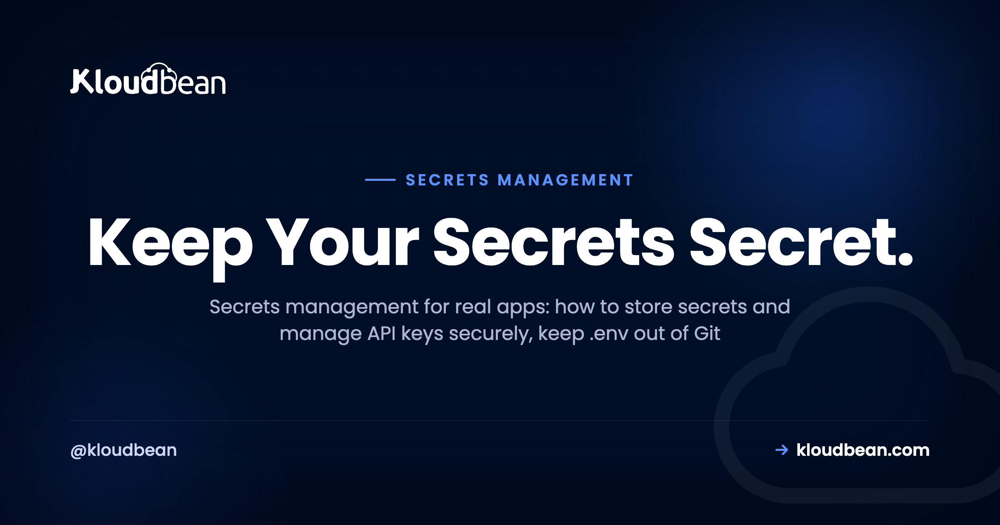
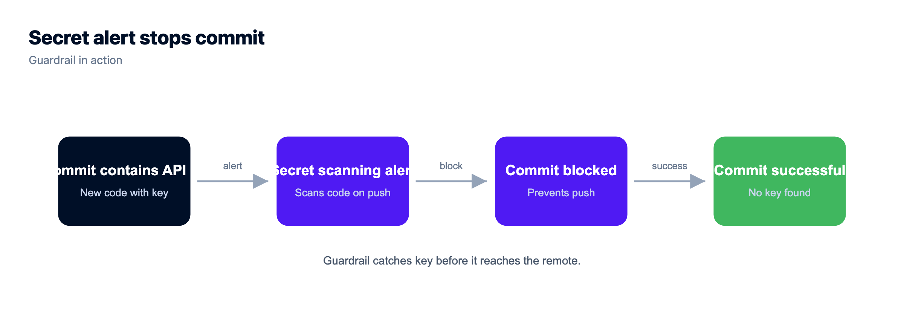
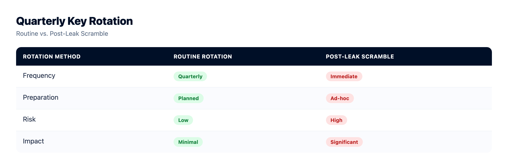
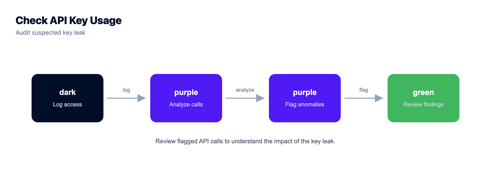
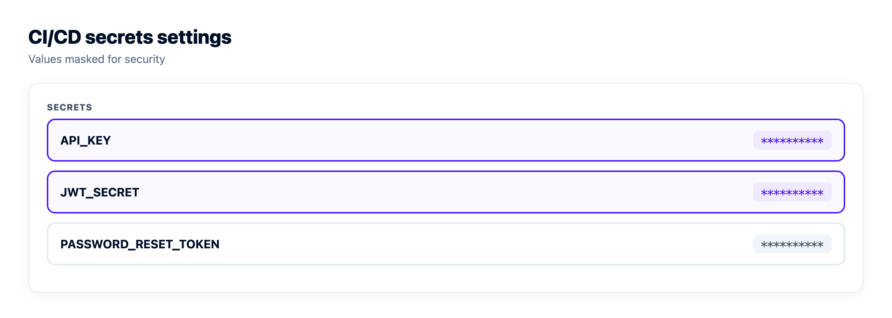
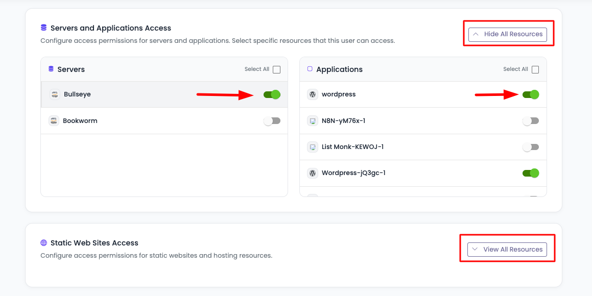
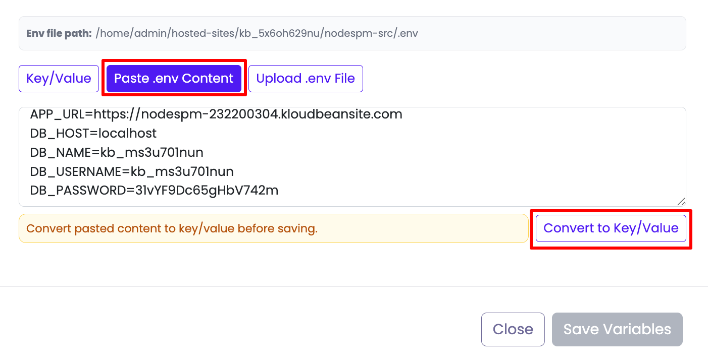

# Secrets Management: How to Store Secrets and Manage API Keys Securely

*Application security*

*By Kloudbean · Keep Your Secrets Secret.*



Every app has secrets. A database password, a Stripe key, a JWT signing secret, an access token for some service you call at 3am when nobody's watching. Secrets management is the unglamorous discipline that keeps those values out of your source code, out of your Git history, and out of the wrong hands. Get it wrong and you get the classic story: a key pushed to a public repo, scraped by a bot within minutes, and a surprise cloud bill by morning. This is the practical version for people shipping real apps, whether you built it in Cursor, Lovable, or by typing every line yourself. How to store secrets, how to manage API keys securely, and what to actually do when one leaks.

> **The short version**
>
> A secret is any value that grants access: a database password, an API key, a signing key, a token. Keep secrets out of your code and out of Git (add `.env` to `.gitignore` before the first commit), inject them as environment variables at deploy time, give every key the least privilege it needs, and rotate them on a schedule and the instant one leaks. If a key ever lands in a commit, rotate first. Cleaning up Git history comes second, because by then the key is already burned.

## What is secrets management?

Secrets management is the practice of storing, delivering, rotating, and revoking the sensitive values your app needs to run, without ever baking them into your source code. That's the whole job. The values move from a safe place into the running process the moment it's needed, and never sit in a file that gets committed, shared, or shipped to a browser.

Before you can protect a secret, you have to know one is a secret. This trips people up more than it should. So here's the line I use: a secret grants access, config just tunes behavior. A database password lets someone read your data. A log level only decides how chatty your logs are. One is a key to your house. The other is which light you left on.

> **The one-question test.** Not sure whether a value is a secret? Ask this: if it leaked, could a stranger act as me, read my data, or spend my money? If yes, it's a secret and belongs in secrets management. If no, it's config, and you can relax about it.

|  | Secret (guard it) | Config (not sensitive) |
| --- | --- | --- |
| Examples | DB password, API key, JWT/signing secret, OAuth client secret, private TLS key, access token | Port, log level, feature flag, public API URL, region, timezone |
| If exposed | Someone can act as you: read data, spend money, sign tokens | Little or nothing; it's often visible anyway |
| Where it lives | Server env or platform config, never in Git | Fine in code or a committed config file |
| Rotation | On a schedule, and on any suspected leak | Rarely changes, no rotation needed |

## The rules that actually matter, and why

Most secrets advice is a list of rules with no reasons attached, which is how people follow them right up until they're inconvenient. So here's each rule with the why underneath it. The why is what makes the rule stick when you're tired and just want the thing to deploy.

### Never hard-code a secret in source

The moment a key is written into your code, it travels everywhere the code travels. Into Git. Into every clone and fork. Into the screenshot you paste in Slack, the pair-programming call you screen-share, the CI logs nobody reads. You can't take it back. A hard-coded key is a key you've mailed to everyone who will ever touch the repo.

```js
// BAD: the key ships with your code, forever
const stripe = require("stripe")("sk_live_51H8xR2rEaLkEyabcd1234");

// GOOD: the key lives in the environment, not the repo
const stripe = require("stripe")(process.env.STRIPE_SECRET_KEY);
```

The good version reads the key from the environment at runtime. The code is now safe to open-source, because there's nothing sensitive left in it. That one move, value out of code and into the environment, is the foundation everything else builds on.

### Never commit .env, and .gitignore it before the first commit

Your `.env` file is where local secrets live, so it must never enter Git. Here's the trap: people add `.env` to `.gitignore` *after* they've already committed it once, then wonder why it's still tracked. Git ignores untracked files. It doesn't forget files it already knows about. And even after you remove it, the value sits in history for anyone who runs `git log -p`. Git history is forever. Add the ignore before your very first commit.

```
# .gitignore  (add this BEFORE your first commit)
.env
.env.local
.env.*.local
*.pem
```



### Inject secrets at deploy time

If the code doesn't carry the secret, something has to hand it over when the app runs. That something is the environment. You set the value on the server or in your platform's config, and your code reads it live.

```js
// Node: read it live, and fail loudly if it's missing
const dbUrl = process.env.DATABASE_URL;
if (!dbUrl) throw new Error("DATABASE_URL is not set");
```

```python
# Python: same idea. os.environ raises if the key is absent
import os
db_url = os.environ["DATABASE_URL"]
```

This is the same split behind [environment variables done right](https://www.kloudbean.com/blog/environment-variables-done-right/): config and secrets live outside the code, set once on the server, changed without editing your source. Rotating a leaked key becomes a config edit, not a code change and a pull request.

### Give every key the least privilege it needs

A secret should be able to do exactly one job and nothing more. If your app only reads from a storage bucket, its key should be read-only. If a token only needs to post to one channel, scope it to that channel. Why bother? Blast radius. When a least-privilege key leaks, the damage is capped at what that key could do. When your god-mode admin key leaks, the attacker owns the account. Same leak, wildly different Tuesday.

### Rotate on a schedule, and instantly on any suspected leak

Keys don't improve with age. One you made two years ago and never rotated has had two years to leak through a laptop backup, an old CI log, or a former teammate's shell history. Rotating on a schedule (quarterly is a sane default) shrinks that window. Rotating the instant you suspect exposure slams it shut. Panic-rotating after you spot a key on GitHub isn't a strategy, it's damage control, and the next section covers doing it well.



### Use different secrets per environment

Dev, staging, and production each get their own secrets. Never reuse a production key in development. A laptop is a softer target than your prod server, dev keys pass through more logs and more hands, and you never want a test script quietly pointed at a "dev" key that's secretly prod. Separate secrets also let you rotate or revoke one environment without knocking the others over.

<!-- Figure (inline SVG): "A secret's journey: kept safe vs leaked." Safe path (green): .env on your laptop (gitignored) -> runtime config in the dashboard -> injected at runtime (process.env) -> never in Git, rotate anytime. Leak path (red): hard-coded key or committed .env -> pushed to a Git repo (forever) -> scraped by bots within minutes -> key is burned, rotate now. Caption: Keep a secret on the top road and rotation is a calm config edit. Let it onto the bottom road and rotation is the only thing that saves you. -->

## You just leaked a key. Do this, in order.

It happens to good engineers. A key ends up in a commit, a repo you thought was private goes public, or a config with a live token gets pasted into a support ticket. The instinct is to hide it: delete the file, force-push, hope. That instinct is wrong, and here's the order that actually protects you.

1. **Rotate the key first.** Generate a new one, deploy it, and revoke the old one. The leaked key is compromised from the second it left your control, so the only thing that truly helps is making it worthless. Everything else is cleanup.
2. **Assume it's already been grabbed.** Automated bots scan public commits around the clock and can find a fresh key within minutes of the push. Don't tell yourself "nobody saw it in the ten minutes it was up." Some script did.
3. **Check what the key could touch.** Read your access and audit logs for calls you don't recognize, resources you didn't create, or spend you can't explain. Revoke active sessions if the key granted any. Leaked cloud keys have been used to spin up crypto-mining fleets before the owner finished their coffee.
4. **Then, and only then, clean the history.** Tools like `git filter-repo` or BFG can scrub the value out of past commits. Worth doing. But be clear on what it fixes: it tidies your repo, it does not un-leak the key. Forks, clones, caches, and mirrors already have it.

Why isn't a force-push enough? Because removing it from the branch is not the same as removing it from the internet. The commit may be gone from your main branch, but the host can still serve it from cache, a teammate's fork carries it, and any bot that grabbed it kept a copy. The key is burned. Rotation is the only reliable eraser.



## Where secrets live in production

You've kept secrets out of code. So where do they go instead? There are a few homes, and picking the right one is mostly a question of how many services you run and how strict your audit needs are.

| Where | Good for | Watch out for |
| --- | --- | --- |
| Environment variables / runtime config | Almost every app. DB URLs, API keys, and tokens read by the server. | Set them on the host, never in Git. Redeploy to apply a change. |
| CI/CD secrets | Values needed during the build, like registry logins or deploy tokens. | Scope them to the pipeline and confirm they're masked in build logs. |
| Secret manager (Vault, cloud secret stores) | Many services, dynamic short-lived secrets, strict audit trails. | Real operational overhead. Genuine overkill for a single app. |
| Frontend / client bundle | Public values only, like a publishable key. | Anything secret placed here is already public. No exceptions. |

An opinion, since you're here for one: most apps don't need a dedicated secrets manager. A single app, or a handful, with secrets kept out of Git and set as environment variables on a server you control is genuinely fine. Vault and the big cloud secret stores earn their keep when you juggle many services, need credentials that expire on their own, or have auditors asking who read which secret and when. Reach for that when you feel the pain, not before. Build-time secrets, meanwhile, belong in your pipeline's secret store, which pairs naturally with [auto-deploy from GitHub](https://www.kloudbean.com/blog/ci-cd-auto-deploy-from-github/).



## Least privilege in practice: scoped tokens

The single highest-leverage habit in this whole guide is scoping. A narrow token that leaks is a headache. A god-mode key that leaks is an incident. Same event, and the only difference is how much power you handed the key in the first place.

So prefer tokens that name exactly what they can do. Read-only where you only read. One resource where you only touch one. Short-lived where the platform supports expiry. A clean example of the pattern in the wild: [Kloudbean's](https://www.kloudbean.com/) Platform API uses scoped personal API tokens, so a token you generate for a script carries only the access you grant it, not the keys to your whole account. That's least privilege shipped as a default, and it's the shape you want every token to have. The same idea extends to people, not just machines.



*Least privilege for humans too: subusers with User Access Control get granular per-resource, per-action permissions, so a teammate sees exactly what their job needs.*

## How Kloudbean handles secrets

Worth being precise here, because it's easy to over-claim. Kloudbean does not sell a separate "secrets vault" product, and you don't need one to do this properly. Secrets live where they should: as environment variables and runtime configuration you set in the dashboard, stored for your app and injected at runtime, never sitting in your repo.

In the console you open your app, head to Runtime Configuration, and set your environment variables there (Node and Python runtime config is editable right in the UI). You can paste a whole `.env` and convert it into key/value pairs in one step. Because the values live on the server and not in Git, rotating a secret is a config edit plus a redeploy, with zero code changes.




*Runtime Configuration, Environment Variables: your secrets live on the server as key/value pairs and get injected at runtime, so they never enter the repo.*

A few more grounded pieces fit the same keep-secrets-safe, least-privilege theme:

- **Scoped personal API tokens** for the Platform API, so automation gets only the access you grant, not your whole account.
- **HttpOnly cookie sessions**, which keep session tokens out of reach of client-side JavaScript and harden you against XSS and CSRF. The reasoning behind that lives in the [security headers guide](https://www.kloudbean.com/blog/security-headers-guide/).
- **Basic Auth gate and IP Access Control** (allow or deny by IP, including CIDR ranges) to lock an app or a staging site down to only the people who should reach it.
- **Subusers and User Access Control**, granular per-resource, per-action permissions so teammates get exactly the access their job needs and nothing extra.
- **Social login** (Google, GitHub, LinkedIn), so you can skip rolling and storing your own password database if you'd rather not carry that risk.

Pair that with the platform's default baseline (a Shorewall firewall and Fail2ban), free auto-renewing SSL so secrets in transit stay encrypted, and managed databases with controlled access, and the story holds together without a bolt-on vault. If your workloads touch regulated data, the shared-responsibility split matters: the platform provides the infrastructure controls, and you own the app-level discipline in this guide. More on that in [secure and compliant hosting](https://www.kloudbean.com/blog/secure-compliant-hosting/), and if the "managed" part is still fuzzy, start with [what a managed server actually is](https://www.kloudbean.com/blog/what-is-a-managed-server/).

> **Coming from a committed .env?** If your database password has been sitting in Git, treat it as leaked. Spin up a fresh [managed database](https://www.kloudbean.com/blog/add-managed-database-to-your-app/) or reset the password, set the new connection string as an environment variable, and add `.env` to `.gitignore` so it can't happen twice.

None of this is exotic. Keep secrets out of code and out of Git, hand them to the app at runtime, scope them tight, and rotate them like you mean it. Then the worst case, a leak, drops from a crisis to a chore.

<!-- cta:start -->
**The server layer, hardened for you.**

The platform keeps the server, stack, SSL, and patching current, with automatic backups running. Application-level security stays yours, and that split is deliberate rather than hidden.

- Shorewall firewall
- Fail2ban
- OS patching handled
- Free SSL
- IP access control
- Automatic backups

[Start free](https://console.kloudbean.com/register) · [See plans](https://www.kloudbean.com/pricing/)
<!-- cta:end -->

## FAQ

### What is secrets management?

Secrets management is how you store, deliver, rotate, and revoke the sensitive values an app needs, like database passwords and API keys, without putting them in your source code. Done right, the repo carries no secrets and a leaked key is a config swap away from fixed.

### What counts as a secret versus config?

A secret grants access: a database password, an API key, a signing key, a token. Config just tunes behavior, like a port or a log level. The test: if the value leaked and a stranger could act as you or spend your money, it's a secret.

### Where should I store API keys?

On the server or in your platform's runtime configuration, read at runtime through environment variables. Never in source code, never committed to Git, and never in a frontend bundle the browser can read. On Kloudbean you set them under Runtime Configuration and the platform injects them at runtime.

### Can I commit .env if my repo is private?

Don't. A private repo is not a vault: it can be forked, cloned to laptops, shared with contractors, or made public by accident, and the secret sits in Git history the whole time. Add .env to .gitignore before your first commit and set the values on the server.

### What should I do if I leaked an API key?

Rotate it first: generate a new key, deploy it, and revoke the old one, because the leaked key is compromised the moment it left your control. Then check your access and audit logs for unfamiliar activity. A force-push alone doesn't help, since bots and forks already have the old value.

### How often should I rotate secrets?

On a schedule, and immediately on any suspected leak. Quarterly is a reasonable default for most apps, more often for high-value keys. Because secrets live in config rather than code, rotation is an edit and a redeploy, not a code change.

### What does least privilege mean for API keys?

A key does exactly what it needs and nothing more: read-only where you only read, one resource where you only touch one, short-lived where the platform allows. The reason is blast radius. A narrow key that leaks caps the damage at what that key could do, not your whole account.

### Do I need a secrets manager like Vault?

Usually not, if you run one app or a few. Environment variables kept out of Git and set on a server you control cover most cases. Vault and cloud secret stores earn their complexity with many services, dynamic short-lived credentials, or strict audits. Adopt one when you feel that pain.

### How does Kloudbean handle secrets?

Kloudbean doesn't sell a separate secrets vault. You set secrets as environment variables and runtime configuration in the dashboard, injected at runtime and never stored in your repo. It also offers scoped personal API tokens for its Platform API, HttpOnly cookie sessions, Basic Auth, IP Access Control, and subusers with granular User Access Control.

### How do I manage API keys securely across dev, staging, and production?

Give each environment its own keys and never reuse a production key in development. Set them separately in each environment's config, scope them to the least access each needs, and rotate them independently. A leaked dev key then can't reach production data.
